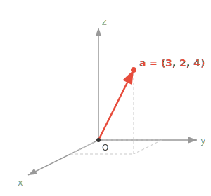
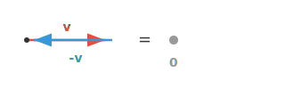
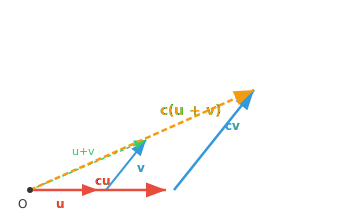
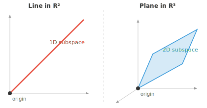

# Vector Spaces

*Vector spaces form the mathematical playground where ML lives. This file covers vector addition, scalar multiplication, closure axioms, subspaces, and why nearly everything in AI is represented as vectors.*

- Think of a Vector Space as a specific kind of playground where mathematical objects live, and each object is called a **vector**. 

- Vector space is formally defined as an collection of vectors that can be added and scaled together without leaving the space. 

- A useful non-example: the integers $\mathbb{Z}$ are **not** a vector space over the real numbers, since scaling $3$ by $0.5$ gives $1.5$, which falls outside the set. The "without leaving the space" part of the definition is doing real work.

- For geometric intuition in machine learning (ML), we will always think of vectors as a point in Euclidean space, represented by it's coordinates. 

- The vector $\mathbf{a}$ (denoted mathematically as lowercase letters in bold) has $n$ coordinates, each representing a position along an axis.

$$\mathbf{a} = [a_1, a_2, a_3]$$



- The vectors in the vector space live under a very specific, unbreakable set of rules:

    - **Vector Addition (Combining)**:
    You can take any two vectors and combine them to create a new one.
    Think of vectors as instructions for movement.
    If vector A means "walk 3 steps forward" and vector B means "walk 2 steps right,"
    adding them (A + B) creates a new, single instruction: "walk 3 steps forward and 2 steps right."

    - **Scalar Multiplication (Scaling)**:
    You can take any vector and scale it using a regular number (a "scalar").
    You can stretch it, shrink it, or reverse it.
    If vector A is "walk 3 steps forward," scaling it by 2 makes it "walk 6 steps forward."
    Scaling it by -1 flips it entirely to "walk 3 steps backward."

- The **dimension** of a vector space is the number of independent directions it contains. $\mathbb{R}^2$ is 2-dimensional (needs 2 coordinates), while $\mathbf{a}$ above lives in $\mathbb{R}^3$.

- We can for instance represent any object, say, a human, as a vector, where $h_1$ = height in cm, $h_2$ = weight in kg, $h_3$ = age.

$$\mathbf{h} = [185, 75, 30]$$

- We have now created a vector space with a vector representing a human.

- We can represent multiple humans, and see how close or apart they are!


- We can add more features, creating a rich representation of a human, often called feature vectors in ML.

- The more unique and meaningful features you have, the more descriptive the feature vector is, an important factor to remember. 

- Beyond 3 dimensions, vectors become very difficult to visually inspect, inspiring a field of mathematics called **Linear Algebra**.

- Now, **Linear algebra** is the study of vectors, vector spaces and mappings between vectors.

- We represent almost every thing in AI/ML as vectors, making linear algebra the bedrock of the field.

- Vector addition can be performed by placing one vector on the tail of the other visually, and drawing from the origin to the endpoint.


- For two vectors $\mathbf{a} = (a_1, a_2)$ and $\mathbf{b} = (b_1, b_2)$: $\mathbf{a} + \mathbf{b} = (a_1 + b_1, a_2 + b_2)$

- Vectors can also be subtracted, with all addition rules applying too.

- Multiplying a vector by a scalar scales the vector by that factor in the same direction.


- For a scalar $c$ and vector $\mathbf{v} = (v_1, v_2)$: $c\mathbf{v} = (cv_1, cv_2)$

- **Closure under Addition**: If you add any two vectors from the vector space, the result is also a vector within the same space: If $\mathbf{u} \in V$ and $\mathbf{v} \in V$, then $\mathbf{u} + \mathbf{v} \in V$

- **Closure under Scalar Multiplication**: If you multiply any vector from the vector space by a scalar, the result is a vector within the same space: If $\mathbf{v} \in V$ and $c \in F$, then $c\mathbf{v} \in V$

- **Commutativity of Addition**: For any two vectors $\mathbf{u}$ and $\mathbf{v}$: $\mathbf{u} + \mathbf{v} = \mathbf{v} + \mathbf{u}$


- Both paths through the parallelogram arrive at the same point.

- **(Zero Vector)**: There exists a vector $\mathbf{0}$ such that for any vector $\mathbf{v}$: $\mathbf{v} + \mathbf{0} = \mathbf{v}$


- **Additive Inverse**: For every vector $\mathbf{v}$, there exists a vector $-\mathbf{v}$ such that: $\mathbf{v} + (-\mathbf{v}) = \mathbf{0}$



- **Distributivity 1**: For any scalar $c$ and vectors $\mathbf{u}$, $\mathbf{v}$: $c(\mathbf{u} + \mathbf{v}) = c\mathbf{u} + c\mathbf{v}$



- Scaling the sum (gold) gives the same result as summing the scaled vectors.

- **Distributivity 2**: For any scalars $c$, $d$ and vector $\mathbf{v}$: $(c + d)\mathbf{v} = c\mathbf{v} + d\mathbf{v}$

- **Associativity**: For any scalars $c$, $d$ and vector $\mathbf{v}$: $(cd)\mathbf{v} = c(d\mathbf{v})$

- **Identity Element**: For any vector $\mathbf{v}$: $1\mathbf{v} = \mathbf{v}$, where $1$ is the multiplicative identity in the field of scalars.

- Some examples of vector spaces:

    - **$\mathbb{R}^n$ (n-dimensional space)**: all real numbers in an n-dimensional space, example vector [1,4,3000...nth item], add two points or scale one, and you still land somewhere on the plane.

    - **Grayscale images**: a $28 \times 28$ image is just 784 pixel intensities, i.e. a vector in $\mathbb{R}^{784}$. Adding two images (blending) or scaling one (brightening) gives another image of the same size.

    - **Audio signals**: a 1-second clip sampled at 44.1kHz is a vector with 44,100 entries. Mixing two clips together is just vector addition.

    - **Polynomials**: adding two polynomials or scaling one by a number gives another polynomial, so they form a vector space too. Vectors don't have to look like arrows!

- A **subspace** is just a smaller playground inside the bigger one. Imagine 3D space as a room. A flat sheet of paper passing through the centre of the room is a subspace, and so is a single straight wire through the centre.

- The key requirement is that the subspace must pass through the origin. If you shift that sheet of paper off-centre, it stops being a subspace because the zero vector is no longer on it.



- All the same rules from the vector space (addition, scaling, closure) still work inside a subspace. You can add or scale vectors within it and never "fall off" into the larger space.

- A line through the origin is a 1-dimensional subspace, a plane through the origin is a 2-dimensional subspace, and the full space is a subspace of itself.

- In ML, subspaces appear naturally. High-dimensional data often has structure that lives on a lower-dimensional subspace. Techniques like PCA find that subspace so we can work with the data more efficiently.

## Coding Tasks (use CoLab or notebook)

1. Run code to verify the distributivity property, then Modify and play around to test other rules!
```python
import jax.numpy as jnp

u = jnp.array([1, 2])
v = jnp.array([3, 0])
c = 2

lhs = c * (u + v)
rhs = c*u + c*v

print(f"LHS: {lhs}")
print(f"RHS: {rhs}")
```

2. Run code to visualise different vectors, then modify values for different coordinates to understand how each axis affects position.
```python
import jax.numpy as jnp
import matplotlib.pyplot as plt

# Try changing these vectors!
a = jnp.array([3, 2, 4])
b = jnp.array([1, 4, 2])
c = jnp.array([4, 1, 3])

fig = plt.figure()
ax = fig.add_subplot(111, projection="3d")

for vec, name, color in [(a, "a", "red"), (b, "b", "blue"), (c, "c", "green")]:
    ax.quiver(0, 0, 0, *vec, color=color, arrow_length_ratio=0.1, linewidth=2, label=name)

lim = int(jnp.abs(jnp.stack([a, b, c])).max()) + 1
ax.set_xlim([0, lim]); ax.set_ylim([0, lim]); ax.set_zlim([0, lim])
ax.set_xlabel("X"); ax.set_ylabel("Y"); ax.set_zlabel("Z")
ax.legend()
plt.show()
```

## Side Quest (Some mathematical symbols to know)

| Symbol | Meaning | Example |
|---|---|---|
| ∈ | is an element of | x ∈ A: x is in set A |
| ∉ | is not an element of | x ∉ A |
| ⊂ | is a proper subset of | A ⊂ B |
| ⊆ | is a subset of or equal to | A ⊆ B |
| ∪ | union | A ∪ B: things in A or B |
| ∩ | intersection | A ∩ B: things in both A and B |
| ∅ | empty set | A = ∅ |
| ℝ | real numbers | x ∈ ℝ |
| ℤ | integers | -2, -1, 0, 1, 2 |
| ℕ | natural numbers | 1, 2, 3, ... |
| ℚ | rational numbers | fractions like 1/2 |
| ⇒ | implies | x > 2 ⇒ x > 1 |
| ⇔ | if and only if | x = 2 ⇔ x² = 4, with extra conditions |
| ∀ | for all | ∀x ∈ ℝ |
| ∃ | there exists | ∃x such that x² = 4 |
| ¬ | not | ¬P: not P |
| ∧ | and | P ∧ Q |
| ∨ | or | P ∨ Q |
| ∴ | therefore | x = 2, ∴ x² = 4 |