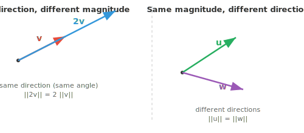
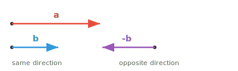

# Vector Properties

*Vector properties describe the geometric and algebraic characteristics that define how vectors behave. This file covers magnitude, direction, unit vectors, equality, parallelism, orthogonality, and linear independence, the building blocks of every ML feature space.*

- The **magnitude** (or length) of a vector tells you *how far* it reaches. Think of it as the length of the arrow. For a vector $\mathbf{a} = (a_1, a_2, a_3)$, its magnitude is:

$$\|\mathbf{a}\| = \sqrt{a_1^2 + a_2^2 + a_3^2}$$

- This is just the Pythagorean theorem extended to higher dimensions and measuring the straight-line distance from the origin to the point.

- The **direction** of a vector tells you *where* it points; simply visualise a straight line from the origin to the coordinate's point. 

- When origin is not explicitly specifies, we often imply (0,0,...0), the centerpoint, at least for visualisation purposes. 

- Position doesn't matter, its always about displacement: a vector $(3, 2)$ drawn from the origin and the same $(3, 2)$ drawn from another point are still equal.


- Two vectors can have the same length but point in completely different directions, or point the same way but differ in length.



- Two vectors are **equal** if and only if all their corresponding components match; same length, same direction, the exact same arrow.

$$\mathbf{a} = \mathbf{b} \iff a_i = b_i \text{ for all } i$$

- Two vectors are **parallel** if one is a scalar multiple of the other. They point along the same line, either in the same direction or exactly opposite.

$$\mathbf{a} \parallel \mathbf{b} \iff \mathbf{a} = k\mathbf{b} \text{ for some scalar } k \neq 0$$



- If $k > 0$, they point the same way. If $k < 0$, they point in opposite directions. Either way, they lie on the same line through the origin.

- Intuitively, parallel vectors carry no "new" directional information. One is just a stretched or flipped version of the other.

- Two vectors are **orthogonal** (perpendicular) if they point in completely independent directions. Moving along one gives you zero progress along the other.


- Think of walking north and then walking east, these are orthogonal directions, no amount of walking north will ever move you east. We will encounter orthogonality very often.

- Orthogonality is central to ML: features that are orthogonal carry completely independent information, which is ideal for representation.

- More generally, any two vectors have an **angle** $\theta$ between them, ranging from $0°$ to $180°$.

- This angle captures the entire relationship between two directions: $0°$ means parallel (same direction), $180°$ means parallel (opposite direction), and $90°$ means orthogonal. Everything in between is a blend.

- Most vector relationships in ML live somewhere in this spectrum. Later, we will see exact tools (dot product, cosine similarity) to compute this angle.

- A set of vectors is **linearly dependent** if at least one of them can be built from the others by scaling and adding. It brings no new information to the set.

- For example, if $\mathbf{c} = 2\mathbf{a} + 3\mathbf{b}$, then $\mathbf{c}$ is redundant, you already have everything $\mathbf{c}$ offers through $\mathbf{a}$ and $\mathbf{b}$.

- Parallel vectors are always linearly dependent, since one is just a scaled copy of the other. Any set containing the zero vector is also linearly dependent.

- Vectors are **linearly independent** if none of them can be built from the others. Each one contributes a genuinely new direction. Orthogonal vectors are always linearly independent.

- Some intuition: if you want to study different humans and represent them as a vector, linearly dependent vectors (humans) will skew the observation in favour of the oversampled data point, an important factor in designing dataset for training AI. 

- In 2D, two linearly independent vectors can reach any point in the plane. In 3D, you need three. This idea of "how many independent vectors you need" connects directly to dimension.

- A vector is **sparse** when most of its components are zero. The opposite, most components being nonzero, is called **dense**.

$$\mathbf{s} = [0, 0, 3, 0, 0, 0, 1, 0, 0, 0]$$

- Sparsity matters because it affects both storage and computation. Sparse vectors can be stored and processed much more efficiently by only tracking the nonzero entries.

- A **unit vector** is a vector with magnitude exactly 1. It purely represents a direction with no length information. You can turn any vector into a unit vector by dividing by its magnitude:

$$\hat{\mathbf{a}} = \frac{\mathbf{a}}{\|\mathbf{a}\|}$$

- This process is called **normalisation**. It strips away "how far" and keeps only "which way", this is an important factor in machine learning. 

- The standard unit vectors point along each axis: $\hat{\mathbf{i}} = (1, 0, 0)$, $\hat{\mathbf{j}} = (0, 1, 0)$, $\hat{\mathbf{k}} = (0, 0, 1)$. Any vector can be written as a combination of these, e.g. $(3, 2, 4) = 3\hat{\mathbf{i}} + 2\hat{\mathbf{j}} + 4\hat{\mathbf{k}}$.

## Coding Tasks (use CoLab or notebook)

1. Compute the magnitude of a vector and verify it matches the Pythagorean theorem, then modify to compute the unit vector. 
```python
import jax.numpy as jnp

a = jnp.array([3.0, 4.0])

magnitude = jnp.sqrt(jnp.sum(a ** 2))
print(f"Magnitude of a: {magnitude}") 
```

2. Check whether two vectors are parallel by testing if one is a scalar multiple of the other.
```python
import jax.numpy as jnp

a = jnp.array([2, 4, 6])
b = jnp.array([1, 2, 3])

ratios = a / b
print(f"Ratios: {ratios}")
print(f"Parallel: {jnp.allclose(ratios, ratios[0])}")
```