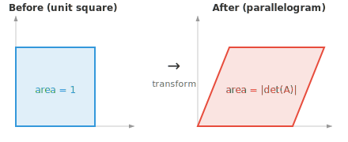
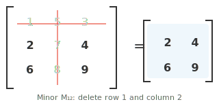

# Matrix Properties

*Matrices are the data structures that store datasets, encode transformations, and define every neural network layer. This file covers matrix dimensions, elements, transpose, trace, determinant, inverse, rank, and null space, the foundational properties used throughout linear algebra and ML.*

- At its core, a **matrix** is a rectangular grid of numbers arranged in rows and columns. If a vector is a single list of numbers, a matrix as a stack of vectors.

```math
A = \begin{bmatrix} 1 & 2 & 3 \\ 4 & 5 & 6 \end{bmatrix}
```

- If a single person is described by the vector $[\text{age}, \text{height}, \text{weight}]$, then three people form a matrix where each row is one person:

```math
\begin{bmatrix} 25 & 170 & 65 \\ 30 & 180 & 80 \\ 22 & 160 & 55 \end{bmatrix}
```

- This matrix has 3 rows and 3 columns, so we call it a $3 \times 3$ matrix.

- Each number in the grid is called an **element** or **entry**, identified by its row and column: $A_{ij}$ is the element in row $i$, column $j$.

- The **transpose** of a matrix flips it along its diagonal, turning rows into columns and columns into rows. If $A$ is $m \times n$, then $A^T$ is $n \times m$.

```math
A = \begin{bmatrix} 1 & 2 & 3 \\ 4 & 5 & 6 \end{bmatrix} \quad \Rightarrow \quad A^T = \begin{bmatrix} 1 & 4 \\ 2 & 5 \\ 3 & 6 \end{bmatrix}
```

- Multiplying a matrix by its transpose always gives a square matrix: $AA^T$ is $m \times m$ and $A^TA$ is $n \times n$.

- The **trace** of a square matrix is the sum of its diagonal elements: $\text{tr}(A) = A_{11} + A_{22} + \cdots + A_{nn}$. The trace equals the sum of the eigenvalues (which we will see later).


- For the matrix above, $\text{tr}(A) = 1 + 4 + 9 = 14$. Only the highlighted diagonal matters.

- If two matrices represent the same linear transformation under different bases, their traces will be the same. The trace is "basis-independent."

- The **rank** of a matrix is the number of linearly independent rows (or equivalently, columns). It tells you how much "useful information" the matrix carries.

- For example, the following matrix has rank 2 because neither row is a multiple of the other:

```math
\begin{bmatrix} 1 & 2 \\ 3 & 4 \end{bmatrix}
```

But this matrix has rank 1 because the second row is just twice the first, so it adds no new information:

```math
\begin{bmatrix} 1 & 2 \\ 2 & 4 \end{bmatrix}
```

- A $5 \times 3$ matrix can have rank at most 3. If some rows are just scaled or combined versions of others, the rank drops. A matrix with maximum possible rank is called **full rank**.


- A square matrix is invertible (has an inverse) if and only if it is full rank.

- The rank is connected to the **null space** (the set of vectors that the matrix maps to zero) through the **rank-nullity theorem**: $\text{rank}(A) + \text{nullity}(A) = \text{number of columns of } A$. What the matrix keeps (rank) plus what it destroys (nullity) equals the total dimension.

- The **column space** of a matrix is the set of all possible outputs when you multiply the matrix by any vector. It is spanned by the columns of the matrix. If a matrix has 3 columns but only 2 are independent, the column space is a 2D plane, not all of 3D space.


- The **row space** is the same idea but from the perspective of rows. The rank equals the dimension of both the column space and the row space, so they always agree.

- Together, the column space tells you "what outputs can this matrix produce?" and the null space tells you "what inputs get mapped to zero?" These two spaces completely describe what the matrix does.

- The **determinant** of a square matrix is a single number that captures how the matrix scales space. Think of a $2 \times 2$ matrix as transforming a unit square into a parallelogram. The determinant is the area of that parallelogram (with a sign).

```math
\det\begin{bmatrix} a & b \\ c & d \end{bmatrix} = ad - bc
```



- For example:

```math
\det\begin{bmatrix} 2 & 1 \\ 0 & 3 \end{bmatrix} = 2 \cdot 3 - 1 \cdot 0 = 6
```

The transformation stretches the unit square into a parallelogram with area 6.

- If the determinant is positive, the transformation preserves orientation (things don't get "flipped"). If negative, it flips orientation (like a mirror reflection). If zero, the matrix squashes space into a lower dimension, collapsing the parallelogram to a line or point.

- A matrix with determinant zero is called **singular**. It has no inverse and has lost information permanently.

- For matrices larger than $2 \times 2$, the determinant is computed using **minors** and **cofactors**. The **minor** $M_{ij}$ is the determinant of the smaller matrix you get by deleting row $i$ and column $j$.



- The **cofactor** $C_{ij} = (-1)^{i+j} M_{ij}$ attaches a sign to each minor (alternating like a checkerboard: $+, -, +, \ldots$). The determinant of the full matrix is then the sum along any row or column: $\det(A) = \sum_j A_{1j} \cdot C_{1j}$. This is called **cofactor expansion**.

- The **inverse** of a square matrix $A$, written $A^{-1}$, is the matrix that undoes what $A$ does: $AA^{-1} = A^{-1}A = I$ (the identity matrix). Only non-singular matrices have inverses.

- For a $2 \times 2$ matrix, the inverse has a direct formula:

```math
\begin{bmatrix} a & b \\ c & d \end{bmatrix}^{-1} = \frac{1}{ad - bc}\begin{bmatrix} d & -b \\ -c & a \end{bmatrix}
```

Notice the determinant in the denominator, which is why singular matrices (determinant zero) have no inverse.

- The **condition number** measures how sensitive a matrix is to small changes in its input. It is defined as $\kappa(A) = \|A\| \cdot \|A^{-1}\|$.

- A condition number close to 1 means the matrix is **well-conditioned**: small input changes produce small output changes. A large condition number means it is **ill-conditioned**: tiny errors get amplified enormously. Orthogonal and identity matrices have condition number 1, while singular matrices have infinite condition number.

- For example, the following matrix has condition number $10^8$. One direction is scaled normally while the other is nearly squashed to zero, so small perturbations along that direction get wildly distorted:

```math
\begin{bmatrix} 1 & 0 \\ 0 & 10^{-8} \end{bmatrix}
```

- Just as vectors have norms (length), matrices have **norms** that measure their "size." The most common is the **Frobenius norm**, which treats the matrix as a long vector and computes its length:

```math
\|A\|_F = \sqrt{\sum_{i}\sum_{j} A_{ij}^2}
```

- For example:

```math
\left\|\begin{bmatrix} 1 & 2 \\ 3 & 4 \end{bmatrix}\right\|_F = \sqrt{1 + 4 + 9 + 16} = \sqrt{30} \approx 5.48
```

- The **spectral norm** $\|A\|_2$ is the largest singular value of $A$. It measures the maximum amount the matrix can stretch any unit vector. In ML, matrix norms are used for weight regularisation (penalising large weights) and monitoring training stability.

- A symmetric matrix $A$ is **positive definite** if for every non-zero vector $\mathbf{x}$: $\mathbf{x}^T A \mathbf{x} > 0$. This quadratic form always produces a positive number.

- For example, the following matrix is positive definite:

```math
A = \begin{bmatrix} 2 & 1 \\ 1 & 3 \end{bmatrix}
```

Pick any vector, say $\mathbf{x} = [1, -1]^T$: $\mathbf{x}^T A \mathbf{x} = 2 - 1 - 1 + 3 = 3 > 0$. No matter which non-zero $\mathbf{x}$ you try, you always get a positive result.

- Positive definite matrices are important because they guarantee that optimisation problems have a unique minimum.

- If the condition is relaxed to $\mathbf{x}^T A \mathbf{x} \geq 0$ (allowing zero), the matrix is **positive semi-definite** (PSD). PSD matrices come up constantly: covariance matrices, kernel matrices in SVMs, and Hessians at local minima are all PSD. The difference is that PSD allows some directions to be "flat" (zero curvature) rather than strictly curving upward.

## Coding Tasks (use CoLab or notebook)

1. Compute the trace, rank, and determinant of a matrix. Try making one row a multiple of another and see how rank and determinant change.
```python
import jax.numpy as jnp

A = jnp.array([[1.0, 2.0],
               [3.0, 4.0]])

print(f"Trace: {jnp.trace(A)}")
print(f"Rank: {jnp.linalg.matrix_rank(A)}")
print(f"Determinant: {jnp.linalg.det(A):.2f}")
```

2. Compute the inverse of a matrix, multiply it by the original, and verify you get the identity. Then try a singular matrix and observe what happens.
```python
import jax.numpy as jnp

A = jnp.array([[1.0, 2.0],
               [3.0, 4.0]])

A_inv = jnp.linalg.inv(A)
print(f"A * A_inv:\n{A @ A_inv}")
```
