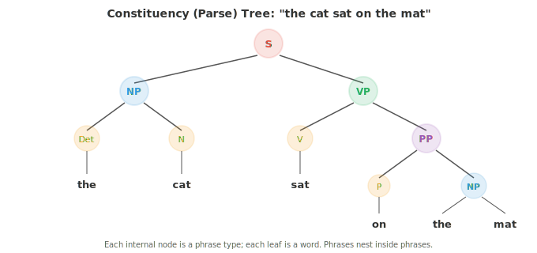
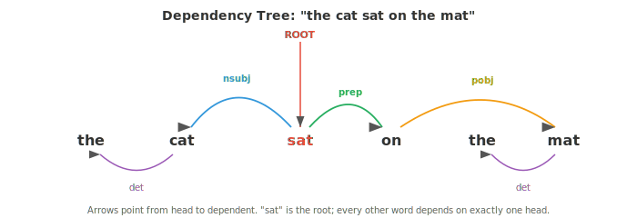

# Linguistic Foundations

*Linguistics provides the structural vocabulary that NLP systems implicitly learn and exploit. This file covers morphology, syntax, semantics, pragmatics, phonology, constituency and dependency parsing, and the distributional hypothesis, the human-language science that grounds tokenisation, grammar, and meaning in AI.*

- Before we can build systems that understand or generate language, we need to understand how language itself works. 

- Linguistics is the scientific study of language, and it provides the conceptual vocabulary that NLP borrows from constantly. 

- Even modern neural models, which learn language from raw data, implicitly rediscover many of the structures that linguists have catalogued for decades.

- Language has structure at every level: the sounds that make up words, the parts that make up words, the rules that combine words into sentences, the meaning those sentences carry, and the way context shapes interpretation. We will work through each level from the bottom up.

- **Morphology** is the study of the internal structure of words. Words are not atomic; they are built from smaller meaningful units called **morphemes**.

- The word "unhappiness" contains three morphemes: "un-" (a prefix meaning "not"), "happy" (the root), and "-ness" (a suffix that turns an adjective into a noun). Each morpheme contributes to the meaning.

- A **root** (or stem) is the core morpheme that carries the primary meaning. "Happy," "run," "compute" are roots. 

- An **affix** is a morpheme that attaches to a root to modify it. 

- English has **prefixes** (before the root: un-, re-, pre-) and **suffixes** (after: -ing, -ed, -tion). Some languages also have infixes (inserted inside the root) and circumfixes (wrapping around).


- There are two kinds of morphological processes. **Inflection** changes the grammatical properties of a word without changing its core meaning or part of speech: "run" becomes "runs" (third person), "running" (progressive), "ran" (past tense). The word is still a verb meaning the same thing.

- **Derivation** creates a new word, often changing the part of speech: "happy" (adjective) becomes "happiness" (noun), "compute" (verb) becomes "computation" (noun) becomes "computational" (adjective). Each derivation shifts meaning and grammatical category.

- Languages vary enormously in morphological complexity. English is relatively **analytic** (few morphemes per word, relying on word order). 

- Turkish and Finnish are **agglutinative** (words can contain many morphemes strung together). Arabic and Hebrew use **templatic** morphology (roots are consonant skeletons like k-t-b for "write," and vowel patterns are inserted to create different words: kitab "book," kataba "he wrote," maktub "written").

- Morphology matters for NLP because it affects tokenisation. A word-level tokeniser treats "run," "runs," "running," and "ran" as four unrelated symbols. 

- A morphologically-aware system recognises they share a root. Subword tokenisation (BPE, WordPiece), which we will cover in file 02, is a statistical approximation to morphological analysis.

- **Syntax** is the study of how words combine into phrases and sentences. Every language has rules governing word order and structure; violating them produces gibberish. 

- "The cat sat on the mat" is grammatical English; "Mat the on sat cat the" is not.

- There are two main frameworks for describing syntactic structure.

- **Phrase structure grammar** (also called constituency grammar) says sentences are built by nesting phrases inside phrases. A sentence (S) consists of a noun phrase (NP) and a verb phrase (VP). 

- A noun phrase might be a determiner (Det) followed by a noun (N). A verb phrase might be a verb (V) followed by a noun phrase. These rules build a tree:



- This tree is called a **constituency tree** (or parse tree). Each internal node is a phrase type, each leaf is a word. The tree captures the hierarchical grouping: "on the mat" is a unit (prepositional phrase), "sat on the mat" is a unit (verb phrase), and the whole thing is a sentence.

- A **context-free grammar (CFG)** formalises these rules. It consists of a set of production rules, each of the form $A \to \alpha$, where $A$ is a non-terminal symbol (a phrase type like NP or VP) and $\alpha$ is a sequence of terminals (words) and non-terminals. For example:

```
S  → NP VP
NP → Det N
NP → Det N PP
VP → V NP
VP → V PP
PP → P NP
Det → "the" | "a"
N  → "cat" | "mat" | "dog"
V  → "sat" | "chased"
P  → "on" | "under"
```

- Starting from S and repeatedly applying rules, you can generate all sentences the grammar allows. Parsing is the reverse: given a sentence, find the tree (or trees) that produced it. A sentence with multiple valid parse trees is **syntactically ambiguous**. "I saw the man with the telescope" has two parses: I used a telescope to see the man, or I saw a man who had a telescope.

- **Dependency grammar** takes a different perspective. Instead of phrase nesting, it describes direct relationships between words. Each word in a sentence depends on exactly one other word (its **head**), except the root of the sentence. The result is a **dependency tree** where edges are labelled with grammatical relations (subject, object, modifier, etc.).



- In the dependency view, "sat" is the root. "Cat" depends on "sat" as its subject (nsubj). "On" depends on "sat" as a prepositional modifier. "Mat" depends on "on" as the object of the preposition. Every word hangs off exactly one head, creating a tree.

- Dependency grammar has become the dominant framework in modern NLP because dependency trees are easier to produce with statistical parsers and the relations map more directly to semantic roles (who did what to whom).

- **Valency** describes how many arguments a verb requires. "Sleep" is **intransitive** (one argument: the sleeper). "Eat" is **transitive** (two: the eater and the eaten). "Give" is **ditransitive** (three: the giver, the thing given, and the receiver). Knowing a verb's valency constrains which parse trees are valid.

- **Semantics** is the study of meaning. Syntax tells you how a sentence is structured; semantics tells you what it means.

- **Lexical semantics** concerns the meaning of individual words. Words are related to each other in systematic ways:

    - **Synonymy**: words with (nearly) the same meaning. "Big" and "large" are synonyms. True perfect synonymy is rare; there are almost always subtle differences in connotation or usage.
    - **Antonymy**: words with opposite meanings. "Hot" and "cold," "buy" and "sell."
    - **Hypernymy/hyponymy**: "is-a" relationships. "Dog" is a hyponym of "animal" (a dog is a kind of animal). "Animal" is a hypernym of "dog." These form taxonomic hierarchies.
    - **Meronymy**: "part-of" relationships. "Wheel" is a meronym of "car."
    - **Polysemy**: a single word with multiple related meanings. "Bank" means a financial institution or a river bank. Context disambiguates.

- **Word sense disambiguation (WSD)** is the task of determining which sense of a polysemous word is intended in a given context. In "I deposited money at the bank," the financial sense is correct. In "We sat by the river bank," the geographical sense is. WSD was a central problem in early NLP; modern contextual embeddings (ELMo, BERT) largely solve it by producing different vector representations for different uses of the same word.

- **Compositional semantics** asks how the meanings of individual words combine to form the meaning of a phrase or sentence. The principle of **compositionality** (attributed to Frege) states that the meaning of a complex expression is determined by the meanings of its parts and the rules used to combine them. "The cat chased the dog" means something different from "the dog chased the cat" because the syntactic structure (who is the subject vs object) interacts with the word meanings.

- Not all meaning is compositional. **Idioms** like "kick the bucket" (meaning "to die") have meanings that cannot be derived from their parts. These are a challenge for any compositional approach.

- **Distributional semantics** is the computational approach to meaning that underpins modern NLP. The **distributional hypothesis** (Firth, 1957) states: "You shall know a word by the company it keeps." Words that appear in similar contexts tend to have similar meanings. This is the theoretical foundation for word embeddings (Word2Vec, GloVe), which we will explore in file 03.

- **Pragmatics** studies how context affects meaning. The same sentence can mean different things depending on who says it, when, where, and why.

- "Can you pass the salt?" is syntactically a yes/no question about ability. Pragmatically, it is a request. You would not answer "Yes, I can" and then sit still. Understanding this requires knowledge beyond the literal words, specifically, the conventions of **speech acts**.

- **Speech act theory** (Austin, Searle) distinguishes between:
    - **Locutionary act**: the literal content ("Can you pass the salt?")
    - **Illocutionary act**: the intended function (a request)
    - **Perlocutionary act**: the effect on the listener (they pass the salt)

- **Implicature** (Grice) is meaning that is implied but not explicitly stated. If someone asks "Is John a good cook?" and you reply "He's British," you have not answered the question literally, but the listener can infer (through cultural stereotypes, fairly or not) that you mean "no." Grice's **cooperative principle** says speakers generally try to be informative, truthful, relevant, and clear, and listeners interpret utterances assuming these maxims hold.

- **Coreference** is a pragmatic phenomenon where different expressions refer to the same entity. In "Alice went to the store. She bought milk," "she" refers to Alice. Resolving coreference is essential for understanding multi-sentence text and is a key NLP task.

- **Discourse structure** describes how sentences connect to form coherent text. A narrative has a beginning, middle, and end. An argument has claims and evidence. **Rhetorical Structure Theory (RST)** analyses text as a tree of discourse relations (elaboration, contrast, cause, etc.) between segments.

- Pragmatics is where NLP gets hardest. Modern language models handle much of syntax and semantics implicitly through training data, but pragmatic reasoning, understanding sarcasm, implicature, and context-dependent meaning, remains a frontier challenge.

- **Phonology** studies the sound systems of languages. While this chapter focuses on text, a brief overview bridges to the audio and speech chapter (Chapter 09).

- A **phoneme** is the smallest unit of sound that distinguishes meaning. English has about 44 phonemes. The words "bat" and "pat" differ by one phoneme (/b/ vs /p/), which changes the meaning entirely. This is called a **minimal pair**.

- **Allophones** are different physical realisations of the same phoneme that do not change meaning. The "p" in "pin" (aspirated, with a puff of air) and the "p" in "spin" (unaspirated) are allophones of /p/ in English; a native speaker treats them as the same sound.

- The **International Phonetic Alphabet (IPA)** provides a standardised notation for phonemes across all languages. The word "cat" is transcribed as /kæt/. IPA is the bridge between written text and speech systems.

- **Prosody** covers the rhythm, stress, and intonation of speech. "I didn't say he stole the money" has seven different meanings depending on which word is stressed. Prosody carries information that text alone loses, which is why text-to-speech systems must model it carefully.

- In NLP, phonological knowledge appears in text-to-speech (grapheme-to-phoneme conversion), speech recognition (mapping acoustic signals to phonemes), and even in spelling correction and transliteration.

## Coding Tasks (use CoLab or notebook)

1. Build a simple morphological analyser that splits English words into likely morphemes using a list of common prefixes and suffixes.
```python
prefixes = ['un', 're', 'pre', 'dis', 'mis', 'over', 'under', 'out', 'non']
suffixes = ['ing', 'ed', 'ly', 'ness', 'ment', 'tion', 'able', 'ible', 'er', 'est', 'ful', 'less', 'ous']

def analyse_morphemes(word):
    """Simple morpheme analysis using known affixes."""
    parts = []
    remaining = word.lower()

    # Check prefixes
    for p in sorted(prefixes, key=len, reverse=True):
        if remaining.startswith(p) and len(remaining) > len(p) + 2:
            parts.append(f"[prefix: {p}]")
            remaining = remaining[len(p):]
            break

    # Check suffixes
    for s in sorted(suffixes, key=len, reverse=True):
        if remaining.endswith(s) and len(remaining) > len(s) + 2:
            root = remaining[:-len(s)]
            parts.append(f"[root: {root}]")
            parts.append(f"[suffix: {s}]")
            remaining = None
            break

    if remaining is not None:
        parts.append(f"[root: {remaining}]")

    return parts

for word in ['unhappiness', 'reusable', 'disconnected', 'overreacting', 'kindness']:
    print(f"{word:20s} → {' + '.join(analyse_morphemes(word))}")
```

2. Implement a simple context-free grammar parser using recursive descent. Define a small grammar and parse a sentence into a constituency tree.
```python
class CFGParser:
    """Recursive descent parser for a tiny English grammar."""
    def __init__(self, tokens):
        self.tokens = tokens
        self.pos = 0

    def peek(self):
        return self.tokens[self.pos] if self.pos < len(self.tokens) else None

    def consume(self, expected=None):
        tok = self.peek()
        if expected and tok != expected:
            return None
        self.pos += 1
        return tok

    def parse_det(self):
        if self.peek() in ('the', 'a'):
            return ('Det', self.consume())
        return None

    def parse_noun(self):
        if self.peek() in ('cat', 'dog', 'mat', 'man'):
            return ('N', self.consume())
        return None

    def parse_verb(self):
        if self.peek() in ('sat', 'chased', 'saw'):
            return ('V', self.consume())
        return None

    def parse_prep(self):
        if self.peek() in ('on', 'under', 'with'):
            return ('P', self.consume())
        return None

    def parse_np(self):
        save = self.pos
        det = self.parse_det()
        noun = self.parse_noun()
        if det and noun:
            # Check for optional PP
            pp = self.parse_pp()
            if pp:
                return ('NP', det, noun, pp)
            return ('NP', det, noun)
        self.pos = save
        return None

    def parse_pp(self):
        save = self.pos
        prep = self.parse_prep()
        np = self.parse_np()
        if prep and np:
            return ('PP', prep, np)
        self.pos = save
        return None

    def parse_vp(self):
        save = self.pos
        verb = self.parse_verb()
        if verb:
            np = self.parse_np()
            if np:
                return ('VP', verb, np)
            pp = self.parse_pp()
            if pp:
                return ('VP', verb, pp)
        self.pos = save
        return None

    def parse_sentence(self):
        np = self.parse_np()
        vp = self.parse_vp()
        if np and vp and self.pos == len(self.tokens):
            return ('S', np, vp)
        return None

def print_tree(tree, indent=0):
    if isinstance(tree, str):
        print(' ' * indent + tree)
    elif isinstance(tree, tuple):
        print(' ' * indent + tree[0])
        for child in tree[1:]:
            print_tree(child, indent + 2)

sentences = [
    "the cat sat on the mat",
    "a dog chased the cat",
]

for sent in sentences:
    tokens = sent.split()
    parser = CFGParser(tokens)
    tree = parser.parse_sentence()
    print(f"\n'{sent}':")
    if tree:
        print_tree(tree)
    else:
        print("  (no parse found)")
```

3. Explore lexical relations by building a simple word graph. Given a small vocabulary with synonym, antonym, and hypernym relations, find paths between words.
```python
relations = {
    ('big', 'large'): 'synonym',
    ('big', 'small'): 'antonym',
    ('small', 'tiny'): 'synonym',
    ('dog', 'animal'): 'hypernym',
    ('cat', 'animal'): 'hypernym',
    ('puppy', 'dog'): 'hypernym',
    ('happy', 'glad'): 'synonym',
    ('happy', 'sad'): 'antonym',
    ('hot', 'cold'): 'antonym',
    ('hot', 'warm'): 'synonym',
}

# Build adjacency list
from collections import defaultdict, deque

graph = defaultdict(list)
for (w1, w2), rel in relations.items():
    graph[w1].append((w2, rel))
    graph[w2].append((w1, rel))

def find_path(start, end):
    """BFS to find a path between two words through the relation graph."""
    queue = deque([(start, [(start, None)])])
    visited = {start}
    while queue:
        node, path = queue.popleft()
        if node == end:
            return path
        for neighbor, rel in graph[node]:
            if neighbor not in visited:
                visited.add(neighbor)
                queue.append((neighbor, path + [(neighbor, rel)]))
    return None

pairs = [('big', 'tiny'), ('puppy', 'cat'), ('happy', 'sad')]
for w1, w2 in pairs:
    path = find_path(w1, w2)
    if path:
        steps = " → ".join(f"{w}({r})" if r else w for w, r in path)
        print(f"{w1} → {w2}: {steps}")
    else:
        print(f"{w1} → {w2}: no path found")
```
