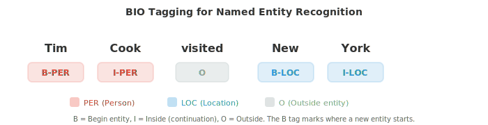

# Text Processing and Classic NLP

*Text processing transforms raw characters into structured representations that models can consume. This file covers tokenisation (word, subword, BPE, WordPiece), text normalisation, edit distance, TF-IDF, n-gram language models, POS tagging, NER, and sentiment analysis, the classical NLP pipeline that still underpins modern systems.*

- Raw text is messy. Before any NLP model can work with language, the text must be cleaned, normalised, and converted into a structured representation. This file covers the pipeline from raw characters to features that models can consume, along with the classical NLP algorithms that dominated before deep learning.

- **Text normalisation** transforms raw text into a canonical form. The goal is to reduce irrelevant variation so that "Hello", "hello", "HELLO" and "héllo" are treated appropriately.

- **Case folding** converts text to lowercase. This collapses "The" and "the" into one token. It helps for most tasks, but destroys useful information in some cases: "US" (the country) vs "us" (the pronoun), or "Apple" (the company) vs "apple" (the fruit).

- **Unicode normalisation** handles the fact that the same character can be encoded multiple ways. The character "é" can be a single code point (U+00E9) or a base "e" plus a combining accent (U+0065 + U+0301). NFC normalisation composes them into one code point; NFD decomposes them. Without normalisation, two identical-looking strings may not match.

- **Edit distance** measures how different two strings are. The **Levenshtein distance** counts the minimum number of single-character insertions, deletions, and substitutions needed to transform one string into another. "kitten" → "sitting" has edit distance 3 (k→s, e→i, insert g).

- Edit distance is computed using dynamic programming (we review in alrothim chapter). Define $D[i][j]$ as the distance between the first $i$ characters of string $s$ and the first $j$ characters of string $t$:

```math
D[i][j] = \begin{cases} j & \text{if } i = 0 \\ i & \text{if } j = 0 \\ D[i{-}1][j{-}1] & \text{if } s[i] = t[j] \\ 1 + \min(D[i{-}1][j], \; D[i][j{-}1], \; D[i{-}1][j{-}1]) & \text{otherwise} \end{cases}
```

- Edit distance powers spelling correction, fuzzy matching, and DNA sequence alignment. In NLP, it is used to handle typos and find similar words.

- **Tokenisation** splits text into discrete units (tokens) that a model can process. This is the first and arguably most important preprocessing step. The choice of tokenisation strategy profoundly affects model behaviour.

- **Whitespace tokenisation** splits on spaces. Simple but naive: "New York" becomes two tokens, "don't" is one token (or split into "don" and "'t" depending on the splitter), and languages like Chinese and Japanese have no spaces between words at all.

- **Rule-based tokenisation** uses handcrafted patterns (regular expressions) to handle contractions, punctuation, and special cases. "I'm" → "I" + "'m", "U.S.A." stays as one token. Every language needs its own rules, which is labour-intensive.

- **Subword tokenisation** is the modern solution. Instead of splitting at word boundaries, it learns a vocabulary of frequent subword units from data. This elegantly handles unknown words: if "unhappiness" is not in the vocabulary, it might be split into "un" + "happi" + "ness", preserving morphological structure.


- **Byte-Pair Encoding (BPE)** starts with individual characters as the vocabulary. It repeatedly finds the most frequent adjacent pair and merges them into a new token. After enough merges, common words are single tokens and rare words are split into frequent subword pieces.

- The BPE algorithm:
    1. Initialise the vocabulary with all individual characters in the training corpus
    2. Count the frequency of every adjacent token pair
    3. Merge the most frequent pair into a new token
    4. Repeat steps 2-3 for a desired number of merges (vocabulary size)

- For example, starting with "l o w" (5 times), "l o w e r" (2 times), "n e w e s t" (6 times): the most frequent pair might be "e s" → merge into "es". Then "es t" → "est". Then "n e w" → "new". The final vocabulary contains both full words and subword pieces.

- **WordPiece** (used by BERT) is similar to BPE but selects merges based on likelihood rather than frequency. It merges the pair that maximises the language model likelihood of the training data. Subword tokens that are not word-initial are prefixed with "##" (e.g., "playing" → "play" + "##ing").

- **Unigram** (used by SentencePiece) takes the opposite approach: start with a large vocabulary and iteratively remove tokens whose removal least hurts the training data likelihood. The final vocabulary is the set of subword units that best explain the corpus.

- **SentencePiece** is a language-agnostic tokenisation library that treats the input as a raw byte stream (no pre-tokenisation on spaces). This makes it work for any language, including those without spaces. It implements both BPE and Unigram algorithms.

- The vocabulary size is a key hyperparameter. Typical choices range from 30,000 to 100,000 tokens. Larger vocabularies mean fewer tokens per sequence (more efficient) but a larger embedding table. Smaller vocabularies mean more subword splits and longer sequences.

- Both techniques reduce words to a base form, but they differ in approach.

- **Stemming** chops off suffixes using crude rules. The Porter stemmer reduces "running" to "run", "happiness" to "happi", and "studies" to "studi". It is fast but imprecise: "university" and "universe" both stem to "univers" despite being unrelated.

- **Lemmatisation** uses vocabulary and morphological analysis to find the true dictionary form (lemma). "Running" → "run", "better" → "good", "mice" → "mouse". It requires knowing the part of speech: "saw" as a verb lemmatises to "see", but as a noun it stays "saw".

- Modern subword tokenisation has largely replaced stemming and lemmatisation in neural NLP, but they remain useful in information retrieval and when working with smaller models or limited data.

- **Part-of-speech (POS) tagging** assigns a grammatical category to each word: noun, verb, adjective, determiner, etc. This is one of the oldest NLP tasks and is fundamental to syntactic analysis.

- The Penn Treebank tagset is the most common for English, with 36 tags (NN for singular noun, NNS for plural noun, VB for base verb, VBD for past tense, JJ for adjective, etc.).

- POS tagging is tricky because many words are ambiguous. "Book" can be a noun ("the book") or a verb ("book a flight"). "Run" has dozens of senses across parts of speech. Context is essential.

- Early taggers used **Hidden Markov Models (HMMs)** from chapter 05. The hidden states are POS tags, the observations are words. The transition probabilities capture tag sequences (a determiner is likely followed by a noun or adjective), and the emission probabilities capture which words appear with which tags. The Viterbi algorithm finds the most likely tag sequence.

- The HMM model for POS tagging:

$$\hat{t}_{1:n} = \arg\max_{t_{1:n}} \prod_{i=1}^{n} P(w_i \mid t_i) \cdot P(t_i \mid t_{i-1})$$

- Modern POS taggers use neural networks (bidirectional LSTMs or transformers) and achieve over 97% accuracy on English, approaching human performance.

- **Named Entity Recognition (NER)** identifies and classifies proper names and other specific entities in text: persons, organisations, locations, dates, monetary amounts, etc.

- In "Apple CEO Tim Cook announced the event in Cupertino on Monday," a NER system should identify: Apple (ORG), Tim Cook (PER), Cupertino (LOC), Monday (DATE).

- NER is typically framed as **sequence labelling** using **BIO tagging** (also called IOB tagging). Each token gets a tag:
    - **B-TYPE**: beginning of an entity of type TYPE
    - **I-TYPE**: inside (continuation of) an entity of type TYPE
    - **O**: outside any entity

- "Tim Cook visited New York" becomes: Tim/B-PER Cook/I-PER visited/O New/B-LOC York/I-LOC. The B tag marks where a new entity starts, which is important when two entities of the same type are adjacent.



- Classical NER used **Conditional Random Fields (CRFs)** from chapter 05, which model the conditional probability of the entire tag sequence given the input. Unlike HMMs, which are generative ($P(x, y)$), CRFs are discriminative and model $P(y \mid x)$ directly. A linear-chain CRF defines:

$$P(y_{1:n} \mid x_{1:n}) = \frac{1}{Z(x)} \exp\!\left(\sum_{i=1}^{n} \left[\sum_k \lambda_k f_k(y_i, x, i) + \sum_j \mu_j g_j(y_i, y_{i-1}, x, i)\right]\right)$$

- Here $f_k$ are **emission features** (how likely tag $y_i$ is given the input at position $i$) and $g_j$ are **transition features** (how likely tag $y_i$ is given the previous tag $y_{i-1}$). 

- The partition function $Z(x) = \sum_{y'} \exp(\ldots)$ sums over all possible tag sequences to normalise the distribution. Training maximises the conditional log-likelihood, which requires computing $Z(x)$ efficiently using the forward algorithm (chapter 05). 

- The key advantage over independently classifying each token: the CRF's transition features enforce structural constraints (e.g., I-PER should only follow B-PER or I-PER, never appear after O). 

- Modern NER stacks a CRF on top of a neural encoder (BiLSTM-CRF or BERT-CRF), where the neural network produces the emission scores and the CRF layer learns transition structure.

- **Syntactic parsing** converts a sentence into its syntactic structure, either a constituency tree or a dependency tree (both from file 01).

- The **CYK algorithm** (Cocke-Younger-Kasami) parses sentences with context-free grammars using dynamic programming. 

- It requires the grammar to be in **Chomsky Normal Form** (every rule has either two non-terminals or one terminal on the right side). It fills a triangular table bottom-up: cells represent spans of the sentence, and each cell stores the non-terminals that can generate that span.

- CYK runs in $O(n^3 \cdot |G|)$ time, where $n$ is the sentence length and $|G|$ is the grammar size. This is exact but slow for large grammars.

- **Shift-reduce parsing** processes the sentence left to right, maintaining a stack. At each step, it either **shifts** (pushes the next word onto the stack) or **reduces** (pops elements from the stack and replaces them with a phrase). A trained classifier decides the action at each step. This runs in $O(n)$ time, making it much faster than CYK.

- **Dependency parsing** is now more common than constituency parsing in practice. Transition-based dependency parsers (like shift-reduce) and graph-based parsers (which score all possible edges and find the maximum spanning tree) are the two main approaches. Neural dependency parsers using BiLSTMs or transformers achieve state-of-the-art results.

- Before embeddings, NLP represented documents as vectors using simple counting methods.

- The **bag-of-words (BoW)** model represents a document as a vector of word counts, ignoring word order entirely. If the vocabulary has $V$ words, each document is a vector in $\mathbb{R}^V$ (connecting back to vector spaces from chapter 01). The entry for word $w$ is the number of times $w$ appears in the document.


- BoW is simple but surprisingly effective for tasks like document classification and spam filtering. Its main weakness is that it treats every word as equally important: "the" and "revolutionary" get equal weight.

- **TF-IDF** (Term Frequency-Inverse Document Frequency) fixes this by weighting words based on how informative they are. Words that appear frequently in one document but rarely across the corpus are likely important for that document.

$$\text{TF-IDF}(t, d) = \text{TF}(t, d) \times \text{IDF}(t)$$

- **Term frequency** $\text{TF}(t, d)$ is often the raw count of term $t$ in document $d$ (or its log: $1 + \log(\text{count})$).

- **Inverse document frequency** $\text{IDF}(t) = \log\frac{N}{|\{d : t \in d\}|}$, where $N$ is the total number of documents. Words appearing in every document (like "the") get IDF close to 0. Rare words get high IDF.

- TF-IDF vectors can be compared using cosine similarity (from chapter 01) to measure document similarity. This is the foundation of classical information retrieval and search engines.

- A **language model** assigns a probability to a sequence of words. It answers: how likely is this sentence? Language models are central to machine translation, speech recognition, spelling correction, and text generation.

- The probability of a sentence $w_1, w_2, \ldots, w_n$ is, by the chain rule of probability (chapter 05):

$$P(w_1, w_2, \ldots, w_n) = \prod_{i=1}^{n} P(w_i \mid w_1, \ldots, w_{i-1})$$

- This is exact but impractical: you would need to store probabilities for every possible history. The **Markov assumption** (chapter 05) truncates the history to the last $k-1$ words, giving an **n-gram model** (where $n = k$).

- A **bigram model** ($n = 2$) conditions only on the previous word:

$$P(w_i \mid w_1, \ldots, w_{i-1}) \approx P(w_i \mid w_{i-1})$$

- A **trigram model** ($n = 3$) conditions on the previous two words. N-gram probabilities are estimated by counting in a corpus:

$$P(w_i \mid w_{i-1}) = \frac{\text{count}(w_{i-1}, w_i)}{\text{count}(w_{i-1})}$$

- **Perplexity** measures how well a language model predicts a test set. It is the inverse probability of the test set, normalised by the number of words:

$$\text{PPL} = P(w_1, \ldots, w_N)^{-1/N} = \exp\!\left(-\frac{1}{N} \sum_{i=1}^{N} \log P(w_i \mid w_{<i})\right)$$

- Lower perplexity means the model is less "surprised" by the test data and therefore better. A model that assigns uniform probability over a 10,000-word vocabulary has perplexity 10,000. A good bigram model might achieve perplexity around 200. Modern neural language models achieve perplexity below 20.

- Notice that perplexity is the exponentiated cross-entropy (from chapter 05's information theory). Minimising cross-entropy loss during training directly minimises perplexity.

- **Smoothing** handles the zero-probability problem: if an n-gram never appeared in training, the model assigns it probability 0, which makes the entire sentence probability 0. **Laplace smoothing** (add-1) adds a small count to every n-gram:

$$P_{\text{Laplace}}(w_i \mid w_{i-1}) = \frac{\text{count}(w_{i-1}, w_i) + 1}{\text{count}(w_{i-1}) + V}$$

- This is too aggressive for large vocabularies (it steals too much probability from observed n-grams). **Kneser-Ney smoothing** is the gold standard for n-gram models. It combines two ideas: absolute discounting and a continuation probability for backoff.

- First, **absolute discounting** subtracts a fixed discount $d$ (typically $d \approx 0.75$) from each observed count, rather than adding pseudocounts. The freed probability mass is redistributed to unseen n-grams. The interpolated form is:

$$P_{\text{KN}}(w_i \mid w_{i-1}) = \frac{\max(\text{count}(w_{i-1}, w_i) - d, \; 0)}{\text{count}(w_{i-1})} + \lambda(w_{i-1}) \cdot P_{\text{cont}}(w_i)$$

- where $\lambda(w_{i-1})$ is a normalising constant that distributes the discounted mass. The key innovation is the **continuation probability** $P_{\text{cont}}(w_i)$, which measures how many different contexts $w_i$ appears in, rather than how often it appears overall:

$$P_{\text{cont}}(w_i) = \frac{|\{w' : \text{count}(w', w_i) > 0\}|}{|\{(w', w'') : \text{count}(w', w'') > 0\}|}$$

- The numerator counts how many distinct words precede $w_i$ in the corpus. A word like "Francisco" appears in few contexts (almost always after "San"), so even if "San Francisco" is very frequent, "Francisco" gets a low continuation probability and will not be predicted spuriously in other contexts. 

- Conversely, common words like "the" appear after many different words and get high continuation probability. This captures the intuition that a word's versatility matters more than its raw frequency for backoff estimation.

- N-gram models were the state of the art for decades. They are fast, interpretable, and require no training (just counting). But they struggle with long-range dependencies ("The keys that I left on the table **are** missing" requires knowing the subject "keys" is plural, which is far from the verb). Neural language models, starting with RNNs and culminating in transformers, address this limitation.

## Coding Tasks (use CoLab or notebook)

1. Implement the Levenshtein edit distance using dynamic programming. Test it on word pairs and use it for simple spelling correction.
```python
import jax.numpy as jnp

def edit_distance(s, t):
    """Compute Levenshtein edit distance using DP."""
    m, n = len(s), len(t)
    D = [[0] * (n + 1) for _ in range(m + 1)]

    for i in range(m + 1):
        D[i][0] = i
    for j in range(n + 1):
        D[0][j] = j

    for i in range(1, m + 1):
        for j in range(1, n + 1):
            if s[i-1] == t[j-1]:
                D[i][j] = D[i-1][j-1]
            else:
                D[i][j] = 1 + min(D[i-1][j], D[i][j-1], D[i-1][j-1])

    return D[m][n]

# Test
pairs = [("kitten", "sitting"), ("sunday", "saturday"), ("hello", "hallo")]
for s, t in pairs:
    print(f"d('{s}', '{t}') = {edit_distance(s, t)}")

# Simple spelling correction
dictionary = ["the", "their", "there", "then", "than", "this", "that", "these", "those"]
misspelled = "thier"
corrections = sorted(dictionary, key=lambda w: edit_distance(misspelled, w))
print(f"\nClosest to '{misspelled}': {corrections[:3]}")
```

2. Implement BPE tokenisation from scratch. Start with character-level tokens and iteratively merge the most frequent pairs.
```python
from collections import Counter

def get_pairs(corpus):
    """Count adjacent token pairs across all words."""
    pairs = Counter()
    for word, freq in corpus.items():
        symbols = word.split()
        for i in range(len(symbols) - 1):
            pairs[(symbols[i], symbols[i+1])] += freq
    return pairs

def merge_pair(pair, corpus):
    """Merge all occurrences of a pair in the corpus."""
    new_corpus = {}
    bigram = ' '.join(pair)
    replacement = ''.join(pair)
    for word, freq in corpus.items():
        new_word = word.replace(bigram, replacement)
        new_corpus[new_word] = freq
    return new_corpus

# Training corpus with word frequencies
text = "low low low low low lower lower newest newest newest newest newest newest"
word_freqs = Counter(text.split())
# Initialise: split each word into characters with end-of-word marker
corpus = {' '.join(word) + ' _': freq for word, freq in word_freqs.items()}

print("Initial corpus:")
for word, freq in corpus.items():
    print(f"  {word}: {freq}")

# Run BPE for 10 merges
for i in range(10):
    pairs = get_pairs(corpus)
    if not pairs:
        break
    best_pair = max(pairs, key=pairs.get)
    corpus = merge_pair(best_pair, corpus)
    print(f"\nMerge {i+1}: {best_pair} (freq={pairs[best_pair]})")
    for word, freq in corpus.items():
        print(f"  {word}: {freq}")
```

3. Build a bigram language model and compute perplexity on a test sentence. Experiment with Laplace smoothing.
```python
from collections import Counter, defaultdict
import math

# Training corpus
train = """the cat sat on the mat . the dog chased the cat .
the cat ran from the dog . a dog sat on a mat .""".split()

# Count bigrams and unigrams
bigrams = Counter(zip(train[:-1], train[1:]))
unigrams = Counter(train)
vocab_size = len(set(train))

def bigram_prob(w2, w1, alpha=0):
    """P(w2 | w1) with optional Laplace smoothing."""
    return (bigrams[(w1, w2)] + alpha) / (unigrams[w1] + alpha * vocab_size)

# Compute perplexity
test = "the cat sat on a mat .".split()

for alpha in [0, 1, 0.1]:
    log_prob = 0
    for w1, w2 in zip(test[:-1], test[1:]):
        p = bigram_prob(w2, w1, alpha=alpha)
        if p > 0:
            log_prob += math.log(p)
        else:
            log_prob += float('-inf')

    ppl = math.exp(-log_prob / (len(test) - 1)) if log_prob > float('-inf') else float('inf')
    print(f"Smoothing α={alpha}: perplexity = {ppl:.2f}")
```

4. Implement TF-IDF from scratch and use cosine similarity to find the most similar document to a query.
```python
import jax.numpy as jnp
import math
from collections import Counter

documents = [
    "the cat sat on the mat",
    "the dog chased the cat around the park",
    "a mat was placed on the floor by the door",
    "the quick brown fox jumped over the lazy dog",
]

# Build vocabulary
vocab = sorted(set(word for doc in documents for word in doc.split()))
word_to_idx = {w: i for i, w in enumerate(vocab)}
V = len(vocab)
N = len(documents)

# Compute TF-IDF matrix
doc_freq = Counter()
for doc in documents:
    for word in set(doc.split()):
        doc_freq[word] += 1

tfidf_matrix = jnp.zeros((N, V))
for i, doc in enumerate(documents):
    word_counts = Counter(doc.split())
    for word, count in word_counts.items():
        tf = 1 + math.log(count)
        idf = math.log(N / doc_freq[word])
        j = word_to_idx[word]
        tfidf_matrix = tfidf_matrix.at[i, j].set(tf * idf)

# Query
query = "cat on the mat"
query_vec = jnp.zeros(V)
query_counts = Counter(query.split())
for word, count in query_counts.items():
    if word in word_to_idx:
        tf = 1 + math.log(count)
        idf = math.log(N / doc_freq.get(word, 1))
        query_vec = query_vec.at[word_to_idx[word]].set(tf * idf)

# Cosine similarity (from chapter 01)
def cosine_sim(a, b):
    return jnp.dot(a, b) / (jnp.linalg.norm(a) * jnp.linalg.norm(b) + 1e-8)

print(f"Query: '{query}'\n")
for i, doc in enumerate(documents):
    sim = cosine_sim(query_vec, tfidf_matrix[i])
    print(f"  Doc {i} (sim={sim:.3f}): '{doc}'")
```
