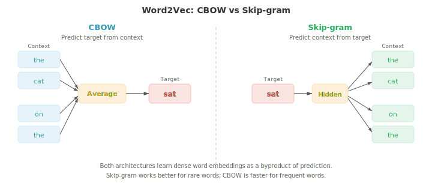

# Embeddings and Sequence Models

*Word embeddings compress sparse, symbolic text into dense vector spaces where semantic similarity becomes geometric proximity. This file covers Word2Vec (CBOW, Skip-gram), GloVe, FastText, RNNs, LSTMs, GRUs, seq2seq with attention, and the encoder-decoder paradigm, the progression from bag-of-words to contextual representations.*

- In file 01, we introduced the distributional hypothesis: words that appear in similar contexts tend to have similar meanings. In file 02, we represented text using sparse, hand-crafted features like TF-IDF vectors. These vectors live in very high-dimensional spaces (one dimension per vocabulary word) and are mostly zeros. **Word embeddings** compress this information into dense, low-dimensional vectors that capture semantic relationships, and they are learned directly from data.

- **Word2Vec** (Mikolov et al., 2013) learns word embeddings by training a shallow neural network on a simple prediction task. There are two architectures.

- The **Continuous Bag of Words (CBOW)** model predicts a target word from its surrounding context words. Given a window of context words (e.g., "the cat ___ on the"), the model averages their embedding vectors and passes the result through a linear layer to predict the missing word ("sat"). The training objective maximises:

$$P(w_t \mid w_{t-k}, \ldots, w_{t-1}, w_{t+1}, \ldots, w_{t+k})$$

- The **Skip-gram** model does the reverse: given a target word, predict the surrounding context words. For the target word "sat", the model tries to predict "the", "cat", "on", "the" in separate predictions. The objective maximises:

$$P(w_{t+j} \mid w_t) \quad \text{for each } j \in [-k, k], \; j \neq 0$$



- Skip-gram tends to work better for rare words because each word generates multiple training examples (one per context position). CBOW is faster and slightly better for frequent words because it averages over multiple context signals.

- Training on the full vocabulary is expensive because the softmax denominator sums over all $V$ words. **Negative sampling** approximates this by turning the problem into binary classification: distinguish the true context word (positive sample) from randomly sampled noise words (negative samples). Instead of computing the full softmax, the model only updates embeddings for the target, the true context word, and a handful of negatives:

$$\mathcal{L} = \log \sigma(v_{w_O}^T v_{w_I}) + \sum_{i=1}^{k} \mathbb{E}_{w_i \sim P_n} [\log \sigma(-v_{w_i}^T v_{w_I})]$$

- Here $v_{w_I}$ is the input word embedding, $v_{w_O}$ is the output (context) word embedding, and $P_n$ is the noise distribution, typically the unigram frequency raised to the 3/4 power (which downweights very frequent words like "the").

- Why does this simple objective produce meaningful embeddings? Levy and Goldberg (2014) showed that skip-gram with negative sampling is implicitly factorising a **shifted pointwise mutual information (PMI)** matrix. At convergence, the dot product of two word vectors approximates:

$$v_w^T v_c \approx \text{PMI}(w, c) - \log k$$

- where $\text{PMI}(w, c) = \log \frac{P(w, c)}{P(w) P(c)}$ measures how much more likely words $w$ and $c$ co-occur than expected by chance (chapter 05 information theory), and $k$ is the number of negative samples. Words that co-occur much more than chance have high PMI and therefore high dot product (similar embeddings). Words that co-occur less than expected have negative PMI and dissimilar embeddings. This reveals that Word2Vec is doing the same thing as classical distributional semantics methods like latent semantic analysis (SVD on co-occurrence matrices), but in a more scalable, online fashion.

- The most surprising property of Word2Vec embeddings is that they capture **analogies** through vector arithmetic. The vector $v_{\text{king}} - v_{\text{man}} + v_{\text{woman}}$ is closest to $v_{\text{queen}}$. This works because the embedding space encodes semantic relationships as approximately linear directions: the "royalty" direction is roughly $v_{\text{king}} - v_{\text{man}}$, and adding it to $v_{\text{woman}}$ lands near $v_{\text{queen}}$. This connects to the linear algebra of chapter 01: semantic relationships are vector translations.

- **GloVe** (Global Vectors for Word Representation, Pennington et al., 2014) takes a different approach. Instead of learning from local context windows one at a time, it builds a global word co-occurrence matrix $X$ where $X_{ij}$ counts how often word $j$ appears in the context of word $i$ across the entire corpus. The model then learns embeddings whose dot product approximates the log co-occurrence:

$$w_i^T \tilde{w}_j + b_i + \tilde{b}_j = \log X_{ij}$$

- The loss function weights each pair by a capping function $f(X_{ij})$ that prevents very frequent co-occurrences from dominating:

$$\mathcal{L} = \sum_{i,j=1}^{V} f(X_{ij}) \left(w_i^T \tilde{w}_j + b_i + \tilde{b}_j - \log X_{ij}\right)^2$$

- GloVe combines the benefits of global matrix factorisation (like latent semantic analysis) with the local context learning of Word2Vec. In practice, GloVe and Word2Vec produce embeddings of similar quality.

- **FastText** (Bojanowski et al., 2017) extends skip-gram by representing each word as a bag of character n-grams. The word "where" with $n = 3$ becomes: "<wh", "whe", "her", "ere", "re>", plus the whole-word token "<where>". The word's embedding is the sum of all its n-gram embeddings.

- This has a crucial advantage: FastText can produce embeddings for words it has never seen during training. The word "whereabouts" shares n-grams with "where", so its embedding will be reasonable even if "whereabouts" never appeared in the training data. This is especially useful for morphologically rich languages (file 01) where words have many inflected forms.

- **Embedding evaluation** typically uses two types of benchmarks. **Analogy tasks** test whether $v_a - v_b + v_c \approx v_d$ (e.g., "Paris" $-$ "France" $+$ "Italy" $\approx$ "Rome"). **Similarity benchmarks** compare the cosine similarity (chapter 01) between word pairs to human judgements. Common datasets include WordSim-353, SimLex-999, and the Google analogy test set. A practical caveat: embeddings that excel at analogies may not be best for downstream tasks like sentiment classification. The best evaluation is often the task itself.

- In chapter 06, we introduced RNNs, LSTMs, and GRUs as architectures for sequential data. Here we focus on how they are applied to language tasks specifically.

- A **language model RNN** reads tokens one at a time and predicts the next token at each step. The hidden state $h_t$ compresses the entire history $w_1, \ldots, w_t$ into a fixed-size vector, and a linear layer plus softmax maps $h_t$ to a distribution over the vocabulary. Training uses cross-entropy loss against the true next token, which is identical to minimising perplexity (file 02). The key limitation: the fixed-size hidden state must encode everything about the history, and information from early tokens gets progressively overwritten.

- **Bidirectional RNNs** process the sequence in both directions: one RNN reads left-to-right, another reads right-to-left. At each position $t$, the forward hidden state $\overrightarrow{h}_t$ and backward hidden state $\overleftarrow{h}_t$ are concatenated to form a context-aware representation $h_t = [\overrightarrow{h}_t ; \overleftarrow{h}_t]$. This gives the model access to both past and future context, which is powerful for tasks like POS tagging and NER (file 02) where a word's label depends on words both before and after it. Bidirectional RNNs cannot be used for language modelling because you cannot peek at future tokens when predicting them.


- **Deep stacked RNNs** place multiple RNN layers on top of each other. The hidden states of layer $l$ at all time steps become the input sequence for layer $l + 1$. Stacking 2-4 layers typically improves performance by building hierarchical representations, similar to how deeper CNNs build feature hierarchies (chapter 06). Beyond 4 layers, vanishing gradients and overfitting become problems unless residual connections are added between layers.

- The **sequence-to-sequence (seq2seq)** architecture (Sutskever et al., 2014) maps a variable-length input sequence to a variable-length output sequence. It consists of an **encoder** RNN that reads the input and compresses it into a context vector (the final hidden state), and a **decoder** RNN that generates the output one token at a time, conditioned on this context vector.


- Seq2seq was the breakthrough architecture for machine translation. The encoder reads a French sentence, the decoder produces the English translation. The decoder starts with a special start-of-sequence token and generates tokens autoregressively until it produces an end-of-sequence token. A practical trick: reversing the input sequence (feeding "chat le" instead of "le chat") improved results because it placed the first input word closer to the first output word in the computation graph, shortening the gradient path.

- The bottleneck problem: the entire input must be compressed into a single fixed-size vector. For long sentences, this vector cannot capture all the information, and performance degrades. This motivated **attention mechanisms**.

- Chapter 06 introduced the modern Q, K, V formulation of attention. The original attention mechanisms for NLP were formulated differently, as alignment models between encoder and decoder states.

- **Bahdanau attention** (additive attention, Bahdanau et al., 2015) computes an alignment score between the decoder hidden state $s_t$ and each encoder hidden state $h_i$ using a learned feed-forward network:

$$e_{ti} = v^T \tanh(W_s s_{t-1} + W_h h_i)$$

- The scores are normalised to attention weights via softmax, and the context vector is a weighted sum of encoder states:

$$\alpha_{ti} = \frac{\exp(e_{ti})}{\sum_j \exp(e_{tj})}, \quad c_t = \sum_i \alpha_{ti} h_i$$

- The decoder then uses both $s_{t-1}$ and $c_t$ to produce the next output. The key insight: instead of one fixed context vector for the entire sentence, each decoder step gets a different weighted combination of encoder states, allowing the model to "look back" at the relevant parts of the input.

- **Luong attention** (multiplicative attention, Luong et al., 2015) simplifies the score computation. The **dot** variant uses $e_{ti} = s_t^T h_i$. The **general** variant uses $e_{ti} = s_t^T W h_i$. These are faster than Bahdanau's additive score because they use matrix multiplication instead of a feed-forward network. Luong attention also computes the context vector from the current decoder state $s_t$ (rather than $s_{t-1}$), which gives it access to more information but makes the computation slightly different.


- Attention weights are often visualised as heatmaps showing which input tokens the decoder focuses on when producing each output token. In translation, these heatmaps roughly trace the word alignment between source and target languages, with the diagonal pattern broken by reordering (e.g., adjective-noun order differs between French and English).

- At inference time, the decoder must choose a token at each step. **Greedy decoding** picks the highest-probability token at each position, but this can lead to suboptimal sequences: a locally good choice may force the model into a globally bad sentence. **Beam search** maintains the top $k$ (the beam width) partial sequences at each step, expanding each by all possible next tokens and keeping the best $k$ overall.

- With beam width $k = 1$, beam search reduces to greedy decoding. Typical values are $k = 4$ to $k = 10$. Larger beams find better sequences but are proportionally slower. Beam search also needs **length normalisation** to avoid favouring shorter sequences, which naturally have higher total probability because they multiply fewer terms. The normalised score is:

$$\text{score}(y) = \frac{1}{|y|^\alpha} \sum_{t=1}^{|y|} \log P(y_t \mid y_{<t})$$

- where $|y|$ is the sequence length and $\alpha$ (typically 0.6-0.7) controls the strength of the length penalty. With $\alpha = 0$, there is no length normalisation. With $\alpha = 1$, the score is the per-token log-probability (geometric mean). The intermediate value balances between favouring concise outputs and not truncating too early.

- While RNNs process text sequentially, **1D CNNs** process it in parallel by sliding filters across the token sequence. Each filter detects a local pattern (an n-gram feature).

- **TextCNN** (Kim, 2014) applies multiple 1D convolutional filters of different widths (e.g., 3, 4, 5 tokens) to the input embedding matrix. Each filter produces a feature map, and **max-over-time pooling** takes the single maximum value from each feature map, capturing whether the pattern was detected anywhere in the text regardless of position. The pooled features from all filters are concatenated and passed to a classifier.


- TextCNN is fast and surprisingly effective for text classification tasks like sentiment analysis. It captures local n-gram patterns but cannot model long-range dependencies: a filter of width 5 only sees 5 consecutive tokens. **Dilated causal convolutions** address this by inserting gaps (dilations) between filter elements. Stacking layers with exponentially increasing dilation rates (1, 2, 4, 8, ...) grows the receptive field exponentially without increasing parameters, allowing the model to capture dependencies across hundreds of tokens.

- All the embeddings discussed so far (Word2Vec, GloVe, FastText) produce a single vector per word type regardless of context. "Bank" gets the same embedding whether it means a financial institution or a river bank. This is a fundamental limitation that **contextual embeddings** address.

- **ELMo** (Embeddings from Language Models, Peters et al., 2018) produces contextual word representations by running a deep bidirectional LSTM language model on the input text. The forward LSTM predicts the next word at each position; a separate backward LSTM predicts the previous word. Both are trained as language models on large corpora.

- At each position $k$, ELMo combines the hidden states from all $L$ layers using task-specific learned weights:

$$\text{ELMo}_k = \gamma \sum_{j=0}^{L} s_j \, h_{k,j}$$

- Here $h_{k,j}$ is the hidden state at position $k$ and layer $j$ (layer 0 is the raw token embedding), $s_j$ are softmax-normalised scalar weights, and $\gamma$ is a task-specific scaling factor. Different layers capture different information: lower layers capture syntax (POS tags, word morphology), upper layers capture semantics (word sense, semantic role). By mixing all layers with learned weights, ELMo embeddings adapt to diverse downstream tasks.

- ELMo marked the beginning of the **pre-train then fine-tune** paradigm: train a large language model on massive unlabelled text, then use its representations for downstream tasks. ELMo specifically uses the pre-trained representations as fixed or lightly tuned features that are concatenated with task-specific inputs. BERT and GPT (file 04) push this further by fine-tuning the entire model end-to-end, which proves dramatically more effective.

- The progression from Word2Vec to ELMo illustrates a recurring theme in NLP: moving from static to dynamic representations, from local to global context, and from shallow to deep models. Each step trades computational cost for richer representations. Transformers (file 04) complete this progression by replacing recurrence entirely with attention, enabling both deep contextualisation and parallel computation.

## Coding Tasks (use CoLab or notebook)

1. Implement Word2Vec skip-gram with negative sampling from scratch. Train on a small corpus and visualise the learned embeddings using PCA.
```python
import jax
import jax.numpy as jnp
import matplotlib.pyplot as plt

# Small corpus
corpus = """the king ruled the kingdom . the queen ruled the kingdom .
the prince is the son of the king . the princess is the daughter of the queen .
a man worked in the castle . a woman worked in the castle .
the king and queen lived in the castle . the prince and princess played outside .""".lower().split()

vocab = sorted(set(corpus))
word2idx = {w: i for i, w in enumerate(vocab)}
idx2word = {i: w for w, i in word2idx.items()}
V = len(vocab)

# Generate skip-gram pairs with window size 2
window = 2
pairs = []
for i, word in enumerate(corpus):
    for j in range(max(0, i - window), min(len(corpus), i + window + 1)):
        if i != j:
            pairs.append((word2idx[word], word2idx[corpus[j]]))

pairs = jnp.array(pairs)
print(f"Vocabulary: {V} words, Training pairs: {len(pairs)}")

# Model parameters
embed_dim = 16
key = jax.random.PRNGKey(42)
k1, k2 = jax.random.split(key)
W_in = jax.random.normal(k1, (V, embed_dim)) * 0.1    # input embeddings
W_out = jax.random.normal(k2, (V, embed_dim)) * 0.1   # output embeddings

# Negative sampling loss for one pair
def neg_sampling_loss(W_in, W_out, target, context, neg_ids):
    v_in = W_in[target]      # (embed_dim,)
    v_out = W_out[context]   # (embed_dim,)
    v_neg = W_out[neg_ids]   # (k, embed_dim)

    pos_loss = -jax.nn.log_sigmoid(jnp.dot(v_in, v_out))
    neg_loss = -jnp.sum(jax.nn.log_sigmoid(-v_neg @ v_in))
    return pos_loss + neg_loss

# Training loop
num_neg = 5
lr = 0.05

@jax.jit
def train_step(W_in, W_out, target, context, neg_ids):
    loss, (g_in, g_out) = jax.value_and_grad(neg_sampling_loss, argnums=(0, 1))(
        W_in, W_out, target, context, neg_ids)
    return loss, W_in - lr * g_in, W_out - lr * g_out

key = jax.random.PRNGKey(0)
for epoch in range(50):
    total_loss = 0.0
    for i in range(len(pairs)):
        key, subkey = jax.random.split(key)
        neg_ids = jax.random.randint(subkey, (num_neg,), 0, V)
        loss, W_in, W_out = train_step(W_in, W_out, pairs[i, 0], pairs[i, 1], neg_ids)
        total_loss += loss
    if (epoch + 1) % 10 == 0:
        print(f"Epoch {epoch+1}: avg loss = {total_loss / len(pairs):.4f}")

# Visualise with PCA (chapter 01)
embeddings = W_in
mean = embeddings.mean(axis=0)
centered = embeddings - mean
U, S, Vt = jnp.linalg.svd(centered, full_matrices=False)
coords = centered @ Vt[:2].T  # project onto top 2 PCs

plt.figure(figsize=(10, 8))
for i, word in idx2word.items():
    plt.scatter(coords[i, 0], coords[i, 1], c='#3498db', s=40)
    plt.annotate(word, (coords[i, 0] + 0.02, coords[i, 1] + 0.02), fontsize=9)
plt.title("Word2Vec Skip-gram Embeddings (PCA projection)")
plt.grid(alpha=0.3); plt.show()
```

2. Build a character-level RNN language model that learns to generate text from a small training string.
```python
import jax
import jax.numpy as jnp

# Tiny training text
text = "to be or not to be that is the question "
chars = sorted(set(text))
char2idx = {c: i for i, c in enumerate(chars)}
idx2char = {i: c for c, i in char2idx.items()}
V = len(chars)
data = jnp.array([char2idx[c] for c in text])

# RNN parameters
hidden_dim = 64
key = jax.random.PRNGKey(0)
k1, k2, k3, k4, k5 = jax.random.split(key, 5)

params = {
    'Wx': jax.random.normal(k1, (V, hidden_dim)) * 0.1,
    'Wh': jax.random.normal(k2, (hidden_dim, hidden_dim)) * 0.05,
    'bh': jnp.zeros(hidden_dim),
    'Wy': jax.random.normal(k3, (hidden_dim, V)) * 0.1,
    'by': jnp.zeros(V),
}

def rnn_step(params, h, x_idx):
    x = jnp.eye(V)[x_idx]  # one-hot
    h = jnp.tanh(x @ params['Wx'] + h @ params['Wh'] + params['bh'])
    logits = h @ params['Wy'] + params['by']
    return h, logits

def loss_fn(params, inputs, targets):
    h = jnp.zeros(hidden_dim)
    total_loss = 0.0
    for t in range(len(inputs)):
        h, logits = rnn_step(params, h, inputs[t])
        log_probs = jax.nn.log_softmax(logits)
        total_loss -= log_probs[targets[t]]
    return total_loss / len(inputs)

grad_fn = jax.jit(jax.grad(loss_fn))

# Training
inputs = data[:-1]
targets = data[1:]
lr = 0.01

for step in range(500):
    grads = grad_fn(params, inputs, targets)
    params = {k: params[k] - lr * grads[k] for k in params}
    if (step + 1) % 100 == 0:
        l = loss_fn(params, inputs, targets)
        print(f"Step {step+1}: loss = {l:.4f}")

# Generate text
def generate(params, seed_char, length=60):
    h = jnp.zeros(hidden_dim)
    idx = char2idx[seed_char]
    result = [seed_char]
    key = jax.random.PRNGKey(42)
    for _ in range(length):
        h, logits = rnn_step(params, h, idx)
        key, subkey = jax.random.split(key)
        idx = jax.random.categorical(subkey, logits)
        result.append(idx2char[int(idx)])
    return ''.join(result)

print(f"\nGenerated: {generate(params, 't')}")
```

3. Implement a toy seq2seq model with Bahdanau attention for sequence reversal. Visualise the attention alignment matrix.
```python
import jax
import jax.numpy as jnp
import matplotlib.pyplot as plt

# Task: reverse a sequence of digits (e.g., [3, 1, 4] -> [4, 1, 3])
vocab_size = 10  # digits 0-9
SOS, EOS = 10, 11  # special tokens
total_vocab = 12
embed_dim, hidden_dim = 16, 32
max_len = 5

key = jax.random.PRNGKey(42)
keys = jax.random.split(key, 8)

params = {
    'embed': jax.random.normal(keys[0], (total_vocab, embed_dim)) * 0.1,
    'enc_Wx': jax.random.normal(keys[1], (embed_dim, hidden_dim)) * 0.1,
    'enc_Wh': jax.random.normal(keys[2], (hidden_dim, hidden_dim)) * 0.05,
    'dec_Wx': jax.random.normal(keys[3], (embed_dim, hidden_dim)) * 0.1,
    'dec_Wh': jax.random.normal(keys[4], (hidden_dim, hidden_dim)) * 0.05,
    # Bahdanau attention
    'Ws': jax.random.normal(keys[5], (hidden_dim, hidden_dim)) * 0.1,
    'Wh_att': jax.random.normal(keys[6], (hidden_dim, hidden_dim)) * 0.1,
    'v_att': jax.random.normal(keys[7], (hidden_dim,)) * 0.1,
    # Output projection (from hidden + context to vocab)
    'Wo': jax.random.normal(keys[0], (hidden_dim * 2, total_vocab)) * 0.1,
}

def encode(params, seq):
    """Encode input sequence, return all hidden states."""
    h = jnp.zeros(hidden_dim)
    states = []
    for t in range(len(seq)):
        x = params['embed'][seq[t]]
        h = jnp.tanh(x @ params['enc_Wx'] + h @ params['enc_Wh'])
        states.append(h)
    return jnp.stack(states), h

def bahdanau_attention(params, dec_state, enc_states):
    """Compute Bahdanau attention weights and context vector."""
    scores = jnp.tanh(enc_states @ params['Wh_att'] + dec_state @ params['Ws'])
    e = scores @ params['v_att']  # (src_len,)
    alpha = jax.nn.softmax(e)
    context = alpha @ enc_states
    return context, alpha

def decode_step(params, dec_h, prev_token, enc_states):
    x = params['embed'][prev_token]
    dec_h = jnp.tanh(x @ params['dec_Wx'] + dec_h @ params['dec_Wh'])
    context, alpha = bahdanau_attention(params, dec_h, enc_states)
    combined = jnp.concatenate([dec_h, context])
    logits = combined @ params['Wo']
    return dec_h, logits, alpha

def seq2seq_loss(params, src, tgt):
    enc_states, enc_final = encode(params, src)
    dec_h = enc_final
    loss = 0.0
    prev_token = SOS
    for t in range(len(tgt)):
        dec_h, logits, _ = decode_step(params, dec_h, prev_token, enc_states)
        log_probs = jax.nn.log_softmax(logits)
        loss -= log_probs[tgt[t]]
        prev_token = tgt[t]
    return loss / len(tgt)

# Generate training data: reverse sequences
key = jax.random.PRNGKey(0)
train_srcs, train_tgts = [], []
for _ in range(200):
    key, subkey = jax.random.split(key)
    length = jax.random.randint(subkey, (), 3, max_len + 1)
    key, subkey = jax.random.split(key)
    seq = jax.random.randint(subkey, (int(length),), 0, vocab_size)
    train_srcs.append(seq)
    train_tgts.append(seq[::-1])  # reverse

# Training
grad_fn = jax.grad(seq2seq_loss)
lr = 0.01

for epoch in range(100):
    total_loss = 0.0
    for src, tgt in zip(train_srcs, train_tgts):
        grads = grad_fn(params, src, tgt)
        params = {k: params[k] - lr * grads[k] for k in params}
        total_loss += seq2seq_loss(params, src, tgt)
    if (epoch + 1) % 20 == 0:
        print(f"Epoch {epoch+1}: avg loss = {total_loss / len(train_srcs):.4f}")

# Visualise attention for one example
test_src = jnp.array([3, 1, 4, 1, 5])
test_tgt = test_src[::-1]

enc_states, enc_final = encode(params, test_src)
dec_h = enc_final
attentions = []
prev_token = SOS
for t in range(len(test_tgt)):
    dec_h, logits, alpha = decode_step(params, dec_h, prev_token, enc_states)
    attentions.append(alpha)
    prev_token = test_tgt[t]

att_matrix = jnp.stack(attentions)
fig, ax = plt.subplots(figsize=(6, 5))
im = ax.imshow(att_matrix, cmap='Blues')
ax.set_xlabel("Source position"); ax.set_ylabel("Target position")
src_labels = [str(int(x)) for x in test_src]
tgt_labels = [str(int(x)) for x in test_tgt]
ax.set_xticks(range(len(src_labels))); ax.set_xticklabels(src_labels)
ax.set_yticks(range(len(tgt_labels))); ax.set_yticklabels(tgt_labels)
for i in range(len(tgt_labels)):
    for j in range(len(src_labels)):
        ax.text(j, i, f"{att_matrix[i,j]:.2f}", ha='center', va='center', fontsize=9)
ax.set_title("Bahdanau Attention Alignment (sequence reversal)")
plt.colorbar(im); plt.tight_layout(); plt.show()
```
