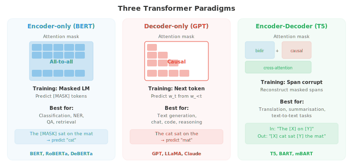
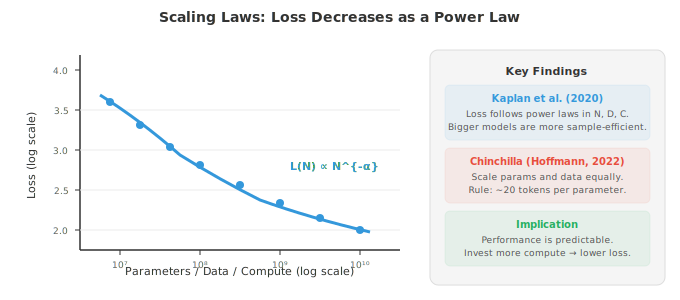

# Transformers and Language Models

*Transformers replaced recurrence with self-attention and became the dominant architecture for language understanding and generation. This file covers BERT, GPT, T5, positional encodings (sinusoidal, RoPE), pre-training objectives (MLM, CLM), fine-tuning, prompt engineering, and scaling laws, the blueprint behind modern LLMs.*

- In chapter 06, we introduced the Transformer architecture: self-attention, multi-head attention, positional encoding, and the encoder-decoder structure. Here we focus on how transformers are adapted for specific NLP paradigms, the models that defined modern NLP (BERT, GPT, T5), and the techniques that make them practical at scale.

- Recall the core operation: **scaled dot-product attention** computes $\text{softmax}(QK^T / \sqrt{d_k}) V$, where queries, keys, and values are linear projections of the input. **Multi-head attention** runs $h$ parallel attention heads, each with different learned projections, and concatenates the results. The Transformer block wraps this with residual connections, layer normalisation, and a position-wise feed-forward network (chapter 06).

- A subtle but important architectural choice is the placement of **layer normalisation**. The original Transformer uses **post-norm**: the residual and normalisation come after the sublayer, as $\text{LayerNorm}(x + \text{Sublayer}(x))$. 

- Most modern models use **pre-norm**: normalise before the sublayer, as $x + \text{Sublayer}(\text{LayerNorm}(x))$. Pre-norm is more stable during training because the residual connection passes gradients directly through the identity path without them being affected by the normalisation. This makes it easier to train very deep models without careful learning rate warmup.

- The **feed-forward sublayer** in each Transformer block is a two-layer MLP applied independently to each token position:

$$\text{FFN}(x) = W_2 \cdot \text{GELU}(W_1 x + b_1) + b_2$$

- The inner dimension is typically 4 times the model dimension (e.g., $d_{\text{model}} = 768$, $d_{\text{ff}} = 3072$). This FFN accounts for about two-thirds of the parameters in each block and is thought to function as a key-value memory that stores factual knowledge learned during training.

- **Positional encoding** gives the model information about token order, since attention itself is permutation-equivariant. The original **sinusoidal encoding** (chapter 06) uses fixed sine and cosine functions at different frequencies. **Learned positional embeddings** simply add a trainable vector for each position (used in BERT and GPT-2). Both are absolute encodings: position 5 gets the same vector regardless of context.

- **Rotary Position Embedding (RoPE)** encodes position by rotating the query and key vectors in 2D subspaces. For a pair of dimensions $(q_{2i}, q_{2i+1})$, the rotation by angle $m\theta_i$ (where $m$ is the position and $\theta_i = 10000^{-2i/d}$) applies:

```math
\begin{bmatrix} q'_{2i} \\ q'_{2i+1} \end{bmatrix} = \begin{bmatrix} \cos m\theta_i & -\sin m\theta_i \\ \sin m\theta_i & \cos m\theta_i \end{bmatrix} \begin{bmatrix} q_{2i} \\ q_{2i+1} \end{bmatrix}
```


- The beauty of RoPE is that the dot product $q'^T k'$ between rotated queries and keys depends only on the relative position $m - n$, not the absolute positions. 

- To see why, write the rotation as $q' = R_m q$ and $k' = R_n k$, where $R_m$ is a block-diagonal rotation matrix. The attention score becomes:

$$q'^T k' = (R_m q)^T (R_n k) = q^T R_m^T R_n \, k = q^T R_{n-m} \, k$$

- The last step follows from the rotation group property: $R_m^T R_n = R_{n-m}$ (rotating back by $m$ then forward by $n$ equals rotating by $n - m$). 

- This means the attention score depends only on the relative distance $n - m$, not the absolute positions $m$ and $n$ individually. 
 
- The model gains a natural notion of distance without any learned position parameters and can generalise to sequence lengths not seen during training.

- **ALiBi** (Attention with Linear Biases) takes an even simpler approach: it adds a fixed linear penalty to the attention scores based on distance, as $\text{score}_{ij} = q_i^T k_j - m \cdot |i - j|$, where $m$ is a head-specific slope. Different heads use different slopes, allowing some heads to focus locally and others globally. ALiBi requires no learned parameters for position and generalises well to sequences longer than those seen during training.

- The three dominant paradigms for Transformer-based language models are **encoder-only**, **decoder-only**, and **encoder-decoder**. They differ in what the model can see (the attention mask) and how they are trained.



- **BERT** (Bidirectional Encoder Representations from Transformers, Devlin et al., 2019) is the canonical encoder-only model. It processes text with full bidirectional attention: every token can attend to every other token, both left and right. This gives BERT rich contextual representations but means it cannot generate text autoregressively.

- BERT is pre-trained with two objectives. **Masked language modelling (MLM)** randomly masks 15% of input tokens and trains the model to predict them. Of the selected tokens, 80% are replaced with a [MASK] token, 10% with a random word, and 10% are left unchanged (to prevent the model from learning to only predict when it sees [MASK]). The training objective is:

$$\mathcal{L}_{\text{MLM}} = -\sum_{i \in \mathcal{M}} \log P(w_i \mid w_{\backslash \mathcal{M}})$$

- where $\mathcal{M}$ is the set of masked positions and $w_{\backslash \mathcal{M}}$ is the sentence with those positions masked. This is a **denoising** objective: the model learns to reconstruct corrupted input.


- **Next Sentence Prediction (NSP)** trains BERT to predict whether two sentences are consecutive in the original text. A special [CLS] token at the start of the input is used for this binary classification. NSP was included to help with tasks like question answering that require understanding sentence relationships, though later work (RoBERTa) showed it contributes little and can be dropped.

- BERT's pre-trained representations are adapted to downstream tasks by adding a task-specific head (a simple linear layer) on top and fine-tuning the entire model. For classification tasks, the [CLS] token representation is used. For token-level tasks (NER, POS tagging), each token's representation is used. This **fine-tuning** approach transfers the linguistic knowledge learned during pre-training to new tasks with relatively little labelled data.

- **GPT** (Generative Pre-trained Transformer, Radford et al., 2018) is the canonical decoder-only model. It uses **causal (autoregressive) attention**: each token can only attend to tokens at earlier positions (and itself). This is enforced by masking future positions in the attention matrix (setting their scores to $-\infty$ before the softmax). The training objective is simple **causal language modelling**: predict the next token given all previous tokens.

$$\mathcal{L}_{\text{CLM}} = -\sum_{i=1}^{n} \log P(w_i \mid w_1, \ldots, w_{i-1})$$

- This is the same n-gram language model objective from file 02, but with a Transformer parameterisation that can condition on the entire preceding context rather than just the last $k-1$ tokens.

- **GPT-2** scaled this up to 1.5 billion parameters and demonstrated strong zero-shot performance: without any fine-tuning, it could perform tasks by conditioning on a natural language prompt ("Translate English to French: ..."). 

- **GPT-3** (175 billion parameters) showed that scale alone could enable **in-context learning**: by providing a few input-output examples in the prompt, the model could perform new tasks without any gradient updates.

- **Encoder-decoder models** like **T5** (Text-to-Text Transfer Transformer, Raffel et al., 2020) frame every NLP task as text-to-text: the input is a text string (possibly with a task prefix like "translate English to German:") and the output is a text string. The encoder processes the input with bidirectional attention, and the decoder generates the output autoregressively with cross-attention to the encoder.

- T5 is pre-trained with **span corruption**: random contiguous spans of tokens are replaced with sentinel tokens, and the model must generate the original tokens. For example, "The cat sat on the mat" might become "The [X] on [Y]" as input, and the target is "[X] cat sat [Y] the mat". This is a generalisation of BERT's MLM to spans rather than individual tokens.

- **BART** (Lewis et al., 2020) is another encoder-decoder model pre-trained with a denoising objective, but it applies a broader set of corruption strategies: token masking, token deletion, span masking, sentence permutation, and document rotation. The diversity of corruption forces the model to learn more robust representations.

- As language models grow larger, **full fine-tuning** (updating all parameters) becomes impractical: a 175B parameter model requires hundreds of gigabytes just to store the optimizer states. **Parameter-efficient fine-tuning (PEFT)** methods adapt only a small fraction of parameters.

- **Adapters** insert small bottleneck layers (typically two linear layers with a nonlinearity: down-project to a small dimension, then up-project back) between the existing Transformer layers. Only the adapter weights are trained; the original model weights are frozen. This adds less than 5% new parameters while matching full fine-tuning performance on most tasks.

- **LoRA** (Low-Rank Adaptation) modifies the weight matrices themselves without adding new layers. Instead of updating the full weight matrix $W$, LoRA learns a low-rank decomposition of the update: $W' = W + BA$, where $B$ is $d \times r$ and $A$ is $r \times d$ with $r \ll d$ (typically $r = 4$ to $r = 64$). The original $W$ is frozen; only $A$ and $B$ are trained. At inference time, the update can be merged into the original weights with no additional latency:

$$W' = W + BA$$


- **Prefix tuning** prepends a sequence of learnable "virtual tokens" to the key and value matrices of each attention layer. The model attends to these prefix vectors as if they were real tokens, and only the prefix parameters are trained. This is similar to prompt tuning but operates in the activation space rather than the embedding space.

- **Prompt engineering** is the art of designing input text that elicits the desired behaviour from a pre-trained model without any parameter updates. 

    - **Zero-shot prompting** describes the task in natural language ("Classify the sentiment of the following review:"). 

    - **Few-shot prompting** provides input-output examples before the actual query. 

    - **Chain-of-thought (CoT)** prompting adds "Let's think step by step" or includes reasoning traces in the examples, which dramatically improves performance on arithmetic and logical reasoning tasks by guiding the model to decompose problems.

- **In-context learning (ICL)** is the phenomenon where large language models can learn to perform tasks from examples provided in the prompt, without any gradient updates. The model's weights do not change; it uses the examples as a kind of implicit specification. 

- How ICL works mechanically remains an active research question; one hypothesis is that the attention layers implement a form of gradient descent in their forward pass, effectively "training" on the in-context examples.

- **Scaling laws** describe predictable relationships between model size, data size, compute budget, and performance (measured by loss). Kaplan et al. (2020) found that loss follows a power law in each variable:

$$L(N) \propto N^{-\alpha_N}, \quad L(D) \propto D^{-\alpha_D}, \quad L(C) \propto C^{-\alpha_C}$$

- where $N$ is the number of parameters, $D$ is the dataset size, and $C$ is the compute budget. These power laws hold over many orders of magnitude and suggest that simply scaling up yields predictable improvements.



- The **Chinchilla scaling laws** (Hoffmann et al., 2022) revised this by showing that most large models are undertrained. For a fixed compute budget $C$, the optimal allocation scales model size and training data equally:

$$N_{\text{opt}} \propto C^{0.5}, \quad D_{\text{opt}} \propto C^{0.5}$$

- This means that if you double your compute budget, you should increase both model size and dataset size by a factor of $\sqrt{2}$, not just make the model bigger. 

- Kaplan et al. had recommended scaling $N$ faster than $D$, which led to very large but undertrained models. Chinchilla (70B parameters, 1.4T tokens) matched the performance of Gopher (280B parameters, 300B tokens) with the same compute budget, demonstrating that the earlier models were severely data-starved. 

- The practical rule of thumb: train on roughly 20 tokens per parameter.

- **Mixture of Experts (MoE)** is an architecture that scales model capacity without proportionally scaling computation. Instead of one large feed-forward layer, MoE uses multiple **expert** FFN layers and a **gating network** (router) that selects which experts to activate for each token.

- The gating function computes a routing score for each expert and selects the top-$k$ (typically $k = 1$ or $k = 2$):

$$G(x) = \text{TopK}(\text{softmax}(W_g x))$$

- Only the selected experts process the token, so the computational cost scales with $k$ (the number of active experts) rather than the total number of experts $E$. A model with 8 experts and top-2 routing has 4x the parameters of a dense model but only 2x the computation.


- A critical challenge in MoE is **load balancing**: if the router sends most tokens to a few popular experts, the others are wasted. Training adds an auxiliary **load balancing loss** that encourages uniform expert utilisation:

$$\mathcal{L}_{\text{balance}} = E \cdot \sum_{i=1}^{E} f_i \cdot p_i$$

- where $f_i$ is the fraction of tokens assigned to expert $i$ and $p_i$ is the average routing probability for expert $i$. This product is minimised when both the token fractions and probabilities are uniform (each equal to $1/E$).

- **Expert parallelism** distributes different experts across different accelerators. During the forward pass, an all-to-all communication step routes tokens to the device hosting their assigned expert, then routes the results back. This communication cost is the main engineering challenge of MoE at scale. Models like Switch Transformer, Mixtral, and GShard use MoE to achieve strong performance with practical inference costs.

- Building models is half the job; measuring whether they work is the other half. NLP evaluation is uniquely difficult because language is ambiguous, subjective, and open-ended.

- A translation can be correct in many different ways. A summary can be good even if it shares no exact words with a reference.

- A chatbot response can be helpful, harmless, and honest, yet reasonable humans will disagree.

- **Exact match (EM)** is the simplest metric: does the model's output exactly match the gold answer? It is used for tasks with short, unambiguous answers like extractive question answering (SQuAD) or closed-form maths.

- EM is harsh; "New York City" and "new york city" fail to match unless normalisation is applied — but its simplicity makes it unambiguous.

- **Token-level metrics** treat NLP as a classification problem at the token level, using precision, recall, and F1 from chapter 06.

- **Precision** measures what fraction of the model's predicted tokens are correct: $P = \text{TP} / (\text{TP} + \text{FP})$. A model that predicts very few entities but gets them all right has high precision.

- **Recall** measures what fraction of the gold tokens the model found: $R = \text{TP} / (\text{TP} + \text{FN})$. A model that predicts every token as an entity has perfect recall but terrible precision.

- **F1** is the harmonic mean of precision and recall:

$$F_1 = \frac{2PR}{P + R}$$

- The harmonic mean (rather than arithmetic) penalises imbalance: if either $P$ or $R$ is low, $F_1$ is low. For NER (file 02), F1 is computed per entity type and then macro-averaged across types. For POS tagging, token-level accuracy is more common because every token gets a tag.

- **Span-level F1** (used in SQuAD) compares the set of tokens in the predicted span to the set in the gold span. This is more forgiving than exact match: if the gold answer is "the Eiffel Tower" and the model predicts "Eiffel Tower", the span F1 is high (4 overlapping tokens out of 5) even though EM is zero.

- **BLEU** (Bilingual Evaluation Understudy, Papineni et al., 2002) is the classic metric for machine translation. It measures n-gram overlap between the candidate translation and one or more reference translations. The score combines precision at multiple n-gram levels (unigram through 4-gram) with a brevity penalty:

$$\text{BLEU} = \text{BP} \cdot \exp\!\left(\sum_{n=1}^{N} w_n \log p_n\right)$$

- where $p_n$ is the **modified n-gram precision**: the count of each n-gram in the candidate is clipped to its maximum count in any reference, preventing a degenerate candidate like "the the the the" from scoring high. The weights $w_n$ are typically uniform ($w_n = 1/N$, with $N = 4$).

- The **brevity penalty** $\text{BP} = \min(1, \exp(1 - r/c))$ penalises candidates shorter than the reference ($c$ is candidate length, $r$ is reference length). Without this, a model could achieve high precision by outputting very few, very safe words.

- BLEU correlates reasonably with human judgement at the corpus level (averaged over many sentences) but poorly at the sentence level.

- It rewards exact n-gram matches and misses valid paraphrases: "the cat is on the mat" and "a feline sits atop the rug" have zero bigram overlap despite meaning the same thing.

- BLEU also ignores recall entirely — a candidate that produces only the most common words scores well on precision.

- **ROUGE** (Recall-Oriented Understudy for Gisting Evaluation, Lin, 2004) is the standard metric for summarisation. Unlike BLEU, which emphasises precision, ROUGE emphasises recall: what fraction of the reference n-grams appear in the candidate?

- **ROUGE-N** computes recall of n-grams: $\text{ROUGE-N} = \frac{|\text{n-grams}_{\text{ref}} \cap \text{n-grams}_{\text{cand}}|}{|\text{n-grams}_{\text{ref}}|}$. ROUGE-1 (unigram) and ROUGE-2 (bigram) are most common.

- ROUGE-L uses the **longest common subsequence (LCS)** between candidate and reference, which captures sentence-level word ordering without requiring consecutive matches.

- The LCS length normalised by reference length gives recall, normalised by candidate length gives precision, and the F-measure combines them.

- LCS is computed via dynamic programming in $O(mn)$ time (similar to edit distance from file 02):

$$R_{\text{LCS}} = \frac{\text{LCS}(X, Y)}{m}, \quad P_{\text{LCS}} = \frac{\text{LCS}(X, Y)}{n}, \quad F_{\text{LCS}} = \frac{(1 + \beta^2) R_{\text{LCS}} P_{\text{LCS}}}{R_{\text{LCS}} + \beta^2 P_{\text{LCS}}}$$

- where $m$ and $n$ are the lengths of reference and candidate, and $\beta$ is typically set to favour recall ($\beta \to \infty$ gives pure recall).

- **METEOR** (Metric for Evaluation of Translation with Explicit ORdering, Banerjee and Lavie, 2005) addresses BLEU's weaknesses by incorporating synonyms, stemming, and word order.

- It first aligns words between candidate and reference using exact matches, stem matches (via Porter stemming from file 02), and synonym matches (via WordNet from file 01).

- Then it computes a harmonic mean of unigram precision and recall weighted toward recall, and applies a fragmentation penalty that penalises candidates where matched words appear in a different order than the reference.

- **ChrF** (Character n-gram F-score) computes F-score over character n-grams rather than word n-grams. This makes it robust to morphological variation (critical for agglutinative languages from file 01) and partially handles tokenisation differences. ChrF++ adds word bigrams to the character n-grams.

- It has become a recommended metric for machine translation alongside BLEU, especially for morphologically rich languages.

- **Perplexity** (file 02) measures how well a language model predicts a held-out test set. It is the standard intrinsic metric for language models: $\text{PPL} = \exp(-\frac{1}{N} \sum_{i} \log P(w_i \mid w_{<i}))$. Lower is better.

- Perplexity is comparable only between models using the same tokenisation, since different tokenisers produce different sequence lengths $N$ for the same text.

- A model with a larger vocabulary tends to have lower perplexity per token but processes fewer tokens per sentence.

- **Bits-per-byte** (BPB) normalises by the number of UTF-8 bytes in the text rather than the number of tokens, making it tokenisation-independent:

```math
\text{BPB} = \frac{-\sum_{i} \log_2 P(w_i \mid w_{<i})}{\text{number of UTF-8 bytes}}
```

- **BERTScore** (Zhang et al., 2020) moves beyond surface-level n-gram matching by computing similarity in embedding space. Each token in the candidate is matched to its most similar token in the reference using cosine similarity of contextual embeddings (typically from a pre-trained BERT model). The scores are aggregated into precision, recall, and F1:

$$R_{\text{BERT}} = \frac{1}{|r|} \sum_{r_i \in r} \max_{c_j \in c} \cos(r_i, c_j), \quad P_{\text{BERT}} = \frac{1}{|c|} \sum_{c_j \in c} \max_{r_i \in r} \cos(c_j, r_i)$$

- where $r_i$ and $c_j$ are contextual embeddings of reference and candidate tokens. This captures semantic similarity that n-gram metrics miss: "automobile" and "car" score highly because their BERT embeddings are similar, even though they share no characters.

- **BLEURT** (Sellam et al., 2020) takes this further by fine-tuning a BERT model directly on human quality judgements. Given a reference and candidate pair, it outputs a scalar quality score. BLEURT is trained on synthetic data (random perturbations of reference translations rated by metrics like BLEU and METEOR) and then fine-tuned on human ratings. It correlates better with human judgement than any surface-level metric.

- **COMET** (Crosslingual Optimized Metric for Evaluation of Translation, Rei et al., 2020) is a learned metric for machine translation that conditions on the source sentence, reference, and candidate — not just reference and candidate. It uses a multilingual encoder (XLM-R) to embed all three and predicts a quality score. By seeing the source, COMET can detect meaning errors that reference-only metrics miss (e.g., a fluent but factually wrong translation).

- **LLM-as-judge** is the modern approach to evaluation at scale. Instead of computing metrics against references, a powerful language model (GPT-4, Claude) is prompted to evaluate the quality of model outputs. The judge receives the input, the model's response, and optionally a reference answer, and produces a rating (e.g., 1-5) or a pairwise preference (response A is better than response B).

- **Pairwise comparison** (used in Chatbot Arena) is the most reliable LLM-as-judge format. The judge sees two responses and picks the better one, rather than assigning absolute scores. This avoids calibration issues (different judges may have different baselines for "3 out of 5"). Results are aggregated into **Elo ratings** (from chess), where each model starts with a base rating and gains or loses points based on wins and losses against other models. The expected win probability of model $A$ against model $B$ is:

$$P(A \succ B) = \frac{1}{1 + 10^{(R_B - R_A) / 400}}$$

- where $R_A, R_B$ are the Elo ratings. After each comparison, ratings are updated: $R_A' = R_A + K(S - P(A \succ B))$, where $S \in \{0, 1\}$ is the actual outcome and $K$ controls the update magnitude. Models that consistently beat strong opponents rise quickly; models that lose to weak opponents fall.

- **Position bias** is a known issue with LLM judges: they tend to prefer the response presented first (or in some models, the response presented second). **Swapping** (evaluating each pair twice with responses in both orders) and averaging the results mitigates this.

- **Verbosity bias** is another: judges tend to prefer longer, more detailed responses even when a concise answer is better.

- **Self-consistency** checks whether the judge gives the same rating across multiple evaluations of the same input. High variance indicates the evaluation signal is noisy.

- **Inter-annotator agreement** (Cohen's kappa or Krippendorff's alpha) measures whether multiple judges agree, providing an upper bound on evaluation reliability.

- **Contamination** is a critical concern: if the evaluation data appeared in the model's training set, benchmark scores are inflated and meaningless.

- This is especially problematic for LLMs trained on web-scraped data, where popular benchmarks are likely present. Mitigation strategies include: using held-out test sets that are not publicly released, creating dynamic benchmarks that regenerate questions periodically, **canary strings** (unique identifiers embedded in benchmark data to detect leakage), and comparing performance on contaminated vs clean subsets.

- **Standard NLU benchmarks** evaluate language understanding across diverse tasks.

- **GLUE** (General Language Understanding Evaluation) and **SuperGLUE** are multi-task benchmarks covering sentiment (SST-2), textual similarity (STS-B), natural language inference (MNLI, RTE), coreference (WSC), and question answering (BoolQ).

- Models are evaluated on each task separately and scored by an aggregate metric. GLUE is now considered saturated (models exceed human performance on most tasks); SuperGLUE remains more challenging.

- **MMLU** (Massive Multitask Language Understanding) evaluates knowledge and reasoning across 57 academic subjects (mathematics, history, law, medicine, computer science, etc.) using multiple-choice questions.

- It tests whether a model has absorbed broad knowledge during pre-training. Scores are reported per subject and as a macro-average.

- **MMLU-Pro** adds harder, multi-step reasoning questions with 10 answer choices instead of 4.

- **HellaSwag** tests commonsense reasoning by asking the model to choose the most plausible continuation of a scenario. The wrong answers are generated adversarially (using models) to be superficially plausible but semantically wrong.

- **WinoGrande** tests commonsense coreference resolution with minimal pairs that differ by one word.

- **ARC** (AI2 Reasoning Challenge) uses grade-school science questions in easy and challenge sets, testing factual and reasoning ability.

- **Reasoning and maths benchmarks** evaluate the problem-solving capabilities that separate strong LLMs from weak ones.

- **GSM8K** (Grade School Math 8K) contains 8,500 elementary maths word problems requiring multi-step arithmetic reasoning. It is the standard benchmark for basic mathematical reasoning and for evaluating chain-of-thought prompting (file 04).

- **MATH** is a harder dataset of competition-level maths problems across algebra, number theory, geometry, counting, and probability. Problems require multi-step symbolic reasoning, and MATH-500 is a commonly reported 500-problem subset.

- **AIME** (American Invitational Mathematics Examination) problems are competition-level: solving them correctly requires deep mathematical reasoning over many steps. DeepSeek-R1 scores 79.8% on AIME 2024, demonstrating that RL-trained reasoning models (file 05) can approach strong human competitors.

- **HumanEval** and **MBPP** (Mostly Basic Programming Problems) evaluate code generation by checking whether the model's code passes unit tests. HumanEval contains 164 Python problems with function signatures and docstrings; the model must generate the function body.

- The metric is **pass@k**: the probability that at least one of $k$ generated solutions passes all tests. For a single sample:

$$\text{pass@}k = 1 - \frac{\binom{n-c}{k}}{\binom{n}{k}}$$

- where $n$ is the total number of generated samples and $c$ is the number that pass. This formula corrects for the bias in simply taking the best of $k$ samples.

- **SWE-bench** goes further, evaluating whether models can resolve real GitHub issues by modifying existing codebases — a much harder test of practical software engineering ability.

- **GPQA** (Graduate-Level Google-Proof QA) contains expert-level questions in biology, physics, and chemistry that are difficult even for domain experts. It tests whether models have genuine understanding rather than pattern matching. The "Diamond" subset is the hardest.

- **Safety and alignment benchmarks** evaluate whether models are helpful, harmless, and honest.

- **TruthfulQA** tests whether models reproduce common misconceptions. Questions are designed so that the most common internet answers are wrong (e.g., "What happens if you swallow gum?", the common myth is that it stays for 7 years, but the truthful answer is that it passes through normally). Models that have memorised popular but incorrect claims score poorly.

- **BBQ** (Bias Benchmark for QA) tests for social biases across categories like age, gender, race, and religion. Questions are structured so that a biased model would systematically choose stereotypical answers. **Toxigen** evaluates the model's tendency to generate toxic content about specific demographic groups.

- **MT-Bench** evaluates multi-turn conversation ability using 80 carefully designed questions across writing, roleplay, reasoning, maths, coding, extraction, STEM, and humanities. An LLM judge (GPT-4) scores responses on a 1-10 scale. The multi-turn format tests whether models can follow up, maintain context, and handle clarification requests.

- **Chatbot Arena** (LMSYS) uses real users to conduct blind pairwise comparisons between anonymous models. Users submit prompts and vote for the better response without knowing which model produced it. The resulting Elo leaderboard is considered the most ecologically valid evaluation of general-purpose LLM quality because it reflects real user preferences on diverse, uncurated prompts.

- **AlpacaEval** automates pairwise evaluation by comparing model outputs against a reference model (GPT-4) on a fixed set of instructions. A judge model determines the win rate.

- **AlpacaEval 2.0** uses length-controlled win rates to correct for verbosity bias.

- **Task-specific evaluation** requires tailored metrics for specialised domains.

- **Word Error Rate (WER)** for speech recognition: $\text{WER} = (S + D + I) / N$, where $S$, $D$, $I$ are substitution, deletion, and insertion errors and $N$ is the number of reference words. This is the edit distance (file 02) normalised by reference length, applied at the word level.

- **Slot F1** for task-oriented dialogue systems measures whether the model correctly extracts structured information from user utterances (e.g., extracting "destination: Paris" and "date: tomorrow" from "Book me a flight to Paris tomorrow").

- **Citation accuracy** for RAG systems (file 05) checks whether the model's generated citations actually support the claims made. A claim is verified against the retrieved passage, and the metric counts the fraction of claims that are fully, partially, or not supported.

- **Evaluation pitfalls** are common and can invalidate entire benchmark comparisons.

- **Teaching to the test**: optimising for benchmark performance rather than genuine capability. A model fine-tuned on MMLU-style multiple choice will score well on MMLU but may fail on the same questions posed in open-ended format.

- **Metric gaming**: models can be optimised to produce outputs that score well on automatic metrics (high BLEU, low perplexity) without being genuinely good. The BLEU-optimal translation is often a safe, generic paraphrase rather than a natural, fluent one.

- **Benchmark saturation**: when models approach or exceed human performance on a benchmark, the benchmark stops being informative. GLUE, SQuAD 1.1, and several others are now saturated.

- The field continuously creates harder benchmarks, but the cycle of creation, saturation, and replacement makes longitudinal comparison difficult.

- **Human evaluation** remains the gold standard but is expensive, slow, and hard to reproduce. Different annotator pools (crowdworkers vs domain experts, different cultures, different languages) produce different judgements. Reporting inter-annotator agreement and annotator demographics is essential for reproducibility.

## Coding Tasks (use CoLab or notebook)

1. Implement a full Transformer encoder block from scratch (multi-head attention, feed-forward, residual connections, layer norm). Apply it to a simple sequence classification task.
```python
import jax
import jax.numpy as jnp
import matplotlib.pyplot as plt

def layer_norm(x, gamma, beta, eps=1e-5):
    mean = x.mean(axis=-1, keepdims=True)
    var = x.var(axis=-1, keepdims=True)
    return gamma * (x - mean) / jnp.sqrt(var + eps) + beta

def multi_head_attention(Q, K, V, W_q, W_k, W_v, W_o, n_heads):
    B, T, D = Q.shape
    head_dim = D // n_heads

    q = Q @ W_q  # (B, T, D)
    k = K @ W_k
    v = V @ W_v

    # Reshape to (B, n_heads, T, head_dim)
    q = q.reshape(B, T, n_heads, head_dim).transpose(0, 2, 1, 3)
    k = k.reshape(B, T, n_heads, head_dim).transpose(0, 2, 1, 3)
    v = v.reshape(B, T, n_heads, head_dim).transpose(0, 2, 1, 3)

    scores = q @ k.transpose(0, 1, 3, 2) / jnp.sqrt(head_dim)
    weights = jax.nn.softmax(scores, axis=-1)
    out = (weights @ v).transpose(0, 2, 1, 3).reshape(B, T, D)
    return out @ W_o, weights

def transformer_block(x, params):
    # Pre-norm multi-head self-attention
    normed = layer_norm(x, params['ln1_g'], params['ln1_b'])
    attn_out, weights = multi_head_attention(
        normed, normed, normed,
        params['W_q'], params['W_k'], params['W_v'], params['W_o'],
        n_heads=4
    )
    x = x + attn_out

    # Pre-norm feed-forward
    normed = layer_norm(x, params['ln2_g'], params['ln2_b'])
    ff = jax.nn.gelu(normed @ params['W1'] + params['b1'])
    ff = ff @ params['W2'] + params['b2']
    x = x + ff
    return x, weights

# Initialise parameters
d_model, d_ff, n_heads = 32, 128, 4
key = jax.random.PRNGKey(42)
keys = jax.random.split(key, 10)

params = {
    'W_q': jax.random.normal(keys[0], (d_model, d_model)) * 0.05,
    'W_k': jax.random.normal(keys[1], (d_model, d_model)) * 0.05,
    'W_v': jax.random.normal(keys[2], (d_model, d_model)) * 0.05,
    'W_o': jax.random.normal(keys[3], (d_model, d_model)) * 0.05,
    'ln1_g': jnp.ones(d_model), 'ln1_b': jnp.zeros(d_model),
    'ln2_g': jnp.ones(d_model), 'ln2_b': jnp.zeros(d_model),
    'W1': jax.random.normal(keys[4], (d_model, d_ff)) * 0.05,
    'b1': jnp.zeros(d_ff),
    'W2': jax.random.normal(keys[5], (d_ff, d_model)) * 0.05,
    'b2': jnp.zeros(d_model),
}

# Test with random input
x = jax.random.normal(keys[6], (2, 8, d_model))  # batch=2, seq_len=8
out, attn_weights = transformer_block(x, params)
print(f"Input shape:  {x.shape}")
print(f"Output shape: {out.shape}")
print(f"Attention weights shape: {attn_weights.shape}")  # (B, n_heads, T, T)

# Visualise attention patterns for each head
fig, axes = plt.subplots(1, 4, figsize=(16, 3.5))
for h in range(4):
    im = axes[h].imshow(attn_weights[0, h], cmap='Blues', vmin=0)
    axes[h].set_title(f"Head {h}")
    axes[h].set_xlabel("Key pos"); axes[h].set_ylabel("Query pos")
plt.suptitle("Multi-Head Attention Patterns")
plt.tight_layout(); plt.show()
```

2. Implement causal (autoregressive) attention masking and compare it with bidirectional attention. Show how the mask prevents information from flowing from future to past tokens.
```python
import jax
import jax.numpy as jnp
import matplotlib.pyplot as plt

def attention(Q, K, V, mask=None):
    d_k = Q.shape[-1]
    scores = Q @ K.T / jnp.sqrt(d_k)
    if mask is not None:
        scores = jnp.where(mask, scores, -1e9)
    weights = jax.nn.softmax(scores, axis=-1)
    return weights @ V, weights

seq_len, d_model = 6, 8
key = jax.random.PRNGKey(0)
k1, k2, k3 = jax.random.split(key, 3)
Q = jax.random.normal(k1, (seq_len, d_model))
K = jax.random.normal(k2, (seq_len, d_model))
V = jax.random.normal(k3, (seq_len, d_model))

# Bidirectional (encoder-style): all positions visible
bidir_mask = jnp.ones((seq_len, seq_len), dtype=bool)
bidir_out, bidir_weights = attention(Q, K, V, bidir_mask)

# Causal (decoder-style): only past and current positions visible
causal_mask = jnp.tril(jnp.ones((seq_len, seq_len), dtype=bool))
causal_out, causal_weights = attention(Q, K, V, causal_mask)

fig, axes = plt.subplots(1, 3, figsize=(14, 4))
tokens = [f"t{i}" for i in range(seq_len)]

axes[0].imshow(bidir_weights, cmap='Blues', vmin=0, vmax=0.5)
axes[0].set_title("Bidirectional Attention\n(BERT-style)")
axes[0].set_xticks(range(seq_len)); axes[0].set_xticklabels(tokens)
axes[0].set_yticks(range(seq_len)); axes[0].set_yticklabels(tokens)

axes[1].imshow(causal_mask.astype(float), cmap='Greys', vmin=0, vmax=1)
axes[1].set_title("Causal Mask\n(1 = allowed, 0 = blocked)")
axes[1].set_xticks(range(seq_len)); axes[1].set_xticklabels(tokens)
axes[1].set_yticks(range(seq_len)); axes[1].set_yticklabels(tokens)

axes[2].imshow(causal_weights, cmap='Blues', vmin=0, vmax=0.5)
axes[2].set_title("Causal Attention\n(GPT-style)")
axes[2].set_xticks(range(seq_len)); axes[2].set_xticklabels(tokens)
axes[2].set_yticks(range(seq_len)); axes[2].set_yticklabels(tokens)

for ax in axes:
    ax.set_xlabel("Key"); ax.set_ylabel("Query")
plt.tight_layout(); plt.show()

# Verify: in causal attention, output at position i depends only on positions <= i
print("Causal attention weight at position 2 (should only attend to 0, 1, 2):")
print(f"  Weights: {causal_weights[2]}")
print(f"  Sum of future weights (should be ~0): {causal_weights[2, 3:].sum():.6f}")
```

3. Implement LoRA (Low-Rank Adaptation) and show how it modifies a weight matrix with far fewer trainable parameters than full fine-tuning.
```python
import jax
import jax.numpy as jnp

d_model = 256
rank = 4  # LoRA rank (much smaller than d_model)

key = jax.random.PRNGKey(42)
k1, k2, k3 = jax.random.split(key, 3)

# Original frozen weight matrix
W_frozen = jax.random.normal(k1, (d_model, d_model)) * 0.02

# LoRA matrices (only these are trainable)
B = jnp.zeros((d_model, rank))       # initialised to zero
A = jax.random.normal(k2, (rank, d_model)) * 0.01  # random init

# Forward pass: W_effective = W_frozen + B @ A
x = jax.random.normal(k3, (8, d_model))

# Without LoRA
y_original = x @ W_frozen.T

# With LoRA
W_effective = W_frozen + B @ A
y_lora = x @ W_effective.T

# Parameter counts
full_params = d_model * d_model
lora_params = d_model * rank + rank * d_model  # B + A

print(f"Model dimension: {d_model}")
print(f"LoRA rank: {rank}")
print(f"Full fine-tuning parameters: {full_params:,}")
print(f"LoRA parameters: {lora_params:,}")
print(f"Parameter reduction: {full_params / lora_params:.1f}x")
print(f"\nSince B is initialised to zeros, initial LoRA output matches original:")
print(f"  Max difference: {jnp.abs(y_original - y_lora).max():.2e}")

# Simulate training: only update A and B
def lora_forward(A, B, W_frozen, x):
    return x @ (W_frozen + B @ A).T

def dummy_loss(A, B, W_frozen, x, target):
    pred = lora_forward(A, B, W_frozen, x)
    return jnp.mean((pred - target) ** 2)

# Target: some transformation of x
target = x @ jax.random.normal(jax.random.PRNGKey(99), (d_model, d_model)).T * 0.02

grad_fn = jax.jit(jax.grad(dummy_loss, argnums=(0, 1)))
lr = 0.01

for step in range(200):
    gA, gB = grad_fn(A, B, W_frozen, x, target)
    A = A - lr * gA
    B = B - lr * gB

loss_before = dummy_loss(jnp.zeros_like(A), jnp.zeros_like(B), W_frozen, x, target)
loss_after = dummy_loss(A, B, W_frozen, x, target)
print(f"\nLoss before LoRA: {loss_before:.6f}")
print(f"Loss after LoRA:  {loss_after:.6f}")
print(f"Effective weight change rank: {jnp.linalg.matrix_rank(B @ A)}")
```