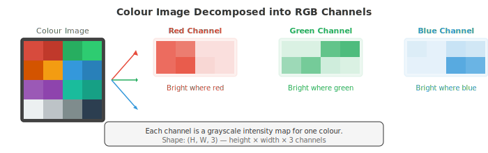
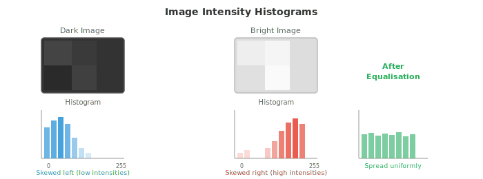
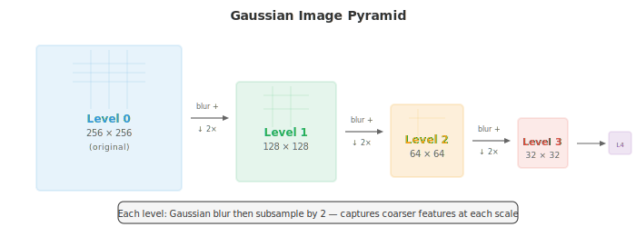

# Image Fundamentals

*Image fundamentals explain how digital images are represented, formed, and pre-processed before any model sees them. This file covers pixels, colour spaces (RGB, HSV, YCbCr, LAB), the pinhole camera model, convolution, edge detection (Sobel, Canny), histograms, and feature descriptors (SIFT, ORB), the low-level vision toolkit.*

- A **digital image** is a 2D grid of numbers. Each cell in the grid is a **pixel** (picture element), and its value represents intensity or colour. A grayscale image is a single 2D matrix where each pixel holds a brightness value, typically from 0 (black) to 255 (white) for 8-bit images.

- A colour image extends this to three channels. In the **RGB** colour space, each pixel stores three values: red, green, and blue intensity. 

- The couloured image is a 3D tensor (matrix) of shape (height, width, 3). Mixing these three channels at different intensities produces the full spectrum of visible colour.



- **Bit depth** determines how many distinct intensity levels each channel can represent. 

- An 8-bit image has $2^8 = 256$ levels per channel, giving $256^3 \approx 16.7$ million possible colours. A 16-bit image has 65,536 levels per channel, used in medical imaging and HDR photography where fine intensity distinctions matter.

- RGB is convenient for displays, but other colour spaces are better suited for different tasks.

- **HSV** (Hue, Saturation, Value) separates colour information from brightness. Hue is the pure colour (0-360 degrees around a colour wheel), saturation is how vivid the colour is (0 = grey, 1 = pure colour), and value is brightness. HSV is useful for colour-based segmentation because you can threshold on hue alone, regardless of lighting conditions. Detecting "red objects" is much easier in HSV than in RGB.

- **YCbCr** separates luminance (Y, perceived brightness) from chrominance (Cb, Cr, colour difference signals). This is the colour space used in JPEG compression and video codecs. Human vision is more sensitive to brightness than colour, so chrominance can be stored at lower resolution (chroma subsampling) with little perceptual loss.

- **LAB** (CIELAB) is designed so that numerical distance between two colours corresponds to perceptual difference. Equal steps in LAB space look like equal steps to a human observer. The L channel is lightness, A goes from green to red, and B goes from blue to yellow. LAB is used when you need perceptually uniform colour comparisons.

- **Image formation** describes how a 3D scene becomes a 2D image. The simplest model is the **pinhole camera**: light from the scene passes through a tiny hole and projects onto a sensor plane behind it. A point $(X, Y, Z)$ in world coordinates projects to pixel coordinates $(u, v)$:

```math
\begin{bmatrix} u \\ v \\ 1 \end{bmatrix} = \frac{1}{Z} \begin{bmatrix} f_x & 0 & c_x \\ 0 & f_y & c_y \\ 0 & 0 & 1 \end{bmatrix} \begin{bmatrix} X \\ Y \\ Z \end{bmatrix}
```

- The 3x3 matrix is the **intrinsic matrix** $K$. It encodes the camera's internal properties: focal lengths $f_x, f_y$ (how strongly the lens converges light) and the principal point $(c_x, c_y)$ (where the optical axis meets the sensor, usually near the image centre). These are fixed for a given camera and lens combination.


- The **extrinsic parameters** describe where the camera is in the world: a rotation matrix $R$ (3x3, from chapter 02) and a translation vector $t$ (3x1). Together, they transform world coordinates to camera coordinates. The full projection is:

$$\mathbf{p} = K [R \mid t] \mathbf{P}$$

- where $\mathbf{P} = [X, Y, Z, 1]^T$ is the 3D point in homogeneous coordinates and $\mathbf{p} = [u, v, 1]^T$ is the projected pixel. The $[R \mid t]$ matrix is 3x4, stacking the rotation and translation side by side. This is all linear algebra from chapter 02.

- Real lenses introduce **distortion**. 

    - **Radial distortion** bends straight lines into curves (barrel distortion makes the image bulge outward; pincushion distortion squeezes it inward). 
    **Tangential distortion** arises when the lens is not perfectly parallel to the sensor. 

- Camera calibration estimates both intrinsic parameters and distortion coefficients from images of a known pattern (like a checkerboard), then corrects (undistorts) images.

- **Spatial filtering** is the foundation of classical image processing. A **filter** (or kernel) is a small matrix (typically 3x3 or 5x5) that slides over the image. At each position, the filter values are multiplied element-wise with the overlapping image patch and summed to produce one output pixel. This is a **2D convolution**, the same operation that powers CNNs (file 02), but here the filter weights are hand-designed rather than learned.

$$(\text{image} * K)[i,j] = \sum_{m} \sum_{n} \text{image}[i+m, j+n] \cdot K[m, n]$$

- This is a 2D extension of the 1D convolution from chapter 06. The filter determines what the operation detects: different filters detect different features.

- **Blurring** smooths an image by averaging neighbouring pixels. A **box filter** gives equal weight to all neighbours. 

- A **Gaussian filter** weights neighbours by a 2D Gaussian (chapter 05), giving more weight to nearby pixels and less to distant ones. Gaussian blur is the most common smoothing operation and is parametrised by $\sigma$: larger $\sigma$ means more smoothing.

- **Median filtering** replaces each pixel with the median of its neighbourhood instead of a weighted average. It is particularly effective at removing salt-and-pepper noise (random black and white pixels) while preserving edges, because the median is robust to outliers (as discussed in chapter 04).

- **Edge detection** identifies boundaries where pixel intensity changes sharply. Edges carry most of the structural information in an image; you can recognise objects from their edges alone.

- The **Sobel operator** uses two 3x3 filters to estimate the gradient in the horizontal and vertical directions:

```math
G_x = \begin{bmatrix} -1 & 0 & 1 \\ -2 & 0 & 2 \\ -1 & 0 & 1 \end{bmatrix}, \quad G_y = \begin{bmatrix} -1 & -2 & -1 \\ 0 & 0 & 0 \\ 1 & 2 & 1 \end{bmatrix}
```

- Convolving the image with $G_x$ gives the horizontal gradient (strong response at vertical edges), and $G_y$ gives the vertical gradient (strong response at horizontal edges). 

- The gradient magnitude $\sqrt{G_x^2 + G_y^2}$ and direction $\arctan(G_y / G_x)$ together describe the edge strength and orientation at each pixel. This is the image-domain analogue of the gradient from chapter 03.


- The **Canny edge detector** is the gold standard for edge detection. It applies four steps:
    1. Smooth the image with a Gaussian filter to reduce noise
    2. Compute gradient magnitude and direction (using Sobel)
    3. **Non-maximum suppression**: thin edges by keeping only pixels that are local maxima along the gradient direction
    4. **Hysteresis thresholding**: use two thresholds (high and low). Pixels above the high threshold are definite edges. Pixels between the thresholds are edges only if connected to a definite edge. Pixels below the low threshold are discarded.

- The two thresholds in Canny make it more robust than a single threshold: strong edges are always kept, and weak edges are kept only if they are part of a continuous edge structure.

- **Frequency domain** analysis reveals patterns that are hard to see in the spatial domain. The **2D Fourier transform** (extending the 1D version from chapter 03) decomposes an image into a sum of 2D sinusoidal patterns at different frequencies and orientations:

$$F(u, v) = \sum_{x=0}^{M-1} \sum_{y=0}^{N-1} f(x, y) \cdot e^{-j2\pi(ux/M + vy/N)}$$

- Low frequencies correspond to smooth, slowly-varying regions (the sky, a wall). High frequencies correspond to sharp transitions (edges, textures, noise). The **magnitude spectrum** shows how much energy exists at each frequency, and the **phase spectrum** encodes the spatial arrangement.

- **Low-pass filtering** removes high frequencies, which smooths the image (equivalent to Gaussian blur in the spatial domain). **High-pass filtering** removes low frequencies, emphasising edges and fine detail. **Band-pass filtering** keeps only a range of frequencies, useful for texture analysis.

- In practice, filtering in the frequency domain can be faster than spatial convolution for large filters, because convolution in the spatial domain is equivalent to element-wise multiplication in the frequency domain (the **convolution theorem**). This connects directly to the Fourier transform properties from chapter 03.

- **Histograms** summarise the distribution of pixel intensities. A histogram counts how many pixels have each intensity value (0-255 for 8-bit images). It is the same frequency distribution from chapter 04 applied to pixel values.



- A dark image has its histogram concentrated on the left (low values). A bright image has it concentrated on the right. A low-contrast image has a narrow histogram. A high-contrast image has a wide, spread-out histogram.

- **Histogram equalisation** stretches the histogram to span the full intensity range, improving contrast. The idea is to find a mapping that makes the cumulative distribution function (CDF) of pixel intensities approximately linear. This is a direct application of the CDF concept from chapter 04.

- **Otsu's method** automatically finds the best threshold to separate an image into foreground and background. It tries every possible threshold and picks the one that minimises the within-class variance (or equivalently, maximises the between-class variance). This is the same variance concept from chapter 04, applied to pixel intensity populations.

- **Feature extraction** identifies distinctive points or regions in an image that can be used for matching, recognition, and 3D reconstruction. Good features should be repeatable (found again in a different view), distinctive (distinguishable from other features), and efficient to compute.

- **Corner detection** finds points where the image intensity changes significantly in multiple directions. A smooth region has little change in any direction. An edge has change in one direction. A corner has change in at least two directions, making it locally unique and therefore a reliable landmark.

- The **Harris corner detector** analyses the **structure tensor** (also called the second-moment matrix) at each pixel:

```math
M = \sum_{(x,y) \in W} w(x,y) \begin{bmatrix} I_x^2 & I_x I_y \\ I_x I_y & I_y^2 \end{bmatrix}
```

- where $I_x$ and $I_y$ are the image gradients (computed with Sobel), $W$ is a local window, and $w$ is a Gaussian weighting function. The eigenvalues of $M$ (from chapter 02) tell you the type of feature:
    - Both eigenvalues small: flat region (no feature)
    - One large, one small: edge
    - Both large: corner

- Instead of computing eigenvalues explicitly, Harris uses a corner response function: $R = \det(M) - k \cdot (\text{trace}(M))^2$, where $\det(M) = \lambda_1 \lambda_2$ and $\text{trace}(M) = \lambda_1 + \lambda_2$ (both from chapter 02). Large positive $R$ indicates a corner. The constant $k$ is typically 0.04-0.06.

- The **Shi-Tomasi** detector simplifies this to $R = \min(\lambda_1, \lambda_2)$, directly checking that the smaller eigenvalue is large enough. This is slightly more stable in practice.

- **Blob detection** finds regions that differ from their surroundings. Unlike corners (which are point features), blobs have a characteristic size.

- **SIFT** (Scale-Invariant Feature Transform, Lowe, 2004) detects blobs at multiple scales and constructs a descriptor that is invariant to rotation, scale, and partially invariant to illumination changes. It works by:
    1. Building a **scale space** (see below) using Gaussian blur at increasing $\sigma$
    2. Finding extrema in the Difference of Gaussians (DoG) across scales
    3. Refining keypoint locations and removing low-contrast points and edge responses
    4. Assigning a dominant orientation based on local gradient directions
    5. Building a 128-dimensional descriptor from gradient histograms in a 16x16 patch around the keypoint

- **SURF** (Speeded-Up Robust Features) approximates SIFT using box filters and integral images for faster computation. **ORB** (Oriented FAST and Rotated BRIEF) is a fast, open-source alternative that combines the FAST corner detector with the BRIEF binary descriptor, adding rotation invariance.

- **HOG** (Histogram of Oriented Gradients) descriptors divide the image into small cells, compute a histogram of gradient directions within each cell, and normalise across blocks of cells. HOG captures the distribution of edge orientations, which is highly informative for object shape. Before deep learning, HOG + SVM (chapter 06) was the dominant approach for pedestrian detection and object recognition.

- **Image pyramids** represent an image at multiple resolutions. 
    - A **Gaussian pyramid** is built by repeatedly blurring and downsampling (halving the resolution). Each level is a coarser version of the original. 
    - A **Laplacian pyramid** stores the difference between consecutive Gaussian levels, capturing the detail lost at each downsampling step. The Laplacian pyramid is invertible: you can reconstruct the original image from it.



- **Scale space** formalises the idea that objects exist at different scales. A tree is a large blob; a leaf on that tree is a small blob. To detect both, you need to search across scales. The scale space of an image is the family of images produced by convolving with Gaussians at increasing $\sigma$:

$$L(x, y, \sigma) = G(x, y, \sigma) * I(x, y)$$

- where $G$ is a 2D Gaussian with standard deviation $\sigma$. Features that persist across multiple scales are more likely to be meaningful structures rather than noise. Scale space is the theoretical foundation of SIFT and of the multi-scale processing used throughout modern computer vision, including the feature pyramid networks in object detection (file 03).

## Coding Tasks (use CoLab or notebook)

1. Load an image, convert it to different colour spaces (RGB, HSV, LAB), and visualise the individual channels. Observe how colour information is distributed differently across spaces.
```python
import jax.numpy as jnp
import matplotlib.pyplot as plt
from PIL import Image
import numpy as np

# Create a synthetic test image with distinct colours
H, W = 128, 256
img = np.zeros((H, W, 3), dtype=np.uint8)
img[:, :64] = [255, 50, 50]     # red
img[:, 64:128] = [50, 255, 50]  # green
img[:, 128:192] = [50, 50, 255] # blue
img[:, 192:] = [255, 255, 50]   # yellow

# Add a brightness gradient
for y in range(H):
    scale = 0.3 + 0.7 * y / H
    img[y] = (img[y] * scale).astype(np.uint8)

img_jnp = jnp.array(img, dtype=jnp.float32) / 255.0

# Manual RGB to HSV conversion
def rgb_to_hsv(rgb):
    r, g, b = rgb[..., 0], rgb[..., 1], rgb[..., 2]
    maxc = jnp.max(rgb, axis=-1)
    minc = jnp.min(rgb, axis=-1)
    diff = maxc - minc + 1e-7

    # Hue
    h = jnp.where(maxc == minc, 0.0,
        jnp.where(maxc == r, 60 * ((g - b) / diff % 6),
        jnp.where(maxc == g, 60 * ((b - r) / diff + 2),
                              60 * ((r - g) / diff + 4))))
    s = jnp.where(maxc < 1e-7, 0.0, diff / maxc)
    v = maxc
    return jnp.stack([h / 360, s, v], axis=-1)

hsv = rgb_to_hsv(img_jnp)

fig, axes = plt.subplots(2, 3, figsize=(14, 8))
for i, (ch, name) in enumerate(zip([img_jnp[...,0], img_jnp[...,1], img_jnp[...,2]],
                                     ['Red', 'Green', 'Blue'])):
    axes[0, i].imshow(ch, cmap='gray', vmin=0, vmax=1)
    axes[0, i].set_title(f'RGB: {name}'); axes[0, i].axis('off')

for i, (ch, name) in enumerate(zip([hsv[...,0], hsv[...,1], hsv[...,2]],
                                     ['Hue', 'Saturation', 'Value'])):
    axes[1, i].imshow(ch, cmap='gray', vmin=0, vmax=1)
    axes[1, i].set_title(f'HSV: {name}'); axes[1, i].axis('off')

plt.suptitle('RGB vs HSV Channels')
plt.tight_layout(); plt.show()
```

2. Implement Sobel edge detection and Gaussian blur from scratch using 2D convolution. Apply them to an image and compare the results.
```python
import jax
import jax.numpy as jnp
import matplotlib.pyplot as plt

def conv2d(image, kernel):
    """2D convolution (valid mode) from scratch."""
    H, W = image.shape
    kH, kW = kernel.shape
    out_h, out_w = H - kH + 1, W - kW + 1
    output = jnp.zeros((out_h, out_w))
    for i in range(out_h):
        for j in range(out_w):
            patch = image[i:i+kH, j:j+kW]
            output = output.at[i, j].set(jnp.sum(patch * kernel))
    return output

# Create a test image: white rectangle on dark background
img = jnp.zeros((64, 64))
img = img.at[15:50, 20:45].set(1.0)
# Add some noise
key = jax.random.PRNGKey(42)
img = img + jax.random.normal(key, img.shape) * 0.05

# Sobel filters
sobel_x = jnp.array([[-1, 0, 1], [-2, 0, 2], [-1, 0, 1]], dtype=jnp.float32)
sobel_y = jnp.array([[-1, -2, -1], [0, 0, 0], [1, 2, 1]], dtype=jnp.float32)

# Gaussian blur kernel (5x5, sigma=1)
ax = jnp.arange(-2, 3, dtype=jnp.float32)
xx, yy = jnp.meshgrid(ax, ax)
gaussian = jnp.exp(-(xx**2 + yy**2) / (2 * 1.0**2))
gaussian = gaussian / gaussian.sum()

# Apply filters
gx = conv2d(img, sobel_x)
gy = conv2d(img, sobel_y)
edges = jnp.sqrt(gx**2 + gy**2)
blurred = conv2d(img, gaussian)

fig, axes = plt.subplots(1, 4, figsize=(16, 4))
for ax, data, title in zip(axes,
    [img, edges, blurred, gx],
    ['Original', 'Edge Magnitude', 'Gaussian Blur', 'Horizontal Gradient']):
    ax.imshow(data, cmap='gray')
    ax.set_title(title); ax.axis('off')
plt.tight_layout(); plt.show()
```

3. Implement histogram equalisation from scratch and apply it to a low-contrast grayscale image. Compare histograms before and after.
```python
import jax.numpy as jnp
import matplotlib.pyplot as plt

# Create a low-contrast image (values clustered in a narrow range)
key = __import__('jax').random.PRNGKey(42)
img = __import__('jax').random.uniform(key, (128, 128)) * 0.3 + 0.3  # values in [0.3, 0.6]

def histogram_equalise(img, n_bins=256):
    """Histogram equalisation for a grayscale image."""
    # Quantise to bins
    bins = jnp.linspace(0, 1, n_bins + 1)
    hist = jnp.histogram(img, bins=bins)[0]

    # Compute CDF
    cdf = jnp.cumsum(hist)
    cdf_normalised = (cdf - cdf.min()) / (cdf.max() - cdf.min())

    # Map each pixel through the CDF
    indices = jnp.clip((img * n_bins).astype(jnp.int32), 0, n_bins - 1)
    equalised = cdf_normalised[indices]
    return equalised

eq_img = histogram_equalise(img)

fig, axes = plt.subplots(2, 2, figsize=(12, 10))
axes[0, 0].imshow(img, cmap='gray', vmin=0, vmax=1)
axes[0, 0].set_title('Original (Low Contrast)'); axes[0, 0].axis('off')
axes[0, 1].imshow(eq_img, cmap='gray', vmin=0, vmax=1)
axes[0, 1].set_title('After Histogram Equalisation'); axes[0, 1].axis('off')

axes[1, 0].hist(img.ravel(), bins=64, color='#3498db', alpha=0.8)
axes[1, 0].set_title('Histogram Before'); axes[1, 0].set_xlim(0, 1)
axes[1, 1].hist(eq_img.ravel(), bins=64, color='#e74c3c', alpha=0.8)
axes[1, 1].set_title('Histogram After'); axes[1, 1].set_xlim(0, 1)

plt.tight_layout(); plt.show()
```

4. Implement the Harris corner detector from scratch. Detect corners in a simple image and visualise them.
```python
import jax
import jax.numpy as jnp
import matplotlib.pyplot as plt

def harris_corners(img, k=0.05, threshold=0.01):
    """Harris corner detection from scratch."""
    # Compute gradients with Sobel
    sobel_x = jnp.array([[-1, 0, 1], [-2, 0, 2], [-1, 0, 1]], dtype=jnp.float32)
    sobel_y = jnp.array([[-1, -2, -1], [0, 0, 0], [1, 2, 1]], dtype=jnp.float32)

    # Pad image for valid convolution to preserve size
    img_pad = jnp.pad(img, 1, mode='edge')
    H, W = img.shape

    Ix = jnp.zeros_like(img)
    Iy = jnp.zeros_like(img)
    for i in range(H):
        for j in range(W):
            patch = img_pad[i:i+3, j:j+3]
            Ix = Ix.at[i, j].set(jnp.sum(patch * sobel_x))
            Iy = Iy.at[i, j].set(jnp.sum(patch * sobel_y))

    # Structure tensor components
    Ixx = Ix * Ix
    Iyy = Iy * Iy
    Ixy = Ix * Iy

    # Gaussian smoothing of structure tensor (approximate with window sum)
    w = 3  # window half-size
    R = jnp.zeros_like(img)
    pad_xx = jnp.pad(Ixx, w, mode='constant')
    pad_yy = jnp.pad(Iyy, w, mode='constant')
    pad_xy = jnp.pad(Ixy, w, mode='constant')

    for i in range(H):
        for j in range(W):
            sxx = jnp.sum(pad_xx[i:i+2*w+1, j:j+2*w+1])
            syy = jnp.sum(pad_yy[i:i+2*w+1, j:j+2*w+1])
            sxy = jnp.sum(pad_xy[i:i+2*w+1, j:j+2*w+1])
            det = sxx * syy - sxy * sxy
            trace = sxx + syy
            R = R.at[i, j].set(det - k * trace * trace)

    # Threshold
    corners = R > threshold * R.max()
    return R, corners

# Test image: checkerboard pattern (lots of corners)
block = 16
n = 4
checker = jnp.zeros((block * n, block * n))
for i in range(n):
    for j in range(n):
        if (i + j) % 2 == 0:
            checker = checker.at[i*block:(i+1)*block, j*block:(j+1)*block].set(1.0)

R, corners = harris_corners(checker)
cy, cx = jnp.where(corners)

fig, axes = plt.subplots(1, 3, figsize=(14, 4))
axes[0].imshow(checker, cmap='gray')
axes[0].set_title('Checkerboard'); axes[0].axis('off')
axes[1].imshow(R, cmap='hot')
axes[1].set_title('Harris Response'); axes[1].axis('off')
axes[2].imshow(checker, cmap='gray')
axes[2].scatter(cx, cy, c='#e74c3c', s=15, marker='x')
axes[2].set_title(f'Detected Corners ({len(cx)})'); axes[2].axis('off')
plt.tight_layout(); plt.show()
```
