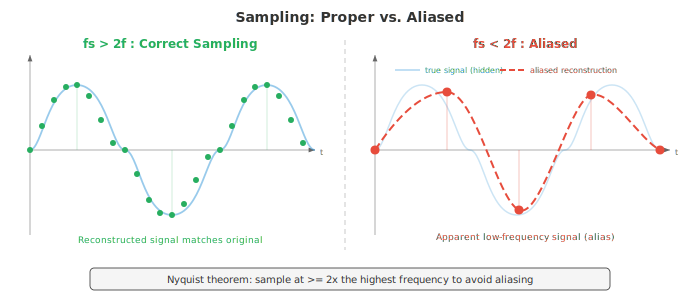
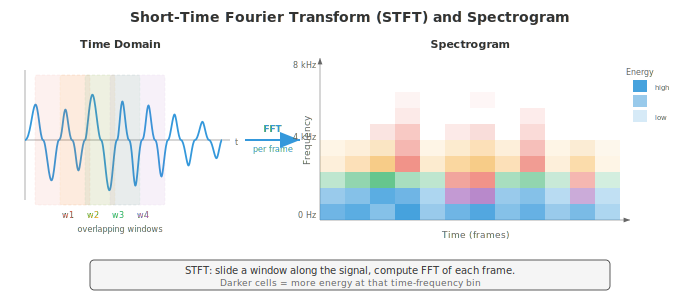
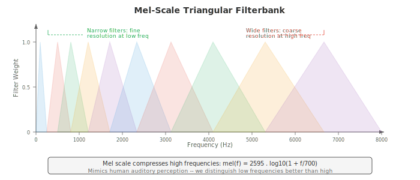

# Digital Signal Processing

*Digital signal processing converts raw audio waveforms into structured representations that ML models can learn from. This file covers sound physics, sampling and quantisation, the Fourier transform (DFT, FFT), spectrograms, mel filterbanks, MFCCs, and windowing, the feature extraction pipeline for all speech and audio AI.*

- **Sound** is a pressure wave that propagates through a medium (air, water, solids). A vibrating object (vocal cord, guitar string, speaker cone) pushes and pulls on air molecules, creating alternating regions of high pressure (compression) and low pressure (rarefaction). 

- These pressure variations travel outward at roughly 343 m/s in air and reach your ear, where they vibrate the eardrum and are transduced into neural signals.

- Think of sound like dropping a stone into a still pond: the stone is the vibrating source, the ripples are the pressure wave, and a cork bobbing on the surface is the microphone or eardrum responding to the wave's arrival. 

- The height of the cork's bobbing is the **amplitude**, how often it bobs per second is the **frequency**, and whether it starts at the top or bottom of its bob when the wave arrives is the **phase**.

- A **waveform** is a plot of pressure (or voltage, after a microphone converts sound to an electrical signal) against time. The simplest waveform is a **pure tone**, a single sinusoid:

$$x(t) = A \sin(2\pi f t + \phi)$$

- where:
    - $A$ is the amplitude (peak deviation from zero, determining loudness), 
    - $f$ is the frequency in Hz (cycles per second, determining pitch), 
    - $\phi$ is the phase in radians (time offset of the wave). 
    
- The **period** is $T = 1/f$, the duration of one complete cycle.


- **Amplitude** determines the perceived loudness. Doubling the amplitude quadruples the power (since power is proportional to amplitude squared). 

- Human hearing spans an enormous range of amplitudes, so we use a logarithmic scale: the **decibel** (dB). The sound pressure level is:

$$L = 20 \log_{10}\left(\frac{A}{A_\text{ref}}\right) \text{ dB}$$

- where $A_\text{ref}$ is a reference amplitude (typically the threshold of hearing, $20 \mu\text{Pa}$). A whisper is about 30 dB, normal conversation 60 dB, a rock concert 110 dB. Each 6 dB increase roughly doubles the amplitude; each 10 dB increase roughly doubles perceived loudness. The logarithm here is the same function from chapter 03.

- **Frequency** determines pitch. Low frequencies (20-250 Hz) sound bass; high frequencies (2000-20000 Hz) sound treble. Human hearing spans roughly 20 Hz to 20 kHz. Concert A is 440 Hz. Doubling the frequency raises the pitch by one **octave**. 

- Most natural sounds are not pure tones but complex mixtures of many frequencies, which is why a piano and a violin playing the same note sound different: they share the same **fundamental frequency** but differ in their **harmonics** (integer multiples of the fundamental) and their relative amplitudes (the **timbre**).

- **Phase** determines where in its cycle the wave starts. Two waves with identical amplitude and frequency but different phases can interfere constructively (phases aligned, amplitudes add) or destructively (phases opposite, amplitudes cancel). 

- Phase is critical in stereo audio and beamforming but is largely discarded in many speech processing pipelines because human pitch and timbre perception is mostly phase-invariant.

- Real-world audio signals are **continuous** functions of time, but computers work with discrete numbers. **Sampling** converts a continuous signal into a discrete sequence by measuring the signal's value at regular intervals. 

- The **sample rate** $f_s$ is how many measurements per second. CD audio uses $f_s = 44{,}100$ Hz; telephony uses 8000 Hz; modern speech models typically use 16000 Hz.

- The **Nyquist-Shannon sampling theorem** states that a continuous signal can be perfectly reconstructed from its samples if and only if the sample rate is at least twice the highest frequency present in the signal:

$$f_s \geq 2 f_\text{max}$$

- The frequency $f_s / 2$ is called the **Nyquist frequency**. If the signal contains frequencies above the Nyquist frequency, those frequencies fold back into the valid range and appear as false lower-frequency components. This phenomenon is called **aliasing**. Aliasing is irreversible: once it occurs, the original signal cannot be recovered from the samples.

- The everyday analogy for aliasing is the wagon-wheel effect in films: a wheel spinning at just above the frame rate appears to spin slowly backward because the camera undersamples the rotation. In audio, a 15 kHz tone sampled at 16 kHz ($f_\text{Nyquist} = 8$ kHz) aliases down to $16 - 15 = 1$ kHz, a completely different pitch.



- To prevent aliasing, an **anti-aliasing filter** (a low-pass filter) removes all frequencies above $f_s/2$ before sampling. This is applied by the analog-to-digital converter (ADC) hardware before the signal is digitised.

- **Quantisation** maps each continuous-valued sample to the nearest value in a finite set of levels. An $n$-bit quantiser has $2^n$ levels. CD audio uses 16-bit quantisation ($2^{16} = 65{,}536$ levels); telephony often uses 8-bit with $\mu$-law or A-law **companding** (a nonlinear mapping that devotes more levels to small amplitudes, matching human perception). Quantisation introduces **quantisation noise**, a form of rounding error with variance $\Delta^2/12$ where $\Delta$ is the step size between levels.

- **Time-domain analysis** extracts features directly from the waveform without transforming it to another domain. These features are simple, fast to compute, and capture basic signal properties.

- **Energy** of a frame of $N$ samples measures the overall loudness:

$$E = \sum_{n=0}^{N-1} x[n]^2$$

- Speech segments have high energy; silence has low energy. Energy is the squared $\ell_2$ norm from chapter 01 applied to a signal vector.

- **Zero-crossing rate** (ZCR) counts how often the signal changes sign in a frame:

$$\text{ZCR} = \frac{1}{2(N-1)} \sum_{n=1}^{N-1} |\text{sign}(x[n]) - \text{sign}(x[n-1])|$$

- High ZCR indicates high-frequency content or noise; low ZCR indicates low-frequency or voiced speech (where the vocal cords vibrate periodically). ZCR is a crude frequency estimator: a pure tone at $f$ Hz crosses zero $2f$ times per second.

- **Autocorrelation** measures how similar a signal is to a delayed copy of itself:

$$R[k] = \sum_{n=0}^{N-1-k} x[n] \cdot x[n+k]$$

- At lag $k = 0$, autocorrelation equals the energy. For periodic signals, the autocorrelation has peaks at lags equal to the period and its multiples. This is the standard technique for **pitch detection**: find the first significant peak in $R[k]$ after $k=0$, and the pitch is $f_s / k_\text{peak}$. Autocorrelation is related to the dot product from chapter 01: $R[k]$ is the dot product of the signal with its $k$-shifted version.

- **Frequency-domain analysis** reveals the spectral content of a signal, information invisible in the waveform. The key tool is the **Discrete Fourier Transform** (DFT), which decomposes a signal of $N$ samples into $N$ complex-valued frequency components:

$$X[k] = \sum_{n=0}^{N-1} x[n] \cdot e^{-j 2\pi k n / N}, \quad k = 0, 1, \ldots, N-1$$

- Each $X[k]$ is a complex number whose magnitude $|X[k]|$ gives the amplitude of the frequency component at $f_k = k \cdot f_s / N$ Hz, and whose phase $\angle X[k]$ gives the phase offset. The DFT is a change of basis from the time-domain basis (unit impulses) to the frequency-domain basis (complex exponentials), which is a direct application of the basis concept from chapter 02. The DFT can be written as a matrix multiplication $\mathbf{X} = W \mathbf{x}$ where $W$ is the $N \times N$ DFT matrix with entries $W_{kn} = e^{-j2\pi kn/N}$.

- The **Fast Fourier Transform** (FFT) is an algorithm that computes the DFT in $O(N \log N)$ operations instead of the naive $O(N^2)$, by recursively splitting the problem into even-indexed and odd-indexed subproblems (the Cooley-Tukey algorithm). This speedup is what makes real-time spectral analysis practical. FFT is one of the most important algorithms in all of computing.

- The **power spectrum** $|X[k]|^2$ shows the distribution of energy across frequencies. The **magnitude spectrum** $|X[k]|$ shows amplitude. Plotting these reveals which frequencies dominate the signal: a vowel has strong harmonics at integer multiples of the fundamental frequency; a fricative (like "s") has broad high-frequency energy.

- A **spectrogram** is a visual representation of how the frequency content of a signal changes over time. It is computed by chopping the signal into short overlapping frames, computing the FFT of each frame, and stacking the resulting magnitude spectra side by side. The horizontal axis is time, the vertical axis is frequency, and the colour (or brightness) at each point represents the magnitude. The spectrogram is the single most important visualisation in audio processing.



- The **mel scale** is a perceptual frequency scale that reflects how humans perceive pitch. Humans perceive equal ratios of frequency as equal intervals of pitch (just as we perceive equal ratios of intensity as equal intervals of loudness). Below about 1000 Hz, the mel scale is approximately linear; above 1000 Hz, it becomes approximately logarithmic:

$$m = 2595 \log_{10}\left(1 + \frac{f}{700}\right)$$

- The inverse is $f = 700(10^{m/2595} - 1)$. The mel scale is the reason that musical semitones are equally spaced on a log-frequency axis: A4 (440 Hz) to A5 (880 Hz) and A5 to A6 (1760 Hz) both sound like "one octave up" even though the Hz gaps are 440 and 880 respectively.

- A **mel filterbank** is a set of triangular bandpass filters spaced uniformly on the mel scale. Each filter covers a frequency band and sums the spectral energy within that band, producing a single number. Typical speech systems use 40-80 mel filters. Low-frequency filters are narrow (high frequency resolution where we are perceptually sensitive) and high-frequency filters are wide (low resolution where we are less sensitive). This mimics the frequency resolution of the human cochlea.



- **Mel-Frequency Cepstral Coefficients** (MFCCs) are the classic feature representation for speech and audio. They compress the mel spectrum into a small number of decorrelated coefficients that capture the shape of the spectral envelope (which encodes vocal tract configuration and therefore phonetic identity) while discarding fine spectral detail (which encodes pitch and phase).

- The MFCC pipeline:
    1. **Pre-emphasis**: apply a first-order high-pass filter $y[n] = x[n] - \alpha x[n-1]$ (typically $\alpha = 0.97$) to boost high frequencies that are attenuated by the vocal tract.
    2. **Framing**: chop the signal into overlapping frames (typically 25 ms long, with 10 ms hop).
    3. **Windowing**: multiply each frame by a window function (Hamming) to reduce spectral leakage (see below).
    4. **FFT**: compute the power spectrum of each windowed frame.
    5. **Mel filterbank**: apply the triangular mel filterbank to the power spectrum, producing mel-band energies.
    6. **Log**: take the logarithm of the mel-band energies. The log compresses the dynamic range and converts multiplication (of spectral components) to addition, matching human loudness perception.
    7. **DCT**: apply the Discrete Cosine Transform to the log-mel energies. The DCT decorrelates the mel bands (since adjacent bands are highly correlated) and compacts the energy into the first few coefficients. Keep the first 13 coefficients (MFCC-0 through MFCC-12).


- The DCT in step 7 is essentially a "Fourier transform of the spectrum" (hence the name **cepstrum** = anagram of spectrum). Low-order cepstral coefficients capture the broad spectral shape (vocal tract resonances, called **formants**), while high-order coefficients capture fine spectral detail (pitch harmonics). By keeping only the first 13, we retain formant information and discard pitch detail.

- **Delta** and **delta-delta** MFCCs (first and second time derivatives of the MFCCs, computed by finite differences across adjacent frames) capture the dynamics of the spectral shape, adding temporal context. A full MFCC feature vector is often 39-dimensional: 13 static + 13 delta + 13 delta-delta.

- Modern neural network models (chapter 06) have largely replaced MFCCs with learned features: log-mel spectrograms (the output of step 6, skipping the DCT) are the standard input for deep learning ASR and audio classification. The model learns its own decorrelation. Still, MFCCs remain important for low-resource settings, classical ML pipelines, and understanding the signal processing foundations.

- **Windowing** is the process of multiplying a signal frame by a smooth window function before computing the FFT. Without windowing, the FFT assumes the frame repeats infinitely; the abrupt start and end of the frame create artificial discontinuities that spread energy across all frequencies, an artifact called **spectral leakage**.

- **Rectangular window** $w[n] = 1$ for all $n$: no tapering, maximum leakage, but widest main lobe (best frequency resolution for a given frame length). Rarely used in practice.

- **Hamming window**: $w[n] = 0.54 - 0.46 \cos(2\pi n / (N-1))$. Tapers to near zero at the edges, greatly reducing leakage. The standard choice for speech processing.

- **Hann window** (also called Hanning): $w[n] = 0.5 - 0.5 \cos(2\pi n / (N-1))$. Tapers to exactly zero at the edges. Very similar to Hamming but with slightly better sidelobe suppression.

- **Blackman window**: $w[n] = 0.42 - 0.5 \cos(2\pi n / (N-1)) + 0.08 \cos(4\pi n / (N-1))$. Even better sidelobe suppression but wider main lobe (worse frequency resolution). Used when sidelobe artifacts are particularly problematic.

- There is a fundamental tradeoff: windows with less leakage have wider main lobes, meaning they cannot resolve two closely spaced frequencies. This is the **spectral resolution vs. leakage tradeoff**, a consequence of the uncertainty principle from chapter 03.

- **Overlap-add** (OLA) is a technique for reconstructing a signal from windowed, processed frames. Frames overlap (typically 50-75%), and after processing, the windowed outputs are summed. If the window and overlap are chosen correctly (e.g., Hann window with 50% overlap), the overlapping windows sum to a constant, giving perfect reconstruction. This is essential for any frame-based modification of audio (noise reduction, pitch shifting, time stretching).

- The **Short-Time Fourier Transform** (STFT) is the formal framework underlying spectrograms. It applies the DFT to each windowed frame of the signal:

```math
\text{STFT}\{x[n]\}(m, k) = \sum_{n=0}^{N-1} x[n + mH] \cdot w[n] \cdot e^{-j 2\pi k n / N}
```

- where $m$ is the frame index, $H$ is the hop size (number of samples between consecutive frames), $w[n]$ is the window function, and $N$ is the FFT size. The output is a 2D complex-valued matrix: the **time-frequency representation** of the signal.

- The STFT embodies a fundamental **time-frequency tradeoff**:
    - Long frames (large $N$): high frequency resolution (can distinguish closely-spaced frequencies) but poor time resolution (cannot pinpoint when a frequency changes).
    - Short frames (small $N$): high time resolution but poor frequency resolution.
    - The product of time resolution and frequency resolution is bounded below: $\Delta t \cdot \Delta f \geq \frac{1}{4\pi}$. This is the **Gabor limit**, the signal processing analogue of the Heisenberg uncertainty principle from physics.

- Typical speech STFT parameters: 25 ms frame length ($N = 400$ at 16 kHz), 10 ms hop ($H = 160$), Hamming window, 512-point FFT (zero-padded from 400 for efficiency and smoother spectral interpolation).

- **Filtering** modifies the frequency content of a signal by amplifying some frequencies and attenuating others. A **filter** is a system that takes an input signal and produces an output signal. Filters are characterised by their **frequency response** $H(f)$, which describes the gain and phase shift applied to each frequency.

- **Low-pass filter**: passes frequencies below a cutoff frequency $f_c$ and attenuates frequencies above it. Removes high-frequency noise and detail. The anti-aliasing filter before sampling is a low-pass filter.

- **High-pass filter**: passes frequencies above $f_c$ and attenuates below. Removes low-frequency rumble and DC offset. The pre-emphasis filter in MFCC extraction ($y[n] = x[n] - 0.97 x[n-1]$) is a simple high-pass filter.

- **Band-pass filter**: passes frequencies within a range $[f_1, f_2]$ and attenuates outside. Each triangle in the mel filterbank is a band-pass filter.

- **Band-stop (notch) filter**: attenuates a specific narrow frequency range. Used to remove specific interference (e.g., 50/60 Hz power line hum).

- A **Finite Impulse Response** (FIR) filter computes each output sample as a weighted sum of the current and past input samples:

$$y[n] = \sum_{k=0}^{M} b_k \cdot x[n-k]$$

- The weights $b_k$ are the **filter coefficients** (also called **taps**). The filter has order $M$. FIR filters are always stable (the output never diverges) and can be designed to have perfectly linear phase (all frequencies are delayed by the same amount, preserving waveform shape). Their downside is that achieving a sharp cutoff requires many taps (high $M$), increasing computation. The output is a convolution of the input with the coefficient vector, exactly the 1D convolution operation from chapter 06.

- An **Infinite Impulse Response** (IIR) filter uses feedback: the output depends on both past inputs and past outputs:

```math
y[n] = \sum_{k=0}^{M} b_k \cdot x[n-k] - \sum_{k=1}^{L} a_k \cdot y[n-k]
```

- The feedback terms $a_k$ create a recursive structure whose impulse response is theoretically infinite in duration. IIR filters achieve sharp cutoffs with far fewer coefficients than FIR filters, but they can be unstable (output grows without bound if the poles of the transfer function lie outside the unit circle, a concept from the $z$-transform). They also have nonlinear phase, which can distort the waveform shape. Classical filter designs (Butterworth, Chebyshev, elliptic) are IIR.

- The **transfer function** of a discrete-time filter is obtained via the $z$-transform:

$$H(z) = \frac{\sum_{k=0}^{M} b_k z^{-k}}{1 + \sum_{k=1}^{L} a_k z^{-k}}$$

- The roots of the numerator are called **zeros** and the roots of the denominator are called **poles**. The pole-zero plot fully characterises the filter's behaviour. Poles near the unit circle amplify nearby frequencies; zeros near the unit circle attenuate them. FIR filters have only zeros (the denominator is 1). This connects to the eigenvalue and root-finding concepts from chapter 02 and chapter 03.

- **Convolution theorem**: convolution in the time domain equals element-wise multiplication in the frequency domain. This means filtering can be performed either by directly convolving the signal with the filter impulse response, or by multiplying their Fourier transforms and inverse-transforming the result. For long filters, the frequency-domain approach (using FFT) is faster: $O(N \log N)$ versus $O(NM)$.

- The **inverse STFT** (iSTFT) reconstructs a time-domain signal from its STFT representation. This is essential for any system that modifies audio in the frequency domain (noise reduction, source separation, voice conversion). The reconstruction uses overlap-add:

```math
x[n] = \frac{\sum_{m} w[n - mH] \cdot \text{IDFT}\{X(m, k)\}[n - mH]}{\sum_{m} w[n - mH]^2}
```

- The denominator normalises for the window overlap, ensuring perfect reconstruction when the synthesis window matches the analysis window and the overlap is sufficient.

- **Summary of the DSP chain for speech**: raw audio is sampled at 16 kHz, pre-emphasised, chopped into 25 ms Hamming-windowed frames with 10 ms hop, each frame is FFT-transformed, passed through a mel filterbank, log-compressed, and either kept as log-mel features (for neural network models) or DCT-transformed to produce MFCCs (for classical models). This entire chain converts a 1D time-domain signal into a 2D time-frequency representation suitable for downstream machine learning, which will be the subject of file 02.

## Coding Tasks (use CoLab or notebook)

1. Generate a sine wave, sample it at different rates, and demonstrate aliasing. Plot the continuous signal, properly-sampled version, and under-sampled (aliased) version.
```python
import jax.numpy as jnp
import matplotlib.pyplot as plt

# Parameters
f_signal = 5.0  # 5 Hz signal
duration = 1.0  # 1 second

# "Continuous" signal (very high sample rate)
t_cont = jnp.linspace(0, duration, 10000)
x_cont = jnp.sin(2 * jnp.pi * f_signal * t_cont)

# Properly sampled (fs = 50 Hz, well above Nyquist = 10 Hz)
fs_good = 50
t_good = jnp.arange(0, duration, 1.0 / fs_good)
x_good = jnp.sin(2 * jnp.pi * f_signal * t_good)

# Under-sampled (fs = 7 Hz, below Nyquist = 10 Hz) -> aliasing
fs_bad = 7
t_bad = jnp.arange(0, duration, 1.0 / fs_bad)
x_bad = jnp.sin(2 * jnp.pi * f_signal * t_bad)

# The aliased frequency: |f_signal - fs_bad| = |5 - 7| = 2 Hz
f_alias = abs(f_signal - fs_bad)
x_alias_cont = jnp.sin(2 * jnp.pi * f_alias * t_cont)

fig, axes = plt.subplots(3, 1, figsize=(12, 9))

# Plot 1: original signal
axes[0].plot(t_cont, x_cont, color='#3498db', linewidth=1.5, label=f'Original {f_signal} Hz')
axes[0].set_title(f'Original {f_signal} Hz Signal')
axes[0].set_xlabel('Time (s)'); axes[0].set_ylabel('Amplitude')
axes[0].legend(); axes[0].grid(True, alpha=0.3)

# Plot 2: proper sampling
axes[1].plot(t_cont, x_cont, color='#3498db', linewidth=1, alpha=0.4, label='Original')
axes[1].stem(t_good, x_good, linefmt='#27ae60', markerfmt='o', basefmt='k-',
             label=f'Sampled at {fs_good} Hz (above Nyquist)')
axes[1].set_title(f'Proper Sampling: fs = {fs_good} Hz > 2 x {f_signal} Hz')
axes[1].set_xlabel('Time (s)'); axes[1].set_ylabel('Amplitude')
axes[1].legend(); axes[1].grid(True, alpha=0.3)

# Plot 3: aliased sampling
axes[2].plot(t_cont, x_cont, color='#3498db', linewidth=1, alpha=0.4, label='Original')
axes[2].stem(t_bad, x_bad, linefmt='#e74c3c', markerfmt='o', basefmt='k-',
             label=f'Sampled at {fs_bad} Hz (below Nyquist)')
axes[2].plot(t_cont, x_alias_cont, color='#f39c12', linewidth=1.5, linestyle='--',
             label=f'Aliased signal appears as {f_alias} Hz')
axes[2].set_title(f'Aliased Sampling: fs = {fs_bad} Hz < 2 x {f_signal} Hz')
axes[2].set_xlabel('Time (s)'); axes[2].set_ylabel('Amplitude')
axes[2].legend(); axes[2].grid(True, alpha=0.3)

plt.tight_layout(); plt.show()
```

2. Compute and visualise the FFT of a signal composed of multiple sinusoids. Show the magnitude spectrum and identify the constituent frequencies.
```python
import jax.numpy as jnp
import matplotlib.pyplot as plt

# Create a composite signal: 220 Hz + 440 Hz + 880 Hz (A3 + A4 + A5)
fs = 8000  # 8 kHz sample rate
duration = 0.1  # 100 ms
t = jnp.arange(0, duration, 1.0 / fs)
n_samples = len(t)

# Three frequency components with different amplitudes
x = 1.0 * jnp.sin(2 * jnp.pi * 220 * t) + \
    0.6 * jnp.sin(2 * jnp.pi * 440 * t) + \
    0.3 * jnp.sin(2 * jnp.pi * 880 * t)

# Compute FFT
X = jnp.fft.fft(x)
freqs = jnp.fft.fftfreq(n_samples, d=1.0 / fs)
magnitude = jnp.abs(X) / n_samples  # normalise

# Only plot positive frequencies
pos_mask = freqs >= 0
freqs_pos = freqs[pos_mask]
mag_pos = magnitude[pos_mask] * 2  # double to account for negative freq energy

fig, axes = plt.subplots(2, 1, figsize=(12, 7))

# Time domain
axes[0].plot(t * 1000, x, color='#3498db', linewidth=1)
axes[0].set_title('Composite Signal: 220 Hz + 440 Hz + 880 Hz')
axes[0].set_xlabel('Time (ms)'); axes[0].set_ylabel('Amplitude')
axes[0].grid(True, alpha=0.3)

# Frequency domain
axes[1].plot(freqs_pos, mag_pos, color='#e74c3c', linewidth=1.5)
axes[1].set_title('Magnitude Spectrum (FFT)')
axes[1].set_xlabel('Frequency (Hz)'); axes[1].set_ylabel('Magnitude')
axes[1].set_xlim(0, 1500)
# Annotate peaks
for f_peak, amp in [(220, 1.0), (440, 0.6), (880, 0.3)]:
    axes[1].annotate(f'{f_peak} Hz', xy=(f_peak, amp), fontsize=10,
                     ha='center', va='bottom', color='#9b59b6',
                     arrowprops=dict(arrowstyle='->', color='#9b59b6'))
axes[1].grid(True, alpha=0.3)

plt.tight_layout(); plt.show()
```

3. Build the full MFCC pipeline from scratch in JAX: pre-emphasis, framing, windowing, FFT, mel filterbank, log, DCT. Visualise the mel filterbank and the resulting MFCCs as a heatmap.
```python
import jax
import jax.numpy as jnp
import matplotlib.pyplot as plt

# --- Generate a synthetic speech-like signal ---
key = jax.random.PRNGKey(42)
fs = 16000
duration = 1.0
t = jnp.arange(0, duration, 1.0 / fs)

# Simulate voiced speech: fundamental + harmonics with amplitude decay
f0 = 150.0  # fundamental frequency
x = sum(jnp.sin(2 * jnp.pi * f0 * k * t) / k for k in range(1, 8))
# Add some noise
x = x + 0.1 * jax.random.normal(key, t.shape)
x = x / jnp.max(jnp.abs(x))  # normalise

# --- Step 1: Pre-emphasis ---
alpha = 0.97
x_pre = jnp.concatenate([x[:1], x[1:] - alpha * x[:-1]])

# --- Step 2: Framing ---
frame_len = int(0.025 * fs)   # 25 ms = 400 samples
hop_len = int(0.010 * fs)     # 10 ms = 160 samples
n_frames = (len(x_pre) - frame_len) // hop_len + 1
frames = jnp.stack([x_pre[i * hop_len : i * hop_len + frame_len]
                     for i in range(n_frames)])

# --- Step 3: Hamming window ---
hamming = 0.54 - 0.46 * jnp.cos(2 * jnp.pi * jnp.arange(frame_len) / (frame_len - 1))
windowed = frames * hamming

# --- Step 4: FFT ---
n_fft = 512
spectra = jnp.fft.rfft(windowed, n=n_fft)
power_spectra = jnp.abs(spectra) ** 2 / n_fft

# --- Step 5: Mel filterbank ---
n_mels = 40
f_min, f_max = 0.0, fs / 2.0

def hz_to_mel(f):
    return 2595 * jnp.log10(1 + f / 700)

def mel_to_hz(m):
    return 700 * (10 ** (m / 2595) - 1)

mel_min = hz_to_mel(f_min)
mel_max = hz_to_mel(f_max)
mel_points = jnp.linspace(mel_min, mel_max, n_mels + 2)
hz_points = mel_to_hz(mel_points)

freq_bins = jnp.floor((n_fft + 1) * hz_points / fs).astype(jnp.int32)
n_freqs = n_fft // 2 + 1
filterbank = jnp.zeros((n_mels, n_freqs))

for m in range(n_mels):
    f_left = freq_bins[m]
    f_center = freq_bins[m + 1]
    f_right = freq_bins[m + 2]
    # Rising slope
    for k in range(int(f_left), int(f_center)):
        if f_center != f_left:
            filterbank = filterbank.at[m, k].set((k - f_left) / (f_center - f_left))
    # Falling slope
    for k in range(int(f_center), int(f_right)):
        if f_right != f_center:
            filterbank = filterbank.at[m, k].set((f_right - k) / (f_right - f_center))

# Apply filterbank
mel_spectra = jnp.dot(power_spectra, filterbank.T)

# --- Step 6: Log ---
log_mel = jnp.log(mel_spectra + 1e-10)

# --- Step 7: DCT (type-II) ---
n_mfcc = 13
n_mel_channels = log_mel.shape[1]
dct_matrix = jnp.zeros((n_mfcc, n_mel_channels))
for i in range(n_mfcc):
    for j in range(n_mel_channels):
        dct_matrix = dct_matrix.at[i, j].set(
            jnp.cos(jnp.pi * i * (j + 0.5) / n_mel_channels)
        )
mfccs = jnp.dot(log_mel, dct_matrix.T)

# --- Visualisation ---
fig, axes = plt.subplots(3, 1, figsize=(14, 11))

# Mel filterbank
freq_axis = jnp.linspace(0, fs / 2, n_freqs)
for m in range(n_mels):
    color = '#3498db' if m % 2 == 0 else '#e74c3c'
    axes[0].plot(freq_axis, filterbank[m], color=color, alpha=0.6, linewidth=0.8)
axes[0].set_title(f'Mel Filterbank ({n_mels} filters)')
axes[0].set_xlabel('Frequency (Hz)'); axes[0].set_ylabel('Weight')
axes[0].grid(True, alpha=0.3)

# Log-mel spectrogram
im1 = axes[1].imshow(log_mel.T, aspect='auto', origin='lower',
                      extent=[0, duration, 0, n_mels], cmap='viridis')
axes[1].set_title('Log-Mel Spectrogram')
axes[1].set_xlabel('Time (s)'); axes[1].set_ylabel('Mel Band')
plt.colorbar(im1, ax=axes[1], label='Log Energy')

# MFCCs
im2 = axes[2].imshow(mfccs.T, aspect='auto', origin='lower',
                      extent=[0, duration, 0, n_mfcc], cmap='coolwarm')
axes[2].set_title(f'MFCCs (first {n_mfcc} coefficients)')
axes[2].set_xlabel('Time (s)'); axes[2].set_ylabel('MFCC Index')
plt.colorbar(im2, ax=axes[2], label='Coefficient Value')

plt.tight_layout(); plt.show()
```

4. Implement FIR low-pass and high-pass filters and visualise their effect on a signal containing both low and high frequency components. Show both time-domain and frequency-domain views.
```python
import jax
import jax.numpy as jnp
import matplotlib.pyplot as plt

# Create a signal with low (100 Hz) and high (2000 Hz) components
fs = 8000
duration = 0.05  # 50 ms for clear visualisation
t = jnp.arange(0, duration, 1.0 / fs)

x_low = jnp.sin(2 * jnp.pi * 100 * t)
x_high = 0.5 * jnp.sin(2 * jnp.pi * 2000 * t)
x = x_low + x_high

# Design a simple FIR low-pass filter using windowed sinc
def fir_lowpass(cutoff_hz, fs, n_taps=51):
    """Design FIR low-pass filter using windowed sinc method."""
    fc = cutoff_hz / fs  # normalised cutoff
    n = jnp.arange(n_taps)
    mid = (n_taps - 1) / 2.0
    # Sinc function (ideal low-pass impulse response)
    h = jnp.where(n == mid, 2 * fc,
                  jnp.sin(2 * jnp.pi * fc * (n - mid)) / (jnp.pi * (n - mid)))
    # Apply Hamming window
    window = 0.54 - 0.46 * jnp.cos(2 * jnp.pi * n / (n_taps - 1))
    h = h * window
    h = h / jnp.sum(h)  # normalise to unity gain at DC
    return h

def apply_filter(x, h):
    """Apply FIR filter via convolution."""
    return jnp.convolve(x, h, mode='same')

# Low-pass filter at 500 Hz (passes 100 Hz, blocks 2000 Hz)
h_lp = fir_lowpass(500, fs, n_taps=51)
x_lp = apply_filter(x, h_lp)

# High-pass = delta - low-pass (spectral inversion)
delta = jnp.zeros(51)
delta = delta.at[25].set(1.0)
h_hp = delta - h_lp
x_hp = apply_filter(x, h_hp)

# Compute spectra for all signals
def compute_spectrum(signal, fs):
    X = jnp.fft.rfft(signal)
    freqs = jnp.fft.rfftfreq(len(signal), d=1.0 / fs)
    mag = jnp.abs(X) / len(signal) * 2
    return freqs, mag

fig, axes = plt.subplots(3, 2, figsize=(14, 10))

# Time domain plots
for i, (sig, title, color) in enumerate([
    (x, 'Original (100 Hz + 2000 Hz)', '#3498db'),
    (x_lp, 'Low-pass filtered (< 500 Hz)', '#27ae60'),
    (x_hp, 'High-pass filtered (> 500 Hz)', '#e74c3c')
]):
    axes[i, 0].plot(t * 1000, sig[:len(t)], color=color, linewidth=1)
    axes[i, 0].set_title(f'Time Domain: {title}')
    axes[i, 0].set_xlabel('Time (ms)'); axes[i, 0].set_ylabel('Amplitude')
    axes[i, 0].grid(True, alpha=0.3)

# Frequency domain plots
for i, (sig, title, color) in enumerate([
    (x, 'Original', '#3498db'),
    (x_lp, 'Low-pass', '#27ae60'),
    (x_hp, 'High-pass', '#e74c3c')
]):
    freqs, mag = compute_spectrum(sig, fs)
    axes[i, 1].plot(freqs, mag, color=color, linewidth=1.5)
    axes[i, 1].set_title(f'Spectrum: {title}')
    axes[i, 1].set_xlabel('Frequency (Hz)'); axes[i, 1].set_ylabel('Magnitude')
    axes[i, 1].set_xlim(0, 3000)
    axes[i, 1].axvline(x=500, color='#f39c12', linestyle='--', alpha=0.7,
                        label='Cutoff (500 Hz)')
    axes[i, 1].legend(); axes[i, 1].grid(True, alpha=0.3)

plt.tight_layout(); plt.show()
```