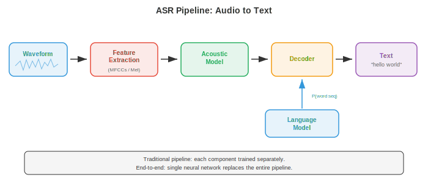

# Automatic Speech Recognition

*Automatic speech recognition converts spoken audio into written text, bridging the gap between human speech and machine-readable language. This file covers GMM-HMMs, CTC loss, the RNN-Transducer, attention-based encoder-decoder models (LAS), Whisper, and end-to-end ASR, from classical pipelines to modern neural architectures.*

- **Automatic speech recognition** (ASR) is the task of converting spoken audio into written text. It is one of the oldest problems in AI (first systems in the 1950s recognised single digits) and one of the most commercially deployed (voice assistants, transcription services, subtitling). 

- The difficulty comes from the enormous variability of speech: different speakers, accents, speaking rates, background noise, microphone characteristics, and the fundamental ambiguity of mapping a continuous acoustic signal to discrete words.

- Think of ASR like a courtroom stenographer. The stenographer hears a continuous stream of sound, mentally segments it into words, resolves ambiguities using context ("they're" vs "their" vs "there"), and types the result. An ASR system does the same thing, but in stages that can be made explicit and optimised independently or jointly.

- The **classical ASR pipeline** processes audio in a chain of distinct stages: raw audio is transformed into features (MFCCs or log-mel spectrograms, from file 01), an **acoustic model** scores how well each feature frame matches each phonetic unit, a **pronunciation model** (lexicon) maps phonetic units to words, a **language model** scores how likely word sequences are, and a **decoder** searches for the word sequence that maximises the combined score. Each component is trained and tuned separately.



- **Phonemes** are the smallest units of sound that distinguish words in a language. English has roughly 39-44 phonemes (the exact number depends on the dialect and the phoneme inventory used). For example, "bat" and "pat" differ in one phoneme (/b/ vs /p/). Most ASR systems model **context-dependent phonemes** called **triphones**: a phoneme defined by its left and right neighbours (e.g., "a" in the context of "b_t" is a different unit from "a" in "c_t"), because the acoustic realisation of a phoneme is heavily influenced by its neighbours (this is called **coarticulation**).

- The number of possible triphones is enormous (40 phonemes cubed = 64,000), so **decision tree clustering** groups acoustically similar triphones into **senones** (typically 2000-10,000 classes). Each senone gets its own acoustic model. This clustering is a form of the decision tree algorithms from chapter 06.

- **GMM-HMM** (Gaussian Mixture Model - Hidden Markov Model) was the dominant acoustic modelling approach from the 1980s to the early 2010s. The HMM (from chapter 05) models the temporal structure of speech: each phoneme is a left-to-right HMM with 3-5 states, where each state represents a sub-phonetic segment (onset, middle, offset). The state-to-state transitions model duration implicitly.

- At each HMM state, the emission probability (how likely a particular feature vector is given that state) is modelled by a **Gaussian mixture model** (GMM): a weighted sum of multivariate Gaussian distributions (from chapter 05):

```math
p(\mathbf{x} | s) = \sum_{m=1}^{M} w_m \cdot \mathcal{N}(\mathbf{x} ; \boldsymbol{\mu}_m, \boldsymbol{\Sigma}_m)
```

- where $\mathbf{x}$ is the feature vector (e.g., 39-dimensional MFCCs), $s$ is the HMM state, $M$ is the number of mixture components (typically 8-64), $w_m$ are mixture weights, and $\boldsymbol{\mu}_m$, $\boldsymbol{\Sigma}_m$ are the mean and covariance of each Gaussian component. The covariance matrices are usually diagonal for computational efficiency (assuming feature dimensions are independent, which is approximately true for MFCCs due to the DCT decorrelation).

- Training uses the **Baum-Welch algorithm** (a special case of EM, from chapter 05) to iteratively estimate the GMM parameters and HMM transition probabilities from transcribed speech data. Decoding (finding the most likely state sequence) uses the **Viterbi algorithm** (dynamic programming, from chapter 05):

```math
\delta_t(j) = \max_{i} \left[ \delta_{t-1}(i) \cdot a_{ij} \right] \cdot b_j(\mathbf{x}_t)
```

- where $\delta_t(j)$ is the probability of the best path ending in state $j$ at time $t$, $a_{ij}$ is the transition probability from state $i$ to state $j$, and $b_j(\mathbf{x}_t)$ is the emission probability of feature $\mathbf{x}_t$ in state $j$.

- **DNN-HMM** (Hinton et al., 2012) replaced the GMM emission model with a deep neural network (DNN, from chapter 06) that predicts senone posterior probabilities $p(s | \mathbf{x})$ from a window of feature frames. The HMM still handles temporal structure and sequencing, but the neural network provides far more discriminative emission scores. This hybrid approach reduced word error rates by 20-30% relative to GMMs and was the dominant paradigm from 2012-2016.

- **WFST decoding** (Weighted Finite-State Transducer) is the standard decoding framework for traditional ASR. Each component (HMM topology H, context-dependency C, lexicon L, grammar/language model G) is represented as a weighted finite-state transducer, and they are composed into a single search graph $H \circ C \circ L \circ G$. The Viterbi search then finds the lowest-cost path through this composed graph. WFSTs allow modular combination of knowledge sources and efficient dynamic programming search. The mathematical framework is from finite automata theory (related to the state machines in chapter 05).

- **End-to-end ASR** eliminates the separate components (pronunciation model, phoneme inventory, WFST decoder) and trains a single neural network that maps directly from audio features to characters or word pieces. The key challenge is the **alignment problem**: the input (hundreds of feature frames per second) and output (a few characters per second) have very different lengths, and the alignment between them is unknown during training.

- **Connectionist Temporal Classification** (CTC) (Graves et al., 2006) solves the alignment problem by introducing a special **blank** token and allowing the network to output any sequence of characters and blanks, as long as collapsing consecutive duplicates and removing blanks yields the correct transcript. For example, the transcript "cat" could be produced by the output sequence "--cc-aa-t--" (where "-" is blank).

- Formally, CTC defines a many-to-one mapping $\mathcal{B}$ from the set of all length-$T$ output sequences (over the alphabet plus blank) to label sequences. The probability of a label sequence $\mathbf{y}$ is the sum over all alignments that collapse to it:

$$P(\mathbf{y} | \mathbf{x}) = \sum_{\boldsymbol{\pi} \in \mathcal{B}^{-1}(\mathbf{y})} \prod_{t=1}^{T} p(\pi_t | \mathbf{x})$$


- Computing this sum naively would require enumerating exponentially many alignments, but the **CTC forward-backward algorithm** computes it efficiently in $O(T \cdot |\mathbf{y}|)$ using dynamic programming, analogous to the HMM forward-backward algorithm from chapter 05.

- CTC makes a **conditional independence assumption**: the output at each time step is independent of all other outputs given the input. This means CTC cannot model output dependencies (e.g., it cannot learn that "q" is almost always followed by "u"). An external language model must be used to handle such dependencies.

- **CTC decoding** options:
    - **Greedy decoding**: take the most probable token at each time step, then collapse. Fast but suboptimal.
    - **Beam search**: maintain the top-$k$ partial hypotheses at each step, merging hypotheses that collapse to the same prefix. Can incorporate a language model score.
    - **Prefix beam search**: a modified beam search that correctly handles the CTC blank merging, ensuring hypotheses are compared after collapsing.

- **RNN-Transducer** (RNN-T) (Graves, 2012) extends CTC by adding an explicit **prediction network** (a language model-like RNN) that conditions each output on the previous outputs, removing the conditional independence assumption. RNN-T has three components:
    - **Encoder**: processes the audio features to produce hidden representations $\mathbf{h}_t^\text{enc}$ (typically a stack of LSTMs or Conformer layers).
    - **Prediction network**: an autoregressive RNN that produces hidden representations $\mathbf{h}_u^\text{pred}$ from the previously emitted labels.
    - **Joint network**: combines the encoder and prediction network outputs at each (time, label) position and produces a distribution over the next token (including blank):

$$p(y | t, u) = \text{softmax}(W \cdot \text{tanh}(W_\text{enc} \mathbf{h}_t^\text{enc} + W_\text{pred} \mathbf{h}_u^\text{pred} + b))$$

- RNN-T can emit zero or more labels per time step (by emitting non-blank tokens before advancing to the next time step, or emitting blank to advance without output). Training uses a forward-backward algorithm over the 2D (time, label) lattice, with complexity $O(T \cdot U)$ where $U$ is the output length. RNN-T is the dominant architecture for on-device streaming ASR (used in Google's Pixel phones and similar products) because it naturally supports streaming: the encoder processes audio left-to-right and the prediction network generates output incrementally.

- **Listen, Attend and Spell** (LAS) (Chan et al., 2016) is an attention-based encoder-decoder model (the sequence-to-sequence architecture from chapter 06). It has three components:
    - **Listener** (encoder): a pyramidal bidirectional LSTM that processes the full input sequence and downsamples by a factor of 8 (by concatenating pairs of consecutive hidden states at each layer), producing a shorter sequence of encoder hidden states.
    - **Attention**: at each decoder step, computes attention weights over all encoder states to form a context vector (the same attention mechanism from chapter 07).
    - **Speller** (decoder): an autoregressive LSTM that generates the output transcript one character at a time, conditioned on the context vector and previously generated characters.

- LAS achieves strong results but requires the full utterance to be available before decoding (because the attention attends to all encoder states), making it unsuitable for streaming applications. It also struggles with very long utterances because attention over long sequences becomes diffuse.

- The **Conformer** (Gulati et al., 2020) combines the local pattern-capturing ability of convolutions with the global dependency modelling of self-attention. Each Conformer block has four modules in a sandwich structure:
    1. **Feed-forward module** (half-step): a feed-forward network with residual connection, using half the residual weight.
    2. **Multi-head self-attention module**: standard transformer self-attention (from chapter 07) with relative positional encoding.
    3. **Convolution module**: a pointwise convolution, a gated linear unit (GLU), a 1D depthwise convolution, batch normalisation, a Swish activation, and another pointwise convolution. The depthwise convolution captures local context (like an n-gram over the feature sequence).
    4. **Feed-forward module** (half-step): identical to module 1.

- The output is: $\mathbf{y} = \text{LayerNorm}(\mathbf{x} + \frac{1}{2}\text{FFN}_1 + \text{MHSA} + \text{Conv} + \frac{1}{2}\text{FFN}_2)$. The macaron-like structure (FFN-Attention-Conv-FFN) with half-step residuals was found empirically to outperform other orderings. Conformers have become the default encoder for both CTC and RNN-T systems, outperforming pure transformer and pure LSTM encoders.


- **Whisper** (Radford et al., 2023) is OpenAI's large-scale attention-based ASR model. It uses a standard encoder-decoder transformer architecture (from chapter 07) trained on 680,000 hours of weakly supervised data scraped from the internet (audio paired with approximate transcripts). Key design choices:
    - Input: 80-channel log-mel spectrogram (from file 01) with 25 ms windows and 10 ms hops, normalised to zero mean and unit variance.
    - Encoder: standard transformer encoder with sinusoidal positional embeddings and pre-activation layer normalisation.
    - Decoder: transformer decoder that autoregressively generates tokens using a byte-level BPE tokenizer (from chapter 07).
    - Multitask: a single model handles transcription, translation, language identification, and timestamp prediction, conditioned on special task tokens in the decoder prompt.
    - The scale of the training data (rather than architectural novelty) is the primary driver of Whisper's strong generalisation across domains, accents, and languages.

- **wav2vec 2.0** (Baevski et al., 2020) is a **self-supervised** pre-training framework for speech representations. The core idea is to learn speech representations from large amounts of unlabelled audio, then fine-tune with a small amount of labelled data. This follows the same self-supervised paradigm as BERT (from chapter 07) but adapted for continuous audio signals.

- The wav2vec 2.0 architecture has three parts:
    - **Feature encoder**: a multi-layer 1D CNN that processes raw waveform samples and produces latent representations $\mathbf{z}_t$ at a 20 ms frame rate (one vector every 320 samples at 16 kHz).
    - **Quantisation module**: discretises the latent representations into a finite codebook using **product quantisation** (dividing the vector into groups and quantising each group independently, choosing from $G$ codebooks of $V$ entries each). This produces targets $\mathbf{q}_t$ for the contrastive learning objective.
    - **Context network**: a transformer encoder that takes the (partially masked) latent representations and produces contextualised representations $\mathbf{c}_t$.


- During pre-training, random spans of latent representations are **masked** (replaced with a learned mask embedding), and the model must identify the true quantised representation of the masked position from a set of distractors (negatives sampled from other positions in the same utterance). The contrastive loss is:

$$\mathcal{L} = -\log \frac{\exp(\text{sim}(\mathbf{c}_t, \mathbf{q}_t) / \kappa)}{\sum_{\tilde{\mathbf{q}} \in Q_t} \exp(\text{sim}(\mathbf{c}_t, \tilde{\mathbf{q}}) / \kappa)}$$

- where $\text{sim}$ is cosine similarity, $\kappa$ is a temperature parameter, and $Q_t$ includes the true quantised target plus distractors. An additional **diversity loss** encourages equal use of all codebook entries. This loss is essentially the InfoNCE contrastive loss, the same family of contrastive objectives used in visual self-supervised learning.

- After pre-training, a linear projection and CTC head are added on top, and the model is fine-tuned on labelled data. wav2vec 2.0 achieved near state-of-the-art results with only 10 minutes of labelled data (using 53,000 hours of unlabelled audio for pre-training), demonstrating the power of self-supervised learning for low-resource speech recognition.

- **HuBERT** (Hsu et al., 2021) is another self-supervised approach that replaces the contrastive objective with a **masked prediction** objective (predicting discrete cluster assignments of the masked frames). The targets are produced by an offline clustering step (k-means on MFCCs in the first iteration, then k-means on HuBERT features in subsequent iterations). HuBERT simplifies the training pipeline compared to wav2vec 2.0 (no quantisation module or contrastive sampling needed) and achieves comparable or better results.

- **Fast Conformer** (Rekesh et al., 2023, NVIDIA NeMo) replaces the quadratic self-attention in the standard Conformer with a **down-sampled attention** mechanism: the input sequence is compressed (typically 8× via strided convolution) before computing attention, then expanded back. This reduces the attention cost from $O(T^2)$ to $O(T^2/64)$ while retaining global context, enabling training on very long utterances (up to several minutes) without memory issues. Fast Conformer is the default encoder in NVIDIA's NeMo toolkit and forms the backbone of their production-grade models.

- **Parakeet** (NVIDIA, 2024) is a family of high-accuracy English ASR models built on the Fast Conformer encoder with CTC and RNN-T decoders, trained on 64,000 hours of English speech. Parakeet models (0.6B and 1.1B parameters) achieved the lowest word error rates on standard benchmarks at the time of release, surpassing Whisper large-v3 on most English test sets. The key ingredients are the efficient Fast Conformer architecture, aggressive data augmentation (SpecAugment, speed perturbation, noise mixing), and large-scale supervised training data — demonstrating that careful engineering of known components can still push the state of the art.

- **Canary** (NVIDIA, 2024) extends the NeMo framework to multilingual and multitask ASR. It uses a Fast Conformer encoder with an attention-based decoder (rather than CTC or RNN-T) and handles transcription plus translation across multiple languages in a single model (similar to Whisper's multitask design but with the more efficient Fast Conformer backbone). Canary models support English, German, Spanish, and French with competitive accuracy.

- **Moonshine** (Useful Sensors, 2024) is a family of ASR models specifically optimised for **on-device and edge deployment**. The encoder uses a hybrid architecture that replaces the initial transformer/conformer layers with a small CNN followed by a few transformer layers, dramatically reducing the model size (the base model is under 30M parameters). Moonshine targets real-time streaming on CPUs and low-power devices where Whisper would be too large and slow, trading some accuracy for 5-10× lower latency and memory footprint.

- **Distil-Whisper** (Gandhi et al., 2023) applies **knowledge distillation** (chapter 06) to compress Whisper into a smaller, faster model. The student model uses only 2 decoder layers (compared to Whisper's 32) while keeping the full encoder, and is trained to match Whisper's output distributions. Distil-Whisper achieves within 1% WER of the teacher while being 6× faster, making it practical for real-time applications where the full Whisper model is too slow.

- **Universal Speech Model (USM)** (Zhang et al., 2023, Google) scales self-supervised pre-training to 12 million hours of unlabelled audio across 300+ languages, followed by supervised fine-tuning. USM demonstrates that the wav2vec 2.0 / self-supervised paradigm scales to truly massive data regimes, achieving strong performance on low-resource languages with very limited labelled data.

- **Massively Multilingual Speech (MMS)** (Pratap et al., 2023, Meta) extends wav2vec 2.0 pre-training to over 1,100 languages using religious recordings and other sources of multilingual audio. MMS covers far more languages than any previous ASR system, enabling speech recognition for many under-resourced languages for the first time.

- The landscape of modern ASR is converging on a few dominant patterns: (1) Conformer-family encoders with CTC or RNN-T for streaming, (2) encoder-decoder transformers for offline/multitask, (3) self-supervised pre-training for low-resource settings, and (4) scale — more data and larger models consistently improve accuracy. The choice between these depends on the deployment constraints: latency budget, compute available, number of languages, and whether the application is streaming or batch.

- **Language model integration** improves ASR by incorporating linguistic knowledge beyond what the acoustic model captures. The basic idea is to combine the acoustic model score $p(\mathbf{x} | \mathbf{y})$ (how well the audio matches the transcript) with a language model score $p(\mathbf{y})$ (how likely the transcript is as a sentence) during decoding.

- **Shallow fusion** combines the scores at beam search time:

$$\hat{\mathbf{y}} = \arg\max_\mathbf{y} \left[ \log p_\text{AM}(\mathbf{y} | \mathbf{x}) + \lambda \log p_\text{LM}(\mathbf{y}) \right]$$

- where $\lambda$ is a tunable weight and $p_\text{LM}$ is an external language model (typically an n-gram or neural LM from chapter 07). This is simple and effective but requires the LM to operate on the same token vocabulary as the ASR model.

- **Deep fusion** (Gulcehre et al., 2015) integrates the language model inside the decoder network: the LM hidden state is concatenated with the decoder hidden state and passed through a gating mechanism before the output projection. The entire system (including the pre-trained LM) is fine-tuned jointly. This allows deeper integration but is more complex to train.

- **Cold fusion** (Sriram et al., 2018) is similar to deep fusion but trains the ASR decoder from scratch with the language model integrated, rather than fine-tuning a pre-trained decoder. This forces the acoustic model to learn complementary information rather than duplicating what the LM already knows.

- **Rescoring** (N-best rescoring) is a two-pass approach: first generate $N$ candidate transcripts using beam search, then re-rank them using a more powerful language model (e.g., a large transformer LM). This is simple to implement and allows using very large LMs that would be too slow for first-pass decoding.

- **Internal language model estimation** (ILME) addresses a subtle problem: end-to-end models implicitly learn an internal LM from the training transcripts, which can conflict with the external LM during shallow fusion (essentially double-counting the linguistic prior). ILME estimates the internal LM and subtracts its score during fusion:

$$\hat{\mathbf{y}} = \arg\max_\mathbf{y} \left[ \log p_\text{E2E}(\mathbf{y} | \mathbf{x}) - \beta \log p_\text{ILM}(\mathbf{y}) + \lambda \log p_\text{LM}(\mathbf{y}) \right]$$

- **Streaming vs. offline ASR** is a fundamental architectural choice. Offline (or batch) ASR processes the entire utterance before producing any output. Streaming ASR produces output incrementally as audio arrives, with bounded latency.

- Streaming is essential for real-time applications: live captioning, voice assistants (the user expects a response before they finish speaking), telephone call transcription. The challenge is that some future context is helpful for recognition (knowing that the next word is "York" disambiguates "New"), but streaming systems cannot wait for arbitrarily long future context.

- **Unidirectional encoders** (left-to-right LSTMs, causal convolutions, causal transformers) naturally support streaming because each output depends only on past and present input. Bidirectional encoders (which look at future context) do not support streaming directly.

- **Chunked attention** (also called blockwise or segmental attention) divides the input into fixed-length chunks and applies self-attention only within each chunk (and optionally to a few preceding chunks). This limits the latency to the chunk size plus processing time, while still allowing some local bidirectional context within each chunk. The tradeoff is that accuracy degrades as the chunk size decreases.

- **Lookahead** allows a streaming encoder to peek at a small number of future frames (e.g., 300-900 ms) before producing output for the current frame. This is implemented by adding a small right-context to the unidirectional computation. The lookahead window adds latency but significantly improves accuracy.

- **Latency** in streaming ASR has several components:
    - **Algorithmic latency**: the delay from when audio arrives to when the model can process it (determined by chunk size, lookahead, and feature extraction).
    - **Computational latency**: the time to run the model's forward pass.
    - **Endpointer latency**: the delay in detecting that the user has finished speaking.
    - **First-token latency**: how quickly the first word appears. **Finalization latency**: how quickly the final output is confirmed (streaming systems often produce provisional output that gets corrected as more audio arrives).

- **Evaluation metrics** for ASR:

- **Word Error Rate** (WER) is the primary metric. It is computed by aligning the hypothesis (system output) to the reference (ground truth transcript) using edit distance (minimum number of substitutions, insertions, and deletions to transform one into the other), then:

$$\text{WER} = \frac{S + D + I}{N}$$

- where $S$ is substitutions, $D$ is deletions, $I$ is insertions, and $N$ is the total number of words in the reference. WER can exceed 100% if there are many insertions. A WER of 5% is considered roughly human-level for clean read speech; conversational or noisy speech is much harder (10-20%+).

- **Character Error Rate** (CER) is the same formula applied at the character level rather than the word level. CER is more informative for languages without clear word boundaries (Chinese, Japanese) and for evaluating how close near-misses are ("cat" vs "bat" is 100% WER but 33% CER).

- **Word Information Lost** (WIL) and **Word Information Preserved** (WIP) are information-theoretic alternatives that account for the correlation between reference and hypothesis more precisely than WER, but they are less commonly reported.

- **Real-Time Factor** (RTF) measures computational efficiency: the ratio of processing time to audio duration. RTF < 1 means the system runs faster than real time; RTF > 1 means it cannot keep up with live audio. Streaming systems must maintain RTF < 1.

- **Data augmentation** is critical for robust ASR. Common techniques:
    - **Speed perturbation**: resampling audio at 0.9x and 1.1x speed (changing pitch and duration).
    - **SpecAugment** (Park et al., 2019): masking random frequency bands and time steps in the spectrogram. This is the audio analogue of dropout and is one of the most effective regularisation techniques for ASR. It requires no additional data.
    - **Noise augmentation**: mixing clean speech with recorded noise at various signal-to-noise ratios.
    - **Room impulse response simulation**: convolving clean speech with simulated room acoustics to simulate reverberant environments.

- **Tokenisation** for ASR determines the output vocabulary of the model. Options include:
    - **Characters**: simple, small vocabulary (~30 for English), but long output sequences and no implicit language modelling.
    - **Word pieces / BPE** (from chapter 07): subword units that balance vocabulary size and sequence length. The standard for modern systems (Whisper uses byte-level BPE with ~50,000 tokens).
    - **Words**: large vocabulary (50,000+), short output sequences, but cannot handle out-of-vocabulary words.
    - **Phonemes**: linguistically motivated, compact, but requires a pronunciation lexicon.

- The evolution of ASR can be summarised as a progression from heavily engineered modular systems (GMM-HMM + WFST decoding, 1990s-2010s) to hybrid systems (DNN-HMM, 2012-2016) to end-to-end systems that absorb more and more of the pipeline into a single neural network (CTC, RNN-T, LAS, 2016-2020) to large-scale pre-trained models that leverage vast amounts of unlabelled or weakly labelled data (wav2vec 2.0, Whisper, 2020-present). Each transition simplified the engineering while improving accuracy, following the broader trend in machine learning toward learning representations from data rather than hand-designing them (the same story told in chapter 06 for image features replaced by CNNs, and in chapter 07 for NLP features replaced by transformers).

## Coding Tasks (use CoLab or notebook)

1. Implement CTC loss from scratch in JAX. Create a toy example with a short sequence of logits and a target label, compute the CTC forward algorithm to get the total probability, and compute the negative log-likelihood loss.
```python
import jax
import jax.numpy as jnp
import matplotlib.pyplot as plt

def ctc_forward(log_probs, targets):
    """
    CTC forward algorithm (log-domain for numerical stability).
    log_probs: (T, V) log probabilities over vocabulary (index 0 = blank)
    targets: (U,) target label indices (no blanks)
    Returns: log probability of the target sequence under CTC.
    """
    T, V = log_probs.shape
    U = len(targets)

    # Build the extended label sequence with blanks: [blank, y1, blank, y2, ..., yU, blank]
    S = 2 * U + 1
    labels = jnp.zeros(S, dtype=jnp.int32)  # all blanks
    for i in range(U):
        labels = labels.at[2 * i + 1].set(targets[i])

    # Initialise alpha (log domain)
    NEG_INF = -1e30
    alpha = jnp.full((T, S), NEG_INF)
    alpha = alpha.at[0, 0].set(log_probs[0, labels[0]])        # start with blank
    alpha = alpha.at[0, 1].set(log_probs[0, labels[1]])        # or first label

    # Fill forward
    for t in range(1, T):
        for s in range(S):
            # Same state
            a = alpha[t - 1, s]
            # From previous state
            if s > 0:
                a = jnp.logaddexp(a, alpha[t - 1, s - 1])
            # Skip blank (if current and two-back labels are different)
            if s > 1 and labels[s] != 0 and labels[s] != labels[s - 2]:
                a = jnp.logaddexp(a, alpha[t - 1, s - 2])
            alpha = alpha.at[t, s].set(a + log_probs[t, labels[s]])

    # Total log probability: sum of last two states at final time step
    log_prob = jnp.logaddexp(alpha[T - 1, S - 1], alpha[T - 1, S - 2])
    return log_prob, alpha

# --- Toy example ---
T = 12   # input length (time steps)
V = 5    # vocab size (0=blank, 1='c', 2='a', 3='t', 4='x')
targets = jnp.array([1, 2, 3])  # "c", "a", "t"

# Create random logits and convert to log-probabilities
key = jax.random.PRNGKey(42)
logits = jax.random.normal(key, (T, V))
log_probs = jax.nn.log_softmax(logits, axis=-1)

log_prob, alpha = ctc_forward(log_probs, targets)
ctc_loss = -log_prob

print(f"Target sequence: {targets.tolist()} ('c', 'a', 't')")
print(f"Input length T={T}, Vocab size V={V}")
print(f"CTC log-probability: {log_prob:.4f}")
print(f"CTC loss (neg log-prob): {ctc_loss:.4f}")

# Visualise the forward variable (alpha) lattice
fig, ax = plt.subplots(figsize=(12, 5))
# Convert from log to linear for visualisation
alpha_linear = jnp.exp(alpha - jnp.max(alpha))  # normalise for visibility
im = ax.imshow(alpha_linear.T, aspect='auto', origin='lower', cmap='viridis')
ax.set_xlabel('Time step (t)')
ax.set_ylabel('Extended label index (s)')

label_names = ['_', 'c', '_', 'a', '_', 't', '_']  # _ = blank
ax.set_yticks(range(len(label_names)))
ax.set_yticklabels(label_names)
ax.set_title(f'CTC Forward Variable (alpha lattice) | Loss = {ctc_loss:.2f}')
plt.colorbar(im, ax=ax, label='Normalised probability')
plt.tight_layout(); plt.show()
```

2. Build a simple encoder-decoder attention-based ASR model (a minimal LAS-like architecture) in JAX. Use a 1D convolution encoder and a single-layer decoder with dot-product attention. Run it on synthetic data and visualise the attention weights.
```python
import jax
import jax.numpy as jnp
import matplotlib.pyplot as plt

# --- Minimal attention-based encoder-decoder for ASR ---

def init_params(key, input_dim, hidden_dim, vocab_size):
    """Initialise parameters for a tiny LAS-like model."""
    keys = jax.random.split(key, 8)
    scale = 0.1
    params = {
        # Encoder: simple linear projection (simulating conv output)
        'enc_w': jax.random.normal(keys[0], (input_dim, hidden_dim)) * scale,
        'enc_b': jnp.zeros(hidden_dim),
        # Attention: query, key, value projections
        'attn_q': jax.random.normal(keys[1], (hidden_dim, hidden_dim)) * scale,
        'attn_k': jax.random.normal(keys[2], (hidden_dim, hidden_dim)) * scale,
        'attn_v': jax.random.normal(keys[3], (hidden_dim, hidden_dim)) * scale,
        # Decoder RNN (simple Elman RNN for illustration)
        'dec_wh': jax.random.normal(keys[4], (hidden_dim, hidden_dim)) * scale,
        'dec_wx': jax.random.normal(keys[5], (vocab_size, hidden_dim)) * scale,
        'dec_wc': jax.random.normal(keys[6], (hidden_dim, hidden_dim)) * scale,
        'dec_b': jnp.zeros(hidden_dim),
        # Output projection
        'out_w': jax.random.normal(keys[7], (hidden_dim, vocab_size)) * scale,
        'out_b': jnp.zeros(vocab_size),
    }
    return params

def encode(params, x):
    """Encoder: linear projection (placeholder for conv/LSTM stack)."""
    return jnp.tanh(x @ params['enc_w'] + params['enc_b'])

def attend(params, query, enc_out):
    """Dot-product attention over encoder outputs."""
    q = query @ params['attn_q']                   # (hidden,)
    k = enc_out @ params['attn_k']                 # (T_enc, hidden)
    v = enc_out @ params['attn_v']                 # (T_enc, hidden)
    d_k = q.shape[-1]
    scores = (k @ q) / jnp.sqrt(d_k)              # (T_enc,)
    weights = jax.nn.softmax(scores)               # (T_enc,)
    context = weights @ v                          # (hidden,)
    return context, weights

def decode_step(params, h_prev, y_prev_onehot, enc_out):
    """Single decoder step: RNN + attention."""
    # Embed previous token
    y_emb = y_prev_onehot @ params['dec_wx']       # (hidden,)
    # Attend to encoder
    context, attn_w = attend(params, h_prev, enc_out)
    # RNN update
    h = jnp.tanh(h_prev @ params['dec_wh'] + y_emb + context @ params['dec_wc']
                  + params['dec_b'])
    # Output logits
    logits = h @ params['out_w'] + params['out_b']
    return h, logits, attn_w

# --- Setup ---
key = jax.random.PRNGKey(0)
input_dim = 40       # e.g., 40 mel bands
hidden_dim = 64
vocab_size = 10      # small vocab for demo
T_enc = 30           # encoder time steps
T_dec = 8            # decoder steps

params = init_params(key, input_dim, hidden_dim, vocab_size)

# Synthetic input: random mel-like features
key, subkey = jax.random.split(key)
x = jax.random.normal(subkey, (T_enc, input_dim))

# Encode
enc_out = encode(params, x)

# Decode (teacher forcing with random targets)
key, subkey = jax.random.split(key)
targets = jax.random.randint(subkey, (T_dec,), 0, vocab_size)

h = jnp.zeros(hidden_dim)
all_logits = []
all_attn = []

for t in range(T_dec):
    y_prev = jax.nn.one_hot(targets[t] if t > 0 else 0, vocab_size)
    h, logits, attn_w = decode_step(params, h, y_prev, enc_out)
    all_logits.append(logits)
    all_attn.append(attn_w)

all_attn = jnp.stack(all_attn)  # (T_dec, T_enc)
all_logits = jnp.stack(all_logits)  # (T_dec, vocab_size)

# --- Visualise attention weights ---
fig, axes = plt.subplots(1, 2, figsize=(14, 5))

im = axes[0].imshow(all_attn, aspect='auto', cmap='Blues', origin='lower')
axes[0].set_xlabel('Encoder time step')
axes[0].set_ylabel('Decoder step')
axes[0].set_title('Attention Weights (decoder -> encoder)')
plt.colorbar(im, ax=axes[0])

# Show predicted token distribution for each decoder step
im2 = axes[1].imshow(jax.nn.softmax(all_logits, axis=-1), aspect='auto',
                      cmap='Oranges', origin='lower')
axes[1].set_xlabel('Vocabulary index')
axes[1].set_ylabel('Decoder step')
axes[1].set_title('Output Token Probabilities')
plt.colorbar(im2, ax=axes[1])

plt.suptitle('Minimal Attention-based ASR Model (untrained)')
plt.tight_layout(); plt.show()
```

3. Compute Word Error Rate (WER) from scratch using dynamic programming (edit distance), and evaluate multiple hypotheses against a reference. Visualise the edit distance matrix.
```python
import jax.numpy as jnp
import matplotlib.pyplot as plt
import numpy as np

def compute_wer(reference, hypothesis):
    """
    Compute WER using dynamic programming (Levenshtein distance on words).
    Returns WER, number of substitutions, deletions, insertions, and the DP matrix.
    """
    ref_words = reference.split()
    hyp_words = hypothesis.split()
    N = len(ref_words)
    M = len(hyp_words)

    # DP matrix: d[i][j] = edit distance between ref[:i] and hyp[:j]
    d = np.zeros((N + 1, M + 1), dtype=np.int32)
    # Backtrack matrix to count S, D, I
    ops = np.zeros((N + 1, M + 1, 3), dtype=np.int32)  # [sub, del, ins]

    for i in range(N + 1):
        d[i][0] = i  # all deletions
    for j in range(M + 1):
        d[0][j] = j  # all insertions

    for i in range(1, N + 1):
        for j in range(1, M + 1):
            if ref_words[i - 1] == hyp_words[j - 1]:
                sub_cost = d[i - 1][j - 1]  # match, no edit
            else:
                sub_cost = d[i - 1][j - 1] + 1  # substitution
            del_cost = d[i - 1][j] + 1      # deletion
            ins_cost = d[i][j - 1] + 1      # insertion

            d[i][j] = min(sub_cost, del_cost, ins_cost)

    # Backtrack to count operations
    i, j = N, M
    S, D, I = 0, 0, 0
    while i > 0 or j > 0:
        if i > 0 and j > 0 and d[i][j] == d[i-1][j-1] and ref_words[i-1] == hyp_words[j-1]:
            i -= 1; j -= 1  # correct
        elif i > 0 and j > 0 and d[i][j] == d[i-1][j-1] + 1:
            S += 1; i -= 1; j -= 1  # substitution
        elif i > 0 and d[i][j] == d[i-1][j] + 1:
            D += 1; i -= 1  # deletion
        elif j > 0 and d[i][j] == d[i][j-1] + 1:
            I += 1; j -= 1  # insertion
        else:
            break

    wer = (S + D + I) / N if N > 0 else 0.0
    return wer, S, D, I, d

# --- Test cases ---
reference = "the cat sat on the mat"
hypotheses = [
    "the cat sat on the mat",          # perfect
    "the cat sit on the mat",          # 1 substitution
    "the cat on the mat",              # 1 deletion
    "the big cat sat on the mat",      # 1 insertion
    "a dog sat in a rug",              # multiple errors
]

print(f"Reference: '{reference}'\n")
print(f"{'Hypothesis':<40s} {'WER':>6s} {'S':>3s} {'D':>3s} {'I':>3s}")
print("-" * 60)
results = []
for hyp in hypotheses:
    wer, S, D, I, dp = compute_wer(reference, hyp)
    results.append((hyp, wer, S, D, I, dp))
    print(f"'{hyp}':<40s} {wer:>6.1%} {S:>3d} {D:>3d} {I:>3d}")

# Visualise the DP matrix for the worst case
worst = results[-1]
hyp_words = worst[0].split()
ref_words = reference.split()
dp_matrix = worst[5]

fig, axes = plt.subplots(1, 2, figsize=(14, 5))

# DP matrix
im = axes[0].imshow(dp_matrix, cmap='YlOrRd', origin='upper')
axes[0].set_xticks(range(len(hyp_words) + 1))
axes[0].set_xticklabels([''] + hyp_words, rotation=45, ha='right', fontsize=9)
axes[0].set_yticks(range(len(ref_words) + 1))
axes[0].set_yticklabels([''] + ref_words, fontsize=9)
axes[0].set_xlabel('Hypothesis words')
axes[0].set_ylabel('Reference words')
axes[0].set_title(f'Edit Distance Matrix\nWER = {worst[1]:.1%}')
for i in range(dp_matrix.shape[0]):
    for j in range(dp_matrix.shape[1]):
        axes[0].text(j, i, str(dp_matrix[i, j]), ha='center', va='center', fontsize=8)
plt.colorbar(im, ax=axes[0])

# WER comparison bar chart
names = [f'Hyp {i+1}' for i in range(len(results))]
wers = [r[1] * 100 for r in results]
colors = ['#27ae60' if w == 0 else '#f39c12' if w < 30 else '#e74c3c' for w in wers]
axes[1].barh(names, wers, color=colors)
axes[1].set_xlabel('WER (%)')
axes[1].set_title('Word Error Rate Comparison')
for i, (w, r) in enumerate(zip(wers, results)):
    axes[1].text(w + 1, i, f'{w:.0f}% (S={r[2]}, D={r[3]}, I={r[4]})',
                 va='center', fontsize=9)
axes[1].set_xlim(0, max(wers) * 1.4)

plt.tight_layout(); plt.show()
```

4. Implement SpecAugment (frequency masking and time masking) on a log-mel spectrogram and visualise the original vs. augmented versions. Generate the spectrogram from a synthetic signal.
```python
import jax
import jax.numpy as jnp
import matplotlib.pyplot as plt

# --- Generate synthetic log-mel spectrogram ---
key = jax.random.PRNGKey(42)
fs = 16000
duration = 2.0
t = jnp.arange(0, duration, 1.0 / fs)

# Simulate speech: chirp signal with harmonics
f0 = 120.0
x = sum(jnp.sin(2 * jnp.pi * f0 * k * t * (1 + 0.1 * t)) / k for k in range(1, 10))
key, subkey = jax.random.split(key)
x = x + 0.05 * jax.random.normal(subkey, t.shape)

# Compute log-mel spectrogram (simplified)
frame_len = 400  # 25 ms
hop_len = 160    # 10 ms
n_fft = 512
n_mels = 80

n_frames = (len(x) - frame_len) // hop_len + 1
hamming = 0.54 - 0.46 * jnp.cos(2 * jnp.pi * jnp.arange(frame_len) / (frame_len - 1))

frames = jnp.stack([x[i * hop_len : i * hop_len + frame_len] for i in range(n_frames)])
windowed = frames * hamming
spectra = jnp.abs(jnp.fft.rfft(windowed, n=n_fft)) ** 2

# Simple mel filterbank
def hz_to_mel(f): return 2595 * jnp.log10(1 + f / 700)
def mel_to_hz(m): return 700 * (10 ** (m / 2595) - 1)

mel_points = jnp.linspace(hz_to_mel(0), hz_to_mel(fs / 2), n_mels + 2)
hz_pts = mel_to_hz(mel_points)
bins = jnp.floor((n_fft + 1) * hz_pts / fs).astype(jnp.int32)

n_freqs = n_fft // 2 + 1
fb = jnp.zeros((n_mels, n_freqs))
for m in range(n_mels):
    lo, mid, hi = int(bins[m]), int(bins[m+1]), int(bins[m+2])
    for k in range(lo, mid):
        if mid != lo:
            fb = fb.at[m, k].set((k - lo) / (mid - lo))
    for k in range(mid, hi):
        if hi != mid:
            fb = fb.at[m, k].set((hi - k) / (hi - mid))

log_mel = jnp.log(spectra @ fb.T + 1e-10)

# --- SpecAugment ---
def spec_augment(spec, key, n_freq_masks=2, freq_mask_width=15,
                 n_time_masks=2, time_mask_width=25):
    """Apply SpecAugment: frequency and time masking."""
    augmented = spec.copy()
    T, F = spec.shape

    # Frequency masking
    for _ in range(n_freq_masks):
        key, k1, k2 = jax.random.split(key, 3)
        f_width = jax.random.randint(k1, (), 1, freq_mask_width + 1)
        f_start = jax.random.randint(k2, (), 0, max(1, F - freq_mask_width))
        mask = (jnp.arange(F) >= f_start) & (jnp.arange(F) < f_start + f_width)
        augmented = jnp.where(mask[None, :], 0.0, augmented)

    # Time masking
    for _ in range(n_time_masks):
        key, k1, k2 = jax.random.split(key, 3)
        t_width = jax.random.randint(k1, (), 1, time_mask_width + 1)
        t_start = jax.random.randint(k2, (), 0, max(1, T - time_mask_width))
        mask = (jnp.arange(T) >= t_start) & (jnp.arange(T) < t_start + t_width)
        augmented = jnp.where(mask[:, None], 0.0, augmented)

    return augmented

key, subkey = jax.random.split(key)
log_mel_aug = spec_augment(log_mel, subkey)

# --- Visualise ---
fig, axes = plt.subplots(2, 1, figsize=(14, 8))

im0 = axes[0].imshow(log_mel.T, aspect='auto', origin='lower', cmap='inferno',
                       extent=[0, duration, 0, n_mels])
axes[0].set_title('Original Log-Mel Spectrogram')
axes[0].set_xlabel('Time (s)'); axes[0].set_ylabel('Mel Band')
plt.colorbar(im0, ax=axes[0], label='Log Energy')

im1 = axes[1].imshow(log_mel_aug.T, aspect='auto', origin='lower', cmap='inferno',
                       extent=[0, duration, 0, n_mels])
axes[1].set_title('After SpecAugment (frequency + time masking)')
axes[1].set_xlabel('Time (s)'); axes[1].set_ylabel('Mel Band')
plt.colorbar(im1, ax=axes[1], label='Log Energy')

plt.tight_layout(); plt.show()
```
