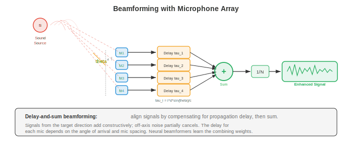
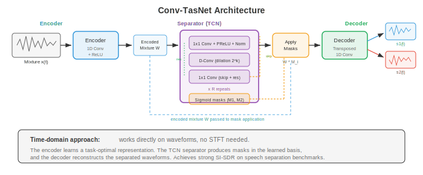

# Source Separation and Noise Cancellation

*Source separation and noise cancellation recover individual signals from mixed audio; the computational cocktail party problem. This file covers ICA, NMF, time-frequency masking, beamforming, deep learning separation networks (Conv-TasNet, SepFormer), speech enhancement, and adaptive noise cancellation.*

- Imagine standing at a crowded cocktail party. Dozens of people are talking simultaneously, music is playing, glasses are clinking, yet you can focus on one conversation and follow it clearly. This remarkable ability, the **cocktail party problem** (Cherry, 1953), is something the human auditory system solves effortlessly but machines find extraordinarily difficult. This file covers the algorithms that attempt it: separating mixed audio sources, cancelling unwanted noise, and enhancing speech in adverse conditions.

- The signal-processing foundations from file 01 (STFT, spectrograms, filterbanks) underpin every method here. The matrix decomposition techniques from chapter 02 (NMF, ICA, SVD) provide the classical toolkit. The deep learning architectures from chapter 06 (CNNs, RNNs, attention) and the probability theory from chapter 04/05 inform the modern approaches.


- **Problem formulation**: a mixture signal $x(t)$ is observed at one or more microphones. The mixture is a sum (in the simplest case) of $C$ source signals:

$$x(t) = \sum_{c=1}^{C} s_c(t) + n(t)$$

- where $s_c(t)$ is the $c$-th source signal and $n(t)$ is background noise. The goal is to recover the individual $s_c(t)$ from $x(t)$. In the single-microphone case this is severely underdetermined: one equation, $C$ unknowns. Additional assumptions (statistical independence, spectral structure, learned priors) are needed to make the problem tractable.

- In the frequency domain (via STFT from file 01), the mixture becomes:

$$X(t, f) = \sum_{c=1}^{C} S_c(t, f) + N(t, f)$$

- Many separation methods work in the time-frequency domain by estimating a **mask** $M_c(t, f) \in [0, 1]$ for each source, then recovering the source as $\hat{S}_c(t, f) = M_c(t, f) \cdot X(t, f)$. The **ideal binary mask (IBM)** sets $M_c(t, f) = 1$ if source $c$ dominates that time-frequency bin and 0 otherwise. The **ideal ratio mask (IRM)** is a soft version:

$$\text{IRM}_c(t, f) = \frac{|S_c(t, f)|^2}{\sum_{j=1}^{C} |S_j(t, f)|^2}$$

- **Independent Component Analysis (ICA)** is the classical approach when the number of microphones equals or exceeds the number of sources. ICA (chapter 02) finds a linear unmixing matrix $W$ such that $\hat{s} = Wx$, where the recovered sources $\hat{s}$ are maximally statistically independent. The key assumption is that source signals are non-Gaussian and independent, which is typically valid for speech and music.

- For the multi-microphone instantaneous mixing model $x = As$ (where $A$ is the mixing matrix), ICA recovers $W \approx A^{-1}$ by maximising the non-Gaussianity of the outputs (FastICA uses negentropy) or by minimising mutual information. ICA works well in controlled settings but fails when mixing involves convolution (room reverberation), when sources outnumber microphones, or when the independence assumption is violated.

- **Non-negative Matrix Factorisation (NMF)** decomposes the magnitude spectrogram $V \in \mathbb{R}_+^{F \times T}$ into a product of two non-negative matrices (chapter 02):

$$V \approx WH$$

- where $W \in \mathbb{R}_+^{F \times K}$ is a dictionary of $K$ spectral basis vectors and $H \in \mathbb{R}_+^{K \times T}$ contains the activation coefficients over time. The non-negativity constraint is physically motivated: magnitudes are non-negative, and sounds combine additively.

- For source separation, NMF learns separate dictionaries for each source: $W_{\text{speech}}$ captures the spectral patterns of speech (formant structures), while $W_{\text{noise}}$ captures noise patterns. The mixture is decomposed as $V \approx W_{\text{speech}} H_{\text{speech}} + W_{\text{noise}} H_{\text{noise}}$, and each source is recovered by masking. NMF is minimised using multiplicative updates with either the Frobenius norm or KL divergence as the cost function:

```math
\begin{aligned}
\text{Frobenius:} \quad D_F(V \| WH) &= \|V - WH\|_F^2 \\
\text{KL:} \quad D_{KL}(V \| WH) &= \sum_{f,t} \left[ V_{ft} \log \frac{V_{ft}}{(WH)_{ft}} - V_{ft} + (WH)_{ft} \right]
\end{aligned}
```

- **Beamforming** exploits spatial information from microphone arrays. When a source signal arrives at different microphones with different delays (due to the spatial arrangement), these delays can be used to enhance the signal from one direction while suppressing others.



- **Delay-and-sum beamforming** is the simplest approach. If the desired source is at angle $\theta$ relative to the array, the time delay at microphone $m$ is $\tau_m(\theta) = d_m \sin \theta / c$, where $d_m$ is the microphone position and $c$ is the speed of sound. The beamformer output aligns and sums the microphone signals:

$$y(t) = \frac{1}{M} \sum_{m=1}^{M} x_m(t - \tau_m(\theta))$$

- Signals from the target direction add coherently, while signals from other directions add incoherently, providing spatial filtering. The array geometry determines the spatial resolution: larger arrays give narrower beams.

- **Minimum Variance Distortionless Response (MVDR)** beamforming optimises the weights to minimise total output power while passing the target direction without distortion:

```math
\begin{aligned}
\min_{\mathbf{w}} \quad & \mathbf{w}^H \Phi_{nn} \mathbf{w} \\
\text{subject to} \quad & \mathbf{w}^H \mathbf{d}(\theta) = 1
\end{aligned}
```

- where $\Phi_{nn}$ is the noise spatial covariance matrix and $\mathbf{d}(\theta)$ is the steering vector for direction $\theta$. The closed-form solution is:

$$\mathbf{w}_{\text{MVDR}} = \frac{\Phi_{nn}^{-1} \mathbf{d}(\theta)}{\mathbf{d}(\theta)^H \Phi_{nn}^{-1} \mathbf{d}(\theta)}$$

- MVDR adapts to the noise environment by using the estimated noise covariance, providing better interference rejection than delay-and-sum. It is widely used in hearing aids, smart speakers, and teleconferencing systems.

- **Deep learning for source separation** has dramatically improved performance, especially in the single-microphone case where classical methods struggle. The general paradigm is: encode the mixture, estimate masks or source representations with a neural network, and decode to recover individual sources.

- **Deep clustering** (Hershey et al., 2016) embeds each time-frequency bin into a high-dimensional space where bins belonging to the same source are close together and bins from different sources are far apart. A bidirectional LSTM (chapter 06) maps each T-F bin $(t, f)$ to an embedding $v_{t,f} \in \mathbb{R}^D$. The training objective is:

$$\mathcal{L} = \|VV^T - YY^T\|_F^2$$

- where $V$ is the matrix of embeddings and $Y$ is the one-hot matrix of source assignments. The product $VV^T$ is an affinity matrix (how similar two bins' embeddings are), and $YY^T$ is the ideal affinity (1 if same source, 0 otherwise). At inference, K-means clustering on the embeddings produces binary masks.

- **Conv-TasNet** (Luo and Mesgarani, 2019) operates entirely in the time domain, bypassing the STFT. It has three components:



- **Encoder**: a 1D convolution maps short segments of the mixture waveform to a latent representation. For a mixture $x \in \mathbb{R}^T$, the encoder output is $w = \text{ReLU}(U \ast x) \in \mathbb{R}^{N \times L}$, where $U$ is a learnable basis (analogous to the STFT basis but learned from data), $N$ is the number of basis functions, and $L$ is the number of segments. The encoder kernel size and stride (typically 2ms and 1ms) determine the temporal resolution.

- **Separator**: a **Temporal Convolutional Network (TCN)** processes the encoded mixture and outputs $C$ masks. The TCN stacks dilated 1D depthwise separable convolutions (from chapter 08's efficient convolutions) in blocks with exponentially increasing dilation factors $1, 2, 4, \ldots, 2^{B-1}$, repeated $R$ times. This gives a very large receptive field while keeping computation efficient.

- **Decoder**: a transposed 1D convolution (with a learned basis $V$) converts each masked representation back to the time domain: $\hat{s}_c = V^T (M_c \odot w)$.

- Conv-TasNet significantly outperforms spectrogram-based methods because the learned encoder-decoder basis can capture information (particularly phase) that the STFT magnitude discards.

- **Dual-Path RNN (DPRNN)** (Luo et al., 2020) addresses the long sequence modelling problem in separation. Rather than processing the entire encoded sequence with a single RNN or TCN, DPRNN splits the sequence into overlapping chunks and applies RNNs along two paths: an **intra-chunk** path (modelling local patterns within each chunk) and an **inter-chunk** path (modelling global patterns across chunks). This reduces the RNN sequence length from $L$ to $\sqrt{L}$ in each dimension:

```math
\begin{aligned}
\text{Intra-chunk:} \quad & h_{k,n}^{\text{intra}} = \text{BiLSTM}_{\text{intra}}(z_{k,n}) \\
\text{Inter-chunk:} \quad & h_{k,n}^{\text{inter}} = \text{BiLSTM}_{\text{inter}}(h_{k,n}^{\text{intra}})
\end{aligned}
```

- where $k$ indexes the chunk and $n$ indexes the position within the chunk. The intra-chunk LSTM processes across $n$ for a fixed $k$; the inter-chunk LSTM processes across $k$ for a fixed $n$.

- **SepFormer** (Subakan et al., 2021) replaces the RNNs in the dual-path framework with transformers (chapter 07). The intra-chunk transformer captures local dependencies with self-attention, and the inter-chunk transformer captures global dependencies. Multi-head attention's ability to model long-range dependencies without the vanishing gradient problem (chapter 06) makes SepFormer particularly effective for long recordings. SepFormer achieves state-of-the-art results on the WSJ0-2mix benchmark.

- **Permutation Invariant Training (PIT)** solves a fundamental problem in supervised source separation: the label assignment ambiguity. If the network has two outputs (for two speakers), which output should correspond to which speaker? There is no natural ordering. PIT computes the loss for all possible assignments and takes the minimum:

$$\mathcal{L}_{\text{PIT}} = \min_{\pi \in \mathcal{P}} \sum_{c=1}^{C} \ell(\hat{s}_{\pi(c)}, s_c)$$

- where $\mathcal{P}$ is the set of all permutations of $\{1, \ldots, C\}$ and $\ell$ is the per-source loss (typically scale-invariant signal-to-distortion ratio, SI-SDR). For $C = 2$ sources there are only 2 permutations; for $C = 3$ there are 6. This is computed efficiently using the Hungarian algorithm for larger $C$.

- **Scale-Invariant Signal-to-Distortion Ratio (SI-SDR)** is the standard evaluation metric for source separation:

```math
\begin{aligned}
s_{\text{target}} &= \frac{\langle \hat{s}, s \rangle}{\|s\|^2} s \\
e_{\text{noise}} &= \hat{s} - s_{\text{target}} \\
\text{SI-SDR} &= 10 \log_{10} \frac{\|s_{\text{target}}\|^2}{\|e_{\text{noise}}\|^2}
\end{aligned}
```

- where $\hat{s}$ is the estimated source and $s$ is the ground truth. SI-SDR is invariant to the overall scale of the estimate, which is desirable because absolute volume is less important than the quality of the separation. Higher SI-SDR (in dB) is better. State-of-the-art systems achieve around 20-22 dB SI-SDR improvement on WSJ0-2mix.

- **Music source separation** separates a music recording into stems: vocals, drums, bass, and other instruments. This enables applications like karaoke (remove vocals), remixing (adjust instrument levels), and transcription (analyse one instrument at a time).

- **Open-Unmix** (Stoter et al., 2019) is a reference baseline that uses a 3-layer bidirectional LSTM to predict a soft mask for each source in the magnitude STFT domain. It processes each source independently with a dedicated model. Simple but effective, Open-Unmix established reproducible benchmarks on MUSDB18.

- **Demucs** (Defossez et al., 2019; updated as Hybrid Demucs, 2021) uses a U-Net architecture (chapter 08) that operates directly on the waveform. The encoder compresses the mixture through strided convolutions, the decoder expands it back through transposed convolutions with skip connections, and each source gets its own decoder head. **Hybrid Demucs** combines time-domain and frequency-domain processing: the encoder has parallel time-domain and STFT branches whose features are fused before the decoder. This captures both fine temporal details and spectral structure.

- Demucs achieves state-of-the-art separation quality on MUSDB18, with particularly strong vocal separation. Its U-Net architecture is reminiscent of the image segmentation architectures from chapter 08, treating the separation problem as a form of "audio segmentation".

- **Active noise cancellation (ANC)** reduces unwanted sound by generating an anti-noise signal that destructively interferes with the noise. Think of noise-cancelling headphones: a microphone picks up ambient noise, the ANC system generates an inverted version, and the combined signal (noise + anti-noise) ideally cancels to silence.

- The physics is simple: if the noise is $n(t)$, generating $-n(t)$ at the same point in space produces silence: $n(t) + (-n(t)) = 0$. The challenge is that the anti-noise must be precisely aligned in time, amplitude, and phase. Even small errors produce residual noise or artifacts.

- **Feedforward ANC** uses a reference microphone that picks up the noise before it reaches the listener. The system has time to process the noise and generate the anti-noise. The reference signal passes through an adaptive filter whose output is subtracted from the noise at the error microphone (near the listener). This works well for predictable, broadband noise (engine hum, fan noise).

- **Feedback ANC** uses only an error microphone at the listener's ear. The system estimates the noise from the residual signal (what the listener actually hears) and adjusts the anti-noise. Feedback ANC is simpler (no reference microphone needed) but has limited bandwidth and can become unstable.

- **Adaptive filtering** is the mathematical engine behind ANC. The filter coefficients must continuously adapt to the changing noise environment. The most common algorithm is the **Least Mean Squares (LMS)** filter.


- **LMS algorithm**: an FIR filter with coefficients $\mathbf{w} = [w_0, w_1, \ldots, w_{L-1}]^T$ processes the reference signal $\mathbf{x}(n) = [x(n), x(n-1), \ldots, x(n-L+1)]^T$. The output is $y(n) = \mathbf{w}^T \mathbf{x}(n)$, the error is $e(n) = d(n) - y(n)$ (where $d(n)$ is the desired/primary signal), and the weight update is:

$$\mathbf{w}(n+1) = \mathbf{w}(n) + \mu \, e(n) \, \mathbf{x}(n)$$

- where $\mu$ is the step size (learning rate). This is a stochastic gradient descent step on the mean squared error $E[e^2(n)]$, using the instantaneous gradient estimate $-2 e(n) \mathbf{x}(n)$ instead of the true gradient (chapter 03's gradient descent and chapter 06's SGD).

- The step size $\mu$ controls the trade-off between convergence speed and steady-state error. Too large and the filter oscillates or diverges; too small and adaptation is sluggish. The stability condition is $0 < \mu < 2 / (\lambda_{\max})$, where $\lambda_{\max}$ is the largest eigenvalue of the input autocorrelation matrix $R = E[\mathbf{x}\mathbf{x}^T]$.

- **Normalised LMS (NLMS)** normalises the step size by the input power, making convergence independent of the signal level:

$$\mathbf{w}(n+1) = \mathbf{w}(n) + \frac{\mu}{\|\mathbf{x}(n)\|^2 + \epsilon} \, e(n) \, \mathbf{x}(n)$$

- where $\epsilon$ is a small regularisation constant to prevent division by zero. NLMS converges more reliably than LMS because the effective step size adapts to the input power.

- **Recursive Least Squares (RLS)** is a faster-converging alternative that minimises the weighted least squares cost $\sum_{k=1}^{n} \lambda^{n-k} e^2(k)$, where $\lambda \in (0, 1]$ is a forgetting factor. RLS maintains an estimate of the inverse autocorrelation matrix and updates it recursively, achieving optimal convergence at the cost of $O(L^2)$ computation per sample (versus $O(L)$ for LMS).

- **Noise reduction and speech enhancement** aim to improve speech quality and intelligibility in noisy recordings. Unlike source separation (which separates distinct sources), speech enhancement specifically targets the speech-plus-noise case, recovering clean speech from a noisy observation.

- **Spectral subtraction** is the simplest approach. During noise-only frames (detected by VAD from file 03), estimate the noise spectrum $|\hat{N}(f)|^2$. Then subtract it from each frame:

$$|\hat{S}(f)|^2 = \max(|X(f)|^2 - \alpha |\hat{N}(f)|^2, \beta |X(f)|^2)$$

- where $\alpha$ is an over-subtraction factor (typically 1-4, aggressive subtraction removes more noise but introduces more artifacts) and $\beta$ is a spectral floor that prevents negative values and reduces "musical noise" artifacts (isolated tonal remnants that sound like random musical notes).

- **Wiener filtering** provides the minimum mean squared error estimate of the clean speech spectrum:

$$\hat{S}(t, f) = \frac{|S(t,f)|^2}{|S(t,f)|^2 + |N(t,f)|^2} \cdot X(t, f) = G(t, f) \cdot X(t, f)$$

- The Wiener gain $G(t, f) = \text{SNR}(t, f) / (1 + \text{SNR}(t, f))$ ranges from 0 (pure noise) to 1 (pure speech), acting as a soft mask. The challenge is estimating the speech and noise power spectra. The **a priori SNR** $\xi(t, f) = |S(t,f)|^2 / |N(t,f)|^2$ is estimated using the "decision-directed" approach: a smoothed combination of the current frame's estimate and the previous frame's Wiener-filtered output.

- **Neural speech enhancement** uses deep learning to estimate either a mask (like the Wiener gain) or the clean spectrogram directly. Architectures range from simple feedforward networks to U-Nets (chapter 08), CRNs (Convolutional Recurrent Networks), and transformers.

- **DCCRN** (Deep Complex Convolutional Recurrent Network) operates on the complex STFT (both magnitude and phase), using complex-valued convolutions that naturally handle the real and imaginary parts. This avoids the phase estimation problem that plagues magnitude-only approaches.

- **FullSubNet** uses a dual-path architecture with a full-band model (capturing global spectral patterns) and a sub-band model (capturing local harmonic details). The full-band model processes the entire spectrum, while the sub-band model processes narrow frequency bands centred on each frequency bin. Their outputs are combined for the final mask estimate.

- **DNS (Deep Noise Suppression) Challenge** by Microsoft benchmarks speech enhancement systems annually. Winners typically use large-scale training with diverse noise types, data augmentation (adding noise at various SNRs, reverberation, codec artifacts), and real-time-capable architectures.

- **Echo cancellation** removes acoustic echo in two-way communication. When you are on a phone call, the far-end speaker's voice plays through your loudspeaker, bounces around the room, and is picked up by your microphone, creating an echo that the far-end speaker hears. **Acoustic Echo Cancellation (AEC)** models the acoustic path from loudspeaker to microphone and subtracts the predicted echo.

- The acoustic path is modelled as an adaptive FIR filter (using LMS or NLMS) with the far-end signal as input. The filter models the room impulse response, which includes direct path, early reflections, and late reverberation. Room impulse responses can be hundreds of milliseconds long, requiring filters with thousands of taps.

- **Double-talk detection** is critical for AEC: when both the near-end and far-end speakers talk simultaneously, the adaptive filter must freeze (stop updating) to prevent it from cancelling the near-end speaker's voice. Double-talk detectors compare the energy of the error signal with the far-end signal energy; a sudden increase in error energy that is not explained by the far-end signal suggests near-end speech.

- The **normalised cross-correlation** between the far-end signal $x(n)$ and the microphone signal $d(n)$ provides a double-talk indicator:

$$\xi(n) = \frac{|\sum_{k=0}^{L-1} x(n-k) d(n-k)|}{\sqrt{\sum_{k} x^2(n-k)} \sqrt{\sum_{k} d^2(n-k)}}$$

- During single-talk (far-end only), $\xi$ is high because $d$ is mostly echo of $x$. During double-talk, $\xi$ drops because the near-end speech is uncorrelated with $x$.

- Modern AEC systems combine adaptive filtering with neural networks: the adaptive filter provides an initial echo estimate, and a neural network (similar to the speech enhancement models above) cleans up residual echo and handles non-linearities (loudspeaker distortion) that linear filters cannot capture.

- **Evaluation metrics for separation and enhancement**:
    - **SI-SDR** (defined above): standard for source separation.
    - **SDR** (Signal-to-Distortion Ratio): from BSS Eval, measures overall separation quality including artifacts and interference.
    - **PESQ** (Perceptual Evaluation of Speech Quality): ITU standard that predicts subjective quality scores. Range: -0.5 to 4.5.
    - **STOI** (Short-Time Objective Intelligibility): predicts speech intelligibility. Range: 0 to 1.
    - **DNSMOS**: Microsoft's deep noise suppression MOS predictor, a neural network trained to predict human MOS scores without requiring clean reference audio.

## Coding Tasks (use CoLab or notebook)

- **Task 1: Independent Component Analysis for source separation.** Implement FastICA to separate two mixed audio sources, demonstrating the classical cocktail party solution for the determined case (equal sources and microphones).

```python
import jax
import jax.numpy as jnp
import jax.random as jr
import matplotlib.pyplot as plt

# Generate two source signals
sr = 8000
duration = 1.0
t = jnp.linspace(0, duration, int(sr * duration))

# Source 1: sinusoidal (like a tone)
s1 = jnp.sin(2 * jnp.pi * 440 * t) + 0.3 * jnp.sin(2 * jnp.pi * 880 * t)

# Source 2: sawtooth-like (rich harmonics)
s2 = 2 * (t * 200 % 1) - 1  # sawtooth at 200 Hz

# Normalise sources
s1 = s1 / jnp.max(jnp.abs(s1))
s2 = s2 / jnp.max(jnp.abs(s2))
sources = jnp.stack([s1, s2])  # (2, T)

# Mixing matrix (unknown to the algorithm)
A = jnp.array([[0.8, 0.4],
               [0.3, 0.9]])
mixtures = A @ sources  # (2, T)

# FastICA implementation
def whiten(X):
    """Centre and whiten the data."""
    X_centered = X - jnp.mean(X, axis=1, keepdims=True)
    cov = (X_centered @ X_centered.T) / X_centered.shape[1]
    eigvals, eigvecs = jnp.linalg.eigh(cov)
    D_inv_sqrt = jnp.diag(1.0 / jnp.sqrt(eigvals + 1e-8))
    whitening = D_inv_sqrt @ eigvecs.T
    return whitening @ X_centered, whitening

def fastica(X, n_components=2, max_iter=200, tol=1e-6):
    """FastICA using tanh non-linearity (approximation to negentropy)."""
    X_white, whitening = whiten(X)
    n, T = X_white.shape

    key = jr.PRNGKey(42)
    W = jr.normal(key, (n_components, n))
    # Orthogonalise W
    U, _, Vt = jnp.linalg.svd(W, full_matrices=False)
    W = U @ Vt

    for iteration in range(max_iter):
        W_old = W.copy()

        # For each component
        for i in range(n_components):
            w = W[i]
            # w^T X_white: (T,)
            wx = w @ X_white  # (T,)

            # g(u) = tanh(u), g'(u) = 1 - tanh^2(u)
            g_wx = jnp.tanh(wx)
            g_prime_wx = 1 - g_wx ** 2

            # Newton update: w_new = E[X * g(w^T X)] - E[g'(w^T X)] * w
            w_new = jnp.mean(X_white * g_wx[None, :], axis=1) - \
                    jnp.mean(g_prime_wx) * w

            # Decorrelate from previous components (deflation)
            for j in range(i):
                w_new = w_new - jnp.dot(w_new, W[j]) * W[j]

            w_new = w_new / jnp.linalg.norm(w_new)
            W = W.at[i].set(w_new)

        # Check convergence
        convergence = jnp.min(jnp.abs(jnp.diag(W @ W_old.T)))
        if convergence > 1 - tol:
            print(f"FastICA converged in {iteration + 1} iterations")
            break

    # Unmixing matrix
    unmixing = W @ whitening
    recovered = unmixing @ X
    return recovered, unmixing

recovered, W_unmix = fastica(mixtures)

# Fix sign ambiguity (ICA can flip signs)
for i in range(2):
    if jnp.corrcoef(recovered[i], sources[i])[0, 1] < -0.5:
        recovered = recovered.at[i].set(-recovered[i])

# If sources are swapped, fix permutation
corr_00 = jnp.abs(jnp.corrcoef(recovered[0], sources[0])[0, 1])
corr_01 = jnp.abs(jnp.corrcoef(recovered[0], sources[1])[0, 1])
if corr_01 > corr_00:
    recovered = recovered[::-1]

# Normalise for display
recovered = recovered / jnp.max(jnp.abs(recovered), axis=1, keepdims=True)

fig, axes = plt.subplots(3, 2, figsize=(14, 9))

axes[0, 0].plot(t[:1000], s1[:1000], color='#3498db', linewidth=0.8)
axes[0, 0].set_title('Source 1 (Original)')
axes[0, 0].set_ylabel('Amplitude')

axes[0, 1].plot(t[:1000], s2[:1000], color='#e74c3c', linewidth=0.8)
axes[0, 1].set_title('Source 2 (Original)')

axes[1, 0].plot(t[:1000], mixtures[0, :1000], color='#9b59b6', linewidth=0.8)
axes[1, 0].set_title('Mixture 1 (Microphone 1)')
axes[1, 0].set_ylabel('Amplitude')

axes[1, 1].plot(t[:1000], mixtures[1, :1000], color='#9b59b6', linewidth=0.8)
axes[1, 1].set_title('Mixture 2 (Microphone 2)')

axes[2, 0].plot(t[:1000], recovered[0, :1000], color='#27ae60', linewidth=0.8)
axes[2, 0].set_title('Recovered Source 1 (FastICA)')
axes[2, 0].set_ylabel('Amplitude')
axes[2, 0].set_xlabel('Time (s)')

axes[2, 1].plot(t[:1000], recovered[1, :1000], color='#f39c12', linewidth=0.8)
axes[2, 1].set_title('Recovered Source 2 (FastICA)')
axes[2, 1].set_xlabel('Time (s)')

plt.tight_layout()
plt.show()

# Report correlation with originals
for i in range(2):
    corr = jnp.corrcoef(recovered[i], sources[i])[0, 1]
    print(f"Source {i+1} recovery correlation: {corr:.4f}")
```

- **Task 2: NMF-based source separation on spectrograms.** Use non-negative matrix factorisation (chapter 02) to separate a spectrogram into two components, demonstrating how NMF learns spectral dictionaries for each source.

```python
import jax
import jax.numpy as jnp
import jax.random as jr
import matplotlib.pyplot as plt

# Generate two signals with distinct spectral characteristics
sr = 8000
duration = 1.0
t = jnp.linspace(0, duration, int(sr * duration))

# Source 1: low-frequency harmonic (simulating bass)
src1 = (jnp.sin(2 * jnp.pi * 100 * t) +
        0.5 * jnp.sin(2 * jnp.pi * 200 * t) +
        0.3 * jnp.sin(2 * jnp.pi * 300 * t))

# Source 2: high-frequency harmonic (simulating a flute)
src2 = (jnp.sin(2 * jnp.pi * 800 * t) +
        0.4 * jnp.sin(2 * jnp.pi * 1600 * t))

# Time-varying amplitudes (sources active at different times)
env1 = jnp.where(t < 0.5, 1.0, 0.3)
env2 = jnp.where(t > 0.3, 1.0, 0.2)
src1 = src1 * env1
src2 = src2 * env2

mixture = src1 + src2

# Compute magnitude spectrogram (STFT)
n_fft = 512
hop = 128
window = jnp.hanning(n_fft)

def compute_stft(signal, n_fft, hop, window):
    n_frames = 1 + (len(signal) - n_fft) // hop
    frames = jnp.stack([
        signal[i * hop : i * hop + n_fft] * window
        for i in range(n_frames)
    ])
    return jnp.fft.rfft(frames, n=n_fft)

S_mix = compute_stft(mixture, n_fft, hop, window)
V = jnp.abs(S_mix).T  # (F, T) - frequency x time
phase = jnp.angle(S_mix).T

F, T = V.shape
print(f"Spectrogram shape: {F} freq bins x {T} time frames")

# NMF: V ≈ WH using multiplicative update rules
def nmf(V, K, n_iter=200, key=jr.PRNGKey(0)):
    """Non-negative Matrix Factorisation with Frobenius norm."""
    k1, k2 = jr.split(key)
    W = jnp.abs(jr.normal(k1, (F, K))) * 0.1 + 0.01  # (F, K)
    H = jnp.abs(jr.normal(k2, (K, T))) * 0.1 + 0.01  # (K, T)

    costs = []
    for i in range(n_iter):
        # Multiplicative update for H
        WtV = W.T @ V
        WtWH = W.T @ W @ H + 1e-8
        H = H * (WtV / WtWH)

        # Multiplicative update for W
        VHt = V @ H.T
        WHHt = W @ H @ H.T + 1e-8
        W = W * (VHt / WHHt)

        cost = jnp.sum((V - W @ H) ** 2)
        costs.append(float(cost))

    return W, H, costs

# Run NMF with K=2 components
K = 2
W, H, costs = nmf(V, K, n_iter=300)

# Reconstruct each source using soft masks
V_hat = W @ H
mask1 = (W[:, 0:1] @ H[0:1, :]) / (V_hat + 1e-8)
mask2 = (W[:, 1:2] @ H[1:2, :]) / (V_hat + 1e-8)

V_src1 = mask1 * V
V_src2 = mask2 * V

# Visualisation
fig, axes = plt.subplots(3, 2, figsize=(14, 10))

# Mixture spectrogram
axes[0, 0].imshow(jnp.log1p(V), aspect='auto', origin='lower', cmap='magma')
axes[0, 0].set_title('Mixture Spectrogram |X|')
axes[0, 0].set_ylabel('Frequency bin')

# NMF convergence
axes[0, 1].plot(costs, color='#3498db', linewidth=1.5)
axes[0, 1].set_title('NMF Convergence')
axes[0, 1].set_xlabel('Iteration')
axes[0, 1].set_ylabel('Frobenius cost')
axes[0, 1].set_yscale('log')

# Spectral basis vectors W
freq_hz = jnp.arange(F) * sr / n_fft
axes[1, 0].plot(freq_hz, W[:, 0], color='#27ae60', linewidth=1.5,
                label='Basis 1 (low freq)')
axes[1, 0].plot(freq_hz, W[:, 1], color='#e74c3c', linewidth=1.5,
                label='Basis 2 (high freq)')
axes[1, 0].set_title('Learned Spectral Bases W')
axes[1, 0].set_xlabel('Frequency (Hz)')
axes[1, 0].set_ylabel('Magnitude')
axes[1, 0].legend()

# Temporal activations H
time_s = jnp.arange(T) * hop / sr
axes[1, 1].plot(time_s, H[0], color='#27ae60', linewidth=1.5,
                label='Activation 1')
axes[1, 1].plot(time_s, H[1], color='#e74c3c', linewidth=1.5,
                label='Activation 2')
axes[1, 1].set_title('Temporal Activations H')
axes[1, 1].set_xlabel('Time (s)')
axes[1, 1].set_ylabel('Activation')
axes[1, 1].legend()

# Separated spectrograms
axes[2, 0].imshow(jnp.log1p(V_src1), aspect='auto', origin='lower', cmap='magma')
axes[2, 0].set_title('Separated Source 1 (low-frequency)')
axes[2, 0].set_ylabel('Frequency bin')
axes[2, 0].set_xlabel('Time frame')

axes[2, 1].imshow(jnp.log1p(V_src2), aspect='auto', origin='lower', cmap='magma')
axes[2, 1].set_title('Separated Source 2 (high-frequency)')
axes[2, 1].set_xlabel('Time frame')

plt.tight_layout()
plt.show()

print(f"Reconstruction error: {jnp.sum((V - W @ H)**2):.2f}")
print(f"NMF learns spectral bases that capture each source's frequency profile.")
```

- **Task 3: LMS adaptive filter for noise cancellation.** Implement the LMS and NLMS algorithms for echo/noise cancellation, showing convergence behaviour and the effect of step size.

```python
import jax
import jax.numpy as jnp
import jax.random as jr
import matplotlib.pyplot as plt

# Simulate an echo cancellation scenario
# Far-end signal -> room impulse response -> echo at microphone
# Near-end speech is the desired signal we want to preserve

sr = 8000
duration = 2.0
n_samples = int(sr * duration)
key = jr.PRNGKey(42)
keys = jr.split(key, 5)

# Far-end signal (reference): random speech-like signal
far_end = jr.normal(keys[0], (n_samples,)) * 0.5

# Room impulse response (unknown to the algorithm)
rir_length = 64
rir = jnp.zeros(rir_length)
rir = rir.at[0].set(0.8)   # direct path
rir = rir.at[5].set(0.3)   # early reflection
rir = rir.at[12].set(-0.2) # reflection
rir = rir.at[25].set(0.1)  # late reflection
rir = rir.at[40].set(-0.05)

# Echo: convolution of far-end with RIR
echo = jnp.convolve(far_end, rir)[:n_samples]

# Near-end speech (active in a portion of the signal)
near_end = jnp.zeros(n_samples)
start, end = n_samples // 3, 2 * n_samples // 3
near_speech = 0.3 * jnp.sin(
    2 * jnp.pi * 300 * jnp.linspace(0, (end - start) / sr, end - start)
)
near_end = near_end.at[start:end].set(near_speech)

# Microphone signal: echo + near-end + noise
noise = jr.normal(keys[1], (n_samples,)) * 0.01
mic_signal = echo + near_end + noise

# LMS adaptive filter
def lms_filter(reference, desired, filter_length, mu):
    """Standard LMS adaptive filter."""
    n = len(reference)
    w = jnp.zeros(filter_length)
    output = jnp.zeros(n)
    error = jnp.zeros(n)
    w_history = []

    for i in range(filter_length, n):
        x = reference[i:i-filter_length:-1]  # reversed segment
        if len(x) < filter_length:
            x = jnp.pad(x, (0, filter_length - len(x)))
        x = reference[max(0, i-filter_length+1):i+1][::-1]

        y = jnp.dot(w, x)
        e = desired[i] - y
        w = w + mu * e * x

        output = output.at[i].set(y)
        error = error.at[i].set(e)

        if i % 500 == 0:
            w_history.append(w.copy())

    return output, error, w_history

# NLMS adaptive filter
def nlms_filter(reference, desired, filter_length, mu, eps=1e-6):
    """Normalised LMS adaptive filter."""
    n = len(reference)
    w = jnp.zeros(filter_length)
    output = jnp.zeros(n)
    error = jnp.zeros(n)

    for i in range(filter_length, n):
        x = reference[max(0, i-filter_length+1):i+1][::-1]

        y = jnp.dot(w, x)
        e = desired[i] - y
        norm_factor = jnp.dot(x, x) + eps
        w = w + (mu / norm_factor) * e * x

        output = output.at[i].set(y)
        error = error.at[i].set(e)

    return output, error

# Run LMS with different step sizes
filter_len = 64
mu_values = [0.001, 0.01, 0.05]
colors_mu = ['#3498db', '#e74c3c', '#27ae60']

fig, axes = plt.subplots(2, 2, figsize=(14, 10))

# Original signals
t = jnp.arange(n_samples) / sr
axes[0, 0].plot(t, mic_signal, color='#9b59b6', linewidth=0.5, alpha=0.7,
                label='Mic (echo + near-end)')
axes[0, 0].plot(t, echo, color='#e74c3c', linewidth=0.5, alpha=0.7,
                label='Echo (to cancel)')
axes[0, 0].plot(t, near_end, color='#27ae60', linewidth=0.8,
                label='Near-end speech (to preserve)')
axes[0, 0].set_title('Signal Components')
axes[0, 0].set_xlabel('Time (s)')
axes[0, 0].set_ylabel('Amplitude')
axes[0, 0].legend(fontsize=8)

# LMS convergence for different step sizes
for mu, color in zip(mu_values, colors_mu):
    _, err, _ = lms_filter(far_end, mic_signal, filter_len, mu)
    # Smoothed squared error
    sq_err = err ** 2
    window_size = 200
    smoothed = jnp.convolve(sq_err, jnp.ones(window_size)/window_size,
                             mode='valid')
    axes[0, 1].plot(smoothed, color=color, linewidth=1.2,
                    label=f'mu={mu}')

axes[0, 1].set_title('LMS Convergence (smoothed MSE)')
axes[0, 1].set_xlabel('Sample')
axes[0, 1].set_ylabel('Squared Error')
axes[0, 1].set_yscale('log')
axes[0, 1].legend()

# Best LMS result
_, err_lms, w_hist = lms_filter(far_end, mic_signal, filter_len, 0.01)
axes[1, 0].plot(t, mic_signal, color='#9b59b6', linewidth=0.5, alpha=0.4,
                label='Before cancellation')
axes[1, 0].plot(t, err_lms, color='#3498db', linewidth=0.5, alpha=0.8,
                label='After LMS cancellation')
axes[1, 0].plot(t, near_end, color='#27ae60', linewidth=0.8, alpha=0.5,
                label='True near-end')
axes[1, 0].set_title('LMS Echo Cancellation Result (mu=0.01)')
axes[1, 0].set_xlabel('Time (s)')
axes[1, 0].set_ylabel('Amplitude')
axes[1, 0].legend(fontsize=8)

# NLMS result
_, err_nlms = nlms_filter(far_end, mic_signal, filter_len, 0.5)
axes[1, 1].plot(t, mic_signal, color='#9b59b6', linewidth=0.5, alpha=0.4,
                label='Before cancellation')
axes[1, 1].plot(t, err_nlms, color='#f39c12', linewidth=0.5, alpha=0.8,
                label='After NLMS cancellation')
axes[1, 1].plot(t, near_end, color='#27ae60', linewidth=0.8, alpha=0.5,
                label='True near-end')
axes[1, 1].set_title('NLMS Echo Cancellation Result (mu=0.5)')
axes[1, 1].set_xlabel('Time (s)')
axes[1, 1].set_ylabel('Amplitude')
axes[1, 1].legend(fontsize=8)

plt.tight_layout()
plt.show()

# Measure echo reduction
echo_power = jnp.mean(echo ** 2)
lms_residual = jnp.mean(err_lms[n_samples//2:] ** 2)  # after convergence
nlms_residual = jnp.mean(err_nlms[n_samples//2:] ** 2)
print(f"Echo power: {10*jnp.log10(echo_power):.1f} dB")
print(f"LMS residual: {10*jnp.log10(lms_residual):.1f} dB "
      f"(ERLE: {10*jnp.log10(echo_power/lms_residual):.1f} dB)")
print(f"NLMS residual: {10*jnp.log10(nlms_residual):.1f} dB "
      f"(ERLE: {10*jnp.log10(echo_power/nlms_residual):.1f} dB)")
```

- **Task 4: Time-frequency masking for speech enhancement.** Implement a simple spectral masking approach (ideal ratio mask) and compare it with spectral subtraction, visualising the separation quality on a synthetic noisy speech signal.

```python
import jax
import jax.numpy as jnp
import jax.random as jr
import matplotlib.pyplot as plt

# Create synthetic "speech" and "noise" signals
sr = 8000
duration = 2.0
t = jnp.linspace(0, duration, int(sr * duration))

# Speech: harmonic series with time-varying amplitude (simulating speech)
speech = jnp.zeros_like(t)
for f0 in [150, 300, 450, 600, 900]:
    amp_env = 0.5 + 0.5 * jnp.sin(2 * jnp.pi * 2.0 * t)  # 2 Hz modulation
    speech = speech + (0.5 / (f0/150)) * amp_env * jnp.sin(2 * jnp.pi * f0 * t)
speech = speech / jnp.max(jnp.abs(speech))

# Noise: band-limited noise
key = jr.PRNGKey(42)
noise_raw = jr.normal(key, t.shape) * 0.4

# Mix at a given SNR
snr_db = 5.0
speech_power = jnp.mean(speech ** 2)
noise_power = jnp.mean(noise_raw ** 2)
noise_scale = jnp.sqrt(speech_power / (noise_power * 10 ** (snr_db / 10)))
noise = noise_raw * noise_scale
mixture = speech + noise

# STFT
n_fft = 512
hop = 128
window = jnp.hanning(n_fft)

def stft(signal, n_fft, hop, window):
    n_frames = 1 + (len(signal) - n_fft) // hop
    frames = jnp.stack([
        signal[i * hop : i * hop + n_fft] * window
        for i in range(n_frames)
    ])
    return jnp.fft.rfft(frames, n=n_fft)

def istft(S, hop, window, length):
    n_fft = (S.shape[1] - 1) * 2
    n_frames = S.shape[0]
    frames = jnp.fft.irfft(S, n=n_fft) * window[None, :]
    output = jnp.zeros(length)
    window_sum = jnp.zeros(length)
    for i in range(n_frames):
        start = i * hop
        end = start + n_fft
        if end <= length:
            output = output.at[start:end].add(frames[i])
            window_sum = window_sum.at[start:end].add(window ** 2)
    window_sum = jnp.maximum(window_sum, 1e-8)
    return output / window_sum

S_speech = stft(speech, n_fft, hop, window)
S_noise = stft(noise, n_fft, hop, window)
S_mix = stft(mixture, n_fft, hop, window)

mag_speech = jnp.abs(S_speech)
mag_noise = jnp.abs(S_noise)
mag_mix = jnp.abs(S_mix)
phase_mix = jnp.angle(S_mix)

# Method 1: Ideal Ratio Mask (oracle - upper bound)
irm = mag_speech ** 2 / (mag_speech ** 2 + mag_noise ** 2 + 1e-8)
S_irm = (irm * mag_mix) * jnp.exp(1j * phase_mix)
enhanced_irm = istft(S_irm, hop, window, len(mixture))

# Method 2: Spectral subtraction
# Estimate noise from first 0.2s (assumed silence)
noise_frames = int(0.2 * sr / hop)
noise_est = jnp.mean(mag_mix[:noise_frames] ** 2, axis=0, keepdims=True)
alpha = 2.0  # over-subtraction factor
beta = 0.02  # spectral floor
mag_sub = jnp.maximum(mag_mix ** 2 - alpha * noise_est, beta * mag_mix ** 2)
mag_sub = jnp.sqrt(mag_sub)
S_sub = mag_sub * jnp.exp(1j * phase_mix)
enhanced_sub = istft(S_sub, hop, window, len(mixture))

# Method 3: Wiener filter
snr_est = mag_mix ** 2 / (noise_est + 1e-8)
wiener_gain = snr_est / (1 + snr_est)
S_wiener = (wiener_gain * mag_mix) * jnp.exp(1j * phase_mix)
enhanced_wiener = istft(S_wiener, hop, window, len(mixture))

# Compute SI-SDR for each method
def si_sdr(estimate, reference):
    """Scale-invariant signal-to-distortion ratio."""
    ref = reference[:len(estimate)]
    est = estimate[:len(reference)]
    s_target = (jnp.dot(est, ref) / (jnp.dot(ref, ref) + 1e-8)) * ref
    e_noise = est - s_target
    return 10 * jnp.log10(jnp.dot(s_target, s_target) /
                           (jnp.dot(e_noise, e_noise) + 1e-8))

si_sdr_mix = si_sdr(mixture, speech)
si_sdr_irm_val = si_sdr(enhanced_irm, speech)
si_sdr_sub_val = si_sdr(enhanced_sub, speech)
si_sdr_wiener_val = si_sdr(enhanced_wiener, speech)

# Visualisation
fig, axes = plt.subplots(3, 2, figsize=(14, 12))

# Spectrograms
axes[0, 0].imshow(jnp.log1p(mag_speech.T), aspect='auto', origin='lower',
                   cmap='magma')
axes[0, 0].set_title('Clean Speech Spectrogram')
axes[0, 0].set_ylabel('Frequency bin')

axes[0, 1].imshow(jnp.log1p(mag_mix.T), aspect='auto', origin='lower',
                   cmap='magma')
axes[0, 1].set_title(f'Noisy Mixture ({snr_db:.0f} dB SNR)')

# Masks
axes[1, 0].imshow(irm.T, aspect='auto', origin='lower', cmap='RdYlGn')
axes[1, 0].set_title('Ideal Ratio Mask (Oracle)')
axes[1, 0].set_ylabel('Frequency bin')

axes[1, 1].imshow(wiener_gain.T, aspect='auto', origin='lower', cmap='RdYlGn',
                   vmin=0, vmax=1)
axes[1, 1].set_title('Estimated Wiener Gain')

# Enhanced waveforms comparison
n_show = 3000
axes[2, 0].plot(t[:n_show], speech[:n_show], color='#27ae60', linewidth=0.8,
                alpha=0.5, label='Clean')
axes[2, 0].plot(t[:n_show], mixture[:n_show], color='#e74c3c', linewidth=0.5,
                alpha=0.4, label='Noisy')
axes[2, 0].plot(t[:n_show], enhanced_irm[:n_show], color='#3498db',
                linewidth=0.8, label='IRM enhanced')
axes[2, 0].set_title('Waveform Comparison (IRM)')
axes[2, 0].set_xlabel('Time (s)')
axes[2, 0].set_ylabel('Amplitude')
axes[2, 0].legend(fontsize=8)

# SI-SDR bar chart
methods = ['Mixture', 'Spectral\nSubtraction', 'Wiener\nFilter', 'Ideal Ratio\nMask']
sdr_values = [float(si_sdr_mix), float(si_sdr_sub_val),
              float(si_sdr_wiener_val), float(si_sdr_irm_val)]
bar_colors = ['#e74c3c', '#f39c12', '#9b59b6', '#27ae60']
bars = axes[2, 1].bar(methods, sdr_values, color=bar_colors, alpha=0.8)
axes[2, 1].set_ylabel('SI-SDR (dB)')
axes[2, 1].set_title('Enhancement Quality Comparison')
for bar, val in zip(bars, sdr_values):
    axes[2, 1].text(bar.get_x() + bar.get_width()/2., bar.get_height() + 0.3,
                    f'{val:.1f}', ha='center', fontsize=10)
axes[2, 1].axhline(0, color='gray', linestyle='--', linewidth=0.8)

plt.tight_layout()
plt.show()

print(f"SI-SDR (noisy mixture):        {si_sdr_mix:.2f} dB")
print(f"SI-SDR (spectral subtraction): {si_sdr_sub_val:.2f} dB")
print(f"SI-SDR (Wiener filter):        {si_sdr_wiener_val:.2f} dB")
print(f"SI-SDR (ideal ratio mask):     {si_sdr_irm_val:.2f} dB (oracle upper bound)")
```
