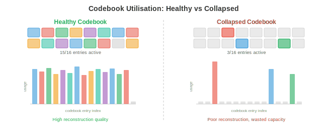
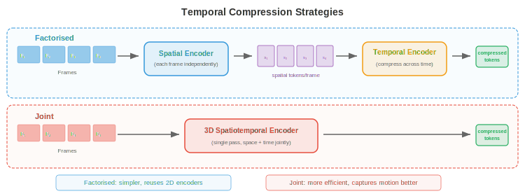
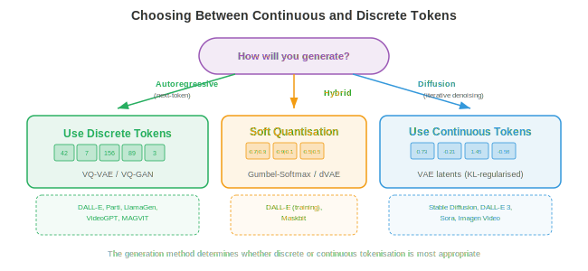

# Image and Video Tokenisation

*Image and video tokenisation converts continuous visual data into discrete token sequences that transformers can process like text. This file covers VQ-VAE, VQ-GAN, codebook learning, DALL-E's dVAE, video tokenisation, and lookup-free quantisation*

## Why Tokenise Images

- Think of language as a finite alphabet: English has roughly 26 letters, and modern language models carve text into 30,000-100,000 subword tokens. Every sentence becomes a sequence of discrete symbols that a transformer can predict one by one. Images, on the other hand, live in a continuous, high-dimensional space: a single 256x256 RGB image is a point in $\mathbb{R}^{256 \times 256 \times 3} \approx \mathbb{R}^{196{,}608}$. If you want a language model to "speak" images with the same machinery it uses to speak English, you need to convert those continuous pixel arrays into a manageable sequence of discrete tokens drawn from a finite vocabulary. That conversion is **image tokenisation**.

- Imagine you are a mosaic artist. You do not have infinite shades of tile; you have a fixed palette of, say, 8192 distinct tile colours. To reproduce a photograph as a mosaic, you must (1) decide which region of the photo each tile represents, (2) pick the closest tile colour for each region, and (3) accept that some detail is lost but the overall picture is recognisable. Image tokenisation does exactly this: an encoder compresses spatial patches into latent vectors, a codebook maps each vector to its nearest entry, and the result is a grid of integer indices, one per patch, that a discrete model can process.

- The benefits of tokenisation are threefold. First, it compresses the image dramatically: a 256x256 image might become a 16x16 grid of tokens, reducing the sequence length from 65,536 pixels to 256 tokens, which is tractable for attention-based models whose cost scales quadratically with sequence length. Second, it unifies the representation: text tokens and image tokens live in the same discrete vocabulary, enabling a single autoregressive transformer to generate interleaved text and images. Third, it imposes a useful bottleneck that forces the model to learn semantically meaningful codes rather than memorising pixel noise.


- Recall from Chapter 8 how convolutional networks extract hierarchical feature maps from images, and from Chapter 7 how text tokenisers convert strings into integer sequences. Image tokenisation sits at the intersection: it uses a CNN or vision transformer encoder (Chapter 8) to produce spatial features, then borrows the idea of a discrete vocabulary (Chapter 7) to convert those features into token indices.

## VQ-VAE: Vector Quantisation

- As we saw in Chapter 6, a standard **variational autoencoder** (VAE) encodes an input into a continuous latent distribution and decodes samples from that distribution back into reconstructions. The latent space is continuous, which makes it awkward to feed into discrete sequence models. The **Vector Quantised Variational Autoencoder** (VQ-VAE), introduced by van den Oord et al. (2017), replaces the continuous latent with a discrete one by introducing a learnable codebook of embedding vectors and snapping each encoder output to its nearest codebook entry.

- Picture a library with exactly $K$ labelled shelves. When a new book (encoder output) arrives, the librarian places it on the shelf whose existing books (codebook vectors) it most closely resembles, and records the shelf number. Later, to retrieve the book, you only need the shelf number: the codebook entry on that shelf is a good enough stand-in. This is vector quantisation.

- Formally, the VQ-VAE has three components:

- An **encoder** $E$ that maps an input image $\mathbf{x} \in \mathbb{R}^{H \times W \times 3}$ to a spatial grid of continuous latent vectors $\mathbf{z}_e = E(\mathbf{x}) \in \mathbb{R}^{h \times w \times d}$, where $h \times w$ is the downsampled spatial resolution and $d$ is the embedding dimension.

- A **codebook** $\mathcal{C} = \{\mathbf{e}_1, \mathbf{e}_2, \ldots, \mathbf{e}_K\} \subset \mathbb{R}^d$ containing $K$ learnable embedding vectors. Typical codebook sizes range from 512 to 16,384 entries.

- A **decoder** $D$ that reconstructs the image from the quantised latents.

- The **quantisation step** replaces each encoder output $\mathbf{z}_e(\mathbf{x})$ at spatial position $(i, j)$ with its nearest codebook entry:

$$\mathbf{z}_q(i,j) = \mathbf{e}_{k^\ast} \quad \text{where} \quad k^\ast = \arg\min_k \|\mathbf{z}_e(i,j) - \mathbf{e}_k\|_2$$

- This is a nearest-neighbour lookup in embedding space, exactly the same operation as k-means assignment (Chapter 6). The index $k^\ast$ is the discrete token for spatial position $(i,j)$, and the full image is represented as an $h \times w$ grid of integers from $\{1, \ldots, K\}$.


- The challenge is that $\arg\min$ is not differentiable: you cannot backpropagate through a discrete selection. VQ-VAE solves this with the **straight-through estimator**: during the forward pass, the decoder receives $\mathbf{z}_q$ (the quantised vector); during the backward pass, the gradient of the reconstruction loss with respect to $\mathbf{z}_q$ is copied directly to $\mathbf{z}_e$, as if the quantisation step were the identity function. This is written compactly as:

$$\mathbf{z}_q = \mathbf{z}_e + \text{sg}(\mathbf{z}_q - \mathbf{z}_e)$$

- where $\text{sg}(\cdot)$ is the stop-gradient operator. In the forward pass this evaluates to $\mathbf{z}_q$; in the backward pass, the gradient flows through only the $\mathbf{z}_e$ term.

- The full VQ-VAE loss has three terms:

$$\mathcal{L} = \underbrace{\|\mathbf{x} - D(\mathbf{z}_q)\|_2^2}_{\text{reconstruction}} + \underbrace{\|\text{sg}(\mathbf{z}_e) - \mathbf{e}\|_2^2}_{\text{codebook (VQ)}} + \underbrace{\beta \|\mathbf{z}_e - \text{sg}(\mathbf{e})\|_2^2}_{\text{commitment}}$$

- The **reconstruction loss** trains the encoder and decoder to faithfully reproduce the input. The **codebook loss** (also called the VQ loss) pulls the codebook vectors toward the encoder outputs; note that $\text{sg}(\mathbf{z}_e)$ means the encoder does not receive gradients from this term, so it only updates the codebook. The **commitment loss** does the reverse: it encourages the encoder outputs to stay close to the codebook vectors, preventing the encoder from "running away" from the codebook. The hyperparameter $\beta$ (typically 0.25) controls the balance between the codebook and commitment terms.

- In practice, the codebook is often updated with an **exponential moving average** (EMA) rather than gradient descent, which is more stable. Let $\mathbf{n}_k$ be the count of encoder outputs assigned to codebook entry $k$ and $\mathbf{s}_k$ be their sum. The EMA update is:

$$\mathbf{n}_k \leftarrow \gamma \mathbf{n}_k + (1 - \gamma) |\{(i,j) : k^\ast_{ij} = k\}|$$

$$\mathbf{s}_k \leftarrow \gamma \mathbf{s}_k + (1 - \gamma) \sum_{(i,j) : k^\ast_{ij} = k} \mathbf{z}_e(i,j)$$

$$\mathbf{e}_k \leftarrow \frac{\mathbf{s}_k}{\mathbf{n}_k}$$

- where $\gamma$ is the decay rate (typically 0.99). This is equivalent to running an online k-means algorithm on the encoder outputs.

### Codebook Collapse

- A notorious failure mode of VQ-VAE is **codebook collapse** (also called index collapse): the model learns to use only a small fraction of the $K$ codebook entries, leaving most entries "dead." Imagine a library where 90% of the shelves are empty because the librarian always routes books to the same few popular shelves. This wastes representational capacity.

- Codebook collapse occurs because the encoder, codebook, and decoder co-adapt during training. If an entry is not selected for several batches, it drifts away from the encoder manifold, making it even less likely to be selected, creating a positive feedback loop.

- Several techniques mitigate codebook collapse:
    - **Codebook reset**: periodically reinitialise dead entries by copying randomly sampled encoder outputs. This gives dead entries a fresh start near the active region of the latent space.
    - **EMA updates with Laplace smoothing**: add a small constant to $\mathbf{n}_k$ to prevent any entry from having zero count, ensuring all entries receive gradient signal.
    - **Commitment loss tuning**: increasing $\beta$ forces encoder outputs to cluster more tightly around codebook entries, distributing assignments more evenly.
    - **Factorised codes**: decompose the codebook lookup into a product of smaller lookups (e.g., two codebooks of size $\sqrt{K}$ each), which improves utilisation by reducing the effective codebook size for each lookup.
    - **Entropy regularisation**: add a penalty that encourages a uniform distribution over codebook usage, maximising the entropy $H = -\sum_k p_k \log p_k$ where $p_k$ is the empirical assignment probability.



## VQ-GAN: Adversarial Training for Higher Fidelity

- VQ-VAE produces decent reconstructions, but the pixel-level $\ell_2$ loss tends to generate blurry outputs because it penalises every pixel deviation equally, averaging over plausible details rather than choosing crisp ones. Imagine asking someone to draw a face that minimises the average difference from all possible faces — they would draw a blurry average face, not a sharp individual one.

- **VQ-GAN** (Esser et al., 2021) addresses this by combining the VQ-VAE framework with a **discriminator** from generative adversarial networks (Chapter 6). The discriminator is a patch-based convolutional network that judges whether a local image patch is real (from the training data) or fake (from the decoder). This adversarial loss encourages the decoder to produce perceptually sharp, realistic textures instead of pixel-wise averages.

- The VQ-GAN objective adds two terms to the VQ-VAE loss:

$$\mathcal{L}_\text{VQ-GAN} = \mathcal{L}_\text{VQ-VAE} + \lambda_\text{adv} \mathcal{L}_\text{adv} + \lambda_\text{perc} \mathcal{L}_\text{perc}$$

- The **adversarial loss** $\mathcal{L}_\text{adv}$ is the standard GAN objective applied to the decoder output. The discriminator $\mathcal{D}$ tries to distinguish real patches from decoded patches, and the decoder (generator) tries to fool it. The non-saturating formulation is:

$$\mathcal{L}_\text{adv} = -\mathbb{E}[\log \mathcal{D}(D(\mathbf{z}_q))]$$

- The **perceptual loss** $\mathcal{L}_\text{perc}$ compares feature activations from a pretrained network (typically VGG or LPIPS) between the original and reconstructed images:

$$\mathcal{L}_\text{perc} = \sum_l \|\phi_l(\mathbf{x}) - \phi_l(D(\mathbf{z}_q))\|_2^2$$

- where $\phi_l$ denotes the feature map at layer $l$ of the pretrained network. This loss captures high-level structural similarity rather than pixel-level accuracy.

- The weight $\lambda_\text{adv}$ is adaptively set so that the adversarial gradient and reconstruction gradient are balanced, preventing the adversarial loss from dominating early in training when the reconstructions are poor.


- The result is a tokeniser that produces dramatically sharper reconstructions than VQ-VAE at the same codebook size. VQ-GAN is the backbone tokeniser behind many major image generation systems, including the original DALL-E, Parti, and numerous text-to-image models. It turns a 256x256 image into a 16x16 or 32x32 grid of discrete tokens from a codebook of size 1024-16384, achieving compression ratios of 16x to 64x in each spatial dimension.

## Residual Quantisation and Multi-Scale Codebooks

- A single codebook imposes a hard ceiling on reconstruction quality: each spatial position is represented by exactly one codebook vector, and any detail finer than the codebook can express is lost. Think of describing a colour with a single word from a fixed palette: "teal" is close but not exact. If you could add a refinement — "teal, but slightly more blue and a touch brighter" — you would get much closer.

- **Residual quantisation** (RQ) applies this idea iteratively. After the first quantisation step produces $\mathbf{z}_q^{(1)}$, compute the residual $\mathbf{r}^{(1)} = \mathbf{z}_e - \mathbf{z}_q^{(1)}$, then quantise the residual against a second codebook to get $\mathbf{z}_q^{(2)}$, and so on for $T$ levels:

$$\mathbf{r}^{(0)} = \mathbf{z}_e$$

$$\mathbf{z}_q^{(t)} = \text{Quantise}(\mathbf{r}^{(t-1)}, \mathcal{C}^{(t)})$$

$$\mathbf{r}^{(t)} = \mathbf{r}^{(t-1)} - \mathbf{z}_q^{(t)}$$

- The final quantised representation is $\hat{\mathbf{z}} = \sum_{t=1}^{T} \mathbf{z}_q^{(t)}$. With $T$ levels each using a codebook of size $K$, the effective vocabulary size is $K^T$, but you only need to store $T \times K$ vectors rather than $K^T$. For example, 8 levels with $K = 1024$ give an effective $1024^8 \approx 10^{24}$ entries while storing only 8192 vectors.

- Each successive level captures finer details: the first codebook captures the coarse structure, the second captures medium-frequency corrections, and so on. This is analogous to successive approximation in JPEG or progressive rendering in web images, where a rough version appears first and detail fills in incrementally.


- **Multi-scale codebooks** extend this idea by operating at different spatial resolutions. Instead of quantising the same spatial grid repeatedly, you quantise at multiple scales: a coarse grid captures global structure, finer grids capture local detail. This is related to the feature pyramid idea from Chapter 8's object detection section, where features at different scales capture different levels of detail.

- **Product quantisation** is a related technique where the $d$-dimensional latent vector is split into $M$ sub-vectors of dimension $d/M$, and each sub-vector is quantised independently with its own codebook. This gives an effective vocabulary of $K^M$ while storing only $M \times K$ vectors. Product quantisation is widely used in approximate nearest-neighbour search (Chapter 13) and has been adapted for image tokenisation.

- **Finite scalar quantisation** (FSQ), introduced by Mentzer et al. (2023), takes a different approach entirely: instead of learning a codebook, it simply rounds each dimension of the latent vector to one of a fixed set of integer levels (e.g., $\{-2, -1, 0, 1, 2\}$). With $L$ levels per dimension and $d$ dimensions, the implicit codebook size is $L^d$. FSQ avoids codebook collapse entirely because there are no learned codebook vectors, only learned encoder outputs that are rounded deterministically. The straight-through estimator handles the non-differentiability of rounding.

## Image Tokenisers in Practice

- The progression from VQ-VAE to VQ-GAN to residual quantisation has spawned a family of practical image tokenisers used in state-of-the-art generative models.

### DALL-E Tokeniser (dVAE)

- The original **DALL-E** (Ramesh et al., 2021) used a discrete VAE (dVAE) to tokenise 256x256 images into 32x32 grids of tokens from a codebook of size 8192. The dVAE replaced the hard $\arg\min$ quantisation with a Gumbel-Softmax relaxation, making the forward pass differentiable during training. At inference time, the $\arg\max$ is used to produce hard token assignments. The dVAE was trained with a combination of reconstruction loss, KL divergence against a uniform prior, and a learned temperature schedule for the Gumbel-Softmax. DALL-E then trained a 12-billion parameter autoregressive transformer to model the joint distribution of 256 text tokens and 1024 image tokens (32x32).

### LlamaGen

- **LlamaGen** (Sun et al., 2024) showed that you can repurpose a standard Llama-style language model architecture (Chapter 7) for autoregressive image generation, provided you have a good image tokeniser. LlamaGen uses an improved VQ-GAN tokeniser with a large codebook (16,384 entries) and trains a vanilla autoregressive transformer (with no special image-specific modifications beyond the tokeniser) to predict image tokens left-to-right in raster scan order. The key insight is that once images are tokenised into discrete sequences, the same next-token-prediction paradigm that works for language works for images, validating the idea that tokenisation truly bridges the modality gap.

### Cosmos Tokeniser

- The **Cosmos tokeniser** (NVIDIA, 2024) is designed for both images and videos in a unified framework. It uses a causal 3D architecture that treats images as single-frame videos, allowing the same tokeniser to handle both modalities. Cosmos supports both continuous and discrete tokenisation modes: the continuous mode outputs real-valued latent vectors (for diffusion model backends), while the discrete mode applies finite scalar quantisation to produce integer tokens (for autoregressive model backends). The encoder uses causal 3D convolutions so that each frame's tokens depend only on the current and previous frames, enabling streaming video tokenisation.


## Video Tokenisation

- Video adds a third axis — time — to the spatial dimensions of images. A video is a sequence of frames, typically at 24-30 frames per second, and adjacent frames are highly redundant because the visual world does not change drastically in 33 milliseconds. Video tokenisation exploits this temporal redundancy to achieve much higher compression than tokenising each frame independently.

- Think of video compression like a flip-book. If you drew every page from scratch, you would need thousands of detailed drawings. But most pages are nearly identical to their neighbours, so you could draw a full "keyframe" every 10 pages and only note the small changes on the pages in between. Video tokenisers learn this trick automatically.

### 3D VQ-VAE

- The most straightforward extension of VQ-VAE to video is the **3D VQ-VAE**, which replaces 2D convolutions in the encoder and decoder with 3D convolutions that operate over the spatial and temporal dimensions simultaneously. If the encoder downsamples by a factor of $f_s$ spatially and $f_t$ temporally, a video clip of $T \times H \times W$ becomes a token grid of $(T/f_t) \times (H/f_s) \times (W/f_s)$.

- For example, with $f_s = 16$ and $f_t = 4$, a 16-frame 256x256 video clip becomes a $4 \times 16 \times 16 = 1024$ token sequence. This is compact enough for a transformer to model autoregressively, whereas the raw pixel count would be $16 \times 256 \times 256 \times 3 \approx 3.1$ million values.

- The 3D convolutions jointly learn spatial and temporal features. Early layers capture local motion (edges moving between frames) while deeper layers capture higher-level dynamics (objects appearing, disappearing, or changing shape). This is the same hierarchical feature extraction principle from Chapter 8's convolutional networks, extended along the time axis.


### Causal Video Tokenisers

- A standard 3D convolution looks at past, current, and future frames, which means you need the entire video clip before you can tokenise any of it. **Causal video tokenisers** constrain the temporal convolutions so that each output depends only on the current and previous frames, never future frames. This is analogous to the causal masking in autoregressive transformers (Chapter 7): information flows forward in time but never backward.

- Causal tokenisation is essential for two use cases. First, **streaming**: you can tokenise video in real time as frames arrive, without buffering future frames. Second, **autoregressive generation**: when a transformer generates video frame-by-frame, the tokens for frame $t$ must be computable without knowing frame $t+1$, because frame $t+1$ has not been generated yet.

- The causal constraint is implemented by padding temporal convolutions asymmetrically: a kernel of temporal size $k$ is padded with $k-1$ zeros on the past side and zero zeros on the future side, ensuring the output at time $t$ depends only on inputs at times $t-k+1, \ldots, t$.

- One elegant property of causal video tokenisers is that they can tokenise a single image (a "video" of one frame) with no special handling. The first frame has no past context, so its tokens are computed from the frame alone. This **image-video unification** means a single tokeniser serves both modalities, simplifying the architecture and enabling models that generate images and videos with the same decoder.

### Temporal Compression Strategies

- Different applications demand different temporal compression ratios. For action recognition (where subtle motions matter), gentle compression ($f_t = 2$) preserves temporal detail. For long-form video generation (where storing thousands of frames is prohibitive), aggressive compression ($f_t = 8$ or higher) is necessary.

- Some tokenisers use **factorised compression**: spatial and temporal compression are performed in separate stages. First, a 2D encoder compresses each frame independently, producing a per-frame latent grid. Then, a 1D temporal encoder compresses across the time dimension. This factorisation is computationally cheaper than full 3D convolution and allows different compression ratios for space and time. The trade-off is that it cannot capture spatiotemporal patterns (like a ball moving diagonally) as efficiently as joint 3D encoding.

- **Temporal interpolation tokens** are a recent innovation where the tokeniser encodes only keyframes fully and represents intermediate frames as lightweight interpolation codes that describe how to morph between keyframes. This mirrors classical video compression (I-frames and P-frames in H.264/HEVC) but in a learned latent space.



## Continuous vs Discrete Tokens

- Not every downstream model needs discrete tokens. **Diffusion models** (Chapter 10, file 04) work natively with continuous values — they iteratively denoise a Gaussian sample, and their loss functions (denoising score matching) are defined over continuous spaces. For diffusion backends, the tokeniser encoder produces continuous latent vectors that are never quantised. **Latent diffusion models** (Stable Diffusion, DALL-E 3, Flux) use a VQ-GAN-like encoder-decoder but skip the codebook entirely, operating in the continuous latent space.

- **Autoregressive models** (GPT-style), on the other hand, predict the next token from a finite vocabulary using a softmax over $K$ classes. They fundamentally require discrete tokens. Every image generation system that uses an autoregressive transformer (DALL-E, Parti, LlamaGen, Chameleon) depends on a discrete tokeniser.

- The choice between continuous and discrete tokens is therefore driven by the generation backend:

- Use **discrete tokens** when: the model is autoregressive (next-token prediction with cross-entropy loss), you want to share a vocabulary with text tokens for unified multimodal models, or you need exact token-level control (e.g., for retrieval or editing by token replacement).

- Use **continuous tokens** when: the model is a diffusion model or flow-matching model, the task requires very high fidelity reconstruction (continuous latents avoid quantisation error entirely), or you want to use regression losses that operate on real-valued vectors.

- Some recent architectures support both modes. The Cosmos tokeniser, for instance, can output either continuous latents (for its diffusion mode) or FSQ-discretised tokens (for its autoregressive mode) from the same encoder, with a lightweight quantisation head that can be switched on or off.

- **Soft quantisation** is a middle ground: instead of hard $\arg\min$ assignment, compute a weighted average of the top-$k$ nearest codebook entries, with weights given by a softmax over negative distances. This preserves more information than hard quantisation while still being approximately discrete. Some systems use soft quantisation during training and hard quantisation at inference.



## Applications

### Autoregressive Image Generation

- Once images are discrete token sequences, you can train a standard autoregressive transformer to model them. The image tokens are flattened into a 1D sequence (typically in raster scan order: left-to-right, top-to-bottom) and the transformer learns $p(\text{token}_i | \text{token}_1, \ldots, \text{token}_{i-1})$ with the standard cross-entropy loss. At generation time, tokens are sampled one by one and the completed grid is passed through the tokeniser's decoder to produce pixels.

- Conditioning on text is straightforward: prepend text tokens to the image token sequence, so the model learns $p(\text{image tokens} | \text{text tokens})$. This is exactly how DALL-E, Parti, and LlamaGen perform text-to-image generation. The text and image tokens share the same transformer, the same attention mechanism, and often the same embedding table (with text and image tokens occupying different index ranges).

- The raster scan order introduces an artificial asymmetry: the top-left of the image is generated first, without any context about the bottom-right. Several works address this. **Masked image modelling** (MaskGIT) trains a bidirectional transformer that generates all tokens simultaneously but with varying confidence, iteratively unmasking the most confident tokens. **Multi-scale generation** generates coarse tokens first (capturing global composition) and then refines with residual tokens. These approaches trade off the simplicity of pure left-to-right generation for better global coherence.

### Unified Vision-Language Tokens

- The deepest motivation for image tokenisation is **unification**: putting vision and language into the same representational format so that a single model architecture handles both. As we discussed in Chapter 7, language models are extraordinarily capable sequence-to-sequence machines. By representing images as token sequences, we inherit all the infrastructure of language modelling — pretraining recipes, scaling laws, RLHF, context length extensions — for free.

- **Chameleon** (Meta, 2024) is a prominent example: it uses a VQ-GAN tokeniser with 8192 codebook entries to convert images into tokens that are interleaved with text tokens in a single vocabulary of ~65,000 entries (text + image). A standard transformer is trained on mixed text-image sequences, enabling it to generate text given images, images given text, or interleaved text-and-image content, all with the same forward pass.

- **Gemini** (Google, 2024) takes a similar approach at massive scale, natively understanding and generating images, audio, and text within a single transformer, with modality-specific tokenisers feeding into a shared sequence.

- The key engineering challenge in unified models is **vocabulary balance**: if 8192 out of 65,000 vocabulary entries are image tokens, the model may under-allocate capacity to vision. Solutions include separate embedding layers for each modality (shared only at the attention level), modality-specific loss weighting, and careful data mixing ratios during pretraining.


## Coding Tasks (use CoLab or notebook)

1. Implement a minimal VQ layer in JAX: given a batch of encoder output vectors, perform nearest-neighbour codebook lookup and compute the VQ-VAE loss (reconstruction + codebook + commitment). Visualise codebook utilisation as a histogram.
```python
import jax
import jax.numpy as jnp
import matplotlib.pyplot as plt

# --- Minimal VQ layer ---
key = jax.random.PRNGKey(42)
d = 8          # embedding dimension
K = 64         # codebook size
n_vectors = 256  # batch of encoder outputs

# Random encoder outputs and codebook
k1, k2 = jax.random.split(key)
z_e = jax.random.normal(k1, (n_vectors, d))       # encoder outputs
codebook = jax.random.normal(k2, (K, d)) * 0.1     # codebook (small init)

# Nearest-neighbour lookup: find closest codebook entry for each z_e
# distances[i, k] = ||z_e[i] - codebook[k]||^2
distances = (
    jnp.sum(z_e ** 2, axis=1, keepdims=True)
    - 2 * z_e @ codebook.T
    + jnp.sum(codebook ** 2, axis=1, keepdims=True).T
)
indices = jnp.argmin(distances, axis=1)       # token indices
z_q = codebook[indices]                        # quantised vectors

# VQ-VAE loss terms
beta = 0.25
loss_codebook = jnp.mean((jax.lax.stop_gradient(z_e) - z_q) ** 2)
loss_commit   = jnp.mean((z_e - jax.lax.stop_gradient(z_q)) ** 2)
loss_total    = loss_codebook + beta * loss_commit
print(f"Codebook loss: {loss_codebook:.4f}, Commitment loss: {loss_commit:.4f}")

# Codebook utilisation
unique, counts = jnp.unique(indices, return_counts=True, size=K, fill_value=-1)
plt.figure(figsize=(10, 4))
plt.bar(range(K), counts, color='#3498db', alpha=0.8)
plt.xlabel('Codebook Index'); plt.ylabel('Assignment Count')
plt.title(f'Codebook Utilisation ({jnp.sum(counts > 0)}/{K} entries used)')
plt.grid(True, alpha=0.3); plt.tight_layout(); plt.show()
# Try: increase K to 512 and observe collapse. Then add codebook reset logic.
```

2. Build a toy 2D vector quantiser that learns to tile a 2D distribution. Generate random 2D points, learn a codebook via EMA updates, and visualise the Voronoi regions.
```python
import jax
import jax.numpy as jnp
import matplotlib.pyplot as plt

# Generate 2D data from a mixture of Gaussians
key = jax.random.PRNGKey(0)
n_points = 2000
K = 16  # codebook entries
gamma = 0.99  # EMA decay

# Four clusters
keys = jax.random.split(key, 5)
centres = jnp.array([[2, 2], [-2, 2], [-2, -2], [2, -2]], dtype=jnp.float32)
data = jnp.concatenate([
    jax.random.normal(keys[i], (n_points // 4, 2)) * 0.5 + centres[i]
    for i in range(4)
])

# Initialise codebook from random data points
idx = jax.random.choice(keys[4], n_points, (K,), replace=False)
codebook = data[idx]
ema_count = jnp.ones(K)
ema_sum = codebook.copy()

# Run EMA-based codebook learning for several epochs
for epoch in range(30):
    # Assign each point to nearest codebook entry
    dists = jnp.sum((data[:, None, :] - codebook[None, :, :]) ** 2, axis=2)
    assignments = jnp.argmin(dists, axis=1)
    # EMA update
    for k in range(K):
        mask = (assignments == k)
        count_k = jnp.sum(mask)
        ema_count = ema_count.at[k].set(gamma * ema_count[k] + (1 - gamma) * count_k)
        if count_k > 0:
            sum_k = jnp.sum(data[mask], axis=0)
            ema_sum = ema_sum.at[k].set(gamma * ema_sum[k] + (1 - gamma) * sum_k)
    codebook = ema_sum / ema_count[:, None]

# Visualise assignments and codebook
fig, ax = plt.subplots(1, 1, figsize=(8, 8))
colors = plt.cm.tab20(jnp.linspace(0, 1, K))
for k in range(K):
    mask = assignments == k
    ax.scatter(data[mask, 0], data[mask, 1], c=[colors[k]], s=5, alpha=0.3)
ax.scatter(codebook[:, 0], codebook[:, 1], c='black', s=120, marker='X',
           edgecolors='white', linewidths=1.5, zorder=10, label='Codebook')
ax.set_title(f'Learned VQ Codebook ({K} entries) on 2D Data')
ax.legend(); ax.set_aspect('equal'); ax.grid(True, alpha=0.3)
plt.tight_layout(); plt.show()
# Try: increase K to 64 and observe finer tiling. Reduce gamma and see instability.
```

3. Demonstrate residual quantisation: encode a batch of vectors with $T$ successive quantisation stages and measure how the reconstruction error decreases with each level.
```python
import jax
import jax.numpy as jnp
import matplotlib.pyplot as plt

key = jax.random.PRNGKey(7)
d = 16         # embedding dimension
K = 32         # codebook size per level
T = 8          # number of residual levels
n_vectors = 512

# Random data to quantise
k1, *cb_keys = jax.random.split(key, T + 1)
z = jax.random.normal(k1, (n_vectors, d))

# Independent random codebooks for each level
codebooks = [jax.random.normal(cb_keys[t], (K, d)) * (0.5 ** t)
             for t in range(T)]

# Residual quantisation loop
residual = z.copy()
z_hat = jnp.zeros_like(z)
errors = []

for t in range(T):
    cb = codebooks[t]
    dists = (jnp.sum(residual ** 2, axis=1, keepdims=True)
             - 2 * residual @ cb.T
             + jnp.sum(cb ** 2, axis=1, keepdims=True).T)
    indices = jnp.argmin(dists, axis=1)
    z_q_t = cb[indices]
    z_hat = z_hat + z_q_t
    residual = residual - z_q_t
    mse = jnp.mean(jnp.sum((z - z_hat) ** 2, axis=1))
    errors.append(float(mse))
    print(f"Level {t+1}: MSE = {mse:.4f}")

plt.figure(figsize=(8, 5))
plt.plot(range(1, T + 1), errors, 'o-', color='#e74c3c', linewidth=2, markersize=8)
plt.xlabel('Residual Quantisation Level')
plt.ylabel('Reconstruction MSE')
plt.title('Error Reduction with Residual Quantisation')
plt.xticks(range(1, T + 1)); plt.grid(True, alpha=0.3)
plt.tight_layout(); plt.show()
# Try: use a single codebook of size K*T and compare with RQ. Which wins?
```

4. Simulate a simple 1D "video tokeniser": generate a sequence of 1D signals (mimicking video frames), apply causal temporal compression, and compare with non-causal compression in terms of reconstruction quality.
```python
import jax
import jax.numpy as jnp
import matplotlib.pyplot as plt

key = jax.random.PRNGKey(99)
n_frames = 16
frame_len = 64

# Generate a "video": a slowly moving Gaussian bump across frames
x_axis = jnp.linspace(-3, 3, frame_len)
frames = jnp.stack([
    jnp.exp(-0.5 * (x_axis - (-2 + 4 * t / n_frames)) ** 2)
    for t in range(n_frames)
])  # shape: (n_frames, frame_len)

# Causal temporal compression: each frame's code depends only on past frames
# Simple approach: average current frame with exponential decay of past
alpha_causal = 0.6
causal_codes = jnp.zeros_like(frames)
causal_codes = causal_codes.at[0].set(frames[0])
for t in range(1, n_frames):
    causal_codes = causal_codes.at[t].set(
        alpha_causal * frames[t] + (1 - alpha_causal) * causal_codes[t - 1]
    )

# Non-causal: average with both past and future (bilateral smoothing)
kernel = jnp.array([0.2, 0.6, 0.2])  # past, current, future
padded = jnp.concatenate([frames[:1], frames, frames[-1:]], axis=0)
noncausal_codes = jnp.stack([
    kernel[0] * padded[t] + kernel[1] * padded[t+1] + kernel[2] * padded[t+2]
    for t in range(n_frames)
])

# Reconstruction error
mse_causal = jnp.mean((frames - causal_codes) ** 2)
mse_noncausal = jnp.mean((frames - noncausal_codes) ** 2)
print(f"Causal MSE: {mse_causal:.6f}, Non-causal MSE: {mse_noncausal:.6f}")

fig, axes = plt.subplots(1, 3, figsize=(15, 5))
for ax, data, title in zip(axes,
    [frames, causal_codes, noncausal_codes],
    ['Original Frames', f'Causal (MSE={mse_causal:.5f})',
     f'Non-causal (MSE={mse_noncausal:.5f})']):
    ax.imshow(data, aspect='auto', cmap='viridis', origin='lower')
    ax.set_xlabel('Spatial Position'); ax.set_ylabel('Frame Index')
    ax.set_title(title)
plt.tight_layout(); plt.show()
# Try: vary alpha_causal and the kernel weights. What happens with alpha=1.0?
```
