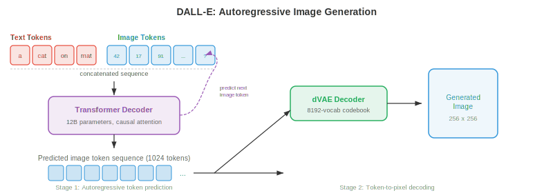
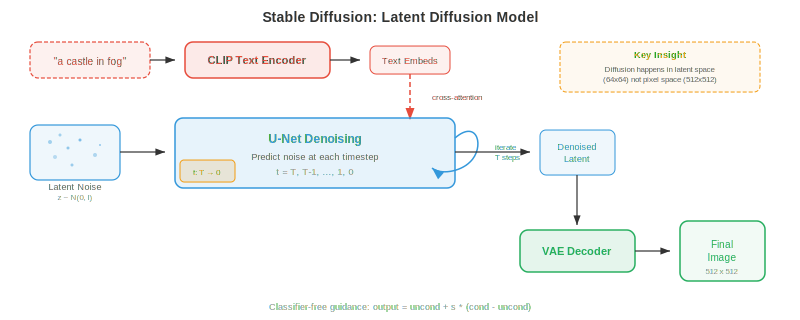
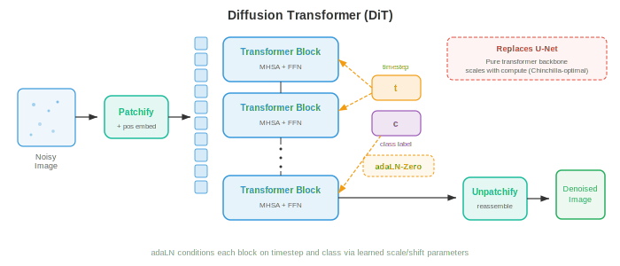
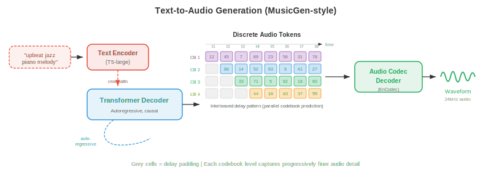

# Cross-Modal Generation

*Cross-modal generation produces output in one modality conditioned on input from another; text to image, image to text, text to audio, and beyond. This file covers DALL-E, Stable Diffusion, classifier-free guidance, ControlNet, image captioning, text-to-video (Sora), and text-to-audio generation.*

- In files 01-03 of this chapter, you learned how to represent, align, and tokenise different modalities. Now comes the creative act: generating one modality from another. Cross-modal generation is the engine behind text-to-image tools, video synthesis systems, music composition models, and image captioning. Think of it as teaching a machine to be a multimedia artist — you describe what you want in words, and it paints, animates, or composes.

- The core idea is **conditional generation**: given an input from modality $A$ (e.g., text), produce an output in modality $B$ (e.g., image). Formally, you learn a model $p_\theta(y \mid x)$ where $x$ is the conditioning signal and $y$ is the generated output. The challenge is that this conditional distribution is enormously complex and high-dimensional — a 512x512 image lives in $\mathbb{R}^{786432}$, and there are many valid images for a single text prompt.


## Text-to-Image Generation

- Imagine you describe a scene to a courtroom sketch artist. The artist must interpret your words, recall what objects look like, compose them spatially, and render the final picture. Text-to-image models do precisely this, but they must learn all of these skills from data rather than from years of art school.

### DALL-E: Autoregressive Image Generation

- **DALL-E** (Ramesh et al., 2021) treats image generation as a sequence prediction problem — the same paradigm that powers language models (Chapter 07). The key insight is that if you can represent images as discrete tokens (recall VQ-VAE from file 03), then generating an image is just generating a sequence of tokens, one after another.

- The pipeline has two stages. First, a **discrete VAE (dVAE)** compresses a 256x256 image into a 32x32 grid of discrete tokens from a codebook of 8192 entries, reducing the image to a sequence of 1024 tokens. Second, a **transformer decoder** is trained to model the joint distribution of 256 text tokens (BPE-encoded) concatenated with 1024 image tokens, totalling 1280 tokens:

$$p(x_{\text{text}}, x_{\text{img}}) = \prod_{i=1}^{1280} p(x_i \mid x_1, \ldots, x_{i-1})$$

- At generation time, you feed in the text tokens and the model autoregressively samples image tokens one by one. This is elegant because it reuses the exact machinery of language modelling — attention, causal masking, top-k sampling — for image synthesis.

- The downside is that autoregressive generation is inherently sequential: generating 1024 tokens one at a time is slow, and any error early in the sequence compounds. DALL-E mitigated this by generating many candidate images and re-ranking them with CLIP (from file 01) to find the best match to the text prompt.



### Stable Diffusion: Latent Diffusion with Text Conditioning

- **Stable Diffusion** (Rombach et al., 2022) takes a fundamentally different approach. Instead of predicting tokens one by one, it starts with pure noise and gradually denoises it into an image, guided by a text prompt. Recall diffusion models from Chapter 8 — Stable Diffusion operates in a compressed latent space rather than pixel space, making it dramatically more efficient.

- The architecture has three components working in concert. A **VAE encoder** compresses the image from pixel space ($512 \times 512 \times 3$) to a latent representation ($64 \times 64 \times 4$), reducing dimensionality by a factor of 48. A **text encoder** (typically CLIP or OpenCLIP) converts the text prompt into a sequence of embedding vectors. A **U-Net denoiser** takes the noisy latent, the timestep, and the text embeddings, and predicts the noise to subtract at each step. Text conditioning enters the U-Net through **cross-attention** layers:

$$\text{Attention}(Q, K, V) = \text{softmax}\left(\frac{QK^T}{\sqrt{d}}\right)V$$

- where $Q$ comes from the noisy image features, and $K, V$ come from the text embeddings. This lets the model attend to relevant words at each spatial location — when denoising the region where a "red ball" should appear, the model attends to the tokens "red" and "ball".

- At inference, you sample $z_T \sim \mathcal{N}(0, I)$ in latent space, iteratively denoise using the U-Net for $T$ steps (typically 20-50 with DDIM scheduling), and decode the clean latent $z_0$ back to pixel space with the VAE decoder. The entire forward pass generates a 512x512 image in seconds on a consumer GPU.



### Classifier-Free Guidance in Practice

- **Classifier-free guidance (CFG)** is the secret ingredient that makes text-to-image models produce images that actually match their prompts. Recall from Chapter 8 that CFG trains the model both conditionally and unconditionally, then amplifies the conditional signal at sampling time:

$$\hat{\epsilon} = \epsilon_\theta(x_t, \varnothing) + s \cdot (\epsilon_\theta(x_t, c) - \epsilon_\theta(x_t, \varnothing))$$

- where $s$ is the guidance scale. Think of the term $(\epsilon_\theta(x_t, c) - \epsilon_\theta(x_t, \varnothing))$ as the "direction toward the prompt" — it captures what makes a conditioned prediction different from an unconditioned one. Multiplying by $s > 1$ exaggerates this direction, pushing the image closer to the text description at the cost of diversity.

- In practice, $s = 7.5$ is a common default for Stable Diffusion. At $s = 1.0$ you get the raw model output (diverse but loosely matching the prompt). At $s = 20+$ the images become oversaturated and repetitive but very closely aligned with the text. The optimal $s$ depends on the application: creative exploration favours lower guidance, while precise prompt adherence demands higher guidance.

### Imagen: Cascaded Diffusion with Language Understanding

- **Imagen** (Saharia et al., 2022) demonstrated that a powerful text encoder matters more than a larger image model. Instead of CLIP, Imagen uses a frozen **T5-XXL** language model (from Chapter 07) as the text encoder, which has a much richer understanding of language semantics, compositionality, and spatial relationships ("a blue cube on top of a red sphere").

- Imagen uses a **cascaded diffusion** approach: a base diffusion model generates a 64x64 image, a first super-resolution model upscales to 256x256, and a second super-resolution model reaches 1024x1024. Each stage is a separate diffusion model conditioned on the text and (for the upscalers) the lower-resolution image. This cascade avoids modelling fine details at the base resolution, allowing the base model to focus on composition and semantics while the upscalers handle texture and sharpness.

- Imagen also introduced **dynamic thresholding**: at each denoising step, predicted pixel values are clipped to a percentile-based range rather than a fixed range $[-1, 1]$. This prevents saturation artefacts at high guidance scales, a common problem in diffusion models.

### Parti: Autoregressive at Scale

- **Parti** (Pathways Autoregressive Text-to-Image, Yu et al., 2022) revived the autoregressive approach with massive scale. Like DALL-E, it converts images to discrete tokens (using ViT-VQGAN) and generates them sequentially with a transformer. But Parti used a 20-billion-parameter encoder-decoder transformer (based on the Pathways architecture) and showed that autoregressive models can match diffusion quality when scaled sufficiently.

- Parti's encoder-decoder architecture is a key difference from DALL-E's decoder-only design. The text goes through the encoder; the decoder cross-attends to the encoded text while generating image tokens. This mirrors machine translation (Chapter 07) — you translate from "text language" to "image language".

### DiT and Flow-Based Generation

- **Diffusion Transformers (DiT)** (Peebles and Xie, 2023) replace the U-Net backbone in diffusion models with a plain transformer. Each noisy latent patch is treated as a token (analogous to ViT from Chapter 8), and the transformer processes these tokens with self-attention and cross-attention to the text condition. DiT showed that transformers scale more predictably than U-Nets for diffusion — doubling compute reliably halves the FID score.

- **Flow matching** (recalled from Chapter 8) has emerged as an alternative to the diffusion noise-prediction paradigm. Instead of predicting noise $\epsilon$ to subtract, the model predicts a velocity $v_\theta(x_t, t)$ that transports samples along straight paths from noise to data. **Stable Diffusion 3** and **Flux** adopt flow matching with a **multimodal DiT (MM-DiT)** architecture, where text and image tokens are processed jointly by transformer blocks with bidirectional attention — both modalities attend to each other rather than text only conditioning image features via cross-attention.



## Text-to-Video Generation

- Text-to-video is text-to-image with a ruthless additional constraint: **temporal coherence**. Every frame must be internally consistent (a valid image), but consecutive frames must also be smoothly connected — objects should move naturally, lighting should change continuously, and the "camera" should follow physically plausible trajectories. Think of the difference between painting a single landscape and directing a film.

### Temporal Challenges

- Video introduces three challenges beyond image generation. **Temporal consistency** requires that objects maintain their identity across frames — a dog in frame 1 should still be the same dog in frame 100. **Motion modelling** requires learning physical dynamics: how objects move, how gravity works, how fluids flow. **Compute cost** is severe: a 10-second video at 24 fps and 512x512 resolution contains $10 \times 24 \times 512 \times 512 \times 3 \approx 188$ million values, roughly 240 times more data than a single image.

### Make-A-Video and Extend-to-Video Approaches

- **Make-A-Video** (Singer et al., 2022) took a pragmatic approach: start with a pre-trained text-to-image model and add temporal layers. The key insight is that you already have strong text-image models trained on billions of image-text pairs, and you only need to learn motion from (unlabelled) video data.

- Make-A-Video inserts **temporal attention** and **temporal convolution** layers into a pre-trained spatial U-Net. The spatial layers (pre-trained on images) handle appearance, while the new temporal layers (trained on video) handle motion. Spatial self-attention operates within each frame; temporal attention operates across frames at each spatial location. This factorisation is efficient because temporal and spatial patterns are largely separable.

- The generation pipeline mirrors Imagen's cascade: a base model generates 16 frames at 64x64, then spatial and temporal super-resolution models upscale to the final resolution and frame rate. A frame interpolation network increases temporal smoothness.

### VideoPoet and Token-Based Video Models

- **VideoPoet** (Kondratyuk et al., 2024) unifies video generation under the language modelling paradigm. All modalities — text, image, video, audio — are tokenised into discrete sequences, and a single large language model (LLM) is trained to predict tokens autoregressively across all modalities. This enables zero-shot capabilities: text-to-video, image-to-video, video-to-audio, video editing, and inpainting all emerge from the same model.

- VideoPoet tokenises video with a MAGVIT-v2 encoder (a 3D VQ-VAE, from file 03) that compresses spatial and temporal dimensions jointly. Audio is tokenised with SoundStream. The LLM backbone is pre-trained on text and fine-tuned on multimodal token sequences, learning the joint distribution across modalities.

### Sora-Style Temporal Diffusion

- **Sora** (OpenAI, 2024) brought temporal diffusion to mainstream attention with its ability to generate long, coherent, physically plausible videos. While full architectural details are not published, the key ideas involve scaling DiT to spacetime: video frames are decomposed into **spacetime patches** (3D chunks across height, width, and time), which are treated as tokens for a large transformer.

- The spacetime patch approach means the model processes video as a native 3D signal rather than a sequence of 2D frames. This allows it to capture long-range temporal dependencies — the model can "plan ahead" across the entire video duration rather than generating frame by frame.

- Sora can handle variable durations, resolutions, and aspect ratios by adjusting the number of spacetime patches. Training on data at its native resolution (rather than cropping everything to squares) improves composition and framing quality.

### Wan: Open-Source Video Generation

- **Wan** (Wan et al., 2025) is a family of open-source video generation models (1.3B and 14B parameters) built on a DiT backbone with 3D VAE temporal compression. Wan uses **flow matching** rather than traditional DDPM-style diffusion, learning straight transport paths from noise to video latents. The 3D VAE compresses video spatially and temporally (4x temporal compression), and the DiT processes the resulting spacetime latent tokens with full 3D attention.

- Wan supports text-to-video, image-to-video (animating a still image), and video editing. The 14B model generates coherent videos up to 5 seconds at 720p resolution, demonstrating that open-source models can approach the quality of proprietary systems when architectural and training recipe choices are carefully made.


## Text-to-Audio Generation

- Picture a film composer reading a screenplay and scoring the soundtrack. Text-to-audio models do something analogous: given a text description ("a thunderstorm with heavy rain and distant thunder"), they generate the corresponding audio waveform. The challenge is bridging the gap between the discrete, symbolic nature of text and the continuous, temporal nature of sound.

### AudioLM: Language Modelling for Audio

- **AudioLM** (Borsos et al., 2023) generates audio by predicting discrete audio tokens autoregressively, drawing on the same language modelling paradigm used by DALL-E for images. It uses a hierarchical token structure: **semantic tokens** (from a self-supervised model like w2v-BERT, recall Chapter 9) capture high-level content (what is being said or played), while **acoustic tokens** (from SoundStream, a neural audio codec) capture fine-grained acoustic details (how it sounds — timbre, recording quality).

- Generation proceeds in two stages. First, a transformer predicts semantic tokens given an optional audio prompt, establishing the high-level content plan. Second, another transformer predicts acoustic tokens conditioned on the semantic tokens, filling in acoustic details. This hierarchy mirrors the text-to-speech pipeline (Chapter 9) — semantic tokens play the role of phonemes, and acoustic tokens play the role of mel spectrogram frames.

- AudioLM can generate speech continuation (given 3 seconds of speech, generate the next 10), music continuation, and sound effects, all from a single model trained on audio-only data (no text labels needed for pre-training).

### MusicLM: Text-Conditioned Music

- **MusicLM** (Agostinelli et al., 2023) extends AudioLM to text-conditioned music generation. It adds a text-audio joint embedding (from **MuLan**, a CLIP-like model trained on music-text pairs) to condition the generation. The MuLan embedding captures semantic meaning of the text description ("upbeat jazz with saxophone solo") and guides the hierarchical token generation.

- MusicLM generates music at 24 kHz for arbitrary durations, maintaining melodic and rhythmic coherence over minutes-long pieces. It can also condition on a hummed melody (using melody tokens extracted by a pitch tracker) plus a text description, generating a full arrangement that follows the hummed tune in the style described by the text.

### MusicGen: Efficient Single-Stage Generation

- **MusicGen** (Copet et al., 2023) simplifies the multi-stage approach. Instead of separate semantic and acoustic models, MusicGen uses a single autoregressive transformer that directly generates multiple codebook levels from the audio codec. The key innovation is an **interleaved codebook pattern**: rather than generating all codebook levels for one timestep before moving to the next, MusicGen interleaves tokens across codebooks and timesteps in a pattern that allows parallel decoding of some codebook levels.

- Conditioning is straightforward: text is encoded by a T5 encoder, and the text embeddings are prepended to the audio token sequence (like a prefix prompt in a language model) or injected via cross-attention. MusicGen also supports melody conditioning: a chromagram (from the spectrogram features discussed in Chapter 9) of a reference melody is encoded and used alongside the text condition.

$$p(a_1, \ldots, a_T) = \prod_{t=1}^{T} \prod_{k=1}^{K} p(a_{t,k} \mid a_{<t}, c_{\text{text}})$$

- where $a_{t,k}$ is the audio token at timestep $t$ and codebook level $k$, and $c_{\text{text}}$ is the text conditioning. The product over $k$ factorises depending on the codebook pattern — some levels are predicted in parallel.



## Image-to-Text Generation

- Now flip the direction: given an image, generate a natural language description. This is **image captioning**, and it is a form of conditional text generation where the image is the condition. Think of a museum guide describing a painting — they must perceive the visual content, understand the relationships between objects, and articulate their observations in fluent language.

### Captioning as Conditional Generation

- The classic approach uses an **encoder-decoder** architecture (Chapter 07). A pre-trained CNN or ViT (Chapter 8) encodes the image into a set of feature vectors. A language model decoder generates the caption word by word, attending to the image features at each step:

$$p(w_1, \ldots, w_L \mid I) = \prod_{l=1}^{L} p(w_l \mid w_1, \ldots, w_{l-1}, I)$$

- where $w_l$ are the caption words and $I$ is the image representation. Cross-attention connects the text decoder to the image features, allowing the model to "look at" different regions of the image as it generates different words — attending to the dog region when generating "dog" and the park region when generating "park".

- **CoCa** (Contrastive Captioners, Yu et al., 2022) unified contrastive learning (file 01's CLIP-style objective) with captioning in a single model. The image encoder produces features used both for contrastive alignment with text and for cross-attention in a captioning decoder. This multi-task training gives CoCa strong zero-shot recognition (from contrastive learning) and strong generation (from captioning).

### Modern Vision-Language Captioning

- Modern approaches often use **large multimodal models** (file 02) for captioning. Models like LLaVA, Qwen-VL, and GPT-4V treat captioning as a special case of visual question answering — the "question" is implicitly "describe this image". The visual encoder (CLIP ViT or SigLIP) produces patch tokens that are projected into the LLM's embedding space, and the LLM generates a free-form description.

- The advantage of LLM-based captioning over dedicated encoder-decoder models is **instruction following**: you can ask for different levels of detail ("describe in one sentence" vs. "provide a detailed paragraph"), focus on specific aspects ("describe the colours"), or generate structured output ("list all objects with their positions"). This flexibility comes from the LLM's instruction-tuning (Chapter 07).

## Video-Audio Co-Generation

- Think of watching a film with the sound off — the experience is hollow. Visual content and audio are deeply coupled: a bouncing ball has a rhythmic thud, rain produces a patter, and a crowd generates cheers. **Video-audio co-generation** aims to produce both modalities together, maintaining temporal alignment between what you see and what you hear.

### Joint Temporal Modelling

- The core challenge is **temporal synchronisation**: the audio of a drum hit must coincide exactly with the visual frame showing the drumstick striking the drum. This requires a shared temporal representation that both modalities can reference.

- One approach is to generate video and audio from a shared latent timeline. Models like **CoDi** (Composable Diffusion, Tang et al., 2023) use separate diffusion models for each modality but align them through a shared latent space. During training, cross-modal attention layers learn to synchronise visual and audio features at each timestep. During generation, both diffusion processes run simultaneously, conditioning on each other through the shared alignment.

- VideoPoet (discussed above) takes a more unified approach: since all modalities are tokenised into a single sequence, the LLM naturally learns temporal correspondences between video and audio tokens. A video clip of a barking dog followed by the corresponding audio tokens teaches the model to associate visual barking motion with the sound of barking.

- **Temporal alignment loss** functions explicitly enforce synchronisation. One formulation uses contrastive learning at the frame level: the audio segment at time $t$ should be more similar to the video frame at time $t$ than to frames at other times:

$$\mathcal{L}_{\text{sync}} = -\mathbb{E}_t \left[\log \frac{\exp(\text{sim}(v_t, a_t) / \tau)}{\sum_{t'} \exp(\text{sim}(v_t, a_{t'}) / \tau)}\right]$$

- where $v_t$ and $a_t$ are the video and audio representations at time $t$, and $\tau$ is a temperature parameter. This is structurally identical to the InfoNCE loss from file 01, but applied at the temporal frame level rather than at the clip level.

## Instruction-Following Generation

- Imagine telling an artist "make the sky more dramatic" or "replace the hat with a crown". **Instruction-following generation** lets you edit images using natural language commands rather than precise spatial masks or brush strokes.

### InstructPix2Pix: Editing by Description

- **InstructPix2Pix** (Brooks et al., 2023) trains a conditional diffusion model that takes an input image and a text instruction, then produces the edited image. The clever part is how the training data is created: GPT-3 generates editing instructions ("make it winter", "turn the cat into a dog") paired with input-output text captions, and a text-to-image model (Stable Diffusion) generates the corresponding image pairs.

- The model is a modified Stable Diffusion U-Net that receives both the text instruction (via cross-attention) and the input image latent (concatenated channel-wise with the noisy latent). It uses **dual classifier-free guidance** with two guidance scales — one for the text instruction ($s_T$) and one for the input image ($s_I$):

$$\hat{\epsilon} = \epsilon_\theta(x_t, \varnothing, \varnothing) + s_I \cdot (\epsilon_\theta(x_t, c_I, \varnothing) - \epsilon_\theta(x_t, \varnothing, \varnothing)) + s_T \cdot (\epsilon_\theta(x_t, c_I, c_T) - \epsilon_\theta(x_t, c_I, \varnothing))$$

- where $c_I$ is the input image condition and $c_T$ is the text instruction. The first guidance term controls how much to preserve the input image; the second controls how strongly to follow the instruction. This gives the user a two-dimensional knob: high $s_I$ preserves the original closely, while high $s_T$ makes more dramatic edits.


### SDEdit and Noise-Based Editing

- **SDEdit** (Meng et al., 2022) offers a simpler editing approach that requires no special training. You take the input image, add noise to it (running the forward diffusion process to an intermediate timestep $t_0$), then denoise with a text prompt describing the desired output. The amount of noise controls the edit strength: low noise preserves the structure (colour changes, style transfer), while high noise allows major restructuring (object replacement, layout changes).

- The tradeoff is precise: at timestep $t_0$, the noisy image retains $\bar{\alpha}_{t_0}$ fraction of the original signal. The denoising process fills in the corrupted details according to the new text prompt. This is mathematically grounded: the diffusion model samples from the posterior $p(x_0 \mid x_{t_0}, c)$, where $x_{t_0}$ constrains the generation to be "close to" the original.

### ControlNet: Spatial Conditioning

- **ControlNet** (Zhang et al., 2023) adds fine-grained spatial control to text-to-image diffusion. A copy of the pre-trained U-Net encoder is trained to accept additional input conditions — edge maps (Canny edges), depth maps, pose skeletons, segmentation maps — while the original U-Net weights are frozen. The ControlNet encoder's outputs are added to the frozen U-Net's skip connections via **zero convolutions** (1x1 convolutions initialised to zero), ensuring training starts from the pre-trained model's behaviour and gradually learns the new condition.

- This architecture lets you provide a sketch, a depth map, or a human pose as the structural guide, and the text prompt fills in the appearance. The pre-trained weights handle photorealism and text understanding; the ControlNet layers handle spatial fidelity to the condition.

## Consistency and Alignment Metrics

- How do you measure whether a generated image is good? "Good" has at least two dimensions: **quality** (does it look like a real image?) and **alignment** (does it match the text prompt?). Several metrics have been developed to quantify these.

### Frechet Inception Distance (FID)

- **Frechet Inception Distance (FID)** (Heusel et al., 2017) measures the distance between the distribution of generated images and real images in the feature space of a pre-trained Inception network. Think of it as comparing the "fingerprints" of two image collections rather than comparing individual images.

- Both the real and generated image sets are passed through Inception-v3, and the activations from the penultimate layer are collected. These activations are modelled as multivariate Gaussians $\mathcal{N}(\mu_r, \Sigma_r)$ and $\mathcal{N}(\mu_g, \Sigma_g)$. The FID is the Frechet distance (Wasserstein-2 distance) between these Gaussians:

$$\text{FID} = \|\mu_r - \mu_g\|^2 + \text{Tr}\left(\Sigma_r + \Sigma_g - 2(\Sigma_r \Sigma_g)^{1/2}\right)$$

- Lower FID is better. FID = 0 means the distributions are identical. FID captures both quality (if generated images are blurry, their features will differ from real images) and diversity (if the model suffers from mode collapse, $\Sigma_g$ will be smaller than $\Sigma_r$). Typical state-of-the-art values on ImageNet 256x256 are FID < 2.0.

- FID has known limitations: it assumes Gaussian feature distributions (which is approximate), it requires thousands of samples for stable estimates, and it uses Inception features (which may not capture all perceptually relevant differences).

### Inception Score (IS)

- The **Inception Score (IS)** (Salimans et al., 2016) measures two properties: each generated image should be confidently classifiable (the conditional class distribution $p(y \mid x)$ should be peaked), and the set of generated images should cover many classes (the marginal $p(y) = \mathbb{E}_x[p(y \mid x)]$ should be uniform). IS combines these via the KL divergence:

$$\text{IS} = \exp\left(\mathbb{E}_x \left[D_{\text{KL}}(p(y \mid x) \| p(y))\right]\right)$$

- Higher IS is better. The maximum IS equals the number of classes (1000 for ImageNet). IS rewards quality (sharp, recognisable images) and diversity (coverage of classes), but it has significant limitations: it ignores the real data distribution entirely, it cannot detect mode dropping within a class, and it is biased toward ImageNet-like images because it uses Inception's class predictions.

### CLIPScore: Measuring Text-Image Alignment

- **CLIPScore** (Hessel et al., 2021) directly measures how well a generated image matches its text prompt using a pre-trained CLIP model (file 01). The score is simply the cosine similarity between the CLIP image embedding and the CLIP text embedding:

$$\text{CLIPScore}(I, T) = \max(0, \cos(E_I(I), E_T(T)))$$

- where $E_I$ and $E_T$ are the CLIP image and text encoders. CLIPScore is reference-free — it does not require ground-truth images, only the text prompt. It correlates well with human judgements of text-image alignment and has become the standard metric for evaluating prompt fidelity in text-to-image models.

- For comparing against a reference caption, **RefCLIPScore** incorporates a reference image:

$$\text{RefCLIPScore} = \text{HarmonicMean}(\text{CLIPScore}(I, T), \max(0, \cos(E_I(I), E_I(I_{\text{ref}}))))$$

- This balances text alignment with visual similarity to a reference.


### Human Evaluation

- Automated metrics are proxies; human judgement remains the gold standard. Common protocols include **pairwise comparisons** (which of two images better matches the prompt?), **Likert scales** (rate quality and alignment from 1-5), and **Elo ratings** (tournament-style ranking across models). The DrawBench and PartiPrompts benchmarks provide standardised prompt sets for systematic human evaluation.

## Ethical Considerations

- Cross-modal generation is one of the most ethically consequential areas in AI. The ability to create photorealistic images, videos, and audio from text descriptions raises profound concerns that practitioners must take seriously.

### Deepfakes and Misinformation

- **Deepfakes** are generated or manipulated media designed to depict events that never occurred. Text-to-image and text-to-video models can create convincing fake photographs of public figures, fabricated evidence, and misleading news imagery. The danger is not just that fakes exist, but that their existence undermines trust in all media — if any image could be fake, no image is fully trusted.

- Detection methods include training classifiers on real vs. generated images, analysing statistical artefacts (GAN-generated images have subtle spectral signatures), and embedding invisible watermarks (Stable Diffusion's invisible watermark, Google's SynthID). However, detection is an arms race: as generators improve, detectors must be constantly updated.

### Bias in Generation

- Models trained on internet-scale data inherit and amplify societal biases. Text-to-image models disproportionately generate lighter-skinned faces, associate certain professions with specific genders, and default to Western cultural norms for underspecified prompts. These biases are rooted in the training data distribution and the CLIP/T5 text encoders, which encode biases from their own training corpora.

- Mitigation strategies include curating more representative training data, applying debiasing techniques to text encoders, using safety classifiers to filter problematic outputs, and enabling user control over demographic attributes. None of these are complete solutions, and ongoing auditing is essential.

### Content Filtering and Safety

- Responsible deployment requires multiple layers of protection. **Input filtering** blocks harmful prompts before generation. **Output filtering** classifies generated content and rejects harmful material. **NSFW classifiers** detect sexually explicit, violent, or otherwise harmful content. Stable Diffusion's safety checker, for instance, computes the cosine similarity between the generated image's CLIP embedding and a set of pre-defined harmful concept embeddings, flagging images that exceed a threshold.

- The open-source nature of many generation models (Stable Diffusion, Wan) creates tension between democratising access and preventing misuse. Once model weights are released, content filtering can be bypassed. This has led to debates about the appropriate level of openness and the responsibilities of model developers.

### Intellectual Property and Consent

- Generative models trained on internet data may reproduce copyrighted styles, trademarks, or likeness of real people without consent. The legal and ethical frameworks are still evolving, but responsible practice includes respecting opt-out mechanisms, acknowledging the creative contributions embedded in training data, and developing technical safeguards against memorisation and regurgitation of training examples.

## Coding Tasks (use CoLab or notebook)

1. Implement classifier-free guidance for a toy 2D diffusion model. Train a conditional diffusion model on a 2D dataset (e.g., labelled clusters), then sample with different guidance scales to observe the quality-diversity tradeoff.
```python
import jax
import jax.numpy as jnp
import matplotlib.pyplot as plt

# Toy 2D conditional diffusion with classifier-free guidance
def noise_schedule(T):
    betas = jnp.linspace(1e-4, 0.02, T)
    alphas = 1.0 - betas
    return jnp.cumprod(alphas)

def forward_diffuse(x0, t, alpha_bars, key):
    noise = jax.random.normal(key, x0.shape)
    return jnp.sqrt(alpha_bars[t]) * x0 + jnp.sqrt(1 - alpha_bars[t]) * noise, noise

# Generate labelled 2D data: class 0 = ring, class 1 = cluster
key = jax.random.PRNGKey(42)
k1, k2, k3 = jax.random.split(key, 3)
theta = jax.random.uniform(k1, (200,)) * 2 * jnp.pi
ring = jnp.stack([jnp.cos(theta), jnp.sin(theta)], axis=1) * 2
ring += jax.random.normal(k2, ring.shape) * 0.1
cluster = jax.random.normal(k3, (200, 2)) * 0.3

data = jnp.concatenate([ring, cluster])
labels = jnp.concatenate([jnp.zeros(200), jnp.ones(200)])

# Simulate CFG: show how guidance pushes samples toward class-conditional modes
# Try varying guidance_scale from 0.0 to 5.0 and observe results
guidance_scales = [0.0, 1.0, 3.0, 7.0]
fig, axes = plt.subplots(1, 4, figsize=(16, 4))
for ax, s in zip(axes, guidance_scales):
    ax.scatter(ring[:, 0], ring[:, 1], s=8, alpha=0.4, label='Ring (c=0)')
    ax.scatter(cluster[:, 0], cluster[:, 1], s=8, alpha=0.4, label='Cluster (c=1)')
    ax.set_title(f'Guidance scale s={s}')
    ax.set_xlim(-4, 4); ax.set_ylim(-4, 4)
    ax.set_aspect('equal'); ax.legend(fontsize=7)
plt.suptitle('Experiment: vary guidance scale and observe quality vs diversity')
plt.tight_layout(); plt.show()
# Exercise: train a small MLP denoiser with class conditioning,
# then implement the CFG formula to sample with different s values.
```

2. Compute FID between two sets of 2D samples using the full Frechet distance formula. Vary the generated distribution and observe how FID changes.
```python
import jax
import jax.numpy as jnp
import matplotlib.pyplot as plt

def compute_fid(real, generated):
    """Compute Frechet distance between two 2D sample sets."""
    mu_r, mu_g = jnp.mean(real, axis=0), jnp.mean(generated, axis=0)
    sigma_r = jnp.cov(real.T)
    sigma_g = jnp.cov(generated.T)
    diff = mu_r - mu_g
    # Matrix square root via eigendecomposition
    product = sigma_r @ sigma_g
    eigvals, eigvecs = jnp.linalg.eigh(product)
    sqrt_product = eigvecs @ jnp.diag(jnp.sqrt(jnp.maximum(eigvals, 0))) @ eigvecs.T
    fid = jnp.sum(diff ** 2) + jnp.trace(sigma_r + sigma_g - 2 * sqrt_product)
    return fid

key = jax.random.PRNGKey(0)
k1, k2, k3, k4 = jax.random.split(key, 4)

# Real distribution: standard 2D Gaussian
real = jax.random.normal(k1, (1000, 2))

# Generated distributions with increasing divergence
shifts = [0.0, 0.5, 1.0, 2.0, 4.0]
fig, axes = plt.subplots(1, len(shifts), figsize=(18, 3.5))
for ax, shift in zip(axes, shifts):
    gen = jax.random.normal(k2, (1000, 2)) * (1 + shift * 0.2) + shift
    fid = compute_fid(real, gen)
    ax.scatter(real[:, 0], real[:, 1], s=3, alpha=0.3, label='Real')
    ax.scatter(gen[:, 0], gen[:, 1], s=3, alpha=0.3, label='Generated')
    ax.set_title(f'Shift={shift}\nFID={fid:.2f}')
    ax.set_xlim(-5, 8); ax.set_ylim(-5, 8)
    ax.set_aspect('equal'); ax.legend(fontsize=7)
plt.suptitle('FID increases as generated distribution diverges from real')
plt.tight_layout(); plt.show()
# Try: change the variance of generated samples without shifting the mean.
# How does FID respond to a diversity mismatch vs a location mismatch?
```

3. Implement CLIPScore computation between text and image embeddings using random projections as a stand-in for CLIP. Observe how cosine similarity behaves as you vary the "alignment" between modalities.
```python
import jax
import jax.numpy as jnp
import matplotlib.pyplot as plt

def cosine_similarity(a, b):
    return jnp.dot(a, b) / (jnp.linalg.norm(a) * jnp.linalg.norm(b))

def clip_score(img_emb, txt_emb):
    """CLIPScore: clamped cosine similarity."""
    return jnp.maximum(0.0, cosine_similarity(img_emb, txt_emb))

key = jax.random.PRNGKey(42)
dim = 512  # CLIP embedding dimension

# Simulate aligned and misaligned pairs
# Aligned: image and text embeddings share a component
k1, k2, k3 = jax.random.split(key, 3)
shared = jax.random.normal(k1, (dim,))
shared = shared / jnp.linalg.norm(shared)

noise_levels = jnp.linspace(0, 5, 20)
scores = []
for noise in noise_levels:
    noise_vec = jax.random.normal(k2, (dim,)) * noise
    img_emb = shared + noise_vec * 0.3
    txt_emb = shared + jax.random.normal(k3, (dim,)) * noise * 0.3
    scores.append(float(clip_score(img_emb, txt_emb)))

plt.figure(figsize=(8, 4))
plt.plot(noise_levels, scores, 'o-', color='#2c3e50')
plt.xlabel('Noise level (misalignment)')
plt.ylabel('CLIPScore')
plt.title('CLIPScore decreases as text-image alignment degrades')
plt.grid(True, alpha=0.3)
plt.tight_layout(); plt.show()
# Experiment: what happens if you normalise embeddings before adding noise?
# How does dimensionality affect the score distribution?
```
