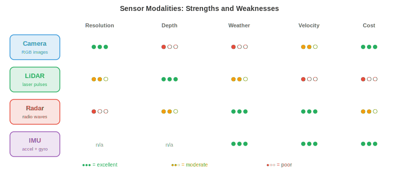

# Perception

*Perception is how autonomous systems sense and interpret the physical world. This file covers sensor modalities, calibration, sensor fusion, 3D object detection, depth estimation, occupancy networks, lane detection, and semantic mapping,  the sensory foundation that every robot, drone, and self-driving car builds upon.*

- For a human, perceiving the world is effortless: you see a car approaching, hear its engine, feel the ground beneath your feet, and instantly build a mental model of your surroundings. An autonomous system must do the same thing, but using electronic sensors and algorithms instead of eyes and ears.

- The fundamental challenge is this: sensors give you raw numbers (pixel intensities, point clouds, signal reflections), and the system must turn those numbers into a structured understanding: "there is a pedestrian 12 metres ahead, moving left at 1.5 m/s." This is the perception problem.

- Everything downstream (prediction, planning, control) depends on perception. A self-driving car with a perfect planner but poor perception will still crash. Perception is the bottleneck.

## Sensor Modalities

- Autonomous systems use multiple sensor types, each with different strengths and failure modes. No single sensor is sufficient on its own.



- **Cameras** capture dense colour information at high resolution. A single image contains millions of pixels, each recording RGB values (as we saw in chapter 8). Cameras are cheap, lightweight, and provide rich texture and colour information essential for reading signs, detecting traffic lights, and recognising objects.

- Camera types include **monocular** (single lens, no native depth), **stereo** (two lenses separated by a baseline, enabling depth via disparity as covered in chapter 8), and **fisheye** (ultra-wide field of view, 180°+, with heavy radial distortion, used for surround-view parking systems).

- The main weakness of cameras is that they lose depth information during projection. A 3D scene is mapped onto a 2D image plane through the pinhole camera model (recall the intrinsic matrix $K$ from chapter 8):

$$\begin{bmatrix} u \\ v \\ 1 \end{bmatrix} = \frac{1}{Z} K \begin{bmatrix} X \\ Y \\ Z \end{bmatrix}$$

- The division by $Z$ discards absolute depth. Two objects of different sizes at different distances can produce identical projections. Recovering depth from a single image is ill-posed, which is why stereo cameras or learned monocular depth models are needed.

- Cameras also struggle in adverse conditions: direct sunlight causes glare, darkness reduces signal, and rain or fog scatter light.

- **LiDAR** (Light Detection and Ranging) fires laser pulses and measures the time for each pulse to bounce back. Since light travels at a known speed ($c \approx 3 \times 10^8$ m/s), the distance to each reflection point is:

$$d = \frac{c \cdot \Delta t}{2}$$


- The factor of 2 accounts for the round trip (out and back). By sweeping the laser across the scene, LiDAR builds a **point cloud**: a set of 3D coordinates $(x, y, z)$, often with intensity (reflectance) values.

- **Spinning LiDAR** (e.g., Velodyne) rotates a laser array 360° to produce a full surround view. Typical units generate 300,000+ points per second across 64–128 vertical channels. The result is a sparse but geometrically accurate 3D representation of the scene.

- **Solid-state LiDAR** has no moving parts, using optical phased arrays or MEMS mirrors instead. This makes them cheaper, more compact, and more reliable, but typically with a narrower field of view (120° vs 360°).

- LiDAR gives precise depth but produces sparse data (far fewer "pixels" than a camera), has no colour information, and is expensive. It also degrades in heavy rain, snow, or dust, as particles scatter the laser pulses.

- **Radar** (Radio Detection and Ranging) works on the same time-of-flight principle as LiDAR but uses radio waves (millimetre-wave, typically 77 GHz for automotive). Radio waves penetrate rain, fog, dust, and snow far better than light, making radar the most weather-robust sensor.

- Radar also directly measures **velocity** via the Doppler effect. When an object moves towards the sensor, reflected waves are compressed (higher frequency); when moving away, they are stretched (lower frequency). The velocity is:

$$v = \frac{\Delta f \cdot c}{2 f_0}$$

- where $\Delta f$ is the frequency shift and $f_0$ is the transmitted frequency. This gives instantaneous radial velocity without any tracking or frame-to-frame computation.

- The tradeoff is resolution: radar has much coarser angular resolution than cameras or LiDAR, making it poor at distinguishing nearby objects or detecting fine details. It excels at detecting vehicles at long range (200+ metres) in any weather.

- **Ultrasonic sensors** emit high-frequency sound pulses (40–70 kHz) and measure echo return time. They work at very short range (0.2–5 metres) and are used primarily for parking assistance. Their physics is identical to LiDAR but with sound instead of light, so $d = \frac{v_{\text{sound}} \cdot \Delta t}{2}$ where $v_{\text{sound}} \approx 343$ m/s.

- An **IMU** (Inertial Measurement Unit) contains accelerometers and gyroscopes that measure linear acceleration and angular velocity respectively. IMUs provide high-frequency motion data (often 200–1000 Hz) that fills the gaps between slower sensor updates. They do not sense the environment directly but track the robot's own motion, making them essential for dead-reckoning and state estimation.

- IMUs suffer from **drift**: small measurement errors accumulate over time, causing the estimated position to diverge from reality. This is why IMUs are almost always fused with other sensors (cameras, GPS, LiDAR) rather than used alone.

- **GNSS** (Global Navigation Satellite Systems, including GPS) provides absolute position on Earth's surface by triangulating signals from multiple satellites. Standard GPS accuracy is 2–5 metres, which is insufficient for lane-level driving. **RTK-GPS** (Real-Time Kinematic) uses a fixed base station to correct errors, achieving centimetre-level accuracy, but requires clear sky view and base station infrastructure.

## Sensor Calibration

- Before sensors can work together, they must be **calibrated**: each sensor's measurements must be related to a common coordinate frame.

- **Intrinsic calibration** determines a sensor's internal parameters. For a camera, this means the focal length, principal point, and distortion coefficients (as covered in chapter 8). For LiDAR, it means the precise angular offsets between laser beams. A common method is Zhang's checkerboard calibration, where a known planar pattern is observed from multiple angles to solve for the intrinsic matrix.

- **Extrinsic calibration** determines the rigid transformation (rotation $R$ and translation $\mathbf{t}$) between two sensors. If a camera and LiDAR are mounted on the same vehicle, extrinsic calibration finds the $4 \times 4$ transformation matrix that maps points from LiDAR coordinates to camera coordinates:

$$\mathbf{p}_{\text{cam}} = \begin{bmatrix} R & \mathbf{t} \\ \mathbf{0}^T & 1 \end{bmatrix} \mathbf{p}_{\text{lidar}}$$

- This is an affine transformation in homogeneous coordinates, exactly the kind we studied in chapter 2 (linear transformations). Getting this matrix wrong means LiDAR points project to the wrong pixels, and the entire fusion pipeline breaks.

- **Temporal calibration** synchronises sensor clocks. A camera capturing at 30 Hz and a LiDAR at 10 Hz produce data at different timestamps. If a car is moving at 30 m/s (highway speed), a 10 ms timing error corresponds to a 30 cm spatial error. Hardware triggering (a shared clock pulse) or software synchronisation (interpolation between timestamps) is essential.

## Sensor Fusion

- No single sensor covers all conditions. Cameras see colour and texture but lose depth. LiDAR measures depth precisely but is sparse and colourblind. Radar works in any weather but has poor resolution. **Sensor fusion** combines their strengths and compensates for individual weaknesses.

- **Early fusion** (or data-level fusion) combines raw sensor data before any processing. For example, projecting LiDAR points onto the camera image to create an RGBD representation (colour + depth per pixel), or painting each LiDAR point with the colour of the camera pixel it projects onto. This preserves the most information but requires precise calibration and is sensitive to misalignment.

- **Late fusion** (or decision-level fusion) processes each sensor independently through its own detection pipeline, then merges the final outputs (bounding boxes, class labels, confidence scores). Each sensor votes, and a fusion module reconciles disagreements. This is simpler and more modular, but each pipeline cannot benefit from the other sensor's raw data.

- **Mid-level fusion** operates on intermediate feature representations. Each sensor's raw data is encoded into a learned feature space (using CNNs or transformers), and the features are then combined. This is the dominant approach in modern systems because it lets the network learn what to extract from each modality.


- **BEVFusion** is a representative mid-level fusion architecture. It projects both camera features and LiDAR features into a common **bird's-eye-view (BEV)** representation, a top-down grid of the scene. Camera features are "lifted" to 3D using predicted depth distributions, then splattered onto the BEV grid. LiDAR features are already 3D and are directly voxelised onto the same grid. The fused BEV features are then processed by a detection head.

- The BEV representation is powerful because it provides a unified, metric-scale coordinate frame where spatial reasoning (distances, sizes, overlaps) is straightforward. In the camera image, a nearby bicycle and a distant truck might occupy the same number of pixels. In BEV, their true sizes and positions are clear.

## 3D Object Detection

- The core task of perception is detecting objects in 3D: where are they, how big are they, what are they, and which way are they facing? Each detection is a **3D bounding box** with position $(x, y, z)$, dimensions $(l, w, h)$, heading angle $\theta$, class label, and confidence score.

- **LiDAR-based detection** operates directly on point clouds. The challenge is that point clouds are unordered, irregular, and vary in density (nearby objects have thousands of points, distant ones have a handful). Recall from chapter 8 that PointNet handles this with shared MLPs and a permutation-invariant aggregation (max pooling).

- **PointPillars** converts the point cloud into a structured representation by discretising the ground plane into a grid of vertical columns ("pillars"). All points within each pillar are encoded by a small PointNet into a fixed-size feature vector. The result is a 2D pseudo-image that can be processed by a standard 2D CNN backbone, followed by a detection head (like the SSD architecture from chapter 8). This is fast and effective.

- **CenterPoint** detects objects as points rather than boxes. It predicts a heatmap of object centres in BEV, then regresses the box attributes (size, height, heading, velocity) at each peak. This is the 3D analogue of CenterNet (chapter 8): anchor-free, no NMS required during training, and naturally extends to tracking by associating centre points across frames.

- **Camera-only 3D detection** must infer depth from 2D images, which is fundamentally harder. Modern approaches like **BEVDet** and **BEVFormer** use transformer architectures to "lift" 2D image features to 3D. BEVFormer uses spatial cross-attention: BEV queries attend to specific 3D reference points projected onto each camera's image, pulling features from the relevant locations.

- The accuracy gap between LiDAR-based and camera-based 3D detection has been shrinking rapidly, driven by better depth estimation, larger models, and temporal fusion (using multiple frames to accumulate depth cues, similar to how stereo matching works but across time).

## Depth Estimation

- Depth estimation is the problem of assigning a distance value to each pixel or point.

- **Stereo matching** uses two cameras separated by a known baseline $b$. The same 3D point appears at slightly different horizontal positions in the two images (the **disparity** $d$). Depth is computed as (from chapter 8):

$$Z = \frac{f \cdot b}{d}$$

- where $f$ is the focal length. The challenge is finding correct correspondences between the two images, especially in textureless regions, occlusions, and repetitive patterns. Modern stereo networks (e.g., RAFT-Stereo) use iterative refinement with correlation volumes.

- **Monocular depth estimation** predicts depth from a single image. Since this is ill-posed (infinitely many 3D scenes can produce the same image), the network must learn statistical priors: "floors are flat," "objects get smaller with distance," "texture gradient indicates receding surfaces."

- **Depth Anything** (covered in chapter 8) achieves strong monocular depth by training on massive unlabelled datasets with self-supervision, then fine-tuning on labelled data. The key insight is that scale-invariant losses handle the inherent ambiguity: the model predicts relative depth (ordering) rather than absolute metres.

- **LiDAR-camera depth fusion** projects sparse LiDAR depth measurements onto the camera image as supervision. The network learns to "fill in" the gaps between sparse points, producing dense depth maps that combine LiDAR's accuracy with the camera's resolution.

## Occupancy Networks

- Traditional perception outputs a list of bounding boxes, one per detected object. But the real world contains many things that do not fit neatly into boxes: oddly shaped debris, construction barriers, overhanging branches, a partially collapsed wall.


- **Occupancy networks** represent the scene as a dense 3D voxel grid. Each voxel (a small cube of space, e.g., 0.2m × 0.2m × 0.2m) is classified as either free, occupied, or unknown, and optionally given a semantic label (road, sidewalk, vehicle, vegetation, etc.).

- This is a shift from object-centric perception ("detect the car") to scene-centric perception ("which parts of 3D space are occupied?"). The advantage is generality: the system does not need a predefined list of object categories to avoid collisions with arbitrary obstacles.

- Architecturally, occupancy networks take sensor inputs (cameras, LiDAR, or both), encode them into a 3D feature volume, and predict per-voxel labels. The 3D feature volume is typically constructed by lifting 2D features to 3D (similar to BEV construction but extending vertically) and processed with 3D convolutions or sparse convolutions.

- **TPVFormer** (Tri-Perspective View) avoids the cubic cost of full 3D attention by factorising the 3D volume into three orthogonal planes (top-down, front, side). Each plane uses 2D attention, and their features are combined at each voxel. This is reminiscent of how SVD decomposes a matrix into simpler factors (chapter 2): breaking a hard 3D problem into manageable 2D pieces.

- The output voxel grid directly tells the planner which regions of space are safe to occupy and which are not, making it a natural interface between perception and planning.

## Lane Detection and Road Topology

- For vehicles on structured roads, understanding **lane geometry** is critical. The system must know where lanes are, how they curve, where they merge and split, and which lane the vehicle is in.

- Classical approaches fit parametric curves to detected lane markings. A common model is the third-degree polynomial:

$$x(y) = a_0 + a_1 y + a_2 y^2 + a_3 y^3$$

- where $y$ is the longitudinal distance ahead and $x$ is the lateral offset. This is a polynomial approximation (recall Taylor series from chapter 3), chosen because roads are smooth curves well-captured by low-degree polynomials. The coefficients are estimated via least-squares regression on detected lane points.

- Modern approaches use neural networks to detect lanes directly. **LaneNet** treats each lane as an instance and uses an embedding branch to group pixels belonging to the same lane, followed by curve fitting. **GANet** uses a graph-based approach, representing lane topology as a directed graph where nodes are lane points and edges encode connectivity (which lanes merge, split, or connect at intersections).

- **Road topology** goes beyond individual lane curves to capture the full structure: how lanes connect to each other, which lanes allow left turns, where a highway on-ramp merges. This is modelled as a directed graph, where intersections are nodes and lane segments are edges with attributes (speed limit, lane type, turn restrictions).

- The graph structure is essential for route planning: the planner needs to know not just "where are the lanes" but "which sequence of lanes leads to the destination."

## Semantic Mapping

- Perception does not end with detecting objects in a single frame. Over time, an autonomous system builds a **semantic map**: a persistent, structured representation of its environment that accumulates information across many observations.

- At its simplest, a semantic map is a 2D grid (an **occupancy grid**) where each cell stores the probability of being occupied. As the robot moves and scans with its sensors, it updates these probabilities using Bayesian updates:

$$P(\text{occupied} \mid z_{1:t}) = \frac{P(z_t \mid \text{occupied}) \cdot P(\text{occupied} \mid z_{1:t-1})}{P(z_t)}$$

- This is Bayes' theorem in action (from chapter 5): each new measurement $z_t$ updates the prior belief about each cell. The **log-odds** representation is often used to avoid numerical issues with multiplying many small probabilities:

$$l_t = l_{t-1} + \log \frac{P(z_t \mid \text{occupied})}{P(z_t \mid \text{free})}$$

- Adding log-odds is equivalent to multiplying probabilities (recall that $\log(ab) = \log a + \log b$), and the running sum naturally accumulates evidence over time.

- Richer maps assign semantic labels to each cell (road, sidewalk, building, vegetation) and can extend to 3D. These are closely related to occupancy networks but emphasise persistence and temporal aggregation rather than single-frame prediction.

- **SLAM** (Simultaneous Localisation and Mapping), covered in chapter 8, is the algorithm that builds the map while simultaneously tracking the robot's position within it. Visual-inertial SLAM fuses camera and IMU data; LiDAR SLAM uses point cloud registration. The perception pipeline feeds detections and depth estimates into the SLAM system, which maintains the global map.

- Modern approaches increasingly use neural implicit representations (like NeRFs from chapter 8) to build dense, photorealistic maps that can be queried at any 3D point. These neural maps store a compressed representation of the entire scene in network weights, enabling tasks like novel view synthesis and detailed spatial queries.

## Coding Tasks (use CoLab or notebook)

1. Project 3D LiDAR points onto a 2D camera image using a projection matrix. Visualise which points fall within the image bounds.
```python
import jax.numpy as jnp
import matplotlib.pyplot as plt

# Simulated LiDAR points in 3D (x=forward, y=left, z=up)
rng = jax.random.PRNGKey(0)
points_3d = jax.random.uniform(rng, (200, 3), minval=jnp.array([5, -10, -2]),
                                maxval=jnp.array([50, 10, 3]))

# Camera intrinsic matrix (focal length 500, image centre 320x240)
K = jnp.array([[500, 0, 320],
               [0, 500, 240],
               [0,   0,   1.0]])

# Extrinsic: LiDAR to camera (identity rotation, small translation)
R = jnp.eye(3)
t = jnp.array([0.0, 0.0, -0.5])

# Project: p_cam = K @ (R @ p_lidar + t)
p_cam = (R @ points_3d.T).T + t
p_img = (K @ p_cam.T).T
p_img = p_img[:, :2] / p_img[:, 2:3]  # divide by Z

# Filter points in front of camera and within image
mask = (p_cam[:, 2] > 0) & (p_img[:, 0] > 0) & (p_img[:, 0] < 640) & \
       (p_img[:, 1] > 0) & (p_img[:, 1] < 480)
depth = p_cam[mask, 2]

plt.figure(figsize=(8, 5))
plt.scatter(p_img[mask, 0], p_img[mask, 1], c=depth, cmap="viridis", s=5)
plt.colorbar(label="Depth (m)")
plt.xlim(0, 640); plt.ylim(480, 0)
plt.title("LiDAR points projected onto camera image")
plt.xlabel("u (pixels)"); plt.ylabel("v (pixels)")
plt.show()
```

2. Build a simple 2D occupancy grid using Bayesian log-odds updates. Simulate a range sensor scanning an environment and watch the map emerge.
```python
import jax
import jax.numpy as jnp
import matplotlib.pyplot as plt

# Grid setup: 50x50 cells, each 0.2m
grid_size = 50
log_odds = jnp.zeros((grid_size, grid_size))

# Sensor model: log-odds update values
l_occ = 0.85   # confidence that a hit means occupied
l_free = -0.4  # confidence that a pass-through means free

# Simulated obstacle: a wall from (5,20) to (5,30) in grid coords
wall_y = jnp.arange(20, 30)

# Robot at (25, 25), scanning outward
robot = jnp.array([25, 25])

for angle_deg in range(0, 360, 5):
    angle = jnp.radians(angle_deg)
    direction = jnp.array([jnp.cos(angle), jnp.sin(angle)])

    for step in range(1, 25):
        cell = (robot + direction * step).astype(int)
        r, c = int(cell[0]), int(cell[1])
        if r < 0 or r >= grid_size or c < 0 or c >= grid_size:
            break

        # Check if this cell is the wall
        is_wall = (r == 5) and (c >= 20) and (c < 30)
        if is_wall:
            log_odds = log_odds.at[r, c].add(l_occ)
            break
        else:
            log_odds = log_odds.at[r, c].add(l_free)

# Convert log-odds to probability
prob = 1.0 / (1.0 + jnp.exp(-log_odds))

plt.figure(figsize=(6, 6))
plt.imshow(prob.T, origin="lower", cmap="RdYlGn_r", vmin=0, vmax=1)
plt.colorbar(label="P(occupied)")
plt.plot(25, 25, "b*", markersize=10, label="Robot")
plt.legend()
plt.title("2D Occupancy Grid from Bayesian Updates")
plt.show()
```

3. Compute the depth from a stereo image pair using disparity. Simulate two camera views of 3D points, compute the disparity, and recover depth.
```python
import jax
import jax.numpy as jnp

# Camera parameters
f = 500.0     # focal length in pixels
b = 0.12      # baseline in metres (12 cm)

# 3D points at known depths
depths_true = jnp.array([5.0, 10.0, 20.0, 50.0, 100.0])

# Disparity = f * b / Z
disparities = f * b / depths_true

# Recover depth from disparity
depths_recovered = f * b / disparities

for z, d, z_r in zip(depths_true, disparities, depths_recovered):
    print(f"True depth: {z:6.1f}m  Disparity: {d:6.2f}px  Recovered: {z_r:6.1f}m")

# Notice: disparity is inversely proportional to depth
# Close objects have large disparity, far objects have tiny disparity
# This is why stereo is most accurate at short range
```
