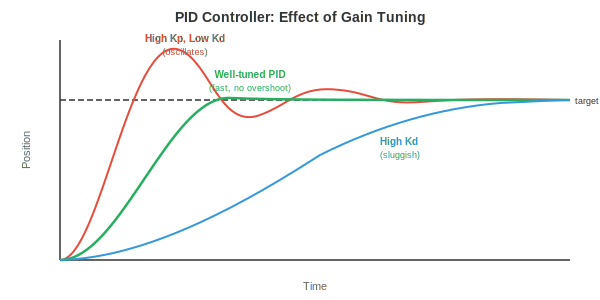

# Robot Learning

*Robot learning bridges the gap between algorithms and physical action. This file covers kinematics, dynamics, classical control, imitation learning, sim-to-real transfer, manipulation, locomotion, and safety, the techniques that give robots the ability to move, grasp, walk, and interact with the real world.*

- In previous chapters, we studied how to perceive the world (chapter 8, chapter 11 file 1) and how to learn from data (chapter 6). But perception and learning are not enough. A robot must **act**: move its arm to grasp a cup, walk across uneven terrain, or navigate a warehouse. This is where robot learning comes in.

- The central challenge is that the physical world is continuous, high-dimensional, contact-rich, and unforgiving. A classification error in image recognition is an incorrect label. A control error in robotics is a broken robot or a dropped object. The stakes are different.

## Robot Kinematics

- **Kinematics** describes the geometry of motion without considering forces. A robot arm is a chain of rigid links connected by joints. Each joint has one degree of freedom (DoF): it either rotates (revolute joint) or slides (prismatic joint).

- The **configuration** of a robot is the set of all joint angles (or displacements) $\mathbf{q} = [q_1, q_2, \ldots, q_n]^T$. This vector lives in **joint space** (or configuration space), an $n$-dimensional space where each axis corresponds to one joint. A 6-DoF robot arm has a 6D configuration space.


- **Forward kinematics (FK)** computes the position and orientation of the end-effector (the "hand") given the joint angles. This is a function $\mathbf{x} = f(\mathbf{q})$ that maps from joint space to **task space** (the 3D position and orientation of the end-effector, also called Cartesian space).

- Each joint is described by a $4 \times 4$ homogeneous transformation matrix (recall affine transformations from chapter 2). The **Denavit-Hartenberg (DH) convention** parameterises each joint with four numbers: link length $a$, link twist $\alpha$, link offset $d$, and joint angle $\theta$. The transformation for joint $i$ is:

$$T_i = \begin{bmatrix} \cos\theta_i & -\sin\theta_i \cos\alpha_i & \sin\theta_i \sin\alpha_i & a_i \cos\theta_i \\ \sin\theta_i & \cos\theta_i \cos\alpha_i & -\cos\theta_i \sin\alpha_i & a_i \sin\theta_i \\ 0 & \sin\alpha_i & \cos\alpha_i & d_i \\ 0 & 0 & 0 & 1 \end{bmatrix}$$

- The full forward kinematics is the product of all joint transformations: $T_{0 \to n} = T_1 T_2 \cdots T_n$. This is matrix multiplication chaining transformations (chapter 2): each joint's transformation is applied in sequence, rotating and translating the frame from the base to the end-effector.

- **Inverse kinematics (IK)** is the reverse problem: given a desired end-effector pose $\mathbf{x}^*$, find the joint angles $\mathbf{q}$ such that $f(\mathbf{q}) = \mathbf{x}^*$. This is much harder because:

    - The mapping is nonlinear (involves sines and cosines).
    - There may be multiple solutions (different arm configurations reach the same point).
    - There may be no solution (the target is out of reach).

- Analytical solutions exist only for specific robot geometries. For general robots, IK is solved iteratively using the **Jacobian**. The Jacobian $J(\mathbf{q})$ relates small changes in joint angles to small changes in end-effector position (recall the Jacobian from chapter 3):

$$\dot{\mathbf{x}} = J(\mathbf{q}) \dot{\mathbf{q}}$$

- To move the end-effector by a small amount $\Delta \mathbf{x}$, we need $\Delta \mathbf{q} = J^{-1} \Delta \mathbf{x}$ (or $J^+ \Delta \mathbf{x}$ using the pseudo-inverse when $J$ is not square). This is iterated until the end-effector reaches the target, which is essentially Newton's method (chapter 3) applied to the kinematics equation.

- Near **singularities**, the Jacobian loses rank (some columns become linearly dependent, as we studied in chapter 2). Physically, this means the robot loses a degree of freedom: no matter how fast the joints move, the end-effector cannot move in certain directions. The pseudo-inverse blows up near singularities, so damped least-squares (adding a regularisation term $\lambda^2 I$) is used instead:

$$\Delta \mathbf{q} = J^T(JJ^T + \lambda^2 I)^{-1} \Delta \mathbf{x}$$

## Dynamics and Control

- **Dynamics** adds forces to the picture. The equations of motion for a robot arm follow the **manipulator equation**:

$$M(\mathbf{q})\ddot{\mathbf{q}} + C(\mathbf{q}, \dot{\mathbf{q}})\dot{\mathbf{q}} + \mathbf{g}(\mathbf{q}) = \boldsymbol{\tau}$$

- where $M(\mathbf{q})$ is the mass (inertia) matrix, $C(\mathbf{q}, \dot{\mathbf{q}})$ captures Coriolis and centrifugal effects, $\mathbf{g}(\mathbf{q})$ is the gravity vector, and $\boldsymbol{\tau}$ is the vector of joint torques (the control input). This is a system of second-order differential equations, one per joint.

- The mass matrix $M$ is always symmetric and positive definite (recall from chapter 2 that positive definite matrices guarantee a unique minimum, here it ensures the system responds predictably to applied torques).

- **PID control** is the most widely used controller in robotics. For each joint, it computes a torque based on the error $e(t) = q_{\text{desired}}(t) - q_{\text{actual}}(t)$:

$$\tau(t) = K_p e(t) + K_i \int_0^t e(s) \, ds + K_d \dot{e}(t)$$

- The three terms have intuitive roles:
    - **Proportional** ($K_p$): corrects proportionally to the current error. Larger error → larger correction. Like a spring pulling the joint towards the target.
    - **Integral** ($K_i$): accumulates past errors to eliminate steady-state offset. If the joint consistently undershoots, the integral term builds up and provides extra push.
    - **Derivative** ($K_d$): reacts to the rate of change of error, providing damping. It slows the response as the error decreases, preventing overshoot and oscillation.



- Tuning $K_p, K_i, K_d$ is a balance: too much $K_p$ causes oscillation, too much $K_d$ makes the system sluggish, too much $K_i$ causes wind-up (the integral grows unbounded during sustained error).

- **Model Predictive Control (MPC)** looks ahead. At each timestep, it solves an optimisation problem: find the sequence of future controls that minimises a cost function (e.g., tracking error + control effort) over a finite horizon, subject to the dynamics model and constraints. Only the first control is applied, then the process repeats at the next timestep.

$$\min_{\mathbf{u}_{0:T}} \sum_{t=0}^{T} \left[ \|\mathbf{x}_t - \mathbf{x}_t^*\|_Q^2 + \|\mathbf{u}_t\|_R^2 \right] \quad \text{subject to} \quad \mathbf{x}_{t+1} = f(\mathbf{x}_t, \mathbf{u}_t)$$

- Here $\|\mathbf{x}\|_Q^2 = \mathbf{x}^T Q \mathbf{x}$ is a weighted norm using positive definite matrix $Q$ (chapter 2), which lets you penalise different state errors differently. MPC naturally handles constraints (joint limits, torque limits, obstacle avoidance) because they are explicitly included in the optimisation.

- **Impedance control** regulates the relationship between force and motion rather than tracking a rigid trajectory. Instead of commanding "go to position $x$," it commands "behave like a spring-damper system centred at $x$":

$$F = K_s(\mathbf{x}^* - \mathbf{x}) + D(\dot{\mathbf{x}}^* - \dot{\mathbf{x}})$$

- where $K_s$ is a stiffness matrix and $D$ is a damping matrix. This makes the robot compliant: if it contacts an obstacle, it yields rather than forcing through. Impedance control is essential for contact-rich tasks like inserting a peg into a hole or handing an object to a human.

## Imitation Learning

- Instead of hand-designing controllers, we can learn control policies from demonstrations. A human performs the task, the robot observes, and a learning algorithm extracts a policy. This is **imitation learning** (or learning from demonstration).

- **Behavioural cloning (BC)** is the simplest approach: treat the demonstrations as a supervised learning dataset. Given observation-action pairs $\{(\mathbf{o}_t, \mathbf{a}_t)\}$ from an expert, train a policy $\pi_\theta(\mathbf{a} \mid \mathbf{o})$ to predict the expert's action from the observation. This is standard supervised learning (chapter 6): minimise the loss:

$$\mathcal{L}(\theta) = \mathbb{E}_{(\mathbf{o}, \mathbf{a}) \sim \mathcal{D}} \left[ \| \pi_\theta(\mathbf{o}) - \mathbf{a} \|^2 \right]$$


- The problem is **distribution shift** (also called the **compounding error problem**). During training, the policy sees the expert's states. During deployment, the policy's own small errors push it into states the expert never visited. These unfamiliar states lead to worse actions, which lead to even more unfamiliar states, and errors compound rapidly.

- Imagine learning to drive by watching a perfect driver. You have never seen what happens after a small swerve because the expert never swerved. The first time you drift slightly, you have no idea how to recover.

- **DAgger** (Dataset Aggregation) addresses this by iterating:
    1. Train a policy on current data.
    2. Run the policy in the environment, collecting new states.
    3. Ask the expert to label these new states with the correct action.
    4. Add the new data to the dataset and retrain.

- Over iterations, the dataset covers states the learned policy actually visits, not just the expert's trajectory. The policy improves because it has seen and learned to recover from its own mistakes.

- **Action Chunking with Transformers (ACT)** is a modern approach where the policy predicts a sequence of future actions (a "chunk") rather than one action at a time. This is implemented using a conditional VAE with a transformer backbone. Predicting action chunks is more robust because it captures temporal correlations: the smoothness of a reaching motion is encoded in the chunk rather than relying on autoregressive single-step predictions that can drift.

- **Diffusion Policy** applies diffusion models (chapter 8) to action generation. Instead of predicting a single action, it models the full distribution of possible actions conditioned on the observation. Starting from noise, it iteratively denoises to produce an action sequence. This handles **multimodality** naturally: when there are multiple valid ways to complete a task (reach from the left or the right), the diffusion model can represent both modes, whereas a regression policy would average them (and reach somewhere in the middle, which might be neither valid).

## Sim-to-Real Transfer

- Training robots in the real world is expensive, slow, and dangerous. A robot learning to grasp by trial and error might take thousands of attempts, breaking objects and itself along the way. **Simulation** offers unlimited, safe, fast experience. But simulators are imperfect: physics is approximated, visuals are synthetic, contacts are simplified.

- The **sim-to-real gap** is the difference between simulated and real performance. A policy that works perfectly in simulation may fail completely on the real robot because it has overfit to simulator-specific details.


- **Domain randomisation** combats this by training across a wide range of simulator settings. Instead of one simulation, use thousands with randomised:
    - Physics: friction coefficients, mass, damping
    - Visuals: lighting, textures, colours, camera position
    - Dynamics: motor delays, noise levels

- The idea is that if the policy works across all these variations, the real world is just "another variation" within the distribution. The policy learns features that are invariant to the randomised properties, and these invariant features transfer.

- **System identification** takes the opposite approach: instead of randomising everything, carefully measure the real system's physical parameters and tune the simulator to match. This gives a more accurate simulation but is brittle (any unmodelled effect causes a gap).

- In practice, the best results combine both: system identification to get the simulator reasonably close, then domain randomisation to cover the remaining uncertainty.

- **Sim-to-real via fine-tuning** trains primarily in simulation, then does a small amount of real-world fine-tuning. The simulation provides a good initialisation, and the real-world data corrects simulator-specific biases. This requires far less real-world data than training from scratch.

## World Models for Robotics

- All of the RL and imitation learning approaches above are **model-free**: the policy learns to act through direct interaction (or demonstrations) without explicitly modelling how the world works. An alternative is **model-based** learning: first learn a model of the environment's dynamics, then use that model to plan or to generate synthetic experience.

- A **world model** learns the transition function $p(s_{t+1} \mid s_t, a_t)$: given the current state and an action, predict the next state (as introduced in chapter 10). In robotics, this means predicting what will happen if the robot takes a particular action: "if I push this block left, it will slide 3cm and the cup behind it will topple."

- The appeal is **sample efficiency**. Real-world robot interaction is expensive. If the robot can learn a world model from a modest amount of real data, it can then "imagine" thousands of trajectories by rolling out the model in its head, planning and refining its policy without touching the physical world. This is analogous to how a chess player thinks ahead by simulating moves mentally.

- **DreamerV3** is a general-purpose model-based RL agent. It learns three components jointly:
    - A **representation model** that encodes observations into a compact latent state.
    - A **transition model** (the world model) that predicts the next latent state given the current state and action.
    - A **reward model** that predicts the reward from the latent state.

- The agent then "dreams" by rolling out the transition model for many steps in latent space, trains a policy on these imagined trajectories, and transfers the policy to the real environment. The key innovation is that all imagination happens in latent space (compact learned representations), not in pixel space, making it computationally feasible.

$$\hat{s}_{t+1} = f_\theta(s_t, a_t), \quad \hat{r}_t = g_\theta(s_t)$$

- The transition model $f_\theta$ and reward model $g_\theta$ are trained on real experience, and the policy is trained on imagined rollouts. This decouples data collection from policy optimisation.

- For robot manipulation, world models enable **mental rehearsal**. Before attempting a grasp, the robot can simulate several approaches in its learned model and pick the one most likely to succeed. This is especially valuable for contact-rich tasks where real-world trial and error is slow and risky.

- World models also connect naturally to **sim-to-real**: a world model trained on real data is effectively a learned simulator that automatically captures real-world physics, bypassing the sim-to-real gap entirely. The model may be less accurate than a hand-built simulator for well-understood scenarios, but it captures effects (friction, deformation, contact dynamics) that hand-built simulators often get wrong.

- The **JEPA** (Joint Embedding Predictive Architecture, introduced in chapter 10) offers an alternative to pixel-level prediction. Instead of predicting exact future observations, JEPA predicts in embedding space: "the latent representation of the next state will be close to this vector." This avoids the difficulty of predicting pixel-perfect futures (which is both unnecessary and computationally wasteful) and focuses on predicting the aspects of the future that matter for decision-making.

- The limitation of world models is **compounding prediction error**. Small inaccuracies in the transition model accumulate over long rollouts, causing imagined trajectories to diverge from reality. Mitigations include short imagination horizons, ensemble models (using uncertainty to detect when predictions become unreliable), and periodically grounding the model with fresh real-world data.

## Manipulation

- **Manipulation** is the art of using a robot's end-effector to interact with objects: picking, placing, pushing, inserting, assembling.

- **Grasping** is the foundational manipulation skill. The goal is to find a stable grasp pose: a position and orientation for the gripper that will securely hold the object.

- **Analytical grasp planning** uses physics. A grasp is stable if the contact forces can resist external wrenches (forces and torques). For a parallel-jaw gripper, the simplest criterion is the **force closure** condition: the contact normals must span all directions of force, so the grasp can resist any disturbance. This involves checking the rank of the grasp wrench matrix, a direct application of the rank concept from chapter 2.

- **Data-driven grasping** learns to predict grasp success from sensory input. Given a depth image of objects on a table, a network predicts a grasp quality score for each candidate gripper pose. **GraspNet** and similar architectures use point cloud encoders (PointNet-style, chapter 8) to predict 6-DoF grasp poses (position + orientation) with confidence scores.

- **Dexterous manipulation** goes beyond simple pick-and-place. A multi-fingered hand has 20+ DoF and can perform tasks like in-hand rotation (spinning a pen between fingers), tool use, and delicate assembly. The state space is enormous and contacts are complex, making this one of the hardest problems in robotics.

- Learning dexterous manipulation often uses reinforcement learning (chapter 6) in simulation with heavy domain randomisation. OpenAI's work on Rubik's cube solving with a Shadow hand trained PPO policies in simulation with randomised physics, achieving transfer to a real robot hand.

- **Contact-rich tasks** like peg-in-hole insertion or wiping a surface require the robot to maintain controlled contact with the environment. These tasks demand force sensing and compliant control (impedance control), and they are difficult to simulate accurately because contact physics is notoriously hard to model.

## Locomotion

- Locomotion is moving the robot's body through the world: walking, running, climbing, swimming. The key difference from manipulation is that the robot must maintain balance while moving, and the contact points with the ground change over time.

- **Legged locomotion** is challenging because it is inherently unstable. A bipedal robot (humanoid) standing on one leg during a step is like an inverted pendulum. The centre of mass must stay above the support polygon (the convex hull of the feet in contact with the ground), or the robot falls.

- The **Zero Moment Point (ZMP)** is the point on the ground where the net torque from gravity and inertial forces is zero. If the ZMP stays inside the support polygon, the robot will not tip over. Traditional humanoid controllers (like Honda's ASIMO) plan trajectories that keep the ZMP within bounds.

- **Central Pattern Generators (CPGs)** are oscillator-based controllers inspired by biology. Animals generate rhythmic locomotion patterns (walking, trotting, galloping) using neural circuits in the spinal cord, without constant brain involvement. CPG models use coupled differential equations:

$$\dot{\phi}_i = \omega_i + \sum_j w_{ij} \sin(\phi_j - \phi_i - \psi_{ij})$$

- where $\phi_i$ is the phase of oscillator $i$, $\omega_i$ is the natural frequency, $w_{ij}$ is the coupling strength, and $\psi_{ij}$ is the desired phase offset. Different phase relationships produce different gaits: all legs in sync (bound), alternating pairs (trot), sequential (walk). The sine coupling naturally synchronises the oscillators, analogous to how Fourier series (chapter 3) decompose motion into frequency components.

- **Reinforcement learning for locomotion** has become the dominant approach for agile quadruped and humanoid robots. The robot learns a policy $\pi(\mathbf{a} \mid \mathbf{o})$ through trial and error in simulation (chapter 6), with rewards for forward velocity, stability, and energy efficiency, and penalties for falling, joint limit violations, and jerky motions.

- The key insight from recent work (e.g., by Agility Robotics, Boston Dynamics, and academic labs) is that RL-trained locomotion policies are far more robust than hand-designed controllers. They naturally learn to recover from pushes, adapt to terrain changes, and handle situations that no engineer anticipated. Training typically uses PPO (chapter 6) with domain randomisation.

- **Quadruped robots** (like Boston Dynamics Spot or Unitree Go2) have become the workhorse of legged robotics. Four legs provide inherent stability (a tripod of three legs can always support the body while one leg moves). RL policies for quadrupeds achieve impressive results: running at 3+ m/s, climbing stairs, navigating rocky terrain, and recovering from kicks.

- **Humanoid locomotion** is harder because bipeds have a smaller support polygon and higher centre of mass. Recent advances (Tesla Optimus, Figure, Unitree H1) use RL trained in simulation with careful reward shaping. The humanoid must learn not just to walk but to coordinate arm swings for balance, navigate uneven surfaces, and recover from perturbations.

## Safety in Robot Learning

- A robot that explores randomly to learn (as in RL) may damage itself, its environment, or nearby humans. **Safe robot learning** constrains exploration to avoid catastrophic outcomes.

- **Constrained RL** adds safety constraints to the MDP (chapter 6). The objective becomes: maximise reward subject to $J_c(\pi) \leq d$, where $J_c$ is the expected cumulative cost (e.g., collision events) and $d$ is the maximum allowable cost. Algorithms like Constrained Policy Optimisation (CPO) extend PPO to handle these constraints.

- **Safety envelopes** define hard boundaries that the robot must never cross, regardless of what the learned policy says. A safety controller monitors the robot's state and overrides the learned policy when a constraint is about to be violated (e.g., approaching a joint limit, moving too fast near a human, or exceeding a force threshold). This is a layered architecture: the learning algorithm handles performance, and the safety layer handles constraints.

- **Risk-aware planning** explicitly models uncertainty in the environment and the robot's own state estimate. Instead of planning for the most likely outcome, it plans for the worst case within a confidence bound. This connects to the condition number concept (chapter 2): a well-conditioned system is robust to perturbations, and risk-aware planning seeks control strategies that remain safe under perturbation.

## Coding Tasks (use CoLab or notebook)

1. Implement forward kinematics for a simple 2-link planar robot arm. Compute and visualise the end-effector position for different joint angles.
```python
import jax.numpy as jnp
import matplotlib.pyplot as plt

def forward_kinematics(q1, q2, l1=1.0, l2=0.8):
    """Compute joint and end-effector positions for a 2-link arm."""
    x1 = l1 * jnp.cos(q1)
    y1 = l1 * jnp.sin(q1)
    x2 = x1 + l2 * jnp.cos(q1 + q2)
    y2 = y1 + l2 * jnp.sin(q1 + q2)
    return jnp.array([0, x1, x2]), jnp.array([0, y1, y2])

fig, ax = plt.subplots(figsize=(6, 6))
configs = [(0.5, 0.3), (1.0, -0.5), (1.5, 1.0), (2.0, -1.5)]
colors = ["#e74c3c", "#3498db", "#27ae60", "#9b59b6"]

for (q1, q2), c in zip(configs, colors):
    xs, ys = forward_kinematics(q1, q2)
    ax.plot(xs, ys, "o-", color=c, linewidth=2, markersize=6,
            label=f"q=({q1:.1f}, {q2:.1f})")

ax.set_xlim(-2, 2); ax.set_ylim(-2, 2)
ax.set_aspect("equal"); ax.grid(True); ax.legend()
ax.set_title("2-Link Robot Arm: Forward Kinematics")
plt.show()
```

2. Implement inverse kinematics using the Jacobian pseudo-inverse. Start from a random configuration and iteratively move the end-effector to a target.
```python
import jax
import jax.numpy as jnp
import matplotlib.pyplot as plt

l1, l2 = 1.0, 0.8

def end_effector(q):
    x = l1 * jnp.cos(q[0]) + l2 * jnp.cos(q[0] + q[1])
    y = l1 * jnp.sin(q[0]) + l2 * jnp.sin(q[0] + q[1])
    return jnp.array([x, y])

jacobian_fn = jax.jacobian(end_effector)

target = jnp.array([0.5, 1.2])
q = jnp.array([0.1, 0.1])
trajectory = [end_effector(q)]

for _ in range(50):
    pos = end_effector(q)
    error = target - pos
    if jnp.linalg.norm(error) < 1e-4:
        break
    J = jacobian_fn(q)
    # Damped pseudo-inverse to handle near-singularities
    dq = J.T @ jnp.linalg.solve(J @ J.T + 0.01 * jnp.eye(2), error)
    q = q + dq
    trajectory.append(end_effector(q))

traj = jnp.stack(trajectory)
plt.plot(traj[:, 0], traj[:, 1], "b.-", label="end-effector path")
plt.plot(*target, "r*", markersize=15, label="target")
plt.gca().set_aspect("equal"); plt.grid(True); plt.legend()
plt.title(f"IK converged in {len(trajectory)-1} steps")
plt.show()
```

3. Simulate a simple PID controller tracking a desired joint trajectory. Observe the effect of tuning the gains.
```python
import jax.numpy as jnp
import matplotlib.pyplot as plt

# Desired trajectory: smooth sinusoidal motion
dt = 0.01
t = jnp.arange(0, 5, dt)
q_desired = jnp.sin(2 * t)

# Simulate second-order dynamics: m * q_ddot + b * q_dot = tau
m, b_damp = 1.0, 0.5

for Kp, Kd, Ki, label in [(10, 5, 0, "PD only"), (10, 5, 2, "PID"), (50, 10, 2, "Aggressive PID")]:
    q, q_dot, integral = 0.0, 0.0, 0.0
    qs = []
    for i in range(len(t)):
        error = q_desired[i] - q
        integral += error * dt
        d_error = -q_dot  # derivative of error (desired velocity is known but simplified here)
        tau = Kp * error + Kd * d_error + Ki * integral
        q_ddot = (tau - b_damp * q_dot) / m
        q_dot += q_ddot * dt
        q += q_dot * dt
        qs.append(float(q))

    plt.plot(t, qs, label=label)

plt.plot(t, q_desired, "k--", label="desired", linewidth=2)
plt.xlabel("Time (s)"); plt.ylabel("Joint angle")
plt.legend(); plt.title("PID Controller Tracking")
plt.show()
```
