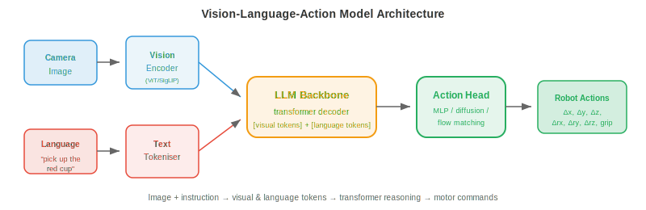

# Vision-Language-Action Models

*Vision-Language-Action models (VLAs) unify seeing, understanding language, and acting into a single neural network. This file covers the VLA architecture, action tokenisation, RT-2, Octo, OpenVLA, pretraining strategies, generalisation, embodiment-agnostic models, and benchmarks*

- In the previous files, we covered perception (sensing the world) and robot learning (controlling the body). Traditionally, these were separate pipelines: a perception module detects objects, a language module interprets commands, and a control module generates actions. Each module was designed, trained, and debugged independently.

- **Vision-Language-Action models (VLAs)** collapse this pipeline into a single neural network. The model takes in images (vision), a natural language instruction (language), and outputs motor commands (action). One model, end-to-end.

- This follows the same unification trend we saw in chapter 10: just as multimodal models merged vision and language understanding into one architecture, VLAs extend this to physical action. The insight is that language provides a natural, flexible interface for specifying tasks ("pick up the red cup and place it on the shelf"), and large pretrained vision-language models already understand both images and instructions.

## From Vision-Language to Action

- Recall from chapter 10 that **Vision-Language Models (VLMs)** like LLaVA and Flamingo take an image and text as input and produce text as output. They understand scenes, answer questions, and follow instructions, all in language.

- VLAs ask: what if the output is not text but **robot actions**? Instead of generating "The red cup is on the left side of the table," the model generates a sequence of motor commands that moves the arm to grasp that cup.

- The key architectural insight is that actions can be represented as tokens, just like words. If a VLM generates language token by token using next-token prediction, a VLA generates action tokens in the same way. The transformer does not fundamentally care whether the output token means "cup" or "move gripper 2cm forward."

- This reframes robot control as a sequence modelling problem, which transformers excel at (chapter 7). The model learns the mapping: (image observation, language instruction) $\to$ (sequence of action tokens).

## VLA Architecture



- A typical VLA has three components:

    - **Vision encoder**: processes camera images into visual tokens. Usually a pretrained ViT (chapter 8) or SigLIP encoder (chapter 10). The image is split into patches, each embedded as a token, exactly as in standard vision transformers.

    - **Language model backbone**: a pretrained LLM (e.g., LLaMA, PaLM) that processes the interleaved sequence of visual tokens and language tokens. This is where the reasoning happens: the model understands "pick up the **red** cup" by attending to both the instruction and the visual features.

    - **Action head**: maps the LLM's output to robot actions. This can be a simple MLP that maps the last hidden state to continuous action values, or a tokenisation scheme that converts actions into discrete tokens predicted by the LLM's existing vocabulary.

- The architecture looks like:

$$\text{Image} \xrightarrow{\text{ViT}} \text{visual tokens} \quad + \quad \text{Instruction} \xrightarrow{\text{tokeniser}} \text{language tokens} \quad \xrightarrow{\text{LLM}} \quad \text{action tokens}$$

- The visual tokens and language tokens are concatenated (or interleaved) and fed into the transformer backbone, which produces action tokens autoregressively. This is the same architecture as a VLM (chapter 10), but the output modality is action instead of text.

## Action Tokenisation

- Robot actions are continuous: joint velocities, end-effector positions, gripper width. These must be converted into discrete tokens for the LLM to generate them.


- The simplest approach is **uniform discretisation**. Each action dimension is divided into $N$ bins spanning the range of valid values. For example, if the x-velocity ranges from -0.1 to 0.1 m/s and we use 256 bins, each bin represents $\frac{0.2}{256} \approx 0.8$ mm/s. An action value is mapped to its nearest bin index, which becomes a token.

- With 7 action dimensions (6 DoF + gripper) and 256 bins each, the action vocabulary has $7 \times 256 = 1792$ tokens. These are added to the LLM's existing text vocabulary. The model generates one action token per dimension, autoregressively, just like generating words.

- **Action chunking** predicts multiple future timesteps at once rather than a single action. If the chunk size is $H$, the model outputs $H \times d$ tokens (where $d$ is the action dimensionality). This is critical for smooth, temporally coherent motions. Predicting one step at a time can produce jerky behaviour because each prediction is independent. Chunking forces the model to plan a short trajectory, capturing temporal structure.

- More sophisticated approaches use **learned tokenisation** via VQ-VAE (chapter 10). A VQ-VAE encoder maps a sequence of continuous actions to a sequence of discrete codebook indices, and the decoder reconstructs the continuous actions from these indices. The LLM then generates codebook indices rather than uniformly binned values. This is analogous to how image tokenisers (chapter 10) compress visual information into a compact discrete code.

## Key VLA Models

- **RT-2** (Robotic Transformer 2, Google DeepMind) was the first large-scale VLA. It takes a pretrained VLM (PaLM-E or PaLI-X, up to 55B parameters) and fine-tunes it on robot demonstration data. Actions are represented as text strings: the token sequence "1 128 91 241 5 101 127" encodes a 7-dimensional action (each number is a bin index).

- RT-2 demonstrated a remarkable property: **emergent capabilities** from the VLM backbone transfer to robotics. The model can follow instructions involving concepts it never saw in robot data (e.g., "move the banana to the country that starts with A" requires visual object recognition + world knowledge + action). The VLM's language understanding and visual reasoning "come for free."

- The limitation of RT-2 is that it was trained on data from a single robot embodiment (a specific arm with a specific gripper). It does not generalise to different robots.

- **Octo** (UC Berkeley) is an open-source, **embodiment-agnostic** VLA designed to work across different robot platforms. The key innovations are:

    - A **diffusion action head** instead of autoregressive token prediction. The action head takes the transformer's output and produces actions via a denoising diffusion process (chapter 8). This naturally handles multimodal action distributions (see diagram below), where there are multiple valid ways to complete a task.


    - **Flexible observation and action spaces**: Octo uses task-specific tokenisers for different robot configurations. It was pretrained on the Open X-Embodiment dataset, which contains demonstrations from 22 different robot embodiments.

    - **Efficient fine-tuning**: Octo can be fine-tuned to a new robot with as few as 100 demonstrations, making it practical for labs with limited data.

- **OpenVLA** (Stanford, UC Berkeley) takes the approach of fine-tuning an existing open-source VLM (Llama-based) for robotics. It uses a 7B parameter backbone, uniform action tokenisation (256 bins per dimension), and trains on Open X-Embodiment data. Its strength is simplicity: the architecture is a standard VLM with action tokens appended to the vocabulary, making it easy to train and deploy with existing LLM infrastructure.

- **$\pi_0$** (Physical Intelligence) represents the state of the art. It uses a pretrained VLM backbone with a **flow matching** action head (chapter 8). Flow matching generates actions by learning a velocity field that transports noise to action distributions, producing smooth, temporally coherent action trajectories. $\pi_0$ demonstrated remarkable generality, performing tasks across multiple robot embodiments including bimanual manipulation and dexterous hand control.

## Pretraining Recipes

- VLAs benefit enormously from pretrained VLM backbones, which already understand visual scenes and language. The training pipeline typically follows stages:

    1. **VLM pretraining**: train (or use off-the-shelf) a vision-language model on billions of image-text pairs from the internet (CLIP, SigLIP, LLaVA-style training as covered in chapter 10).

    2. **Robot data co-training**: fine-tune the VLM on a mixture of internet data and robot demonstration data. The internet data prevents catastrophic forgetting of visual and language understanding, while the robot data teaches action generation. The mixing ratio matters: too much robot data degrades language understanding, too little fails to learn actions.

    3. **Task-specific fine-tuning**: optional fine-tuning on demonstrations for a specific task or robot, often with LoRA (chapter 10) to keep the number of trainable parameters small.

- The amount of robot data is orders of magnitude smaller than internet data. A VLM might be pretrained on billions of images, but the largest robot datasets (Open X-Embodiment) contain only millions of frames across all embodiments. This data scarcity is why starting from a pretrained VLM is essential: the visual and language representations transfer, and only the action mapping needs to be learned from limited robot data.

## Generalisation

- The promise of VLAs is **generalisation**: performing tasks not seen during training, with objects not seen before, in environments not seen before, following instructions not seen before.

- VLAs generalise along several axes:

    - **Novel objects**: the VLM backbone recognises objects from internet pretraining. If the model knows what a "screwdriver" looks like from web images, it can manipulate one even if no robot demonstration ever included a screwdriver.

    - **Novel instructions**: compositional language understanding allows the model to follow new combinations of known concepts. "Stack the blue block on the green block" works even if training only showed stacking red blocks, because the model understands colour adjectives from language pretraining.

    - **Novel environments**: to a degree, VLAs transfer across visual domains (different tables, lighting, backgrounds) because the vision encoder is pretrained on diverse web images. But this has limits: a robot trained in a lab may struggle in a cluttered kitchen.

    - **Novel embodiments**: this is the hardest axis. Different robots have different action spaces (joint angles vs. end-effector velocities), different sensors (wrist cameras vs. overhead cameras), and different physical capabilities. Embodiment-agnostic models like Octo and $\pi_0$ address this with flexible tokenisers and pretraining across many robot types.

- Generalisation is evaluated on **held-out tasks**: the robot is asked to perform tasks it was never trained on. Success rates of 50–80% on novel tasks are considered strong results, compared to >90% on in-distribution tasks. The gap is shrinking as models scale and robot datasets grow.

## Embodiment-Agnostic Models

- The field is moving towards **one model, many robots**. Instead of training a separate policy for each robot, a single VLA handles multiple embodiments.

- This requires solving the **action space mismatch** problem. A 7-DoF arm with a parallel-jaw gripper has 7 action dimensions. A bimanual setup has 14. A quadruped has 12. A humanoid has 30+. The action tokenisation must be flexible enough to handle all of these.

- Solutions include:
    - **Padded action vectors**: use the largest action space and pad smaller ones with zeros.
    - **Per-embodiment action heads**: a shared transformer backbone with separate small MLPs for each robot type.
    - **Normalised action representations**: express all actions in a common frame (e.g., end-effector velocity in the world frame) so that different robots producing similar end-effector motions share the same action tokens.

- The shared backbone learns general visual and language understanding, plus common manipulation strategies (approach from above, align with the object, close the gripper). The embodiment-specific components only need to translate these high-level strategies into specific motor commands.

## Benchmarks and Evaluation

- Evaluating VLAs is uniquely challenging because it requires physical robot experiments (or high-fidelity simulation).

- **SIMPLER** (Simulated Manipulation Policy Evaluation for Robot learning) provides standardised simulated environments for comparing VLA performance without physical hardware. It correlates well with real-world success rates and enables reproducible benchmarking.

- **Real-world evaluation** remains the gold standard. The typical protocol:
    1. Define a set of tasks with clear success criteria (object reaches target position, correct object selected, task completed within time limit).
    2. Run $N$ trials per task (typically 10–50).
    3. Report success rate with confidence intervals.
    4. Include held-out (never-trained-on) tasks to measure generalisation.

- The **Open X-Embodiment** dataset and benchmark aggregate robot data from 22 institutions across multiple robot platforms. It provides a standardised format for sharing demonstrations and a common evaluation suite for cross-embodiment transfer.

## Coding Tasks (use CoLab or notebook)

1. Implement action tokenisation: discretise continuous actions into bins and reconstruct them. Observe the quantisation error as a function of bin count.
```python
import jax.numpy as jnp

# Continuous action: 7 dimensions (6 DoF + gripper)
action_true = jnp.array([0.023, -0.051, 0.012, 0.1, -0.03, 0.005, 0.8])
action_min = jnp.array([-0.1, -0.1, -0.1, -0.5, -0.5, -0.5, 0.0])
action_max = jnp.array([ 0.1,  0.1,  0.1,  0.5,  0.5,  0.5, 1.0])

for n_bins in [16, 64, 256, 1024]:
    # Tokenise: map continuous value to bin index
    normalised = (action_true - action_min) / (action_max - action_min)
    tokens = jnp.clip((normalised * n_bins).astype(int), 0, n_bins - 1)

    # Detokenise: map bin index back to continuous value
    reconstructed = (tokens + 0.5) / n_bins * (action_max - action_min) + action_min

    error = jnp.linalg.norm(action_true - reconstructed)
    print(f"bins={n_bins:4d}  tokens={tokens}  error={error:.6f}")
```

2. Simulate action chunking vs single-step prediction. Generate a smooth trajectory, add noise to single-step predictions, and compare with chunk-based prediction.
```python
import jax
import jax.numpy as jnp
import matplotlib.pyplot as plt

# Ground truth smooth trajectory (e.g., reaching motion)
t = jnp.linspace(0, 2 * jnp.pi, 100)
gt_x = jnp.sin(t)
gt_y = 1 - jnp.cos(t)

# Single-step: each prediction has independent noise
rng = jax.random.PRNGKey(42)
noise_ss = jax.random.normal(rng, (100, 2)) * 0.05
single_step = jnp.stack([gt_x, gt_y], axis=1) + noise_ss
# Cumulative drift from single-step errors
single_step_cumulative = jnp.cumsum(noise_ss, axis=0) * 0.3 + jnp.stack([gt_x, gt_y], axis=1)

# Chunked (chunk_size=10): noise is correlated within chunks, smoother
chunk_size = 10
rng2 = jax.random.PRNGKey(7)
chunks = []
for i in range(0, 100, chunk_size):
    chunk_noise = jax.random.normal(jax.random.fold_in(rng2, i), (2,)) * 0.05
    chunk = jnp.stack([gt_x[i:i+chunk_size], gt_y[i:i+chunk_size]], axis=1)
    chunks.append(chunk + chunk_noise)
chunked = jnp.concatenate(chunks, axis=0)

plt.figure(figsize=(8, 4))
plt.plot(gt_x, gt_y, "k-", linewidth=2, label="Ground truth")
plt.plot(single_step_cumulative[:, 0], single_step_cumulative[:, 1],
         "r-", alpha=0.7, label="Single-step (drifts)")
plt.plot(chunked[:, 0], chunked[:, 1], "b-", alpha=0.7, label="Chunked (stable)")
plt.legend(); plt.axis("equal"); plt.grid(True)
plt.title("Action Chunking vs Single-Step Prediction")
plt.show()
```

3. Visualise how a VLA's action distribution can be multimodal. Use a simple 2D mixture of Gaussians to show why diffusion/flow-matching action heads are preferable to regression.
```python
import jax
import jax.numpy as jnp
import matplotlib.pyplot as plt

# Two valid ways to reach around an obstacle: left or right
rng = jax.random.PRNGKey(0)
k1, k2 = jax.random.split(rng)

mode1 = jax.random.normal(k1, (200, 2)) * 0.15 + jnp.array([-1.0, 0.5])
mode2 = jax.random.normal(k2, (200, 2)) * 0.15 + jnp.array([ 1.0, 0.5])
samples = jnp.concatenate([mode1, mode2])

# Regression predicts the mean = average of modes (invalid!)
mean_pred = samples.mean(axis=0)

plt.figure(figsize=(6, 5))
plt.scatter(samples[:, 0], samples[:, 1], s=5, alpha=0.5, label="True action distribution")
plt.plot(*mean_pred, "rx", markersize=15, markeredgewidth=3, label="Regression mean (invalid!)")
plt.plot(-1, 0.5, "g^", markersize=12, label="Mode 1 (go left)")
plt.plot(1, 0.5, "b^", markersize=12, label="Mode 2 (go right)")
plt.legend(); plt.grid(True)
plt.title("Multimodal Actions: Why Regression Fails")
plt.xlabel("Action dim 1"); plt.ylabel("Action dim 2")
plt.show()
```
