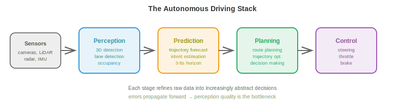
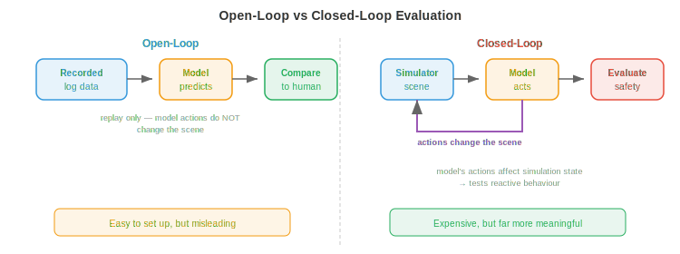

# Self-Driving Cars

*Self-driving cars are the most commercially advanced autonomous systems, integrating perception, prediction, planning, and control into a single vehicle. This file covers the autonomous driving stack, HD maps, motion prediction, planning, end-to-end driving, simulation, safety standards, and levels of autonomy*

- Self-driving cars are arguably the hardest robotics problem being attempted at scale. Unlike a factory robot that operates in a controlled environment, a self-driving car must handle an open world: unpredictable human drivers, pedestrians who jaywalk, construction zones that appear overnight, and weather that changes by the minute.

- The stakes are also uniquely high. A self-driving car operates at highway speeds among vulnerable road users. The error tolerance is near zero for safety-critical failures.

## The Autonomous Driving Stack

- The classical self-driving architecture is a **modular pipeline** with four stages, each feeding into the next:

$$\text{Perception} \to \text{Prediction} \to \text{Planning} \to \text{Control}$$



- **Perception** (covered in file 1 of this chapter) processes raw sensor data into a structured scene representation: detected objects with 3D positions, velocities, and class labels; lane markings; traffic lights; drivable surface boundaries.

- **Prediction** forecasts how other agents (vehicles, pedestrians, cyclists) will move in the future. Given the current state of the scene, the prediction module outputs trajectories for each agent over a time horizon (typically 3-8 seconds into the future).

- **Planning** decides what the ego vehicle should do: which path to follow, when to change lanes, when to yield, when to accelerate or brake. It takes the predicted scene and produces a trajectory for the ego vehicle that is safe, comfortable, and makes progress towards the destination.

- **Control** converts the planned trajectory into actuator commands: steering angle, throttle, and brake. This is the lowest level, translating the abstract trajectory into physical motion.

- The modular design has clear engineering advantages: each module can be developed, tested, and improved independently. But it also has weaknesses: errors propagate downstream (a missed detection is invisible to the planner), and information is lost at each interface (the planner sees bounding boxes, not the rich sensor data that produced them).

## HD Maps

- **High-Definition (HD) maps** are detailed, centimetre-accurate digital maps that encode the road structure: lane boundaries, lane connectivity (which lane connects to which at an intersection), traffic sign positions, speed limits, crosswalk locations, and road surface elevation.

- HD maps provide a strong prior for the driving task. The perception module does not need to discover lane boundaries from scratch every frame; it just needs to localise the vehicle within the map and verify that reality matches the stored structure. This dramatically simplifies planning.

- Building HD maps requires specialised survey vehicles equipped with high-end LiDAR, cameras, and RTK-GPS. The maps must be maintained and updated as roads change. This is expensive and does not scale easily to every road on Earth.

- **Mapless driving** (also called "online mapping") aims to eliminate the dependency on pre-built HD maps. Instead, the vehicle constructs a local map in real-time from its sensors. Models like **MapTR** and **MapTRv2** use transformer architectures to predict vectorised map elements (lane centrelines, road boundaries, pedestrian crossings) directly from camera images, outputting polylines as ordered point sequences.

- The mapless approach trades map accuracy for scalability: any road the car can drive on, it can map. But it requires the perception system to be robust enough to detect all relevant road structure in real-time, including in complex intersections, highway ramps, and construction zones.

- In practice, many systems use a hybrid approach: a lightweight map with coarse road topology (from existing map providers), enriched in real-time by the vehicle's sensors.

## Motion Prediction

- Predicting where other road users will go is one of the hardest subproblems in self-driving. Humans are unpredictable, intentions are hidden, and the space of possible futures branches rapidly.

- The input to a prediction model is the **scene context**: the positions and velocities of all detected agents over the recent past (typically 1-2 seconds of history), plus static context (lane geometry, traffic signals, road boundaries).

- The output is a set of **predicted trajectories** for each agent, typically covering 3-8 seconds into the future. Since the future is uncertain, good prediction models output multiple possible trajectories with associated probabilities, not a single point estimate.

- **Trajectory forecasting** as a regression problem: predict the future $(x, y)$ coordinates of each agent at discrete future timesteps. The loss is typically the minimum average displacement error (minADE) over the $K$ predicted trajectories:

$$\text{minADE}_K = \min_{k \in \{1, \ldots, K\}} \frac{1}{T} \sum_{t=1}^{T} \| \hat{\mathbf{p}}_t^{(k)} - \mathbf{p}_t \|_2$$

- This is a "best of $K$" metric: the model gets credit if any of its $K$ predictions is close to the ground truth. This encourages diverse, multimodal predictions.

- **Social forces** model pedestrian behaviour as a dynamical system where each person experiences attractive forces (towards their goal) and repulsive forces (away from other pedestrians and obstacles). The acceleration of person $i$ is:

$$\mathbf{a}_i = \frac{\mathbf{v}_i^{\text{desired}} - \mathbf{v}_i}{\tau} + \sum_{j \neq i} \mathbf{f}_{ij}^{\text{repulsive}} + \sum_{\text{walls}} \mathbf{f}_{\text{wall}}$$

- This is a system of differential equations similar to the robot dynamics equation from file 2 of this chapter. The model is elegant but relies on hand-tuned force parameters and struggles with complex multi-agent interactions.

- **Graph Neural Networks (GNNs)** for prediction model the scene as a graph: each agent is a node, and edges represent spatial relationships (proximity, lane sharing). Message passing between nodes captures interactions: "this car is yielding to that pedestrian" or "these two vehicles are merging into the same lane."

- Modern prediction architectures (e.g., **MTR**, **QCNet**) use transformer-based models that jointly reason about agent history, map context, and agent-agent interactions. Agents attend to relevant map features (their current lane, upcoming intersections) and to other agents (the car in front, the pedestrian at the crosswalk) via cross-attention. The output is a set of trajectory hypotheses generated autoregressively or via a mixture model.

- **Goal-conditioned prediction** first predicts where an agent is likely to go (a set of candidate goal points, like lane endpoints or intersection exits), then predicts the trajectory to reach each goal. This decomposes the problem into "where" (discrete, manageable) and "how" (continuous path given the goal), making the multimodal prediction problem more tractable.

## Planning

- Given the predicted scene, the planner must produce a trajectory for the ego vehicle. This is a constrained optimisation problem: find a trajectory that is safe, comfortable, efficient, and legal.

- **Rule-based planners** encode driving behaviour as a set of if-then rules: "if a pedestrian is in the crosswalk, yield," "if the gap to the vehicle ahead is less than 2 seconds, do not change lanes," "if approaching a red light, decelerate to stop at the stop line." These rules are interpretable and auditable, but they become unwieldy for complex scenarios (thousands of rules, many edge cases, interactions between rules).

- **Optimisation-based planners** formulate driving as trajectory optimisation. The ego trajectory is parameterised (e.g., as a sequence of $(x, y, \theta, v)$ states at future timesteps) and an objective function is minimised:

$$\min_{\boldsymbol{\xi}} \underbrace{w_1 \cdot J_{\text{progress}}(\boldsymbol{\xi})}_{\text{get to destination}} + \underbrace{w_2 \cdot J_{\text{comfort}}(\boldsymbol{\xi})}_{\text{smooth ride}} + \underbrace{w_3 \cdot J_{\text{safety}}(\boldsymbol{\xi})}_{\text{avoid collisions}}$$

$$\text{subject to: } \text{kinematic constraints, speed limits, lane boundaries}$$

- The progress term penalises deviations from the desired route. The comfort term penalises high lateral acceleration, jerk (derivative of acceleration), and abrupt steering, because passengers feel these. The safety term penalises proximity to other agents, using predicted trajectories to evaluate collision risk.

- This is constrained optimisation (chapter 3): minimise a cost function subject to inequality constraints. The weights $w_1, w_2, w_3$ trade off competing objectives (aggressive driving is faster but less comfortable and less safe).

- **Learning-based planners** use neural networks trained on human driving data to generate trajectories. The model observes the scene and directly outputs a planned trajectory, learning the complex trade-offs implicitly from examples of expert human driving.

- The advantage is that human driving behaviour is captured holistically, including the subtle, hard-to-formalise aspects: how aggressively to merge, when to nudge forward at an intersection, how much space to give a cyclist. The disadvantage is the same distribution shift problem from imitation learning (file 2): the model may behave unpredictably in situations not well-represented in training data.

## End-to-End Driving

- **End-to-end driving** removes the modular boundaries entirely. A single neural network takes raw sensor inputs (camera images, LiDAR point clouds) and directly outputs driving commands (steering, throttle, brake) or a planned trajectory. No separate perception, prediction, or planning modules.

- The appeal is that the entire system is jointly optimised for the final task (safe driving), so no information is lost at module boundaries. The perception module learns to extract exactly the features the planner needs, rather than generic object detections that may not capture task-relevant details.

- **UniAD** (Unified Autonomous Driving) is a landmark end-to-end architecture. It processes multi-camera images through a BEV encoder, then applies a cascade of transformer-based modules: tracking, online mapping, motion prediction, occupancy prediction, and planning. While it has internal modules, they are all differentiable and trained jointly end-to-end, with the planning loss backpropagating through the entire network.

- The planning module in UniAD generates future ego-vehicle waypoints by attending to the predicted BEV features, predicted agent trajectories, and predicted occupancy. This is the multivariate chain rule (chapter 3) in action: gradients flow from the planning loss all the way back to the image encoder, telling the perception features how to be more useful for planning.

- More recent end-to-end approaches use VLA-style architectures (file 3 of this chapter). Models like **DriveVLM** take camera images and a navigation instruction (or route), and produce driving actions using a VLM backbone. This brings the benefits of large-scale pretraining (visual understanding, reasoning) directly into the driving stack.

- The tension in end-to-end driving is **interpretability**. A modular system can report "I detected a pedestrian at (x, y) and predicted they will cross" -- the failure mode is diagnosable. An end-to-end system is a black box that produces a steering angle. When it fails, diagnosing why is difficult, which is a serious concern for safety certification.

## World Models for Driving

- A **world model** learns to predict the future state of the driving scene given the current state and the ego vehicle's actions: $p(s_{t+1} \mid s_t, a_t)$ (as introduced in chapter 10). In driving, this means generating realistic future frames or BEV layouts: "if I accelerate and steer left, the scene will look like this in 3 seconds."

- World models offer two powerful capabilities for self-driving:

    - **Imagination-based planning**: instead of committing to an action and seeing what happens, the planner can "imagine" multiple candidate trajectories by rolling them out through the world model, evaluate each one for safety and comfort, and pick the best. This is model-based RL (covered in file 2 of this chapter) applied to driving.

    - **Learned simulation**: a world model trained on real driving data is effectively a data-driven simulator. It generates realistic scenarios (including rare edge cases) without the manual effort of building a hand-crafted simulator. Crucially, it captures the statistical patterns of real driving: how other drivers actually behave, how lighting changes, how rain affects visibility.

- **GAIA-1** (Wayve) is a generative world model for driving. Given a sequence of past camera frames and ego-vehicle actions, it autoregressively generates future video frames. It uses a video diffusion architecture conditioned on action inputs. The model learns to generate plausible futures: vehicles that obey traffic rules, pedestrians that walk on sidewalks, and traffic lights that transition correctly, all emergent from training data rather than programmed rules.

- **DriveDreamer** and **GenAD** take a similar approach but operate in BEV space rather than pixel space. Predicting future BEV layouts is more compact than generating full video frames (similar to how DreamerV3 in robotics predicts in latent space rather than pixel space, as discussed in file 2). The BEV world model predicts where all agents will be, what the road structure will look like, and where free space exists, and the planner uses this directly.

- **Neural closed-loop simulation** uses world models to replace hand-built simulators for testing. Given a real driving log as a starting point, the world model generates what would have happened if the ego vehicle had taken a different action. This enables counterfactual evaluation: "what if I had braked 0.5 seconds later?" without ever needing to recreate the scenario physically.

- The connection to the **JEPA** framework (chapter 10) is natural here. Driving world models do not need to predict pixel-perfect futures (exact RGB values of every pixel). They need to predict the aspects that matter for planning: where are the agents, how fast are they moving, where is free space. Embedding-space prediction (JEPA-style) captures these semantically meaningful properties without wasting capacity on irrelevant visual details like exact cloud textures.

- The main challenge is **long-horizon fidelity**. World models accumulate errors over time: a small mistake in frame 2 shifts all subsequent frames. For driving, a 3-second prediction horizon is useful for tactical decisions (should I merge now?), but a 30-second horizon (needed for strategic decisions like route planning) remains unreliable. Current work mitigates this with re-anchoring (periodically resetting the model with real observations) and uncertainty estimation (flagging when predictions become unreliable).

## Simulation

- Testing a self-driving car by driving on real roads is necessary but insufficient. Dangerous scenarios (near-collisions, edge cases) are rare, so testing by miles driven is inefficient. A car would need to drive hundreds of millions of miles to statistically demonstrate safety, which is infeasible.

- **Simulation** provides unlimited, controllable, and safe testing. Scenarios that are rare in the real world (a child running into the road, a tyre blowout, a sudden obstacle) can be tested millions of times in simulation.

- **CARLA** is an open-source driving simulator built on Unreal Engine. It provides realistic urban environments, dynamic weather, traffic agents, and sensor simulation (cameras, LiDAR, radar). Researchers use CARLA for training RL-based driving agents and evaluating perception algorithms.

- **nuPlan** (Motional) is a closed-loop planning benchmark. Unlike open-loop evaluation (replay logged data and compare the planner's output to the human driver's actual trajectory), closed-loop evaluation lets the planner's decisions affect the simulation: if the planner decides to change lanes, the simulation evolves accordingly. This tests reactive behaviour, not just trajectory similarity.



- The distinction between **open-loop** and **closed-loop** evaluation is critical:

    - Open-loop: replay a recorded scenario, compute how similar the model's output is to the human driver's actions. This is easy to set up but misleading: a model that always predicts "go straight" might have low error on highways but would crash at the first turn.

    - Closed-loop: the model's actions change the simulation state, and the simulation evolves in response. This tests the model's ability to recover from its own mistakes and react to dynamic situations. It is much more expensive but far more meaningful.

- **Scenario generation** creates test cases that stress the system. Adversarial scenarios (a vehicle suddenly braking, a pedestrian hidden behind a parked car) are generated by optimising for situations where the self-driving system performs worst. This is related to adversarial training in ML (chapter 6): finding the inputs that maximise the loss.

## Safety

- Safety in self-driving is governed by engineering standards, not just ML metrics.

- **ISO 26262** (Functional Safety) is the automotive standard for safety-critical electronic systems. It defines **Automotive Safety Integrity Levels (ASILs)** from A (lowest) to D (highest), based on the severity, exposure, and controllability of potential hazards. A self-driving system's perception and planning components are typically ASIL-D, the highest level, requiring extensive verification, redundancy, and fail-safe design.

- **SOTIF** (Safety of the Intended Functionality, ISO 21448) addresses a different class of hazards: not hardware failures (which ISO 26262 covers), but situations where the system works as designed but still produces an unsafe outcome. A perception model that misclassifies a white truck as sky (a real incident) is a SOTIF issue: the hardware works fine, but the algorithm's limitation causes a hazard.

- The **Operational Design Domain (ODD)** defines the conditions under which the self-driving system is designed to operate: specific geographic areas, road types (highway only, urban, both), weather conditions (no heavy snow), speed ranges, and time of day. Operating outside the ODD is not permitted: if the system cannot handle snow, it must not drive in snow.

- **Fail-safe** vs **fail-operational** design:
    - Fail-safe: when a fault is detected, the system transitions to a safe state (e.g., pulls over and stops). This is the minimum requirement.
    - Fail-operational: the system continues to operate safely despite the fault, using redundant components. A self-driving car with redundant steering, braking, and compute can survive a single component failure and still drive to a safe location.

- **Redundancy** is fundamental. Critical perception sensors are duplicated: multiple cameras covering overlapping fields of view, both LiDAR and radar providing independent depth measurements, dual compute platforms running the same software. If any single component fails, the others provide sufficient information to drive safely.

## Levels of Autonomy


- The **SAE J3016** standard defines six levels of driving automation, from 0 (no automation) to 5 (full automation):

    - **Level 0 (No Automation)**: the human does everything. The system may provide warnings (lane departure alert) but does not control the vehicle.

    - **Level 1 (Driver Assistance)**: the system controls either steering or speed, but not both. Adaptive cruise control (maintains speed and following distance) or lane keeping assist (keeps the car centred in the lane) are Level 1.

    - **Level 2 (Partial Automation)**: the system controls both steering and speed simultaneously, but the human must monitor at all times and be ready to take over. Tesla Autopilot, GM Super Cruise, and most current "self-driving" features are Level 2. The human is still the responsible driver.

    - **Level 3 (Conditional Automation)**: the system drives and monitors the environment, but only in specific conditions (the ODD). The human can disengage but must be ready to take over when the system requests it (with a time buffer, typically 10+ seconds). Mercedes Drive Pilot (on certain highways, below 60 km/h) is the first certified Level 3 system.

    - **Level 4 (High Automation)**: the system drives and handles all situations within its ODD, with no human intervention needed. If it encounters a situation outside its ODD, it can safely stop itself. Waymo's robotaxi service operates at Level 4 in specific geographic areas.

    - **Level 5 (Full Automation)**: the system drives everywhere a human can, in all conditions. No steering wheel or pedals needed. This does not exist yet.

- The critical distinction is **who is responsible for safety**. At Levels 0-2, the human is responsible. At Levels 3-5, the system is responsible (within its ODD). This has profound legal, insurance, and ethical implications.

- The current industry state is a mix of Level 2 (widely deployed), Level 3 (beginning deployment), and Level 4 (limited geographic deployment). Level 5 remains a long-term research goal.

## Coding Tasks (use CoLab or notebook)

1. Implement a simple trajectory optimisation planner. Given a start position, goal, and an obstacle, find the smoothest collision-free path using gradient descent.
```python
import jax
import jax.numpy as jnp
import matplotlib.pyplot as plt

# Trajectory: N waypoints, each (x, y)
N = 20
start = jnp.array([0.0, 0.0])
goal = jnp.array([10.0, 0.0])
obstacle = jnp.array([5.0, 0.0])
obs_radius = 1.5

# Initialise: straight line from start to goal
waypoints_init = jnp.linspace(start, goal, N)

def cost(waypoints):
    wp = jnp.concatenate([start[None], waypoints, goal[None]], axis=0)

    # Smoothness: penalise acceleration (second differences)
    accel = wp[2:] - 2 * wp[1:-1] + wp[:-2]
    smooth_cost = jnp.sum(accel ** 2)

    # Obstacle avoidance: penalise proximity
    dists = jnp.linalg.norm(wp - obstacle, axis=1)
    collision_cost = jnp.sum(jnp.maximum(0, obs_radius + 0.5 - dists) ** 2)

    return 10 * smooth_cost + 100 * collision_cost

grad_cost = jax.grad(cost)

# Optimise the interior waypoints
waypoints = waypoints_init[1:-1]
lr = 0.01
for _ in range(500):
    g = grad_cost(waypoints)
    waypoints = waypoints - lr * g

# Plot
full_path = jnp.concatenate([start[None], waypoints, goal[None]], axis=0)
theta = jnp.linspace(0, 2 * jnp.pi, 100)

plt.figure(figsize=(10, 4))
plt.plot(full_path[:, 0], full_path[:, 1], "b.-", label="Optimised path")
plt.plot(waypoints_init[:, 0], waypoints_init[:, 1], "r--", alpha=0.5, label="Initial (straight)")
plt.fill(obstacle[0] + obs_radius * jnp.cos(theta),
         obstacle[1] + obs_radius * jnp.sin(theta), alpha=0.3, color="red", label="Obstacle")
plt.plot(*start, "go", markersize=10); plt.plot(*goal, "g*", markersize=15)
plt.legend(); plt.axis("equal"); plt.grid(True)
plt.title("Trajectory Optimisation: Smooth Collision-Free Path")
plt.show()
```

2. Simulate a constant-velocity motion prediction model and compare with ground truth for a turning vehicle.
```python
import jax.numpy as jnp
import matplotlib.pyplot as plt

# Ground truth: vehicle turning right
dt = 0.1
T = 40  # 4 seconds
v = 10.0  # m/s
omega = 0.3  # rad/s (turning rate)

# True trajectory (constant turn rate)
t = jnp.arange(T) * dt
theta = omega * t
gt_x = (v / omega) * jnp.sin(theta)
gt_y = (v / omega) * (1 - jnp.cos(theta))

# Constant velocity prediction from t=0
# Assumes the car continues straight at its current heading
obs_steps = 10  # observe first 1 second
vx0 = v * jnp.cos(theta[obs_steps - 1])
vy0 = v * jnp.sin(theta[obs_steps - 1])
pred_t = jnp.arange(T - obs_steps) * dt
pred_x = gt_x[obs_steps - 1] + vx0 * pred_t
pred_y = gt_y[obs_steps - 1] + vy0 * pred_t

plt.figure(figsize=(8, 6))
plt.plot(gt_x[:obs_steps], gt_y[:obs_steps], "ko-", label="Observed")
plt.plot(gt_x[obs_steps:], gt_y[obs_steps:], "g-", linewidth=2, label="True future")
plt.plot(pred_x, pred_y, "r--", linewidth=2, label="Constant velocity prediction")
plt.legend(); plt.axis("equal"); plt.grid(True)
plt.xlabel("x (m)"); plt.ylabel("y (m)")
plt.title("Constant Velocity Prediction vs Turning Vehicle")
plt.show()
```

3. Implement a simple rule-based planner that decides between lane-keeping and stopping based on detected obstacles.
```python
import jax.numpy as jnp

def rule_based_planner(ego_speed, obstacles, speed_limit=13.9):
    """
    Simple rule-based planner.
    ego_speed: current speed (m/s)
    obstacles: list of (distance, speed) tuples for vehicles ahead
    speed_limit: max allowed speed (m/s), default ~50 km/h

    Returns: (target_speed, action_label)
    """
    min_following_distance = 2.0 * ego_speed  # 2-second rule
    emergency_distance = 5.0  # metres

    if not obstacles:
        return speed_limit, "cruise"

    # Find closest obstacle ahead
    closest_dist, closest_speed = min(obstacles, key=lambda o: o[0])

    if closest_dist < emergency_distance:
        return 0.0, "EMERGENCY STOP"
    elif closest_dist < min_following_distance:
        # Match speed of vehicle ahead
        target = min(closest_speed, speed_limit)
        return target, "following"
    else:
        return speed_limit, "cruise"

# Test scenarios
scenarios = [
    (13.9, [], "Empty road"),
    (13.9, [(30.0, 10.0)], "Slower car ahead"),
    (13.9, [(3.0, 0.0)], "Stopped car very close"),
    (13.9, [(50.0, 13.9)], "Car ahead at same speed"),
]

for speed, obs, desc in scenarios:
    target, action = rule_based_planner(speed, obs)
    print(f"{desc:30s}  →  {action:15s} target_speed={target:.1f} m/s ({target*3.6:.0f} km/h)")
```
