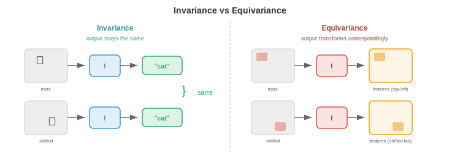

# Geometric Deep Learning

*Geometric deep learning is the unifying framework that reveals CNNs, transformers, and GNNs as instances of the same principle: exploiting symmetry. This file covers symmetry groups, group actions, invariance, equivariance, the five geometric domains, and scale separation*

- Throughout this book, we have studied many architectures: CNNs for images (chapter 8), transformers for language (chapter 7), and RL policies for sequential decisions (chapter 6). These look like completely different models designed for completely different problems. But there is a deeper pattern.

- **Geometric deep learning** reveals that all of these architectures are instances of the same idea: build networks that respect the **symmetries** of the data. CNNs exploit translation symmetry in images. Transformers exploit permutation symmetry in sequences (attention does not depend on absolute position). GNNs exploit permutation symmetry in graphs. Once you see this, the zoo of architectures becomes a single, coherent framework.

## Symmetry and Groups

- A **symmetry** of an object is a transformation that leaves it unchanged. A square has 8 symmetries: 4 rotations (0°, 90°, 180°, 270°) and 4 reflections. A circle has infinitely many: any rotation about its centre. The key insight is that symmetries tell you what does not matter, and knowing what does not matter is enormously powerful for learning.

- In ML terms: if a task has a symmetry, the model should give the same answer regardless of which "version" of the input it sees. A cat detector should work whether the cat is in the top-left or bottom-right of the image. That is translation symmetry.

- Symmetries are formalised as **groups**. A group $G$ is a set of transformations with four properties:

    - **Closure**: combining two transformations gives another transformation in the set. Rotating by 90° then 90° gives 180°, which is also in the set.
    - **Associativity**: $(g_1 \circ g_2) \circ g_3 = g_1 \circ (g_2 \circ g_3)$. The order of grouping does not matter (recall associativity of matrix multiplication from chapter 2).
    - **Identity**: there is a "do nothing" transformation $e$ such that $e \circ g = g \circ e = g$.
    - **Inverse**: every transformation has an undo: $g \circ g^{-1} = e$.

- These are the same axioms as vector spaces (chapter 1) but for transformations instead of vectors. The connection is deep: groups act on vector spaces, and this action is what neural networks must respect.

- Key groups that appear in deep learning:

    - **Translation group** $(\mathbb{R}^n, +)$: shifting an image or signal. This is the symmetry that CNNs exploit.
    - **Symmetric group** $S_n$: all permutations of $n$ elements. This is the symmetry that GNNs and transformers exploit (reordering nodes or tokens should not change the result).
    - **Rotation group** $SO(n)$: all rotations in $n$-dimensional space. $SO(2)$ is rotations in the plane, $SO(3)$ is rotations in 3D (crucial for molecular and 3D vision tasks).
    - **Euclidean group** $E(n)$: all rotations, reflections, and translations. The symmetry of physical space.
    - **Special Euclidean group** $SE(n)$: rotations and translations (no reflections). The symmetry of rigid body motion.

- A **group action** describes how a group transforms the data. If $G$ is a group and $X$ is a data space, the action $\rho: G \times X \to X$ maps each group element $g$ and data point $x$ to a transformed point $\rho(g, x)$. For images, the translation group acts by shifting pixel coordinates. For graphs, the symmetric group acts by relabelling nodes.

## Invariance and Equivariance

- Given a symmetry group, a function can relate to it in two important ways:

- A function $f$ is **invariant** to a group $G$ if the output does not change when the input is transformed:

$$f(\rho(g, x)) = f(x) \quad \text{for all } g \in G$$

- Example: the total brightness of an image does not change if you shift the image. Image classification should be translation-invariant: the class "cat" is the same regardless of where the cat sits.

- A function $f$ is **equivariant** to $G$ if transforming the input transforms the output in a corresponding way:

$$f(\rho_{\text{in}}(g, x)) = \rho_{\text{out}}(g, f(x)) \quad \text{for all } g \in G$$

- Example: if you shift an image right by 5 pixels, the feature map in a CNN also shifts right by 5 pixels. The convolution operation is translation-equivariant: it preserves the spatial relationship. Object detection should be equivariant: if the cat moves, the bounding box should move with it.



- The distinction matters: **intermediate layers** should typically be equivariant (preserving structure for downstream layers), while the **final output** should be invariant (the answer should not depend on the transformation). A CNN achieves this by stacking equivariant convolution layers, then applying global pooling (which is invariant) at the end.

- Building equivariance into the architecture is far more efficient than learning it from data. A translation-equivariant CNN with weight sharing needs far fewer parameters than a fully-connected network that must independently learn "cat at position (10,10)" and "cat at position (200,150)." The symmetry constraint reduces the hypothesis space exponentially.

## The Five Geometric Domains

- Geometric deep learning identifies **five fundamental domains** of data, each with its own symmetry group. Every neural network architecture can be understood as exploiting the symmetry of one of these domains.


- **1. Grids (Euclidean data)**: images, audio spectrograms, volumetric data. The underlying structure is a regular grid with translation symmetry. The group is the translation group (plus possibly rotations and reflections). The architecture that exploits this symmetry is the **CNN**: convolution is exactly the operation that is equivariant to translation. Weight sharing across spatial positions is translation equivariance made concrete.

- **2. Sets (unordered collections)**: point clouds, particle systems. The symmetry is permutation invariance: the order of elements does not matter. The architecture is **DeepSets** (and PointNet from chapter 8): apply a shared function to each element, then aggregate with a permutation-invariant operation (sum, mean, or max). Formally, $f(\{x_1, \ldots, x_n\}) = \phi\left(\sum_i \psi(x_i)\right)$.

- **3. Sequences (ordered data)**: text, time series. Sequences are grids in 1D, but with a twist: the symmetry is more nuanced. Absolute position may or may not matter. RNNs process sequences autoregressively. Transformers with positional encodings can attend to any position, and their self-attention is equivariant to permutation (before positional encoding is added). This is why transformers generalise so well: they start permutation-equivariant and add just enough positional structure.

- **4. Graphs (relational data)**: social networks, molecules, knowledge graphs. The symmetry is permutation of nodes: relabelling the nodes should not change the graph's properties. The architecture is the **GNN**: message passing between connected nodes, using shared functions that do not depend on node ordering. This is the focus of the rest of this chapter.

- **5. Manifolds and meshes**: surfaces, 3D shapes. The symmetry includes diffeomorphisms (smooth deformations). The architecture uses intrinsic operators (e.g., Laplace-Beltrami) that are defined by the surface geometry itself, independent of how the surface is embedded in space. This connects to differential geometry and is relevant for shape analysis, climate modelling on the sphere, and protein surface analysis.

- The power of this framework is unification. A CNN is a GNN on a grid graph. A transformer is a GNN on a fully connected graph. DeepSets is a GNN with no edges. Seeing these as instances of the same principle guides the design of new architectures: identify the symmetry of your data, and build a network that respects it.

## Scale Separation and Coarsening

- Real-world data has structure at multiple scales. An image has fine-grained texture (pixel level), local patterns (edges, corners), object parts (wheels, windows), and global structure (the entire scene). A molecule has atom-level features, functional groups, and overall molecular shape.

- **Scale separation** is the principle that these levels of detail can be processed hierarchically: first capture local structure, then progressively aggregate into coarser representations. This is **coarsening** or **pooling**.

- In CNNs, pooling layers (max pooling, average pooling) downsample the spatial resolution, forcing higher layers to capture larger-scale patterns. In the receptive field view (chapter 8), deeper layers "see" more of the image. This is scale separation in action.

- In graphs, coarsening means clustering groups of nodes into "supernodes," producing a smaller graph that preserves the essential structure. This is graph pooling, which we will cover in detail in file 3. The analogy to image pooling is direct: reduce resolution while preserving important features.

- In sequences, hierarchical processing (e.g., sentence → paragraph → document) captures structure at different temporal or semantic scales. The Swin Transformer (chapter 8) applies this idea to images with its shifted window hierarchy.

- Mathematically, coarsening defines a **hierarchy of increasingly abstract representations**:

$$x \xrightarrow{\text{local features}} h^{(1)} \xrightarrow{\text{coarsen}} h^{(2)} \xrightarrow{\text{coarsen}} \cdots \xrightarrow{\text{global}} y$$

- At each level, the representation is equivariant to the symmetry group of that level. The final global representation is invariant, capturing the essence of the input without sensitivity to irrelevant transformations.

- This hierarchy is why deep networks work better than shallow ones for structured data: each layer adds one level of abstraction, and the composition of many equivariant layers builds up complex invariant features from simple local ones.

## Coding Tasks (use CoLab or notebook)

1. Verify translation equivariance of convolution. Apply a convolution to an image, then shift the image and convolve again. Check that the outputs are shifted versions of each other.
```python
import jax
import jax.numpy as jnp

# 1D signal and a simple filter
signal = jnp.array([0, 0, 0, 1, 2, 3, 2, 1, 0, 0, 0], dtype=float)
kernel = jnp.array([1, 0, -1], dtype=float)

# Convolve then shift
conv_result = jnp.convolve(signal, kernel, mode="same")
shifted_signal = jnp.roll(signal, 3)
conv_shifted = jnp.convolve(shifted_signal, kernel, mode="same")
shifted_conv = jnp.roll(conv_result, 3)

print(f"Conv then shift:  {shifted_conv}")
print(f"Shift then conv:  {conv_shifted}")
print(f"Equivariant: {jnp.allclose(shifted_conv, conv_shifted, atol=1e-5)}")
```

2. Verify permutation invariance of DeepSets-style aggregation. Apply a shared function to each element of a set, sum the results, and check that the output is the same regardless of element ordering.
```python
import jax
import jax.numpy as jnp

# A "set" of 4 vectors (order should not matter)
x = jnp.array([[1.0, 2.0], [3.0, 4.0], [5.0, 6.0], [7.0, 8.0]])

# Simple shared function: element-wise square
psi = lambda v: v ** 2

# Aggregate by sum
def deepsets(points):
    return jnp.sum(jax.vmap(psi)(points), axis=0)

# Original order
result1 = deepsets(x)

# Permuted order
perm = jnp.array([2, 0, 3, 1])
result2 = deepsets(x[perm])

print(f"Original order:  {result1}")
print(f"Permuted order:  {result2}")
print(f"Invariant: {jnp.allclose(result1, result2)}")
```

3. Explore group structure. Verify that 2D rotation matrices form a group by checking closure, associativity, identity, and inverse.
```python
import jax.numpy as jnp

def rot2d(theta):
    return jnp.array([[jnp.cos(theta), -jnp.sin(theta)],
                       [jnp.sin(theta),  jnp.cos(theta)]])

R1 = rot2d(jnp.pi / 6)
R2 = rot2d(jnp.pi / 4)
R3 = rot2d(jnp.pi / 3)

# Closure: product of two rotations is a rotation
R12 = R1 @ R2
print(f"Closure (det=1, orthogonal): det={jnp.linalg.det(R12):.4f}, "
      f"R^T R = I: {jnp.allclose(R12.T @ R12, jnp.eye(2), atol=1e-5)}")

# Associativity
print(f"Associative: {jnp.allclose((R1 @ R2) @ R3, R1 @ (R2 @ R3), atol=1e-5)}")

# Identity
I = rot2d(0.0)
print(f"Identity: {jnp.allclose(R1 @ I, R1, atol=1e-5)}")

# Inverse
R1_inv = rot2d(-jnp.pi / 6)
print(f"Inverse: {jnp.allclose(R1 @ R1_inv, jnp.eye(2), atol=1e-5)}")
```
