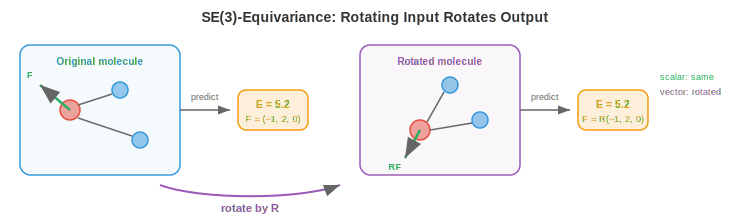

# 3D Graph Networks

*3D graph networks extend GNNs to data with spatial geometry, where rotations and translations must be handled correctly. This file covers geometric graphs, SE(3)/E(n)-equivariance, SchNet, DimeNet, EGNN, tensor field networks, and applications in molecular property prediction, protein structure, materials science, and drug discovery -- the architectures that learn from the 3D physical world.*

- The GNNs in files 3 and 4 operate on abstract graphs: nodes have features, edges encode connectivity, but there is no notion of 3D space. A social network graph has no geometry. But many of the most impactful applications of GNNs involve data that lives in **physical 3D space**: molecules, proteins, crystals, point clouds. For these, the spatial positions of nodes carry critical information that abstract GNNs ignore.

- The challenge is that 3D data has **geometric symmetries** (file 1): rotating a molecule does not change its properties, and neither does translating it. A 3D GNN must respect these symmetries. An energy prediction that changes when you rotate the molecule is physically wrong.

## Geometric Graphs

- A **geometric graph** is a graph embedded in 3D space. Each node $i$ has a position $\mathbf{r}_i \in \mathbb{R}^3$ in addition to its feature vector $\mathbf{h}_i$. Edges may be defined by spatial proximity (connect nodes within distance $r_{\text{cut}}$) rather than by explicit bonds.

- For molecules, the geometric graph has atoms as nodes (with features: element type, charge, etc.) and chemical bonds as edges. The 3D positions $\mathbf{r}_i$ are the atom coordinates, determined by quantum mechanics or experimental measurement (X-ray crystallography, cryo-EM).

- For point clouds (from LiDAR or 3D scanners, chapter 8 and chapter 11), each point is a node with position and optional features (colour, intensity). Edges connect nearby points, forming a **k-nearest-neighbour (kNN) graph** or a radius graph.

- The key geometric quantities for message passing are:

    - **Interatomic distances**: $d_{ij} = \|\mathbf{r}_i - \mathbf{r}_j\|$. Distances are invariant to rotation and translation. Two molecules with identical interatomic distances are the same shape, regardless of orientation.

    - **Bond angles**: the angle $\theta_{ijk}$ between vectors $\mathbf{r}_j - \mathbf{r}_i$ and $\mathbf{r}_k - \mathbf{r}_i$ at node $i$. Angles capture local geometry beyond pairwise distances.

    - **Dihedral (torsion) angles**: the angle $\phi_{ijkl}$ between the planes defined by $(i, j, k)$ and $(j, k, l)$. Dihedrals capture how the structure twists in 3D, essential for protein backbone geometry.

    - **Relative position vectors**: $\mathbf{r}_{ij} = \mathbf{r}_j - \mathbf{r}_i$. These are translation-invariant but NOT rotation-invariant. Using them requires equivariant (not just invariant) architectures.

## SE(3) and E(n) Equivariance

- The symmetry group for 3D physical data is the **Euclidean group** $E(3)$, consisting of all rotations, reflections, and translations. The subgroup **$SE(3)$** (Special Euclidean) includes rotations and translations but excludes reflections.

- A 3D GNN should be:
    - **Translation-invariant** for scalar outputs (energy, binding affinity): shifting all atoms by the same vector should not change the prediction.
    - **Rotation-invariant** for scalar outputs: rotating the molecule should not change its energy.
    - **Rotation-equivariant** for vector/tensor outputs (forces, dipole moments): rotating the molecule should rotate the predicted force vectors by the same rotation.



- Formally, for a scalar prediction $f$ and rotation $R \in SO(3)$:

$$f(R\mathbf{r}_1, R\mathbf{r}_2, \ldots) = f(\mathbf{r}_1, \mathbf{r}_2, \ldots) \quad \text{(invariance)}$$

- For a vector prediction $\mathbf{F}$:

$$\mathbf{F}(R\mathbf{r}_1, R\mathbf{r}_2, \ldots) = R \cdot \mathbf{F}(\mathbf{r}_1, \mathbf{r}_2, \ldots) \quad \text{(equivariance)}$$

- These constraints directly mirror the invariance/equivariance framework from file 1, now applied specifically to the 3D rotation and translation groups.

- There are two design approaches:
    1. **Invariant architectures**: use only invariant geometric features (distances, angles) as inputs to message passing. The internal representations are scalars (invariant). Simple and efficient but cannot produce vector outputs without breaking symmetry.
    2. **Equivariant architectures**: maintain vector (and higher-order tensor) representations throughout the network, ensuring each layer is equivariant. More expressive, can naturally predict vectors and tensors, but more complex.

## SchNet: Distance-Based Message Passing

- **SchNet** (Schütt et al., 2017) is the foundational invariant 3D GNN. Its key innovation is **continuous filter convolution**: instead of using a fixed set of edge types (like bond type in molecular GNNs), SchNet generates the message filter directly from the interatomic distance.

- The distance $d_{ij}$ is first expanded into a feature vector using **radial basis functions (RBFs)**:

$$\text{RBF}(d_{ij}) = \left[\exp\left(-\gamma_1 (d_{ij} - \mu_1)^2\right), \ldots, \exp\left(-\gamma_K (d_{ij} - \mu_K)^2\right)\right]$$

- Each basis function is a Gaussian centred at $\mu_k$ with width $\gamma_k$. This is analogous to a learnable positional encoding for distances: the continuous distance is mapped to a high-dimensional feature space where the network can learn distance-dependent interactions. The centres $\mu_k$ are typically evenly spaced from 0 to the cutoff radius.

- The SchNet message from node $j$ to node $i$ is:

$$\mathbf{m}_{j \to i} = \mathbf{h}_j \odot W_{\text{filter}}(\text{RBF}(d_{ij}))$$

- where $W_{\text{filter}}$ is an MLP that maps the RBF expansion to a filter vector, and $\odot$ is element-wise multiplication (Hadamard product, chapter 2). The filter depends on the distance, so nearby atoms interact differently from distant atoms. The element-wise multiplication is like a gating mechanism (chapter 6): the distance-dependent filter controls how much of each feature dimension passes through.

- Because SchNet uses only distances (invariant), the entire model is automatically invariant to rotations and translations. No special handling of symmetry is needed beyond this design choice.

## DimeNet and SphereNet: Angles and Dihedrals

- Distances alone cannot fully specify 3D structure. Two different molecular conformations can have identical pairwise distances but different bond angles (this is the problem of "distance geometry ambiguity"). **DimeNet** (Gasteiger et al., 2020) incorporates **bond angles** into message passing.

- DimeNet uses **directional message passing**: messages flow along directed edges, and the message on edge $(j \to i)$ is influenced by the angle between edges $(k \to j)$ and $(j \to i)$:

$$\mathbf{m}_{kj \to ji} = f\left(\mathbf{m}_{kj}, d_{ji}, \theta_{kji}\right)$$

- The angle $\theta_{kji}$ is expanded using spherical Bessel functions and spherical harmonics (the natural basis for angular information on a sphere, analogous to RBFs for distances). This gives the model access to directional information while maintaining invariance.

- **SphereNet** (Liu et al., 2022) goes further by including **dihedral angles** $\phi_{lkji}$, capturing the full 3D torsional structure. The hierarchy is:
    - Distances → captures pairwise proximity
    - Angles → captures local geometry (bent vs. linear)
    - Dihedrals → captures 3D twisting (crucial for protein backbone, drug binding)

- Each level adds geometric resolution at the cost of computational complexity (distances are $O(|E|)$, angles are $O(|E| \cdot k)$, dihedrals are $O(|E| \cdot k^2)$ where $k$ is the average degree).

## E(n) Equivariant GNNs (EGNN)

- **EGNN** (Satorras et al., 2021) takes the equivariant approach: instead of using only invariant features, it updates both node features **and** node positions at each layer, maintaining equivariance throughout.

- The EGNN update for node $i$:

$$\mathbf{m}_{ij} = \phi_e\left(\mathbf{h}_i, \mathbf{h}_j, d_{ij}^2, a_{ij}\right)$$

$$\mathbf{r}_i' = \mathbf{r}_i + C \sum_{j \neq i} (\mathbf{r}_i - \mathbf{r}_j) \cdot \phi_r(\mathbf{m}_{ij})$$

$$\mathbf{h}_i' = \phi_h\left(\mathbf{h}_i, \sum_j \mathbf{m}_{ij}\right)$$

- The key is the position update: node positions are adjusted by a weighted sum of relative position vectors $(\mathbf{r}_i - \mathbf{r}_j)$. The weights come from the message function $\phi_r$, which depends only on invariant quantities (features and distances). This construction is **provably equivariant**: if all input positions are rotated by $R$, all output positions are rotated by the same $R$.

- EGNN is elegant because it achieves equivariance without explicitly using spherical harmonics or irreducible representations. The relative position vectors carry the directional information, and the invariant message function controls how that directional information is used.

- The simplicity comes with a tradeoff: EGNN only uses vector representations (order 1). It cannot represent higher-order tensors like quadrupole moments or stress tensors without extension.

## Tensor Field Networks and Higher-Order Representations

- **Tensor Field Networks** (Thomas et al., 2018) and their successors (**SE(3)-Transformers**, **MACE**, **Equiformer**) use the full machinery of **irreducible representations** of the rotation group to build equivariant layers.

- In representation theory (connecting to the linear algebra of chapter 2), rotations in 3D can be decomposed into irreducible components characterised by an integer order $\ell$:
    - $\ell = 0$: scalars (1 component, invariant). Energy, charge.
    - $\ell = 1$: vectors (3 components, rotate like position vectors). Forces, dipole moments.
    - $\ell = 2$: rank-2 symmetric traceless tensors (5 components). Quadrupole moments, stress tensors.
    - Higher $\ell$: capture increasingly complex angular structure.

- These are called **spherical tensors**, and they transform under rotation $R$ via the **Wigner-D matrices** $D^\ell(R)$: a scalar is unchanged, a vector rotates by $R$, a rank-2 tensor rotates by a more complex matrix.

- **Equivariant message passing** with spherical tensors uses the **Clebsch-Gordan tensor product** to combine features of different orders:

$$(\mathbf{f}^{\ell_1} \otimes \mathbf{f}^{\ell_2})^{\ell_{\text{out}}} = \sum_{m_1, m_2} C^{\ell_{\text{out}}, m_{\text{out}}}_{\ell_1, m_1, \ell_2, m_2} \cdot f^{\ell_1}_{m_1} \cdot f^{\ell_2}_{m_2}$$

- The Clebsch-Gordan coefficients $C$ are fixed mathematical constants that ensure the tensor product is equivariant. This is the SO(3)-equivariant analogue of matrix multiplication.

- **MACE** (Batatia et al., 2022) uses higher-order messages (products of multiple neighbour features) to achieve high accuracy with fewer message-passing layers. By constructing body-ordered interactions (2-body from distances, 3-body from angles, many-body from tensor products), MACE captures complex atomic interactions efficiently.

- **Equiformer** (Liao & Smidt, 2023) combines equivariant spherical tensor features with the transformer attention mechanism (file 4), creating an SE(3)-equivariant Graph Transformer. Attention scores are computed from invariant features, while the value aggregation operates on equivariant tensor features.

## Applications

- **Molecular property prediction**: given a molecule's 3D structure, predict properties like energy, forces, dipole moment, HOMO-LUMO gap, toxicity, solubility. This is the most mature application of 3D GNNs. Models trained on quantum chemistry datasets (QM9, OC20) achieve chemical accuracy on many properties, enabling virtual screening of millions of candidate molecules.

- **Molecular dynamics acceleration**: computing forces between atoms using quantum mechanics (density functional theory, DFT) is extremely expensive ($O(n^3)$ for $n$ electrons). A 3D GNN trained to predict forces can replace DFT during molecular dynamics simulations, achieving a speedup of $10^3$–$10^6$ while maintaining near-DFT accuracy. This enables simulations of larger systems and longer timescales, revealing phenomena invisible to traditional methods.

- **Protein structure**: proteins are chains of amino acids that fold into complex 3D structures. The protein backbone is a geometric graph where nodes are residues and edges connect spatially proximate residues. 3D GNNs are used for protein function prediction, binding site identification, and protein design (inverse folding: given a desired structure, predict the amino acid sequence). **AlphaFold** uses geometric and graph-based reasoning to predict protein structures from sequences.

- **Materials science and catalysis**: crystalline materials have periodic 3D structures. GNNs model the repeating unit cell and predict material properties: band gap, formation energy, mechanical strength. The Open Catalyst Project (OC20/OC22) benchmarks GNNs for predicting adsorption energies on catalytic surfaces, accelerating the search for new catalysts for renewable energy.

- **Drug discovery**: 3D GNNs predict how a drug molecule will bind to a target protein. The binding affinity depends on the 3D shape complementarity and chemical interactions between the drug and the protein's binding pocket. Models like **DiffDock** use equivariant GNNs with diffusion models (chapter 8) to predict binding poses (the 3D orientation of the drug in the protein pocket).

## Graph Generation

- All architectures above **analyse** existing graphs. **Graph generation** creates new ones: design a molecule with desired properties, generate a synthetic social network for testing, or propose a novel protein structure. This is the generative counterpart to graph-level prediction.

- The challenge is that graphs are discrete, variable-sized, and combinatorial. Generating a graph means deciding how many nodes to create, what features they have, and which pairs to connect. The space of possible graphs grows super-exponentially with the number of nodes.

- **Autoregressive generation** builds the graph one node (or one edge) at a time. **GraphRNN** (You et al., 2018) generates graphs sequentially: an RNN maintains a state, generates one new node at each step, and decides which existing nodes to connect it to. The generation order imposes an artificial sequence on the inherently unordered graph, but BFS orderings help by keeping recently generated nodes relevant.

- **VAE-based generation** encodes graphs into a continuous latent space (using a GNN encoder), then decodes new graphs from sampled latent vectors. **GraphVAE** generates a probabilistic adjacency matrix $\hat{A} \in [0, 1]^{n \times n}$ in one shot, but this scales as $O(n^2)$ and produces dense outputs that must be thresholded. The latent space allows smooth interpolation: moving between two molecular embeddings generates chemically valid intermediate structures.

- **Diffusion-based generation** applies the diffusion framework (chapter 8) to graphs. The forward process gradually adds noise to node features and edge structures. The reverse process learns to denoise, generating valid graphs from noise. **DiGress** (Vignac et al., 2023) applies discrete diffusion to both node types and edge types, naturally handling the categorical nature of graph data.

- For **molecular generation**, the key constraint is **chemical validity**: generated molecules must obey valence rules (carbon forms 4 bonds, oxygen forms 2, etc.). Methods like **Junction Tree VAE (JT-VAE)** decompose molecules into valid substructures (rings, chains, functional groups) and generate by assembling these building blocks, guaranteeing validity by construction.

- **Goal-directed generation** optimises for specific properties: generate a molecule with high binding affinity to a target protein, low toxicity, and good solubility. This combines graph generation with property prediction (using a 3D GNN as the property evaluator) in a loop: generate → evaluate → refine. Reinforcement learning (chapter 6) or Bayesian optimisation guides the search through chemical space.

- **DiffDock** (Corso et al., 2023) uses SE(3)-equivariant diffusion to predict how a drug molecule docks into a protein binding pocket. The model generates the 3D binding pose (position and orientation of the drug relative to the protein) by denoising from random placements, combining the 3D equivariant networks from this file with the diffusion framework from chapter 8.

## Coding Tasks (use CoLab or notebook)

1. Build a simple invariant 3D message-passing layer using interatomic distances. Apply it to a small molecule (water: H-O-H) and verify that the output is invariant to rotation.
```python
import jax
import jax.numpy as jnp

# Water molecule: O at origin, two H atoms
positions = jnp.array([[0.0, 0.0, 0.0],     # O
                        [0.96, 0.0, 0.0],    # H1
                        [-0.24, 0.93, 0.0]])  # H2

# Node features: [atomic number]
features = jnp.array([[8.0], [1.0], [1.0]])

# Compute pairwise distances (invariant)
def pairwise_distances(pos):
    diff = pos[:, None, :] - pos[None, :, :]
    return jnp.sqrt(jnp.sum(diff**2, axis=-1) + 1e-8)

# Simple distance-based message passing
def invariant_message_pass(features, positions):
    dists = pairwise_distances(positions)
    # RBF expansion with 4 centres
    centres = jnp.array([0.5, 1.0, 1.5, 2.0])
    rbf = jnp.exp(-5.0 * (dists[:, :, None] - centres[None, None, :]) ** 2)

    # Message: features weighted by distance-dependent filter
    messages = jnp.einsum("ij,jd->id", rbf.sum(axis=-1), features)
    return messages

output1 = invariant_message_pass(features, positions)

# Rotate the molecule by 90 degrees around z-axis
R = jnp.array([[0, -1, 0], [1, 0, 0], [0, 0, 1]], dtype=float)
rotated_positions = (R @ positions.T).T

output2 = invariant_message_pass(features, rotated_positions)

print(f"Original output:\n{output1}")
print(f"\nRotated output:\n{output2}")
print(f"\nInvariant: {jnp.allclose(output1, output2, atol=1e-5)}")
```

2. Compute the bond angle between three atoms and verify it is rotation-invariant.
```python
import jax.numpy as jnp

def bond_angle(r_i, r_j, r_k):
    """Angle at node j between edges j->i and j->k."""
    v1 = r_i - r_j
    v2 = r_k - r_j
    cos_angle = jnp.dot(v1, v2) / (jnp.linalg.norm(v1) * jnp.linalg.norm(v2))
    return jnp.arccos(jnp.clip(cos_angle, -1, 1))

# Three atoms
r1 = jnp.array([1.0, 0.0, 0.0])
r2 = jnp.array([0.0, 0.0, 0.0])
r3 = jnp.array([0.0, 1.0, 0.0])

angle_original = bond_angle(r1, r2, r3)
print(f"Original angle: {jnp.degrees(angle_original):.1f}°")

# Apply random rotation
R = jnp.array([[0.36, 0.48, -0.80],
               [-0.80, 0.60, 0.00],
               [0.48, 0.64, 0.60]])
r1_rot, r2_rot, r3_rot = R @ r1, R @ r2, R @ r3

angle_rotated = bond_angle(r1_rot, r2_rot, r3_rot)
print(f"Rotated angle:  {jnp.degrees(angle_rotated):.1f}°")
print(f"Invariant: {jnp.allclose(angle_original, angle_rotated, atol=1e-4)}")
```

3. Demonstrate equivariant position updates (EGNN-style). Update node positions using distance-weighted relative vectors and verify equivariance.
```python
import jax
import jax.numpy as jnp

def egnn_position_update(positions, features):
    """Simple EGNN-style equivariant position update."""
    n = positions.shape[0]
    new_positions = jnp.zeros_like(positions)

    for i in range(n):
        shift = jnp.zeros(3)
        for j in range(n):
            if i != j:
                r_ij = positions[i] - positions[j]
                d_ij = jnp.linalg.norm(r_ij)
                # Weight based on distance (simple: inverse distance)
                weight = 1.0 / (d_ij + 1.0)
                # Scale by feature similarity
                feat_sim = jnp.dot(features[i], features[j])
                shift = shift + weight * feat_sim * r_ij
        new_positions = new_positions.at[i].set(positions[i] + 0.1 * shift)

    return new_positions

# 3 atoms
pos = jnp.array([[0.0, 0.0, 0.0], [1.0, 0.0, 0.0], [0.0, 1.0, 0.0]])
feat = jnp.array([[1.0, 0.5], [0.5, 1.0], [0.8, 0.3]])

# Update positions
pos_new = egnn_position_update(pos, feat)

# Now rotate input, update, and check if output is rotated consistently
R = jnp.array([[0.0, -1.0, 0.0], [1.0, 0.0, 0.0], [0.0, 0.0, 1.0]])
pos_rot = (R @ pos.T).T
pos_new_from_rot = egnn_position_update(pos_rot, feat)

# Should be the same as rotating the original output
pos_new_then_rot = (R @ pos_new.T).T

print(f"Update then rotate:\n{jnp.round(pos_new_then_rot, 4)}")
print(f"\nRotate then update:\n{jnp.round(pos_new_from_rot, 4)}")
print(f"\nEquivariant: {jnp.allclose(pos_new_then_rot, pos_new_from_rot, atol=1e-4)}")
```
