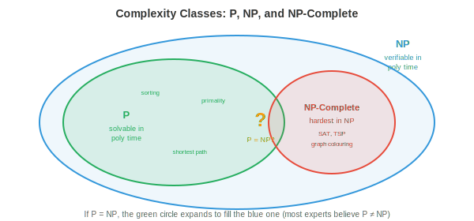

# Discrete Maths

*Discrete maths is the mathematics of countable, separated structures, the foundation that computing is built on. This file covers propositional and predicate logic, proof techniques, sets, relations, functions, graph theory fundamentals, and recurrence relations*

- In earlier chapters, we worked with continuous mathematics: calculus (chapter 3), probability distributions (chapter 5), and optimisation over real-valued parameters (chapter 6). But computers are fundamentally **discrete** machines. They store bits (0 or 1), process integers, follow branching logic, and operate on finite data structures. **Discrete maths** provides the formal language for reasoning about these structures.

- Everything in this chapter rests on discrete maths: processor logic gates are Boolean algebra, scheduling algorithms need proof of correctness, memory management uses set operations, and algorithm analysis requires recurrence relations.

## Propositional Logic

- **Propositional logic** is the algebra of true/false statements. A **proposition** is a statement that is either true (T) or false (F), never both. "It is raining" is a proposition. "What time is it?" is not (it is a question, not a statement with a truth value).

- Propositions can be combined using **logical connectives**:

    - **AND** (conjunction, $p \wedge q$): true only when both $p$ and $q$ are true.
    - **OR** (disjunction, $p \vee q$): true when at least one of $p$ or $q$ is true.
    - **NOT** (negation, $\neg p$): flips the truth value.
    - **IMPLIES** (implication, $p \to q$): false only when $p$ is true and $q$ is false. "If it rains, the ground is wet" is only violated when it rains and the ground is dry.
    - **IFF** (biconditional, $p \leftrightarrow q$): true when both have the same truth value.

- A **truth table** exhaustively lists all possible input combinations and the resulting output. For $n$ propositions, the table has $2^n$ rows. This is how we verify logical equivalences:

| $p$ | $q$ | $p \wedge q$ | $p \vee q$ | $p \to q$ |
|-----|-----|--------------|------------|-----------|
| T | T | T | T | T |
| T | F | F | T | F |
| F | T | F | T | T |
| F | F | F | F | T |

- The implication row where $p$ is false deserves attention: $F \to q$ is always true, regardless of $q$. This is **vacuous truth**. "If pigs fly, then I am the king of England" is logically true because the premise is false. This seems counterintuitive but is essential for mathematical reasoning.

- **Logical equivalences** are identities that hold for all truth values:

    - **De Morgan's laws**: $\neg(p \wedge q) \equiv \neg p \vee \neg q$ and $\neg(p \vee q) \equiv \neg p \wedge \neg q$. To negate an AND, negate each part and switch to OR (and vice versa). These appear directly in programming: `!(a && b)` is equivalent to `(!a || !b)`.

    - **Contrapositive**: $p \to q \equiv \neg q \to \neg p$. "If it rains, the ground is wet" is equivalent to "if the ground is not wet, it is not raining." This is a powerful proof technique.

    - **Double negation**: $\neg(\neg p) \equiv p$.

    - **Distributive**: $p \wedge (q \vee r) \equiv (p \wedge q) \vee (p \wedge r)$.

- A formula that is always true (for all truth assignments) is a **tautology**. One that is always false is a **contradiction**. One that is sometimes true and sometimes false is **contingent**. For example, $p \vee \neg p$ is a tautology and $p \wedge \neg p$ is a contradiction.

## Predicate Logic and Quantifiers

- Propositional logic cannot express statements about *all* or *some* elements of a set. "Every prime greater than 2 is odd" requires **predicate logic**, which extends propositional logic with variables, predicates, and quantifiers.

- A **predicate** is a statement that depends on a variable: $P(x)$ = "$x$ is even." It becomes a proposition when $x$ is given a specific value: $P(4)$ is true, $P(7)$ is false.

- **Quantifiers** express scope:

    - **Universal quantifier** ($\forall$): "for all." $\forall x \, P(x)$ means "$P(x)$ is true for every $x$ in the domain."
    - **Existential quantifier** ($\exists$): "there exists." $\exists x \, P(x)$ means "there is at least one $x$ for which $P(x)$ is true."

- Negating quantifiers flips them: $\neg(\forall x \, P(x)) \equiv \exists x \, \neg P(x)$. "Not everyone passed" means "someone failed." And $\neg(\exists x \, P(x)) \equiv \forall x \, \neg P(x)$. "There is no perfect algorithm" means "every algorithm has a flaw."

- Nested quantifiers express complex relationships. $\forall x \, \exists y \, (y > x)$ means "for every number, there is a larger one" (true for integers). The order matters: $\exists y \, \forall x \, (y > x)$ means "there is a number larger than all others" (false for integers).

- Predicate logic is the language of formal specification. When we say an algorithm is "correct," we mean $\forall \text{inputs} \, x, \, \text{output}(x) = \text{desired}(x)$. When we say it "terminates," we mean $\forall x \, \exists t \, \text{halts}(x, t)$.

## Proof Techniques

- A **proof** is a logical argument that establishes a statement's truth beyond doubt. Unlike empirical evidence (which shows something works for tested cases), a proof guarantees it works for all cases. This is the standard of correctness in CS.

- **Direct proof**: assume the hypothesis, derive the conclusion through logical steps. To prove "if $n$ is even, then $n^2$ is even": assume $n = 2k$ for some integer $k$, then $n^2 = 4k^2 = 2(2k^2)$, which is even.

- **Proof by contradiction**: assume the statement is false and derive a contradiction. To prove $\sqrt{2}$ is irrational: assume $\sqrt{2} = a/b$ (fully reduced). Then $2 = a^2/b^2$, so $a^2 = 2b^2$, meaning $a^2$ is even, so $a$ is even, say $a = 2c$. Then $4c^2 = 2b^2$, so $b^2 = 2c^2$, meaning $b$ is also even. But we said $a/b$ was fully reduced -- contradiction.

- **Proof by induction**: prove a statement for all natural numbers by showing: (1) the **base case** holds (typically $n = 0$ or $n = 1$), and (2) the **inductive step**: if the statement holds for $n = k$ (the inductive hypothesis), then it holds for $n = k + 1$.

- For example, prove $\sum_{i=1}^{n} i = \frac{n(n+1)}{2}$:
    - Base case: $n = 1$: $1 = \frac{1 \cdot 2}{2} = 1$. True.
    - Inductive step: assume $\sum_{i=1}^{k} i = \frac{k(k+1)}{2}$. Then $\sum_{i=1}^{k+1} i = \frac{k(k+1)}{2} + (k+1) = \frac{k(k+1) + 2(k+1)}{2} = \frac{(k+1)(k+2)}{2}$. This is the formula with $n = k+1$. Done.

- Induction is the workhorse for proving properties of recursive algorithms and data structures. Every recursive algorithm has an implicit inductive proof of correctness: the base case is the termination condition, and the inductive step is the recursive call.

- **Strong induction** assumes the statement holds for all values up to $k$ (not just $k$), then proves it for $k + 1$. This is useful when the recursion depends on more than just the previous value.

- The **pigeonhole principle**: if $n+1$ objects are placed into $n$ boxes, at least one box contains two objects. Simple but surprisingly powerful. It proves that in any group of 13 people, at least two share a birthday month. In networking, it proves that hash collisions are inevitable when more items than buckets exist.

## Sets

- A **set** is an unordered collection of distinct elements. Sets are the most primitive data structure in maths, and they underpin everything from type systems to database queries.

- **Set operations** (connecting to chapter 5 where we used these for probability):

    - **Union** $A \cup B$: elements in $A$ or $B$ or both.
    - **Intersection** $A \cap B$: elements in both $A$ and $B$.
    - **Complement** $\bar{A}$: elements not in $A$ (relative to a universal set).
    - **Difference** $A \setminus B$: elements in $A$ but not in $B$.
    - **Cartesian product** $A \times B$: all ordered pairs $(a, b)$ with $a \in A, b \in B$.

- The **power set** $\mathcal{P}(A)$ is the set of all subsets of $A$. If $|A| = n$, then $|\mathcal{P}(A)| = 2^n$. For $A = \{1, 2\}$: $\mathcal{P}(A) = \{\emptyset, \{1\}, \{2\}, \{1, 2\}\}$.

- **Cardinality** measures set size. Finite sets have integer cardinality. Infinite sets come in different sizes: the natural numbers $\mathbb{N}$ and rationals $\mathbb{Q}$ are **countably infinite** (can be listed), while the reals $\mathbb{R}$ are **uncountably infinite** (cannot be listed, proven by Cantor's diagonal argument). This distinction matters in computability theory: there are uncountably many functions but only countably many programs, so most functions are uncomputable.

## Relations

- A **relation** $R$ on a set $A$ is a subset of $A \times A$: a set of ordered pairs specifying which elements are related. For example, $\leq$ on integers is the set $\{(a, b) : a \leq b\}$.

- Important properties of relations:

    - **Reflexive**: every element is related to itself. $a R a$ for all $a$. Example: $\leq$ (every number is $\leq$ itself).
    - **Symmetric**: if $a R b$ then $b R a$. Example: "is a sibling of."
    - **Antisymmetric**: if $a R b$ and $b R a$ then $a = b$. Example: $\leq$.
    - **Transitive**: if $a R b$ and $b R c$ then $a R c$. Example: $<$, $\leq$, "is an ancestor of."

- An **equivalence relation** is reflexive, symmetric, and transitive. It partitions the set into **equivalence classes** where all elements within a class are related to each other but not to elements in other classes. Modular arithmetic is an equivalence relation: $a \equiv b \pmod{n}$ partitions integers into $n$ classes. Type equivalence in programming languages is an equivalence relation.

- A **partial order** is reflexive, antisymmetric, and transitive. It defines a "less than or equal to" structure that may leave some elements incomparable. File system directories form a partial order (parent-child), but sibling directories are incomparable. A **total order** is a partial order where every pair is comparable (like $\leq$ on integers).

- Partial orders are essential in concurrency: the "happens-before" relation on events is a partial order. Events that are not ordered by happens-before are concurrent and may execute in any relative order.

## Functions

- A **function** $f: A \to B$ maps each element of $A$ (the domain) to exactly one element of $B$ (the codomain). Functions are the mathematical model of deterministic computation: given an input, there is exactly one output.

- **Injective** (one-to-one): different inputs always give different outputs. $f(a) = f(b) \implies a = b$. Lossless compression is injective: different inputs must compress to different outputs (otherwise you cannot decompress uniquely).

- **Surjective** (onto): every element of $B$ is hit by some element of $A$. The range equals the codomain. A hash function mapping strings to 256-bit hashes is not surjective if there are fewer strings than possible hashes.

- **Bijective**: both injective and surjective. A perfect one-to-one correspondence between $A$ and $B$. Bijections have inverses. Encryption must be bijective: each plaintext maps to a unique ciphertext, and the decryption function is the inverse.

- **Composition** $(g \circ f)(x) = g(f(x))$: apply $f$ first, then $g$. Function composition is associative (chapter 2: same as matrix multiplication being associative). Pipelines in software are function composition: data flows through a chain of transformations.

## Graph Theory Fundamentals

- We covered graphs extensively in chapter 12 (graph neural networks), including adjacency matrices, graph types, the Laplacian, and spectral theory. Here we focus on the **algorithmic** and **structural** properties relevant to CS.

- A **tree** is a connected graph with no cycles. Equivalently, it has $n$ nodes and $n-1$ edges. Trees are the structure of file systems, XML/HTML documents, decision processes, and recursive decompositions. A **rooted tree** has a designated root node; every other node has exactly one parent.

- A **spanning tree** of a graph $G$ is a tree that includes all nodes of $G$ using a subset of its edges. **Minimum spanning trees (MST)** minimise the total edge weight. Kruskal's algorithm (sort edges, greedily add the lightest that does not create a cycle) and Prim's algorithm (grow the tree from a starting node, always adding the lightest edge to a new node) both find MSTs in $O(|E| \log |V|)$.

- **Planarity**: a graph is planar if it can be drawn in the plane with no edge crossings. By **Euler's formula**, for a connected planar graph: $|V| - |E| + |F| = 2$, where $|F|$ is the number of faces (regions, including the outer face). This implies $|E| \leq 3|V| - 6$ for planar graphs, so planar graphs are sparse. Circuit board routing and map colouring exploit planarity.

- **Graph colouring** assigns colours to nodes such that no two adjacent nodes share a colour. The minimum number of colours needed is the **chromatic number** $\chi(G)$. The **four-colour theorem** states $\chi(G) \leq 4$ for any planar graph. In CS, graph colouring models register allocation (assign variables to CPU registers so that simultaneously live variables get different registers) and scheduling (assign tasks to time slots so conflicting tasks do not overlap).

- **Euler paths** visit every edge exactly once. They exist if and only if the graph has exactly 0 or 2 nodes with odd degree. **Hamiltonian paths** visit every node exactly once. Determining whether a Hamiltonian path exists is NP-complete -- one of the classic hard problems in CS. This contrast (Euler: polynomial, Hamilton: NP-complete) illustrates how similar-sounding problems can have vastly different computational complexities.

## Recurrence Relations

- A **recurrence relation** defines a sequence where each term depends on previous terms. They arise naturally from recursive algorithms.

- The simplest example: $T(n) = T(n-1) + 1$ with $T(0) = 0$. Unrolling: $T(n) = T(n-1) + 1 = T(n-2) + 2 = \cdots = n$. This is $O(n)$, the time complexity of a simple loop.

- **Merge sort** gives $T(n) = 2T(n/2) + O(n)$: split the array in half (two subproblems of size $n/2$), recursively sort each half, then merge ($O(n)$ work). The solution is $T(n) = O(n \log n)$.

- The **Master Theorem** solves recurrences of the form $T(n) = aT(n/b) + O(n^d)$:

    - If $d > \log_b a$: $T(n) = O(n^d)$ (the work at each level dominates)
    - If $d = \log_b a$: $T(n) = O(n^d \log n)$ (work is balanced across levels)
    - If $d < \log_b a$: $T(n) = O(n^{\log_b a})$ (the number of subproblems dominates)

- For merge sort: $a = 2, b = 2, d = 1$. Since $d = \log_2 2 = 1$, we are in the balanced case: $T(n) = O(n \log n)$.

- The **Fibonacci recurrence** $F(n) = F(n-1) + F(n-2)$ with $F(0) = 0, F(1) = 1$ has the closed-form solution $F(n) = \frac{\phi^n - \psi^n}{\sqrt{5}}$ where $\phi = \frac{1+\sqrt{5}}{2}$ (the golden ratio) and $\psi = \frac{1-\sqrt{5}}{2}$. This shows the Fibonacci sequence grows exponentially as $O(\phi^n)$, which is why naive recursive Fibonacci is exponentially slow.

- **Combinatorics** (permutations, combinations, the binomial theorem, and inclusion-exclusion) is covered in chapter 5 (probability). These counting techniques are essential for algorithm analysis (how many possible inputs? how many comparisons?), but we will not repeat them here.

## Computability

- Not everything can be computed. This is one of the most profound results in all of mathematics, and it sets the fundamental limits of what computers can do.

- A **Turing machine** is an abstract model of computation: an infinite tape of cells (each holding a symbol), a read/write head, and a finite set of states with transition rules. Despite its simplicity, a Turing machine can compute anything that any real computer can. This is the **Church-Turing thesis**: any effectively computable function can be computed by a Turing machine.

- Every programming language (Python, C, Haskell) is **Turing complete**: it can simulate a Turing machine and therefore compute anything that is computable. The differences between languages are in convenience, speed, and safety, not in what they can fundamentally compute.

- The **halting problem** asks: given a program and an input, will the program eventually stop, or will it run forever? Turing proved (1936) that no algorithm can solve this in general. The proof is by contradiction: assume a halting detector $H(P, x)$ exists. Construct a program $D$ that runs $H(D, D)$ and does the opposite of whatever $H$ says. If $H$ says $D$ halts, $D$ loops forever. If $H$ says $D$ loops, $D$ halts. Contradiction.

- This is not a limitation of current technology; it is a mathematical impossibility. No amount of compute, cleverness, or AI will ever solve the halting problem in general. It is the computer science analogue of Gödel's incompleteness theorem.

- Practical consequences: you cannot write a perfect deadlock detector, a perfect virus scanner, or a perfect optimising compiler. Each of these would require solving the halting problem (or an equivalent undecidable problem) in general. Real tools use heuristics and approximations that work in common cases but cannot guarantee correctness for all inputs.

- A problem is **decidable** if an algorithm exists that always terminates with the correct yes/no answer. It is **undecidable** if no such algorithm exists. The halting problem is undecidable. Primality testing is decidable. Type checking in most programming languages is decidable (by design).

## Complexity Theory

- Even among computable problems, some are vastly harder than others. **Complexity theory** classifies problems by the resources (time, space) required to solve them as the input grows.



- **P** (Polynomial time): problems solvable in $O(n^k)$ time for some constant $k$. Sorting ($O(n \log n)$), shortest path ($O(|V|^2)$), matrix multiplication ($O(n^3)$). These are considered "efficient" or "tractable."

- **NP** (Nondeterministic Polynomial time): problems where a proposed solution can be **verified** in polynomial time, even if **finding** the solution might take exponential time. For example, given a claimed Hamiltonian path, you can verify it in $O(n)$ by checking each edge. But finding one might require trying exponentially many possibilities.

- Every problem in P is also in NP (if you can solve it quickly, you can certainly verify a solution quickly). The central question is whether $P = NP$: is every problem whose solution can be quickly verified also quickly solvable? This is the most important open problem in computer science, with a \$1 million Clay Millennium Prize.

- Most experts believe $P \neq NP$, meaning some problems are fundamentally harder to solve than to verify. If $P = NP$, cryptography would collapse (breaking encryption is in NP), and optimisation, scheduling, and drug design would become trivially easy.

- **NP-complete** problems are the hardest problems in NP. A problem is NP-complete if: (1) it is in NP, and (2) every other NP problem can be **reduced** to it in polynomial time. If you could solve any NP-complete problem efficiently, you could solve all of them (and $P = NP$).

- A **reduction** transforms one problem into another. If problem A reduces to problem B, then B is at least as hard as A. Cook (1971) showed that **SAT** (Boolean satisfiability: given a logical formula, is there an assignment of variables that makes it true?) is NP-complete. Karp (1972) showed 21 other classic problems are NP-complete by reducing SAT to each one.

- Famous NP-complete problems:
    - **Travelling Salesman Problem (TSP)**: find the shortest route visiting all cities exactly once.
    - **Graph colouring**: colour nodes with $k$ colours such that no adjacent nodes share a colour ($k \geq 3$).
    - **Subset sum**: given a set of integers, is there a subset that sums to a target value?
    - **Boolean satisfiability (SAT)**: is there a truth assignment that satisfies a logical formula?
    - **Hamiltonian path** (mentioned above in graph theory).

- When you encounter an NP-complete problem in practice, you do not solve it exactly for large inputs. Instead, you use: **approximation algorithms** (find a solution within a guaranteed factor of optimal), **heuristics** (greedy, local search, simulated annealing), or **special-case solvers** (many NP-complete problems are easy for restricted inputs). Modern SAT solvers, for example, routinely solve instances with millions of variables, despite the worst-case exponential complexity, by exploiting structure in practical instances.

- **NP-hard** problems are at least as hard as NP-complete but may not be in NP (their solutions might not even be verifiable in polynomial time). Optimisation versions of NP-complete problems are typically NP-hard: "find the shortest TSP tour" is NP-hard, while "is there a TSP tour shorter than $k$?" is NP-complete.

## Coding Tasks (use CoLab or notebook)

1. Build a truth table generator. Given a logical expression, enumerate all input combinations and compute the output.
```python
import itertools

def truth_table(n_vars, expr_fn):
    """Generate truth table for a boolean function of n_vars variables."""
    headers = [f"p{i}" for i in range(n_vars)]
    print(" | ".join(headers + ["result"]))
    print("-" * (len(headers) * 4 + 10))
    for vals in itertools.product([False, True], repeat=n_vars):
        result = expr_fn(*vals)
        row = [str(v)[0] for v in vals] + [str(result)[0]]
        print(" | ".join(f"{r:>2}" for r in row))

# De Morgan's law: NOT(p AND q) == (NOT p) OR (NOT q)
print("De Morgan's Law verification:")
truth_table(2, lambda p, q: (not (p and q)) == ((not p) or (not q)))
```

2. Prove the sum formula by induction -- numerically verify for many values, then implement the closed-form solution.
```python
import jax.numpy as jnp

# Verify sum formula: sum(1..n) = n(n+1)/2
for n in [1, 5, 10, 100, 1000, 10000]:
    brute = sum(range(1, n + 1))
    formula = n * (n + 1) // 2
    print(f"n={n:5d}  sum={brute:>10d}  formula={formula:>10d}  match={brute == formula}")
```

3. Solve the merge sort recurrence using the Master Theorem and verify empirically by counting operations.
```python
import jax.numpy as jnp

def merge_sort_ops(n):
    """Count comparisons in merge sort (recurrence: T(n) = 2T(n/2) + n)."""
    if n <= 1:
        return 0
    half = n // 2
    return merge_sort_ops(half) + merge_sort_ops(n - half) + n

for n in [8, 64, 512, 4096, 32768]:
    ops = merge_sort_ops(n)
    predicted = n * jnp.log2(n)
    ratio = ops / predicted
    print(f"n={n:5d}  ops={ops:>10d}  n log n={int(predicted):>10d}  ratio={ratio:.3f}")
```
