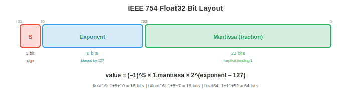

# Computer Architecture

*Computer architecture is how we build machines that execute instructions. This file covers number systems, logic gates, CPU design, instruction set architectures, pipelining, the memory hierarchy, and virtual memory, the hardware foundation that every program, framework, and AI model ultimately runs on.*

- Every neural network, every training loop, every inference call eventually becomes a sequence of electrical signals flowing through transistors. Understanding the hardware is not optional for serious ML practitioners: it explains why matrix multiplications are fast, why memory is the bottleneck, why GPUs dominate AI training, and why cache-friendly code can be 100x faster than naive code.

## Number Systems

- Computers represent everything as **binary** (base 2): sequences of 0s and 1s. Each digit is a **bit**. A group of 8 bits is a **byte**. The value of a binary number $b_{n-1} b_{n-2} \ldots b_1 b_0$ is $\sum_{i=0}^{n-1} b_i \cdot 2^i$.

- For example, $1011_2 = 1 \cdot 8 + 0 \cdot 4 + 1 \cdot 2 + 1 \cdot 1 = 11_{10}$.

- **Hexadecimal** (base 16) is a compact notation for binary. Each hex digit represents 4 bits: $0\text{-}9$ map to $0000\text{-}1001$, and $A\text{-}F$ map to $1010\text{-}1111$. So $\text{0xFF} = 1111\,1111_2 = 255_{10}$. Memory addresses and colour codes are typically written in hex.

- **Two's complement** represents signed integers. For an $n$-bit number, the most significant bit has weight $-2^{n-1}$ instead of $+2^{n-1}$. An 8-bit two's complement ranges from $-128$ to $+127$. To negate a number: flip all bits and add 1. This representation makes addition and subtraction use the same hardware circuit, which is why it is universal.

- **IEEE 754 floating point** represents real numbers as $(-1)^s \times 1.m \times 2^{e-\text{bias}}$, where $s$ is the sign bit, $m$ is the mantissa (fractional part), and $e$ is the biased exponent.



    - **float32** (single precision): 1 sign + 8 exponent + 23 mantissa = 32 bits. Range: $\approx \pm 3.4 \times 10^{38}$, precision: $\approx 7$ decimal digits.
    - **float64** (double precision): 1 sign + 11 exponent + 52 mantissa = 64 bits. Range: $\approx \pm 1.8 \times 10^{308}$, precision: $\approx 15$ decimal digits.
    - **float16** (half precision): 1 + 5 + 10 = 16 bits. Limited range and precision, but uses half the memory and bandwidth. Widely used in ML training (mixed precision, chapter 6).
    - **bfloat16**: 1 + 8 + 7 = 16 bits. Same exponent range as float32 but lower precision. Designed by Google specifically for ML: the full exponent range prevents overflow during training, and the reduced precision is acceptable for gradient updates.

- Floating-point arithmetic is **not exact**. $0.1 + 0.2 \neq 0.3$ in float64 (it equals $0.30000000000000004$). This is because $0.1$ has no exact binary representation, just as $1/3$ has no exact decimal representation. Accumulating these errors over millions of operations (like gradient descent) can cause numerical instability, which is why techniques like loss scaling (chapter 6) and Kahan summation exist.

## Logic Gates

- All computation reduces to **logic gates**: physical circuits that implement Boolean operations (the propositional logic from file 1).

- The fundamental gates:
    - **AND**: output is 1 only if both inputs are 1.
    - **OR**: output is 1 if at least one input is 1.
    - **NOT** (inverter): flips the input.
    - **NAND** (NOT-AND): the universal gate. Any other gate can be built from NAND gates alone. This is why NAND is the fundamental building block of digital circuits.
    - **XOR** (exclusive OR): output is 1 if inputs differ. Essential for addition (the sum bit of binary addition is XOR) and cryptography.

- A **half adder** adds two single bits using XOR (sum) and AND (carry). A **full adder** adds two bits plus a carry-in, chaining together to create an $n$-bit adder. This is how CPUs perform integer addition: a cascade of simple logic gates.

- A **multiplexer** (MUX) selects one of several inputs based on a control signal. With $n$ control bits, it selects from $2^n$ inputs. Multiplexers are the hardware equivalent of an if-else chain and are used extensively in CPU datapaths to route data.

- Modern processors contain billions of transistors, each acting as a tiny switch. A transistor is either on (conducting, representing 1) or off (not conducting, representing 0). Gates are built from transistors, adders from gates, ALUs from adders, and CPUs from ALUs. The entire hierarchy of computing rests on this foundation.

## CPU Architecture

- The **Central Processing Unit (CPU)** executes instructions. Its core components:

    - **ALU** (Arithmetic Logic Unit): performs integer arithmetic (add, subtract, multiply) and logical operations (AND, OR, XOR, shift). This is where the actual computation happens, built from the logic gates described above.

    - **Registers**: tiny, ultra-fast storage locations inside the CPU. A modern CPU has dozens of general-purpose registers, each holding one word (64 bits on a 64-bit CPU). Registers are the fastest memory in the system: access takes ~0.3 nanoseconds.

    - **Program Counter (PC)**: holds the memory address of the next instruction to execute.

    - **Control Unit**: decodes instructions and orchestrates the datapath, telling the ALU what operation to perform and which registers to use.

- The **instruction cycle** (fetch-decode-execute) repeats billions of times per second:

    1. **Fetch**: read the instruction from memory at the address in the PC.
    2. **Decode**: determine what the instruction does (add? load from memory? branch?) and which operands it uses.
    3. **Execute**: perform the operation (ALU computation, memory access, or branch).
    4. Increment the PC (unless the instruction is a branch/jump).

- A CPU running at 4 GHz performs 4 billion cycles per second. Each cycle takes 0.25 nanoseconds. In that time, light travels about 7.5 centimetres, which is why physical chip size matters: signals cannot cross a large chip in one cycle.

## Instruction Set Architectures

- The **Instruction Set Architecture (ISA)** is the contract between hardware and software: it defines the instructions the CPU understands, the register set, the memory model, and the encoding format.

- **CISC** (Complex Instruction Set Computer): instructions can be complex, variable-length, and may access memory directly. A single instruction might multiply two memory values and store the result. **x86** (Intel/AMD) is the dominant CISC ISA, powering most desktops and servers. Its backward compatibility (modern x86 CPUs still run 1980s code) is both its strength and its burden.

- **RISC** (Reduced Instruction Set Computer): instructions are simple, fixed-length, and operate only on registers. Memory access requires separate load/store instructions. Simpler instructions enable faster clock speeds and easier pipelining.

    - **ARM**: the dominant RISC ISA for mobile devices and increasingly for servers and laptops (Apple M-series chips are ARM). ARM's power efficiency makes it ideal for battery-powered and thermally constrained devices.
    - **RISC-V**: an open-source RISC ISA. Anyone can design a RISC-V chip without licensing fees. Growing adoption in embedded systems, research, and AI accelerators.

- The CISC vs RISC distinction has blurred: modern x86 CPUs internally decode complex CISC instructions into simpler micro-operations (essentially RISC internally), getting the benefits of both worlds.

## Pipelining

- Without pipelining, the CPU completes one instruction fully before starting the next. This wastes hardware: while the ALU executes, the fetch and decode units sit idle.


- **Pipelining** overlaps instruction execution, like an assembly line. While instruction 1 is executing, instruction 2 is decoding, and instruction 3 is being fetched. A 5-stage pipeline (fetch, decode, execute, memory access, write-back) can have 5 instructions in flight simultaneously.

- The throughput approaches one instruction per cycle (even though each instruction takes 5 cycles to complete). This is the same principle as pipelining in ML: data parallelism overlaps computation and communication (chapter 6).

- **Hazards** are situations where pipelining breaks:

    - **Data hazard**: instruction 2 needs a result that instruction 1 has not yet produced. "Add R1, R2, R3" followed by "Sub R4, R1, R5" -- the second instruction needs R1, which the first is still computing. **Forwarding** (bypassing) solves this by routing the result directly from one pipeline stage to another without waiting for the write-back stage.

    - **Control hazard**: a branch instruction (if-else) means the CPU does not know which instruction to fetch next until the branch is resolved. **Branch prediction** guesses which way the branch will go and speculatively fetches instructions along the predicted path. Modern predictors are >95% accurate, using history tables and neural-network-like pattern matching. A misprediction costs ~15 cycles (the pipeline must be flushed and restarted).

    - **Structural hazard**: two instructions need the same hardware resource simultaneously (e.g., both need the memory port). Resolved by duplicating resources or inserting a stall.

## Memory Hierarchy

- The fundamental tension in computer memory: fast memory is expensive and small, cheap memory is slow and large. The **memory hierarchy** bridges this gap by exploiting **locality**: programs tend to access the same data repeatedly (temporal locality) and access nearby data (spatial locality).


- The hierarchy, from fastest to slowest:

    - **Registers**: ~0.3 ns access, ~KB total. Inside the CPU.
    - **L1 cache**: ~1 ns, 32-64 KB per core. Split into instruction cache and data cache.
    - **L2 cache**: ~4 ns, 256 KB-1 MB per core.
    - **L3 cache**: ~10 ns, 8-64 MB shared across cores.
    - **RAM (DRAM)**: ~50-100 ns, 8-512 GB. Main memory.
    - **SSD**: ~10-100 μs, 256 GB-8 TB. Persistent storage.
    - **HDD**: ~5-10 ms, 1-20 TB. Mechanical, very slow for random access.

- The speed gap between registers and RAM is ~300x. Between registers and disk, it is ~30,000,000x. The cache hierarchy hides this gap: if the data the CPU needs is in L1 cache (a **cache hit**), access is fast. If not (a **cache miss**), the CPU stalls while data is fetched from a slower level.

- **Cache associativity** determines where a memory address can be stored in the cache:
    - **Direct-mapped**: each address maps to exactly one cache line. Simple but causes conflicts.
    - **Fully associative**: any address can go anywhere. Flexible but expensive to search.
    - **Set-associative** ($k$-way): each address maps to a set of $k$ locations. The practical compromise used in real CPUs (typically 4-way or 8-way).

- **Cache coherence** ensures that all CPU cores see a consistent view of memory. When core 1 writes to an address that core 2 has cached, the coherence protocol (e.g., MESI) invalidates or updates core 2's copy. This is critical for concurrent programming (file 4) and is one reason that shared-memory parallelism is hard.

- For ML practitioners, the memory hierarchy explains why:
    - Matrix operations should access memory sequentially (row-major vs column-major layout matters).
    - Batch size affects performance: larger batches amortise memory latency.
    - Mixed precision (float16/bfloat16) doubles the effective memory bandwidth, which is often the bottleneck.

## Virtual Memory

- **Virtual memory** gives each process the illusion of having its own large, contiguous memory space, even though physical RAM is limited and shared among processes.

- The address space is divided into fixed-size **pages** (typically 4 KB). The **page table** maps virtual page numbers to physical frame numbers. When a program accesses virtual address 0x1234, the CPU translates it to a physical address by looking up the page table.

- The **Translation Lookaside Buffer (TLB)** is a cache for page table entries. Since the page table lives in RAM (slow), the TLB stores recently used translations in fast hardware. A TLB miss requires walking the page table in memory, costing hundreds of cycles.

- A **page fault** occurs when a program accesses a page that is not in physical RAM. The OS loads the page from disk (swapping), which takes millions of cycles. Excessive page faults (**thrashing**) devastates performance. This is why ML training requires enough RAM to hold the model, optimiser states, and a reasonable batch of data.

- **Page replacement** algorithms decide which page to evict when RAM is full:
    - **LRU** (Least Recently Used): evict the page that has not been accessed for the longest time. Optimal in practice for most workloads. Approximated in hardware with the **clock algorithm** (a circular list with reference bits).
    - **FIFO**: evict the oldest page. Simple but can evict frequently used pages.
    - **Optimal** (Bélády's): evict the page that will not be used for the longest time. Impossible to implement (requires future knowledge) but useful as a theoretical benchmark.

- Virtual memory also provides **isolation**: each process has its own virtual address space. A bug in one process cannot corrupt another process's memory, because their virtual addresses map to different physical frames. This is the foundation of OS security and stability.

## I/O, Interrupts, and DMA

- The CPU needs to communicate with the outside world: disks, network cards, keyboards, GPUs. This is the **I/O subsystem**.

- **Programmed I/O** (polling): the CPU repeatedly checks a device's status register in a loop, waiting for data to be ready. Simple but wastes CPU cycles spinning instead of doing useful work.

- **Interrupt-driven I/O**: the device sends a hardware **interrupt** when data is ready. The CPU continues normal execution until the interrupt arrives, then runs an **interrupt handler** (a kernel function) to process the data. This is far more efficient than polling because the CPU is not idle while waiting.

- The interrupt mechanism:
    1. A device signals an interrupt via a hardware line.
    2. The CPU finishes the current instruction, saves the current state (registers, program counter) onto the stack.
    3. The CPU looks up the interrupt handler address in the **interrupt vector table** (a table of function pointers, one per interrupt type).
    4. The handler runs in kernel mode, processes the I/O, and returns.
    5. The CPU restores the saved state and resumes the interrupted program.

- This is the same save/restore pattern as a context switch (file 3), but triggered by hardware rather than a timer.

- **DMA** (Direct Memory Access): for large data transfers (disk reads, network packets, GPU memory copies), having the CPU copy data byte by byte is wasteful. A **DMA controller** transfers data directly between a device and RAM without involving the CPU. The CPU sets up the transfer (source, destination, size), the DMA controller handles it, and the CPU gets an interrupt when it is done.

- DMA is critical for ML: when you call `model.to('cuda')`, the data is transferred from system RAM to GPU memory via DMA over the PCIe bus. During training, gradient synchronisation across GPUs uses DMA-based RDMA (Remote DMA) for high-bandwidth, low-latency transfers (chapter 6).

- The **bus** connects the CPU to memory and I/O devices. Modern systems use **PCIe** (Peripheral Component Interconnect Express) for high-speed devices (GPUs, NVMe SSDs, network cards). PCIe 4.0 provides ~32 GB/s per x16 slot; PCIe 5.0 doubles this. The bus bandwidth is often the bottleneck for GPU training: the GPU can compute faster than data can be fed to it.

- **MMIO** (Memory-Mapped I/O): device registers are mapped to memory addresses. The CPU reads and writes to these addresses using normal load/store instructions, and the hardware routes the access to the device instead of RAM. This unifies memory and I/O access into a single mechanism, simplifying both hardware and software.

## Coding Tasks (use CoLab or notebook)

1. Explore IEEE 754 floating-point representation. Convert a float to its binary representation and observe the sign, exponent, and mantissa fields.
```python
import struct

def float_to_bits(f):
    """Show the IEEE 754 binary representation of a float32."""
    packed = struct.pack('>f', f)
    bits = ''.join(f'{byte:08b}' for byte in packed)
    sign = bits[0]
    exponent = bits[1:9]
    mantissa = bits[9:]
    return sign, exponent, mantissa

for val in [1.0, -1.0, 0.1, 0.5, 3.14, float('inf'), float('nan')]:
    s, e, m = float_to_bits(val)
    print(f"{val:>10}  sign={s}  exp={e} ({int(e, 2) - 127:>4d})  mantissa={m[:10]}...")
```

2. Simulate a direct-mapped cache. Track hits and misses for a sequence of memory accesses.
```python
def simulate_cache(accesses, cache_size=8, block_size=1):
    """Simulate a direct-mapped cache."""
    cache = [None] * cache_size
    hits, misses = 0, 0

    for addr in accesses:
        cache_line = addr % cache_size
        if cache[cache_line] == addr:
            hits += 1
            status = "HIT "
        else:
            misses += 1
            cache[cache_line] = addr
            status = "MISS"
        print(f"  Access {addr:3d} → line {cache_line}: {status}")

    print(f"\nHits: {hits}, Misses: {misses}, Hit rate: {hits/(hits+misses):.1%}")

# Sequential access (good locality)
print("Sequential access:")
simulate_cache([0, 1, 2, 3, 4, 5, 6, 7, 0, 1, 2, 3])

# Strided access (conflict misses)
print("\nStrided access (stride = cache size):")
simulate_cache([0, 8, 0, 8, 0, 8])
```

3. Demonstrate why floating-point arithmetic is not associative. Show cases where $(a + b) + c \neq a + (b + c)$.
```python
import jax.numpy as jnp

a = jnp.float32(1e8)
b = jnp.float32(1.0)
c = jnp.float32(-1e8)

left = (a + b) + c   # (1e8 + 1) + (-1e8)
right = a + (b + c)  # 1e8 + (1 + (-1e8))

print(f"(a + b) + c = {left}")   # should be 1.0
print(f"a + (b + c) = {right}")  # might lose the 1.0
print(f"Equal: {left == right}")
print(f"\nThe 1.0 is lost when added to 1e8 because float32 has only ~7 digits of precision")
```
