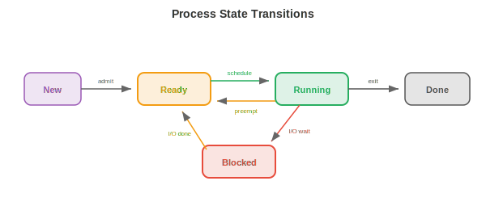

# Operating Systems

*An operating system is the software layer between hardware and applications, managing resources, providing abstractions, and enforcing isolation. This file covers what an OS does, processes, threads, CPU scheduling, memory management, file systems, and system calls*

- A computer without an operating system is like a kitchen without a chef: the ingredients (hardware) are there, but nothing coordinates who uses the stove, where to put the dishes, or how to prevent two people from grabbing the same knife. The **OS** is that coordinator.

- For ML practitioners, OS concepts explain: why `nvidia-smi` shows GPU memory usage per process, why training crashes with "out of memory," why `fork()` duplicates your Python process, and why Docker containers provide isolated environments.

## What an Operating System Does

- The OS has three core responsibilities:

    - **Abstraction**: hide hardware complexity behind clean interfaces. Programs read and write "files" without knowing whether the underlying storage is an SSD, HDD, or network drive. They allocate "memory" without managing physical RAM chips. They run on a "CPU" without worrying about interrupts and cache coherence.

    - **Resource management**: multiple programs share the CPU, memory, disk, and network. The OS decides who gets what, when, and for how long. A fair, efficient allocation strategy keeps the system responsive.

    - **Isolation and protection**: programs must not interfere with each other. A bug in your web browser should not crash the kernel. A malicious program should not read another program's passwords. The OS enforces boundaries using hardware support (privilege levels, virtual memory).

## Processes

- A **process** is a running program. It is the OS's fundamental unit of work. Each process has:

    - **Code** (the program instructions, read-only).
    - **Data** (global variables, heap allocations).
    - **Stack** (function call frames, local variables).
    - **State** (register values, program counter, open files, etc.).

- The **Process Control Block (PCB)** is the OS's data structure for tracking a process. It stores the process ID (PID), state, program counter, register contents, memory maps, open file descriptors, and scheduling priority. When the OS switches from one process to another, it saves the current process's state to its PCB and loads the next process's state. This is a **context switch**.

- Context switches are expensive: saving and restoring registers, flushing caches, and invalidating TLB entries takes microseconds. On a system running thousands of processes, the overhead can be significant. This is why process-per-request server architectures (like old Apache) were replaced by thread-based or event-driven architectures.

- **Process creation** in Unix uses `fork()` and `exec()`:

    - `fork()` creates a **copy** of the current process. The child process gets a duplicate of the parent's memory, file descriptors, and state. Both processes continue executing from the same point, but `fork()` returns 0 in the child and the child's PID in the parent.

    - `exec()` replaces the current process's code with a new program. After `fork()`, the child typically calls `exec()` to run a different program.

    - This fork-then-exec model is elegant: creating a new process (fork) and loading a new program (exec) are separate operations that can be independently customised. Between fork and exec, the child can redirect I/O, change environment variables, or drop privileges.



- **Process states**: a process is in one of several states:
    - **Running**: currently executing on a CPU core.
    - **Ready**: waiting for a CPU core (runnable but not scheduled yet).
    - **Blocked** (waiting): cannot proceed until some event occurs (I/O completion, lock acquisition, timer expiry).
    - **Terminated**: finished execution, waiting for the parent to collect its exit status.

## Threads

- A **thread** is a lightweight execution unit within a process. All threads in a process share the same code, data, and heap, but each has its own stack and register state.

- The advantage over multiple processes: threads share memory, so communication between them is fast (just read/write shared variables). Processes require inter-process communication (pipes, sockets, shared memory mappings), which is slower and more complex.

- The disadvantage: shared memory is dangerous. Two threads writing to the same variable simultaneously cause a **race condition** (the result depends on which thread runs first). This leads us to synchronisation, covered in file 4.

- **Kernel threads** are managed by the OS scheduler. Each thread is independently scheduled onto CPU cores. Creating and switching kernel threads involves system calls, with overhead similar to (but less than) process context switches.

- **User threads** (green threads) are managed by a runtime library in user space, invisible to the OS. They are cheaper to create and switch (no system call needed), but a blocking operation by one user thread blocks all threads in the process (because the OS sees only one kernel thread).

- Modern systems use **hybrid models**: many user threads mapped onto a smaller number of kernel threads (M:N threading). Go's goroutines and Erlang's processes are user-level threads scheduled by the language runtime onto OS threads.

- **Thread pools** pre-create a fixed number of threads that wait for tasks. When a task arrives, it is assigned to an idle thread. This avoids the overhead of creating and destroying threads for each task. Web servers, database engines, and ML inference servers all use thread pools.

## CPU Scheduling

- The **scheduler** decides which process/thread runs on which CPU core at each moment. The goals are: maximise CPU utilisation, minimise response time (for interactive tasks), maximise throughput (for batch tasks), and ensure fairness.

- **First Come First Served (FCFS)**: processes run in arrival order. Simple but suffers from the **convoy effect**: a long-running process blocks all shorter ones behind it.

- **Shortest Job First (SJF)**: run the shortest process first. Provably minimises average waiting time, but requires knowing job lengths in advance (impossible in general). The preemptive version, **Shortest Remaining Time First (SRTF)**, interrupts a running job if a shorter one arrives.

- **Round Robin (RR)**: each process gets a fixed **time quantum** (e.g., 10 ms), then is preempted and moved to the back of the queue. Fair and responsive, but the time quantum matters: too small means excessive context switching, too large degrades to FCFS.

- **Priority scheduling**: each process has a priority. Higher-priority processes run first. The danger is **starvation**: low-priority processes may never run if high-priority processes keep arriving. **Aging** solves this: a process's priority increases the longer it waits.

- **Multilevel Feedback Queues (MLFQ)**: multiple queues with different priorities and time quanta. New processes start in the highest-priority queue (short quantum). If a process uses its full quantum (CPU-bound), it is demoted to a lower-priority queue (longer quantum). Interactive processes naturally stay in high-priority queues (they block for I/O before using their quantum). This adapts to workload without requiring advance knowledge of job types.

- **Completely Fair Scheduler (CFS)**: the Linux scheduler. It maintains a red-black tree (a balanced binary search tree) of processes sorted by "virtual runtime" -- how much CPU time they have consumed. The process with the smallest virtual runtime runs next. This ensures that over time, every process gets its fair share. CFS runs in $O(\log n)$ per scheduling decision.

## Memory Management

- The OS manages physical RAM, allocating it to processes and reclaiming it when no longer needed.

- **Paging** (from file 2) divides virtual memory into fixed-size pages and physical memory into frames. The page table maps pages to frames. Paging eliminates external fragmentation (wasted space between allocations) because all pages are the same size.

- **Demand paging** loads pages into RAM only when they are first accessed (not when the process starts). This saves memory: a program with 1 GB of code might only use 50 MB during a typical run. The rest never gets loaded.

- When RAM is full and a new page is needed, the OS must **evict** an existing page. The **page replacement** algorithms (LRU, FIFO, clock, from file 2) decide which page to evict. Good replacement minimises page faults; bad replacement causes thrashing.

- **Segmentation** divides memory into variable-size segments (code, data, stack, heap), each with its own base address and length. Segments provide logical organisation, while paging provides physical management. Modern systems use segmentation minimally (mainly for protection) and rely on paging for memory management.

- The **heap** is where dynamically allocated memory lives (`malloc`/`free` in C, `new` in Java, implicit in Python). The OS provides large chunks of memory to the process, and a **memory allocator** (e.g., `glibc malloc`, `jemalloc`, `tcmalloc`) subdivides these chunks into smaller allocations. Allocator design affects performance: fragmentation wastes space, and contention between threads wastes time.

## File Systems

- A **file system** organises data on persistent storage (SSD, HDD) as a hierarchy of named files and directories.

- An **inode** (index node) stores a file's metadata: size, ownership, permissions, timestamps, and pointers to the data blocks on disk. The file name is stored in the directory, which maps names to inode numbers. This separation means a file can have multiple names (**hard links**) pointing to the same inode.

- **FAT** (File Allocation Table): a simple file system used on USB drives and SD cards. A table maps each cluster (block) to the next cluster in the file, forming a linked list. Simple but does not support permissions, journaling, or large files well.

- **ext4**: the default Linux file system. Uses inodes with direct, indirect, double-indirect, and triple-indirect block pointers to handle files of any size. Supports **extents** (contiguous ranges of blocks) for efficiency with large files. Maximum file size: 16 TB, maximum partition: 1 EB.

- **Journaling** protects against corruption from crashes. Before modifying file system structures, the changes are written to a **journal** (log). If the system crashes mid-operation, the journal is replayed on reboot to complete or undo the operation. Without journaling, a crash during a write could leave the file system in an inconsistent state (a file's data blocks updated but its inode not, or vice versa).

- **B-tree based file systems** (Btrfs, ZFS) use B-trees (balanced search trees) to organise data and metadata, enabling efficient search, copy-on-write snapshots, and built-in checksums for data integrity. These are the same B-trees used in database indexes.

## System Calls and Kernel Mode

- A **system call** is the interface between user programs and the OS kernel. When a program needs to do something privileged (read a file, allocate memory, create a process, send a network packet), it makes a system call.

- The CPU operates in two modes:
    - **User mode**: restricted. Programs can execute their own code and access their own memory, but cannot directly access hardware, other processes' memory, or OS data structures.
    - **Kernel mode**: unrestricted. The OS kernel can access all hardware and memory. System calls are the controlled gateway from user mode to kernel mode.

- When a program calls `read()`, the following happens:
    1. The program puts arguments in registers and triggers a **trap** (a software interrupt).
    2. The CPU switches to kernel mode and jumps to the system call handler.
    3. The kernel validates the arguments, performs the I/O operation, and copies data to the user's buffer.
    4. The kernel switches back to user mode and returns the result.

- Common system calls: `open`, `read`, `write`, `close` (files), `fork`, `exec`, `wait`, `exit` (processes), `mmap`, `brk` (memory), `socket`, `bind`, `listen`, `accept` (networking).

- **Interrupts** are hardware signals that force the CPU to temporarily stop what it is doing and run an interrupt handler (in the kernel). A keyboard press, a network packet arrival, or a timer tick all generate interrupts. The timer interrupt is particularly important: it is what allows the OS to preempt a running process and switch to another (preemptive multitasking).

## Networking Fundamentals

- The network stack is an OS subsystem that enables communication between machines. Understanding it explains how distributed training synchronises gradients, how model serving handles requests, and why latency matters.


- The **TCP/IP model** organises networking into layers, each providing an abstraction to the layer above:

    - **Link layer**: handles communication over a single physical link (Ethernet, Wi-Fi). Deals with MAC addresses and frames.
    - **Network layer (IP)**: routes packets across multiple networks from source to destination. Each machine has an **IP address** (e.g., 192.168.1.1 for IPv4, or a 128-bit IPv6 address). Routers forward packets hop by hop based on destination IP.
    - **Transport layer (TCP/UDP)**: provides end-to-end communication between applications.
    - **Application layer**: protocols like HTTP, DNS, gRPC that applications use directly.

- **TCP** (Transmission Control Protocol) provides reliable, ordered delivery. It establishes a connection (three-way handshake: SYN, SYN-ACK, ACK), guarantees that all data arrives in order (using sequence numbers and acknowledgements), retransmits lost packets, and controls the sending rate to avoid overwhelming the network (**congestion control**). The cost is latency: the handshake adds a round trip, and retransmissions add delays.

- **UDP** (User Datagram Protocol) provides unreliable, unordered delivery. No handshake, no retransmission, no ordering guarantee. Much lower latency than TCP. Used where speed matters more than reliability: video streaming, online gaming, DNS lookups. In ML, some gradient synchronisation protocols use UDP-based RDMA for lower latency.

- **Sockets** are the OS API for network communication. A **socket** is an endpoint identified by (IP address, port number). A server creates a socket, binds it to a port (e.g., 80 for HTTP), listens for connections, and accepts them. A client creates a socket and connects to the server's address:port. Data is then read and written through the socket just like a file.

- **DNS** (Domain Name System) translates human-readable names (google.com) to IP addresses (142.250.80.46). It is a distributed, hierarchical database: your machine asks a local resolver, which asks root servers, which delegate to authoritative servers for each domain.

- **HTTP** (HyperText Transfer Protocol) is the request-response protocol of the web. A client sends a request (method + URL + headers + optional body), and the server sends a response (status code + headers + body). ML model serving (e.g., TensorFlow Serving, Triton) exposes models as HTTP or gRPC endpoints.

- **Latency vs bandwidth**: latency is the time for one packet to travel from source to destination (determined by physical distance and network hops). Bandwidth is the data rate (how many bytes per second). A high-bandwidth, high-latency connection (satellite internet) can transfer lots of data but each byte takes a long time to arrive. For distributed training, **latency** matters for synchronisation barriers (all GPUs must wait for the slowest), while **bandwidth** matters for transferring large gradient tensors (chapter 6).

## Virtualisation and Containers

- **Virtualisation** runs multiple operating systems on a single physical machine. A **hypervisor** (VMware, KVM, Xen) creates **virtual machines (VMs)**, each with its own virtual CPU, memory, disk, and network interface. Each VM runs a complete OS (guest OS) that believes it has dedicated hardware.

- VMs provide strong isolation (one VM crashing does not affect others) and flexibility (run Linux and Windows on the same machine, migrate VMs between physical hosts). The cost is overhead: each VM runs a full OS kernel, consuming memory and CPU for OS operations that are redundant with the host OS.


- **Containers** (Docker, Podman) provide a lighter alternative. Instead of virtualising the entire hardware, containers share the host OS kernel and use kernel features to isolate processes:

    - **Namespaces** isolate what a process can see: each container gets its own view of the process tree (PID namespace), network interfaces (network namespace), file system mount points (mount namespace), and hostname (UTS namespace). A process inside a container cannot see processes in other containers.

    - **Cgroups** (control groups) limit what a process can use: CPU time, memory, disk I/O, network bandwidth. A container cannot consume more resources than its cgroup allows, preventing one container from starving others.

- Containers start in milliseconds (no OS boot), use minimal overhead (shared kernel), and are defined by a **Dockerfile** that specifies the base image, dependencies, and commands. This makes them reproducible: `docker build` produces the same environment everywhere.

- For ML, containers solve the "it works on my machine" problem. A training environment with specific versions of CUDA, cuDNN, PyTorch, and Python is packaged as a container image. Anyone can reproduce the exact environment on any machine. Cloud training platforms (AWS SageMaker, GCP Vertex AI) run training jobs in containers.

- **Kubernetes** (K8s) orchestrates containers at scale: it schedules containers onto a cluster of machines, restarts failed containers, scales up/down based on load, and manages networking between containers. Large-scale ML serving (thousands of model replicas handling millions of requests) runs on Kubernetes.

## Security Basics

- The OS enforces security through multiple mechanisms:

- **Permissions**: every file has an owner, a group, and permission bits (read/write/execute for owner, group, and others). A process runs with the identity (UID) of the user who started it and can only access files that the permission bits allow. The **root** user (UID 0) bypasses all permission checks, which is why running as root is dangerous.

- **Privilege separation**: processes run with the minimum privileges needed. A web server does not need root access; it should run as a restricted user that can only read web files and bind to port 80. If the server is compromised, the attacker's access is limited to what the restricted user can do.

- **Sandboxing**: restrict what a process can do beyond file permissions. **seccomp** (Linux) limits which system calls a process can make. **AppArmor** and **SELinux** define mandatory access control policies. Containers combine namespaces, cgroups, and seccomp for multi-layered isolation.

- **Address Space Layout Randomisation (ASLR)**: randomise the memory locations of the stack, heap, and libraries each time a program runs. This makes it harder for attackers to exploit memory corruption bugs (buffer overflows), because they cannot predict where code or data will be in memory.

- Security is a systems-wide concern: a chain is only as strong as its weakest link. A model serving system needs secure network communication (TLS/HTTPS), authenticated API access (API keys, OAuth), input validation (prevent adversarial inputs), and isolated execution (containers with minimal privileges).

## Coding Tasks (use CoLab or notebook)

1. Explore process creation. Use Python's `os.fork()` (Unix only) to create a child process and observe that both parent and child continue from the same point.
```python
import os

pid = os.fork()

if pid == 0:
    # Child process
    print(f"Child: my PID is {os.getpid()}, parent PID is {os.getppid()}")
else:
    # Parent process
    print(f"Parent: my PID is {os.getpid()}, child PID is {pid}")
    os.wait()  # wait for child to finish
```

2. Simulate round-robin scheduling. Given a list of processes with burst times, simulate the scheduling and compute average waiting time.
```python
def round_robin(processes, quantum=3):
    """Simulate round-robin scheduling.
    processes: list of (name, burst_time) tuples.
    """
    queue = [(name, burst, 0) for name, burst in processes]  # (name, remaining, wait)
    time = 0
    log = []

    while queue:
        name, remaining, waited = queue.pop(0)
        waited += (time - waited - (processes[[p[0] for p in processes].index(name)][1] - remaining))
        run_time = min(quantum, remaining)
        log.append(f"  t={time:3d}: {name} runs for {run_time} (remaining: {remaining - run_time})")
        time += run_time
        remaining -= run_time

        if remaining > 0:
            queue.append((name, remaining, time))
        else:
            log.append(f"  t={time:3d}: {name} DONE (turnaround: {time})")

    for line in log:
        print(line)

print("Round Robin (quantum=3):")
round_robin([("P1", 10), ("P2", 4), ("P3", 6)], quantum=3)
```

3. Simulate page replacement with LRU. Given a sequence of page accesses and a fixed number of frames, count page faults.
```python
def lru_page_replacement(pages, n_frames):
    """Simulate LRU page replacement."""
    frames = []
    faults = 0

    for page in pages:
        if page in frames:
            frames.remove(page)
            frames.append(page)  # move to most recently used
            status = "HIT "
        else:
            faults += 1
            if len(frames) >= n_frames:
                evicted = frames.pop(0)  # remove least recently used
                status = f"MISS (evict {evicted})"
            else:
                status = "MISS (cold)"
            frames.append(page)
        print(f"  Page {page}: {status}  frames={frames}")

    print(f"\nTotal faults: {faults}/{len(pages)} ({faults/len(pages):.0%})")

print("LRU with 3 frames:")
lru_page_replacement([1, 2, 3, 4, 1, 2, 5, 1, 2, 3, 4, 5], n_frames=3)
```
