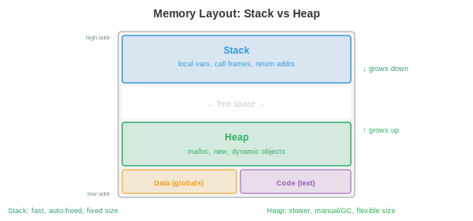
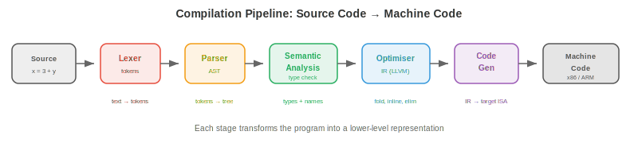

# Programming Languages

*Programming languages are the interface between human intent and machine execution. This file covers language paradigms, type systems, memory management strategies, the compilation pipeline, interpretation and JIT compilation, key language features, domain-specific languages, and design tradeoffs*

- Every piece of software, every ML model, every operating system is written in a programming language. But there are hundreds of languages, each with different strengths. Why? Because language design involves fundamental tradeoffs: performance vs safety, expressiveness vs simplicity, control vs abstraction. Understanding these tradeoffs helps you pick the right tool for the job and understand the constraints you are working within.

## Language Paradigms

- A **paradigm** is a style of programming: a set of principles that guide how you structure code and think about problems.

- **Imperative** programming describes computation as a sequence of commands that change state. "Set x to 5. Add 3 to x. If x > 7, print it." C, Python, and Java are imperative at their core. The mental model is a machine with memory that you modify step by step.

- **Object-oriented (OOP)** programming organises code around **objects**: bundles of data (attributes) and behaviour (methods). Objects interact by sending messages to each other. The key ideas are **encapsulation** (hide internal state behind a public interface), **inheritance** (create new classes by extending existing ones), and **polymorphism** (treat different types uniformly through a shared interface). Java, C++, and Python support OOP.

- **Functional programming (FP)** treats computation as the evaluation of mathematical functions. Core principles: **immutability** (data does not change once created), **pure functions** (output depends only on input, no side effects), and **first-class functions** (functions are values that can be passed as arguments, returned from other functions, and stored in variables). Haskell is purely functional. Python, JavaScript, and Scala support functional style.

- Pure functions are easy to reason about, test, and parallelise (no shared mutable state means no race conditions). This is why functional ideas are increasingly used in distributed systems and data pipelines. JAX (used throughout this book) is functional: `jax.grad` works because JAX functions are pure.

- **Logic programming** describes *what* should be true, not *how* to compute it. You state facts and rules, and the runtime finds solutions. Prolog is the classic example: given "Socrates is a man" and "all men are mortal," the engine derives "Socrates is mortal." Logic programming is used in AI knowledge bases and type checking.

- Most modern languages are **multi-paradigm**: Python supports imperative, OOP, and functional styles. Rust supports imperative and functional. The paradigm is a tool, not a religion.

## Type Systems

- A **type** classifies values and determines what operations are valid. The integer 3 and the string "3" are different types: you can add integers but not strings (well, you can concatenate strings, but that is a different operation).

- **Static typing**: types are checked at **compile time**, before the program runs. Type errors are caught early. C, Java, Rust, and Go are statically typed. You must declare types (or the compiler infers them):

```rust
let x: i32 = 5;     // Rust: x is a 32-bit integer
let y: f64 = 3.14;  // y is a 64-bit float
// let z = x + y;    // compile error: cannot add i32 and f64
```

- **Dynamic typing**: types are checked at **runtime**, when operations are actually executed. More flexible but type errors only surface when the code runs. Python, JavaScript, and Ruby are dynamically typed:

```python
x = 5       # x is an int (for now)
x = "hello" # now x is a string -- no error
```

- **Strong typing**: the language prevents implicit type coercion. Python is strongly typed: `"3" + 5` raises a TypeError. **Weak typing**: the language silently converts types. JavaScript is weakly typed: `"3" + 5` gives `"35"` (number is coerced to string). C is weakly typed: you can cast a pointer to an integer.

- **Type inference** lets the compiler deduce types without explicit annotations:

```rust
let x = 5;        // compiler infers: i32
let y = x + 3.0;  // compile error: mixed types, even with inference
```

- **Generics** (parametric polymorphism) let you write code that works with any type:

```rust
fn largest<T: PartialOrd>(list: &[T]) -> &T {
    let mut max = &list[0];
    for item in &list[1..] {
        if item > max { max = item; }
    }
    max
}
// Works for integers, floats, strings -- any type that supports comparison
```

- For ML: Python's dynamic typing makes experimentation fast but hides bugs. Production ML systems increasingly use type hints (`def train(model: nn.Module, lr: float) -> float`) and static analysis tools (mypy) to catch errors before deployment. PyTorch and JAX use Python for flexibility; TensorRT and ONNX Runtime use C++ for performance.

## Memory Management

- Every program allocates and frees memory. How this is managed is one of the most consequential language design decisions.



- The **stack** stores local variables and function call frames. Allocation is trivial (move the stack pointer) and deallocation is automatic (pop the frame when the function returns). Stack access is fast because it is always in cache. But the stack has fixed size (typically 1-8 MB) and only supports LIFO (last-in-first-out) allocation.

- The **heap** stores dynamically allocated data (objects, arrays, strings whose size is not known at compile time). Heap allocation is slower (need to find a free block) and requires explicit or automatic deallocation. The heap can grow to fill available memory.

- **Manual memory management** (C, C++): the programmer explicitly allocates (`malloc`) and frees (`free`) heap memory. Maximum control and performance, but extremely error-prone:
    - **Use-after-free**: accessing memory that has been freed. Causes crashes or security vulnerabilities.
    - **Double free**: freeing the same memory twice. Corrupts the allocator's internal data structures.
    - **Memory leak**: allocating memory but never freeing it. The program slowly consumes all available RAM.

- **Garbage collection (GC)**: the runtime automatically detects and frees memory that is no longer reachable. The programmer never calls `free`.

    - **Tracing GC** (Java, Go, Python's cycle collector): periodically traverses all reachable objects from "roots" (stack variables, global variables) and frees unreachable objects. Simple but causes **GC pauses**: the program stops while the collector runs. Modern collectors (Go's concurrent GC, Java's ZGC) minimise pause times to sub-millisecond.

    - **Reference counting** (Python's primary mechanism, Swift, Objective-C): each object tracks how many references point to it. When the count drops to 0, the object is immediately freed. No pauses, but cannot handle **cycles** (A references B, B references A, both have count > 0 but neither is reachable). Python uses a separate cycle detector to handle this.

- **Ownership** (Rust): the compiler enforces memory safety rules at compile time, with zero runtime overhead.

    - Each value has exactly one **owner**. When the owner goes out of scope, the value is dropped (freed).
    - Values can be **borrowed** (referenced) but the compiler enforces: either one mutable reference OR any number of immutable references, never both simultaneously.
    - This prevents use-after-free, double free, data races, and dangling pointers, all at compile time. No GC, no runtime cost.

- The **borrow checker** is Rust's killer feature and its steepest learning curve. It guarantees memory safety and thread safety without garbage collection, which is why Rust is increasingly used for performance-critical systems (OS kernels, game engines, ML inference runtimes like Candle and Burn).

## Compilation Pipeline

- A **compiler** translates source code into machine code (or another target language) before the program runs. The pipeline has several stages:



1. **Lexing** (tokenisation): convert the source text into a stream of tokens. `x = 3 + y` becomes `[IDENT("x"), EQUALS, INT(3), PLUS, IDENT("y")]`. The lexer strips whitespace and comments.

2. **Parsing**: build an **Abstract Syntax Tree (AST)** from the token stream. The AST represents the hierarchical structure of the program. `3 + y * 2` parses as `Add(3, Mul(y, 2))` (multiplication has higher precedence). The parser checks syntax: mismatched parentheses and missing semicolons are caught here.

3. **Semantic analysis**: check types, resolve variable names, verify that functions are called with the correct arguments. This is where static type checking happens. The output is a typed, annotated AST.

4. **Optimisation**: transform the program to run faster without changing its behaviour. Common optimisations:
    - **Constant folding**: compute `3 + 5` at compile time, replacing it with `8`.
    - **Dead code elimination**: remove code that can never execute.
    - **Loop unrolling**: replace a loop with repeated inline code to reduce branch overhead.
    - **Inlining**: replace a function call with the function's body, eliminating call overhead.

5. **Code generation**: translate the optimised representation into target machine code (x86, ARM) or an intermediate representation.

- **LLVM** is the dominant compiler infrastructure. It provides a common intermediate representation (LLVM IR) that many languages compile to. LLVM's optimiser works on this IR, and its backends generate machine code for many targets. Clang (C/C++), Rust, Swift, Julia, and many other languages use LLVM. This means improvements to LLVM's optimiser benefit all these languages simultaneously.

## Interpretation and JIT Compilation

- An **interpreter** executes the program line by line (or statement by statement) without producing machine code. This makes startup fast and development interactive, but execution is slower (each line is re-analysed every time it runs).

- Most interpreted languages actually compile to **bytecode**: an intermediate representation that is simpler than source code but not machine-specific. The bytecode runs on a **virtual machine (VM)**.

    - **CPython** (the standard Python implementation) compiles Python source to bytecode (`.pyc` files), which is executed by the CPython VM. The VM interprets bytecode one instruction at a time. This is why Python is ~100x slower than C for compute-heavy code.

    - **JVM** (Java Virtual Machine): Java compiles to JVM bytecode (`.class` files). The JVM initially interprets the bytecode, then **JIT-compiles** frequently executed code paths ("hot spots") to native machine code. This is why Java starts slower than C (interpretation overhead) but approaches C's speed for long-running programs (JIT-optimised hot paths).

- **JIT (Just-In-Time) compilation** compiles code to machine code at runtime, using information available only during execution. A JIT can optimise based on actual runtime data: if a function is always called with integer arguments, the JIT generates specialised integer-only machine code, skipping type checks.

- **PyPy** is an alternative Python implementation with a JIT compiler. It runs most Python code 5-10x faster than CPython by JIT-compiling hot loops to machine code. However, it has limited compatibility with C extension modules (NumPy, PyTorch), which limits its use in ML.

- The spectrum from interpretation to compilation is not binary:
    - Pure interpretation: Bash shell scripts.
    - Bytecode interpretation: CPython.
    - Bytecode + JIT: JVM, .NET CLR, LuaJIT, PyPy.
    - Ahead-of-time (AOT) compilation: C, C++, Rust, Go.
    - AOT + runtime code generation: JAX's `jax.jit` compiles Python functions to optimised XLA code at the first call, then caches the compiled version.

## Key Language Features

- **Closures**: a function that captures variables from its enclosing scope. The function "closes over" the environment in which it was defined:

```python
def make_adder(n):
    def add(x):
        return x + n  # n is captured from the enclosing scope
    return add

add5 = make_adder(5)
print(add5(3))  # 8
```

- Closures are the mechanism behind callbacks, decorators, and partial application. They are fundamental to functional programming.

- **Pattern matching**: a powerful control flow mechanism that destructures data and branches based on its shape:

```rust
match value {
    Some(x) if x > 0 => println!("Positive: {}", x),
    Some(0)           => println!("Zero"),
    Some(x)           => println!("Negative: {}", x),
    None              => println!("Nothing"),
}
```

- Pattern matching is more expressive than if-else chains: it checks the structure of data (is it Some or None? does it contain a value matching a condition?), not just equality. Python added structural pattern matching in 3.10 (`match`/`case`).

- **Algebraic data types (ADTs)**: types that can be one of several variants, each carrying different data. A `Result` type is either `Ok(value)` or `Err(error)`. A `Tree` is either `Leaf(value)` or `Node(left, right)`. ADTs combined with pattern matching enable exhaustive handling of all cases, eliminating entire classes of bugs (null pointer exceptions, unhandled error codes).

- **Traits and interfaces**: define a set of methods that a type must implement, without specifying how. This enables polymorphism: a function that takes "anything that implements the Display trait" works with integers, strings, and custom types. Rust uses traits, Java uses interfaces, Go uses implicit interfaces, Python uses duck typing ("if it walks like a duck...").

## Domain-Specific Languages

- A **domain-specific language (DSL)** is designed for a specific problem domain, trading generality for expressiveness within that domain.

- **SQL**: the language of relational databases. `SELECT name FROM users WHERE age > 30` is far more readable and optimisable than the equivalent imperative loop. The database engine optimises the query execution plan, choosing join strategies and index usage automatically.

- **Regular expressions**: a mini-language for pattern matching in text. `\d{3}-\d{4}` matches phone numbers like "555-1234." Regex engines compile patterns to finite automata for efficient matching.

- **Shader languages** (GLSL, HLSL, Metal Shading Language): programs that run on GPU cores to compute pixel colours, vertex positions, or compute operations. Shaders are massively parallel: each invocation processes one pixel or one element independently. This is the same execution model used by CUDA for ML computation.

- In ML, frameworks like PyTorch and JAX are essentially DSLs for tensor computation, embedded within Python. They provide domain-specific abstractions (tensors, automatic differentiation, device placement) while leveraging Python's ecosystem.

## Language Design Tradeoffs

- No language is best at everything. Design is about choosing which tradeoffs to make:

- **Performance vs safety**: C gives raw speed and hardware control but lets you corrupt memory. Rust gives comparable speed with compile-time memory safety. Java gives memory safety with garbage collection overhead. Python gives maximum safety and expressiveness with 100x slower execution.

- **Expressiveness vs simplicity**: Haskell's type system can express very precise constraints but has a steep learning curve. Go deliberately omits generics (until recently), inheritance, and exceptions for simplicity. Python's "there should be one obvious way to do it" philosophy keeps the language learnable.

- **Control vs abstraction**: C/C++ give you control over memory layout, cache behaviour, and hardware interaction. Python hides all of this. For ML training (where GPU compute dominates), Python's overhead is negligible. For ML inference (where every microsecond counts), C++ or Rust may be necessary.

- **Compilation speed vs runtime speed**: Go compiles in seconds (simple type system, minimal optimisation). Rust compiles in minutes (complex type system, aggressive optimisation). The tradeoff is developer iteration speed vs deployed performance.

- The ML ecosystem reflects these tradeoffs: Python for experimentation and training (expressiveness wins), C++/CUDA for kernels and inference (performance wins), Rust for infrastructure and safety-critical systems (safety wins).

## Coding Tasks (use CoLab or notebook)

1. Explore closures and higher-order functions. Implement a simple function factory and verify that closures capture their environment.
```python
def make_multiplier(factor):
    """Returns a function that multiplies by factor."""
    def multiply(x):
        return x * factor
    return multiply

double = make_multiplier(2)
triple = make_multiplier(3)

print(f"double(5) = {double(5)}")  # 10
print(f"triple(5) = {triple(5)}")  # 15

# Closures capture by reference, not by value
def make_counter():
    count = [0]  # mutable container to allow modification
    def increment():
        count[0] += 1
        return count[0]
    return increment

counter = make_counter()
print(f"counter() = {counter()}")  # 1
print(f"counter() = {counter()}")  # 2
print(f"counter() = {counter()}")  # 3
```

2. Compare dynamic vs static typing behaviour. Show how Python's dynamic typing allows flexibility but can hide bugs.
```python
def add(a, b):
    return a + b

# Works with different types -- flexible!
print(add(3, 5))           # 8 (int + int)
print(add("hello ", "world"))  # "hello world" (str + str)
print(add([1, 2], [3, 4]))    # [1, 2, 3, 4] (list + list)

# But type errors only surface at runtime:
try:
    print(add("hello", 5))  # TypeError! str + int
except TypeError as e:
    print(f"Runtime error: {e}")
    print("A static type checker would catch this before running")
```

3. Measure the performance difference between interpreted Python and compiled/JIT approaches for a compute-heavy task.
```python
import time
import jax
import jax.numpy as jnp

n = 1_000_000

# Pure Python loop (interpreted)
start = time.time()
total = 0.0
for i in range(n):
    total += i * i
python_time = time.time() - start

# JAX (compiled via XLA)
@jax.jit
def sum_squares_jax(n):
    return jnp.sum(jnp.arange(n, dtype=jnp.float32) ** 2)

_ = sum_squares_jax(10)  # warm up JIT
start = time.time()
result = sum_squares_jax(n)
jax_time = time.time() - start

print(f"Python loop: {python_time:.4f}s")
print(f"JAX (JIT):   {jax_time:.6f}s")
print(f"Speedup:     {python_time / jax_time:.0f}x")
```
