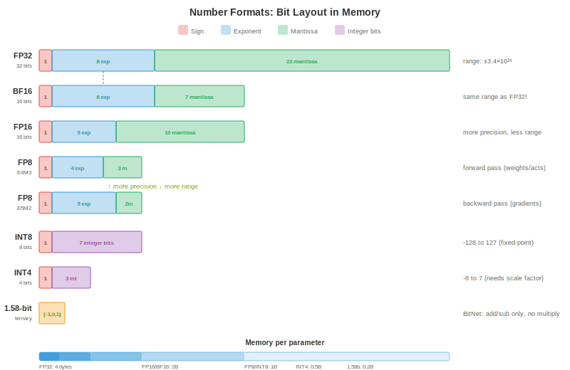

# Quantisation

*Quantisation reduces the precision of model weights and activations, making models smaller, faster, and cheaper to run. This file covers number formats, post-training quantisation, quantisation-aware training, weight-only methods (GPTQ, AWQ), activation quantisation, mixed precision, and KV-cache quantisation*

- A 70B parameter model in float16 requires 140 GB of memory, more than any single GPU. Quantise to INT4 and it fits in 35 GB (one A100) or even 20 GB (consumer RTX 4090 with offloading). Quantisation is not an optimisation nicety; it is what makes large model deployment economically viable.

- The fundamental tradeoff: lower precision means less memory, higher throughput, and lower power, but introduces **quantisation error** that can degrade model quality. The art of quantisation is minimising this degradation.

## Why Quantise

- **Memory reduction**: INT8 is 2x smaller than FP16, INT4 is 4x smaller. For LLMs, model weights dominate memory. Halving precision halves the memory requirement.

- **Throughput gains**: lower precision means more operations per second. NVIDIA Tensor Cores (chapter 16) achieve 2x throughput for FP16 vs FP32, 2x again for INT8 vs FP16, and 2x again for INT4 vs INT8. An H100 does 989 TFLOPS in FP8 vs 67 TFLOPS in FP32 — a 15x difference.

- **Bandwidth savings**: LLM inference is usually **memory-bandwidth-bound** (chapter 16, roofline model). The bottleneck is loading weights from GPU memory, not computing with them. Smaller weights mean fewer bytes to transfer, directly increasing tokens per second. This is why quantisation often gives nearly linear speedups for LLM inference.

- **Energy savings**: lower precision uses less energy per operation. At data centre scale (thousands of GPUs), this translates to significant electricity cost reduction.

## Number Formats

- We covered IEEE 754 floating-point in chapter 13 (computer architecture). Here is the full precision landscape for ML:



| Format | Bits | Exponent | Mantissa | Range | Use Case |
|--------|------|----------|----------|-------|----------|
| FP32 | 32 | 8 | 23 | ±3.4×10³⁸ | Training (gold standard) |
| TF32 | 19 | 8 | 10 | ±3.4×10³⁸ | Tensor Core training (A100+) |
| FP16 | 16 | 5 | 10 | ±65504 | Mixed-precision training |
| BF16 | 16 | 8 | 7 | ±3.4×10³⁸ | Training (same range as FP32) |
| FP8 E4M3 | 8 | 4 | 3 | ±448 | Forward pass (Hopper+) |
| FP8 E5M2 | 8 | 5 | 2 | ±57344 | Gradients (wider range) |
| INT8 | 8 | — | — | -128 to 127 | PTQ inference |
| INT4 | 4 | — | — | -8 to 7 | Weight-only quantisation |
| INT2/Ternary | 2 | — | — | {-1, 0, 1} | Extreme compression |

- **FP8** comes in two variants: **E4M3** (4-bit exponent, 3-bit mantissa, narrower range but more precision) for the forward pass, and **E5M2** (5-bit exponent, 2-bit mantissa, wider range but less precision) for gradients. The Transformer Engine (chapter 16) switches between them automatically per tensor.

- **BF16 vs FP16**: BF16 has the same exponent range as FP32 (no overflow risk) but less mantissa precision. FP16 has more precision but a narrow range (max 65504), requiring loss scaling during training. For inference, both work well; for training, BF16 is safer.

- **Integer formats** have no exponent — they represent fixed-point values. To convert between float and int, you need a **scale factor** and optionally a **zero point**: $x_{\text{float}} = \text{scale} \times (x_{\text{int}} - \text{zero\_point})$.

## The Quantisation Equation

- All quantisation methods map floating-point values to integers and back:

$$x_q = \text{clamp}\left(\text{round}\left(\frac{x}{\text{scale}}\right) + \text{zero\_point}, \; q_{\min}, \; q_{\max}\right)$$

$$\hat{x} = \text{scale} \times (x_q - \text{zero\_point})$$

- The **scale** determines the resolution: $\text{scale} = \frac{x_{\max} - x_{\min}}{q_{\max} - q_{\min}}$. For INT8: $q_{\min} = -128$, $q_{\max} = 127$.

- **Symmetric quantisation** sets $\text{zero\_point} = 0$, so $\text{scale} = \frac{\max(|x|)}{127}$. Simpler and faster (no zero-point subtraction during inference).

- **Asymmetric quantisation** uses a non-zero $\text{zero\_point}$ to handle asymmetric distributions (e.g., ReLU outputs are all non-negative). Maps $[x_{\min}, x_{\max}]$ to $[0, 255]$ for unsigned INT8.


- **Quantisation granularity**: how many values share the same scale factor:
    - **Per-tensor**: one scale for the entire tensor. Simplest but lowest accuracy (one outlier distorts the entire tensor's scale).
    - **Per-channel**: one scale per output channel (for convolutions) or per-row (for linear layers). Much better accuracy with minimal overhead.
    - **Per-group**: one scale per group of $g$ elements (e.g., $g = 128$). Best accuracy, used in modern weight-only quantisation (GPTQ, AWQ).
    - **Per-token**: one scale per token for activations. Handles the fact that different tokens have very different activation magnitudes.

## Post-Training Quantisation (PTQ)

- **PTQ** quantises a pre-trained model without any retraining. You pass a **calibration set** (a small representative dataset, typically 128-512 samples) through the model to collect activation statistics, then compute optimal scale factors.

### Calibration Methods

- **Min-max**: set scale based on the observed minimum and maximum values. Simple but sensitive to outliers (one extreme value wastes most of the quantisation range on rarely-used values).

- **Percentile**: use the 99.99th percentile instead of the absolute max. Clips extreme outliers, giving better resolution for the majority of values. The clipped values saturate to $q_{\min}$ or $q_{\max}$.

- **MSE-optimal**: find the scale that minimises the mean squared error between the original and quantised tensors. This is a 1D optimisation (search over possible clip values) and usually gives the best PTQ accuracy.

- **Entropy-based** (KL divergence): find the scale that minimises the KL divergence between the original and quantised value distributions. Used in TensorRT's INT8 calibration.

### PTQ in Practice

```python
# Simplified PTQ with PyTorch (conceptual)
import torch

def quantise_tensor_symmetric(tensor, bits=8):
    qmax = 2 ** (bits - 1) - 1  # 127 for INT8
    scale = tensor.abs().max() / qmax
    quantised = torch.clamp(torch.round(tensor / scale), -qmax, qmax).to(torch.int8)
    return quantised, scale

def dequantise(quantised, scale):
    return quantised.float() * scale

# Quantise a weight matrix
weight = torch.randn(512, 512)  # pretrained weight
weight_q, scale = quantise_tensor_symmetric(weight, bits=8)
weight_reconstructed = dequantise(weight_q, scale)

# Quantisation error
error = (weight - weight_reconstructed).abs().mean()
print(f"Mean absolute error: {error:.6f}")
print(f"Compression: {weight.numel() * 4 / (weight_q.numel() * 1 + 4):.1f}x")  # +4 bytes for scale
```

- PTQ works well for INT8 on most models with <1% accuracy degradation. For INT4, PTQ quality drops significantly — weight-only methods (below) handle INT4 much better.

## Quantisation-Aware Training (QAT)

- **QAT** inserts fake quantisation operations into the training graph: weights and activations are quantised and dequantised during the forward pass, but gradients flow through as if no quantisation happened (the **straight-through estimator**).

$$\text{Forward: } \hat{W} = \text{dequant}(\text{quant}(W))$$
$$\text{Backward: } \frac{\partial L}{\partial W} \approx \frac{\partial L}{\partial \hat{W}}$$

- The model learns to be robust to quantisation noise during training. QAT typically recovers most or all of the accuracy lost by PTQ, especially at low bit-widths (INT4, INT2).

- **Cost**: QAT requires retraining (or fine-tuning) the model, which is expensive for large models. For a 70B parameter model, QAT might cost $10,000-$100,000 in compute. PTQ costs essentially nothing (just calibration).

- **When to use QAT**: when PTQ quality is unacceptable (usually INT4 or lower), when you are deploying to edge devices with strict latency budgets, or when the model will be quantised millions of times (the one-time QAT cost is amortised).

## Weight-Only Quantisation

- For LLM inference, the bottleneck is loading weights from memory, not computing with them (memory-bandwidth-bound regime). **Weight-only quantisation** quantises weights to INT4 or INT3 while keeping activations in FP16. The compute happens in FP16 (after dequantising the weights on the fly), but memory consumption and bandwidth are reduced by 4-8x.

### GPTQ

- **GPTQ** (Frantar et al., 2022) quantises weights one column at a time, compensating for the error of each column by adjusting subsequent columns. It uses the **Hessian** (second-order information from a calibration set) to determine the optimal quantisation order and error compensation:

$$\hat{W}_{:,j} = \text{quant}(W_{:,j}), \quad W_{:,j+1:} \mathrel{-}= \frac{(\hat{W}_{:,j} - W_{:,j}) \cdot H_{j,j+1:}}{H_{j,j}}$$

- The key insight: quantising column $j$ introduces an error. GPTQ immediately compensates by adjusting all remaining columns so that the overall output of the layer ($XW$) changes as little as possible. This is **optimal brain quantisation** (OBQ) applied to transformers.

- GPTQ with 4-bit group quantisation (group size 128) achieves <1% perplexity degradation on most LLMs. The quantisation takes ~1 hour per 70B model on a single GPU.

### AWQ

- **AWQ** (Activation-Aware Weight Quantisation, Lin et al., 2023) observes that a small fraction of weight channels (1-3%) are far more important than others — they correspond to activation channels with large magnitudes. Protecting these salient channels dramatically reduces quantisation error.

- AWQ scales these important channels by a factor $s$ before quantisation (making them larger and thus less affected by rounding) and scales the corresponding activations by $1/s$ (to preserve the output). The scale $s$ is optimised per-group to minimise the overall quantisation error.

- AWQ is simpler than GPTQ (no Hessian computation), faster to run, and achieves comparable quality. It has become the default for many open-source LLM quantisation pipelines.

### GGUF / llama.cpp Quantisation

- **GGUF** (GGML Universal Format) is the format used by llama.cpp for CPU inference. It supports many quantisation schemes:
    - **Q4_0**: 4-bit, 32-element blocks, symmetric.
    - **Q4_K_M**: 4-bit with mixed-precision important channels (k-quants).
    - **Q5_K_M**: 5-bit with k-quants (higher quality).
    - **Q8_0**: 8-bit, simple and fast.

- The "K" variants (k-quants) allocate more bits to important weight blocks, similar to AWQ's insight but implemented at the format level. Q4_K_M is the sweet spot for most models: 4-bit average with minimal quality loss.

### QuIP and QuIP#

- **QuIP** (Chee et al., 2023) introduces **incoherence processing**: rotate the weight matrix using a random orthogonal transformation before quantisation. This spreads the information across all weights, preventing a few outlier weights from dominating the quantisation error.

- The intuition: if one weight is 100 and the rest are ~1, quantising all with the same scale wastes most of the INT4 range on the outlier. After an orthogonal rotation (which preserves the matrix's mathematical properties), all weights have similar magnitude, and uniform quantisation works much better.

- **QuIP#** extends this with **lattice codebooks**: instead of mapping to a uniform integer grid, map to points in an optimal lattice (the E8 lattice in 8D). Lattice codes pack more quantisation points into the same number of bits, achieving better rate-distortion than uniform quantisation. QuIP# achieves usable quality at **2-bit** precision — half the bits of typical INT4 methods.

### SpQR

- **SpQR** (Dettmers et al., 2023) observes that a tiny fraction of weights (0.1-1%) are **outliers** that contribute disproportionately to output quality. Instead of quantising everything to the same precision, SpQR:

    1. Identifies outlier weights using sensitivity analysis (how much does quantising this weight change the layer output?).
    2. Stores outliers at **full precision** (FP16) in a sparse format.
    3. Quantises all remaining weights to INT3 or INT4.

- The result: ~99% of weights are aggressively quantised (small), while the critical 1% retain full precision (accurate). The sparse outlier storage adds minimal overhead (<5% of total size).

### HQQ

- **HQQ** (Half-Quadratic Quantisation, Badri & Shaji, 2023) is a **zero-shot** weight quantisation method that requires no calibration data at all. It formulates quantisation as a half-quadratic optimisation problem, solving for optimal quantised weights and scale factors iteratively.

- The advantage: no calibration set means no data dependency, instant quantisation, and no risk of calibration data mismatch. HQQ is particularly useful for models where representative calibration data is unavailable or sensitive.

### AQLM

- **AQLM** (Egiazarian et al., 2024) applies **additive quantisation** (multi-codebook vector quantisation) to LLMs. Instead of quantising each weight independently, AQLM groups weights into vectors and represents each vector as the sum of entries from multiple learned codebooks:

$$\mathbf{w} \approx \mathbf{c}_1^{(1)} + \mathbf{c}_2^{(2)} + \cdots + \mathbf{c}_M^{(M)}$$

- where $\mathbf{c}_i^{(m)}$ is an entry from codebook $m$. With $M = 2$ codebooks of 256 entries each, a 8-element vector is encoded as two 8-bit indices = 2 bytes for 8 weights = **2 bits per weight** effective. AQLM achieves state-of-the-art quality at 2-bit precision, outperforming GPTQ and AWQ at this extreme compression level.

### BitNet and 1-Bit LLMs

- **BitNet** (Wang et al., 2023) takes quantisation to the extreme: weights are ternary ($\{-1, 0, +1\}$), requiring only ~1.58 bits per weight. Matrix multiplication becomes **addition and subtraction only** — no floating-point multiplies needed.

- **BitNet b1.58** (Ma et al., 2024) constrains every weight to $\{-1, 0, +1\}$. The "1.58 bits" comes from $\log_2(3) \approx 1.58$. At this precision, a 70B model fits in ~15 GB and inference requires no multiply operations — just adds, subtracts, and sign flips.

- The matmul becomes:

$$y_j = \sum_i W_{ij} \cdot x_i = \sum_{i: W_{ij}=+1} x_i - \sum_{i: W_{ij}=-1} x_i$$

- This is dramatically cheaper than FP16 matmul on any hardware, and could enable LLM inference on devices without floating-point units. The quality tradeoff is significant for current models but improves with scale and training-time quantisation-awareness.

### Microscaling (MX) Formats

- **Microscaling** (MX) formats are a new industry standard (supported by AMD, Arm, Intel, Meta, Microsoft, NVIDIA, Qualcomm) that use **block floating point**: a group of elements shares a single exponent, and each element has its own mantissa.

| Format | Shared Exponent | Element Bits | Total (per element) | Equivalent |
|--------|----------------|-------------|--------------------|----|
| MXFP8 | 8-bit per block | 8 (E4M3/E5M2) | ~8 | Like FP8 with better range |
| MXFP6 | 8-bit per block | 6 | ~6.5 | Between FP8 and INT4 |
| MXFP4 | 8-bit per block | 4 | ~4.5 | Like INT4 with float-like behaviour |
| MXINT8 | 8-bit per block | 8 (integer) | ~8.5 | INT8 with shared scaling |

- The shared exponent amortises the exponent cost across a block (typically 16-32 elements). Each element retains more mantissa bits than it would with an individual exponent, giving better precision per bit. MX formats are expected to replace individual FP8 and INT8 formats in future hardware.

### FP8 Training

- Training in FP8 (not just inference) is now practical on NVIDIA Hopper and Blackwell GPUs. The recipe:

    - **Forward pass**: weights and activations in E4M3 (higher precision, narrower range). The Transformer Engine dynamically computes per-tensor scale factors using delayed scaling (track statistics from the previous iteration, apply them to the current one).

    - **Backward pass**: gradients in E5M2 (wider range, lower precision). Gradients have a broader value range than weights/activations, so the extra exponent bit prevents overflow.

    - **Master weights**: maintained in FP32 for the optimiser state (like standard mixed-precision training with FP16, chapter 6). The FP8 computation is only for the matmuls, not for the weight updates.

    - **Loss scaling**: still needed for FP8, just as for FP16. The dynamic loss scaler adjusts the scale factor to keep gradient values within FP8's representable range.

- FP8 training achieves quality comparable to BF16 training for most model sizes, with ~2x throughput improvement. It is the default for new large-scale training runs on H100 clusters.

## Activation Quantisation

- Activations (the intermediate tensors flowing between layers) can also be quantised, enabling fully INT8 computation (both weights and activations in INT8, with INT32 accumulation).

- **Dynamic quantisation**: compute the scale factor at runtime from the actual activation values. More accurate (adapts to each input) but adds overhead (computing min/max or percentile at each layer).

- **Static quantisation**: compute scale factors once during calibration and fix them. Faster at inference (no runtime statistics) but less accurate if the calibration data is not representative.

- **Per-token quantisation**: compute a separate scale for each token in a sequence. Critical for LLMs because different tokens can have very different activation magnitudes (some tokens produce activations 100x larger than others).

- Activation quantisation is harder than weight quantisation because activations are data-dependent (they change with every input), while weights are fixed. The "outlier" problem is especially severe: a few activation channels have extreme values (100x the mean), and quantising them with the same scale as normal channels wastes precision.

- **SmoothQuant** (Xiao et al., 2022) addresses outliers by mathematically migrating the quantisation difficulty from activations (hard to quantise due to outliers) to weights (easy to quantise): multiply activations by $1/s$ and weights by $s$, where $s$ balances the difficulty. The output $XW = (X \cdot \text{diag}(s^{-1})) \cdot (\text{diag}(s) \cdot W)$ is unchanged.

## Mixed-Precision Quantisation

- Not all layers are equally sensitive to quantisation. Attention layers often tolerate INT4, while embedding layers and the final classifier need higher precision.

- **Sensitivity analysis**: quantise each layer individually and measure the accuracy impact. Layers with high sensitivity get more bits; insensitive layers get fewer bits.

- The Transformer Engine (chapter 16, NVIDIA Hopper) implements dynamic mixed precision at the operation level: each matmul chooses between FP8 and FP16 based on the tensor statistics, maximising throughput while maintaining quality.

## KV-Cache Quantisation

- During LLM generation, the **KV-cache** stores the key and value tensors for all previous tokens. For long sequences, this dominates memory:

$$\text{KV-cache size} = 2 \times n_{\text{layers}} \times n_{\text{heads}} \times d_{\text{head}} \times \text{seq\_len} \times \text{bytes\_per\_element}$$

- A 70B model with 80 layers, 64 heads, 128-dim heads, at sequence length 128K in FP16: $2 \times 80 \times 64 \times 128 \times 131072 \times 2 = 330$ GB. This exceeds the GPU memory.

- **KV-cache quantisation** reduces this by storing cached keys and values in INT8 or INT4 instead of FP16. The quantisation error accumulates over the sequence (each new token attends to all cached K/V), but with per-channel or per-head quantisation, the degradation is acceptable.

- **KV-cache quantisation is multiplicatively beneficial**: it enables longer sequences (more context), larger batch sizes (more concurrent users), and faster inference (less memory bandwidth to load the cache). This is one of the highest-impact optimisations for LLM serving.

## Coding Tasks (use CoLab or notebook)

1. Implement symmetric INT8 quantisation from scratch. Quantise a weight matrix, dequantise it, and measure the reconstruction error as a function of the value distribution.
```python
import jax.numpy as jnp
import jax

def quantise_int8(tensor):
    scale = jnp.max(jnp.abs(tensor)) / 127.0
    quantised = jnp.clip(jnp.round(tensor / scale), -127, 127).astype(jnp.int8)
    return quantised, scale

def dequantise(quantised, scale):
    return quantised.astype(jnp.float32) * scale

# Normal weights (typical for trained models)
key = jax.random.PRNGKey(0)
weights = jax.random.normal(key, (1024, 1024)) * 0.02

q, s = quantise_int8(weights)
recon = dequantise(q, s)

print(f"Original:     {weights.nbytes / 1024:.0f} KB")
print(f"Quantised:    {q.nbytes / 1024:.0f} KB ({weights.nbytes / q.nbytes:.0f}x smaller)")
print(f"Mean abs err: {jnp.abs(weights - recon).mean():.6f}")
print(f"Max abs err:  {jnp.abs(weights - recon).max():.6f}")
print(f"Relative err: {jnp.abs(weights - recon).mean() / jnp.abs(weights).mean():.4%}")
```

2. Demonstrate the outlier problem. Create activations with a few extreme channels and show how per-tensor quantisation fails while per-channel succeeds.
```python
import jax.numpy as jnp
import jax

key = jax.random.PRNGKey(42)

# Activations: most channels are normal, 2 channels have 100x outliers
activations = jax.random.normal(key, (32, 512)) * 0.1
activations = activations.at[:, 0].set(activations[:, 0] * 100)   # outlier channel
activations = activations.at[:, 1].set(activations[:, 1] * 50)    # outlier channel

# Per-tensor quantisation (one scale for entire tensor)
scale_tensor = jnp.max(jnp.abs(activations)) / 127.0
q_tensor = jnp.clip(jnp.round(activations / scale_tensor), -127, 127)
recon_tensor = q_tensor * scale_tensor

# Per-channel quantisation (one scale per channel)
scales_channel = jnp.max(jnp.abs(activations), axis=0) / 127.0
q_channel = jnp.clip(jnp.round(activations / scales_channel), -127, 127)
recon_channel = q_channel * scales_channel

err_tensor = jnp.abs(activations - recon_tensor).mean()
err_channel = jnp.abs(activations - recon_channel).mean()

print(f"Per-tensor error: {err_tensor:.6f}")
print(f"Per-channel error: {err_channel:.6f}")
print(f"Per-channel is {err_tensor / err_channel:.1f}x better")
print(f"\nOutlier channels waste {(activations.shape[1] - 2) / activations.shape[1]:.0%} "
      f"of the quantisation range for {2 / activations.shape[1]:.1%} of channels")
```

3. Compute the KV-cache memory for different model sizes and sequence lengths. Show why KV-cache quantisation is essential for long-context models.
```python
def kv_cache_gb(n_layers, n_heads, d_head, seq_len, bytes_per_elem):
    return 2 * n_layers * n_heads * d_head * seq_len * bytes_per_elem / 1e9

models = [
    ("Llama-7B",  32, 32, 128),
    ("Llama-70B", 80, 64, 128),
    ("GPT-4 (est)", 120, 96, 128),
]

print(f"{'Model':<15} {'SeqLen':>8} {'FP16 (GB)':>10} {'INT8 (GB)':>10} {'INT4 (GB)':>10}")
print("-" * 60)

for name, layers, heads, d_head in models:
    for seq_len in [4096, 32768, 131072]:
        fp16 = kv_cache_gb(layers, heads, d_head, seq_len, 2)
        int8 = kv_cache_gb(layers, heads, d_head, seq_len, 1)
        int4 = kv_cache_gb(layers, heads, d_head, seq_len, 0.5)
        print(f"{name:<15} {seq_len:>8} {fp16:>9.1f}  {int8:>9.1f}  {int4:>9.1f}")
    print()
```
