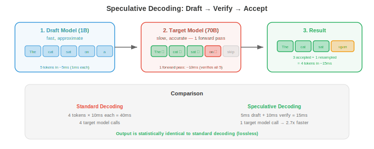

# Scaling and Deployment

*Serving large models to millions of users requires distributing inference across multiple GPUs, predicting tokens before they are needed, caching shared context, and choosing the right framework. This file covers parallelism at inference, speculative decoding, prefix caching, inference frameworks, cost optimisation, and monitoring.*

- A single H100 GPU serving a 70B model can handle ~100 concurrent users at interactive latency. Serving 10 million users requires 100,000 GPUs — costing ~$3 billion per year in cloud compute. Every percentage point of efficiency improvement saves tens of millions of dollars. This is why inference optimisation is not academic: it directly determines the economics of AI products.

## Model Parallelism at Inference

- When a model is too large for a single GPU, it must be split across multiple GPUs. The parallelism strategies from training (chapter 6) apply at inference with different tradeoffs.

### Tensor Parallelism

- **Tensor parallelism** (Megatron-style, chapter 6) splits individual weight matrices across GPUs. For a linear layer $Y = XW$, the weight matrix $W$ is split column-wise across $N$ GPUs. Each GPU computes a partial result, then an all-reduce aggregates:

$$W = [W_1 | W_2 | \cdots | W_N], \quad Y_i = X W_i, \quad Y = \text{concat}(Y_1, \ldots, Y_N)$$

- At inference, tensor parallelism is the default for models that do not fit on one GPU. A 70B model in FP16 requires 140 GB — split across 2 × 80 GB GPUs with tensor parallelism.

- **Latency impact**: tensor parallelism adds an all-reduce communication step per layer. On NVLink (900 GB/s), this adds ~0.1 ms per layer. On PCIe (32 GB/s), it adds ~3 ms per layer. For a 70B model with 80 layers on 2 GPUs: NVLink adds ~8 ms total, PCIe adds ~240 ms. This is why NVLink matters enormously for multi-GPU inference.

### Pipeline Parallelism

- **Pipeline parallelism** assigns different layers to different GPUs. GPU 1 handles layers 0-39, GPU 2 handles layers 40-79. Tokens flow through the pipeline sequentially.

- At inference, pipeline parallelism has higher latency than tensor parallelism (the entire pipeline must be traversed for each token) but lower communication overhead (only activations are passed between GPUs, no all-reduce). It is preferred when GPUs are connected by slow interconnects (different nodes, no NVLink).

### Sequence Parallelism

- For very long sequences, the KV-cache itself may not fit on one GPU even if the model does. **Sequence parallelism** shards the KV-cache across GPUs: each GPU stores a portion of the sequence's cached keys and values.

- During attention, each GPU computes partial attention scores over its cached segment, then a reduction combines the results. This is used in long-context inference (128K+ tokens) where the KV-cache exceeds single-GPU memory.

## Speculative Decoding

- **Speculative decoding** is one of the most impactful LLM inference optimisations. The insight: decoding is slow because it generates one token at a time, with each token requiring a full forward pass of the large model. But a small model can generate candidate tokens much faster, and the large model can **verify** multiple candidates in parallel.



- **The algorithm**:
    1. A **draft model** (small, fast — e.g., 1B params) generates $k$ candidate tokens autoregressively.
    2. The **target model** (large, accurate — e.g., 70B) runs a single forward pass on the entire draft sequence, computing the probability of each candidate token.
    3. Each candidate is **accepted** if the target model agrees (its probability for that token is high enough). Rejected candidates are resampled from the target model's distribution.
    4. On average, multiple tokens are accepted per verification step, giving a speedup proportional to the acceptance rate.

$$\text{Speedup} \approx \frac{k \times \text{acceptance\_rate}}{\text{cost\_ratio}} \approx 2\text{-}3\times$$

- **Why it works without quality loss**: the rejection sampling scheme guarantees that the output distribution matches the target model exactly. Speculative decoding is lossless — the output is statistically identical to running the target model alone, just faster.

- **Variants**:
    - **Medusa** (Cai et al., 2024): instead of a separate draft model, add multiple lightweight "heads" to the target model that predict multiple future tokens simultaneously. No separate model needed.
    - **EAGLE** (Li et al., 2024): trains a lightweight draft head that uses the target model's hidden states to predict future tokens. Higher acceptance rate than independent draft models.
    - **Self-speculative decoding**: the target model itself generates drafts using early exit (run only the first few layers for the draft, then verify with the full model).
    - **Parallel decoding**: generate multiple continuations in parallel (tree of candidates) and verify the entire tree at once. Higher throughput but uses more memory for the branching KV-caches.

## Prefix Caching

- Many requests share common prefixes: system prompts, few-shot examples, or common query patterns. **Prefix caching** stores the KV-cache for these prefixes and reuses it across requests.

- **System prompt caching**: if every request starts with the same 2000-token system prompt, the KV-cache for those 2000 tokens is computed once and shared across all requests. For a 70B model with 80 layers, this saves ~200 MB per request.

- **Radix tree caching** (SGLang): organise cached prefixes in a radix tree (trie). When a new request arrives, find the longest cached prefix match and start generation from there, skipping the matching prefix's computation.

- **Impact**: for applications with long shared prefixes (chatbots with system prompts, RAG with common retrieved passages), prefix caching reduces TTFT by 50-90% and saves proportional GPU compute.

## KV-Cache Eviction

- Beyond quantising the KV-cache (file 01) and using GQA/MLA to reduce its size (file 02), **KV-cache eviction** policies selectively remove cached tokens that are unlikely to be attended to in the future.

- **H2O** (Heavy-Hitter Oracle, Zhang et al., 2023) observes that attention scores follow a power law: a small fraction of tokens ("heavy hitters") receive most of the attention, while the majority receive negligible attention. H2O keeps:

    1. **Recent tokens** (a sliding window of the last $w$ tokens, like StreamingLLM).
    2. **Heavy-hitter tokens** (the top-$k$ tokens by cumulative attention score across all past decode steps).

- Tokens that are neither recent nor heavy-hitters are evicted. This maintains a fixed-size KV-cache while preserving the tokens that actually influence generation. H2O achieves quality close to full KV-cache with only 20% of the memory.

- **Scissorhands** (Liu et al., 2023) takes a similar approach but uses a more sophisticated importance metric: tokens that receive high attention in the **current** step are kept, while tokens that have not been attended to for $T$ steps are evicted. This adapts to changing attention patterns during generation.

- **Dynamic eviction + StreamingLLM**: combine attention sinks (keep the first few tokens permanently) with dynamic eviction (keep recent + heavy-hitter tokens). This is the most memory-efficient approach for very long generation, enabling infinite-length generation with bounded quality degradation.

- The key insight across all eviction methods: LLM attention is **sparse in practice** — even though the architecture computes attention over all cached tokens, the actual attention weights concentrate on a small subset. Evicting the rest has minimal impact on output quality.

## Inference Frameworks

- The LLM serving ecosystem has converged on a few dominant frameworks:

| Framework | Strengths | Best For |
|-----------|-----------|----------|
| **vLLM** | PagedAttention, continuous batching, high throughput | General LLM serving, highest throughput |
| **TensorRT-LLM** | NVIDIA-optimised kernels, FP8, in-flight batching | Maximum performance on NVIDIA GPUs |
| **SGLang** | Prefix caching (RadixAttention), fast structured generation | Applications with shared prefixes, constrained output |
| **llama.cpp** | CPU/Metal/CUDA/Vulkan, GGUF quantisation, portable | Consumer hardware, on-device inference |
| **TGI** (HuggingFace) | Simple API, easy to deploy, model hub integration | Quick deployments, HuggingFace ecosystem |
| **Ollama** | One-command model download and serving | Personal use, local development |
| **ExLlamaV2** | Extreme quantisation optimisation (EXL2 format) | Memory-constrained GPU inference |

- **vLLM** is the default choice for production LLM serving. It supports continuous batching, PagedAttention, tensor parallelism, speculative decoding, LoRA serving, and most open-source models.

- **TensorRT-LLM** achieves the highest raw performance on NVIDIA hardware (10-30% faster than vLLM on the same GPU) but is less flexible and harder to customise.

- **SGLang** excels when applications have structured output (JSON, code with specific format) or shared prefixes, thanks to its radix attention cache and constrained decoding engine.

## Cost Optimisation

- At scale, inference cost dominates ML budgets. Strategies to reduce cost:

- **Right-sizing GPU selection**: not every model needs an H100. A quantised 7B model runs well on an A10G (~$1/hr) instead of an H100 (~$8/hr). Match the GPU to the workload.

- **Spot instances**: cloud providers offer unused GPU capacity at 60-90% discount (AWS Spot, GCP Preemptible). Spot instances can be interrupted, so they work for batch inference but not latency-critical serving. Combined with preemption handling (save state, resume on a new instance), spot instances can serve interactive traffic too.

- **Autoscaling**: scale GPU count based on traffic. Scale up during peak hours, scale down at night. Kubernetes HPA (Horizontal Pod Autoscaler) or cloud-native autoscaling (AWS SageMaker, GCP Vertex AI) handle this.

- **Batching + utilisation**: the difference between 30% and 90% GPU utilisation is 3x in cost per token. Continuous batching, smart scheduling, and PagedAttention all increase utilisation.

- **Quantisation**: INT4 vs FP16 is 4x less memory → fits on a smaller GPU → 2-4x lower cost. Plus, more requests fit in the same batch → higher throughput → lower cost per token.

- **Cost per token benchmarks** (approximate, 2026):

| Setup | Cost per 1M tokens |
|-------|-------------------|
| GPT-4o API | $2.50 |
| Claude 3.5 Sonnet API | $3.00 |
| Llama-70B on H100 (vLLM, FP16) | $0.50 |
| Llama-70B on H100 (TRT-LLM, INT8) | $0.25 |
| Llama-8B on A10G (vLLM, INT4) | $0.05 |
| Llama-3B on-device (llama.cpp) | $0 (hardware amortised) |

## Monitoring

- Production inference requires continuous monitoring to catch degradation before users are affected:

- **Latency monitoring**: track TTFT and TPOT at p50, p95, and p99. Set alerts for p99 exceeding SLO. A spike in p99 often indicates: KV-cache memory pressure (thrashing), a long-running request monopolising the batch, or GPU thermal throttling.

- **Throughput monitoring**: track tokens per second per GPU. A drop indicates: reduced batch efficiency (many short requests → low batch utilisation), increased sequence lengths (more KV-cache memory per request), or hardware issues (GPU in ECC error correction mode, running slower).

- **GPU utilisation**: track SM occupancy, memory utilisation, and memory bandwidth. Low SM occupancy + high memory utilisation = memory-bound (need more bandwidth or quantisation). High SM occupancy + low memory utilisation = compute-bound (need more FLOPS or smaller model).

- **Model quality monitoring**: track per-request metrics (response length, perplexity on a held-out set, user feedback signals). Model quality can degrade due to: data drift (the distribution of incoming requests changes), KV-cache quantisation error accumulating over long conversations, or bugs in the serving pipeline.

- **Cost monitoring**: track cost per token per model per GPU type. If cost increases without throughput increase, investigate efficiency regressions (new model version with higher memory usage, suboptimal batch configuration, or underutilised GPUs).

- **Tools**: Prometheus + Grafana (chapter 15) for infrastructure metrics, vLLM/TRT-LLM's built-in metrics endpoints, and custom logging for model-level metrics.

## Coding Tasks (use CoLab or notebook)

1. Simulate speculative decoding. Use a fast "draft" function and a slow "target" function, and measure the speedup from generating and verifying multiple tokens at once.
```python
import random
import time

def target_model(tokens):
    """Slow but accurate model. Returns probability of each candidate token."""
    time.sleep(0.01)  # simulate 10ms per forward pass
    # For simulation: accept tokens that are even numbers
    return [0.9 if t % 2 == 0 else 0.1 for t in tokens]

def draft_model():
    """Fast but approximate model. Generates one candidate token."""
    time.sleep(0.001)  # simulate 1ms per token
    return random.randint(0, 9)

def standard_decoding(n_tokens):
    """Generate one token at a time with the target model."""
    tokens = []
    for _ in range(n_tokens):
        time.sleep(0.01)  # target model generates 1 token
        tokens.append(random.randint(0, 9))
    return tokens

def speculative_decoding(n_tokens, k=4):
    """Generate k draft tokens, verify with target, accept/reject."""
    tokens = []
    total_target_calls = 0

    while len(tokens) < n_tokens:
        # Draft: generate k candidates quickly
        candidates = [draft_model() for _ in range(k)]

        # Verify: one target model call for all k candidates
        probs = target_model(candidates)
        total_target_calls += 1

        # Accept tokens until one is rejected
        for i, (tok, prob) in enumerate(zip(candidates, probs)):
            if random.random() < prob:
                tokens.append(tok)
                if len(tokens) >= n_tokens:
                    break
            else:
                # Resample from target distribution
                tokens.append(tok + 1)  # simplified resampling
                break

    return tokens, total_target_calls

n = 50

start = time.time()
_ = standard_decoding(n)
standard_time = time.time() - start

start = time.time()
_, target_calls = speculative_decoding(n, k=5)
spec_time = time.time() - start

print(f"Standard:    {standard_time:.2f}s ({n} target calls)")
print(f"Speculative: {spec_time:.2f}s ({target_calls} target calls)")
print(f"Speedup:     {standard_time / spec_time:.1f}x")
```

2. Estimate the cost savings from different optimisation strategies applied to an LLM serving deployment.
```python
def serving_cost_analysis(
    model_name, params_B, precision_bits,
    gpu_name, gpu_mem_gb, gpu_cost_per_hr,
    target_throughput_tps,
):
    """Estimate serving cost for an LLM deployment."""
    model_size_gb = params_B * 1e9 * precision_bits / 8 / 1e9
    gpus_for_model = max(1, int((model_size_gb * 1.2) / gpu_mem_gb + 0.99))  # 1.2x for KV-cache

    # Rough throughput estimate (memory-bandwidth limited)
    tokens_per_gpu = 500 / (params_B * precision_bits / 16)  # normalised to 500 tok/s for 7B FP16
    total_throughput = tokens_per_gpu * gpus_for_model

    replicas = max(1, int(target_throughput_tps / total_throughput + 0.99))
    total_gpus = gpus_for_model * replicas
    cost_per_hr = total_gpus * gpu_cost_per_hr
    cost_per_1M_tokens = cost_per_hr / (total_throughput * replicas * 3600 / 1e6)

    print(f"{model_name} @ {precision_bits}-bit on {gpu_name}:")
    print(f"  Model size: {model_size_gb:.0f} GB → {gpus_for_model} GPU(s)/replica")
    print(f"  Throughput: {total_throughput:.0f} tok/s/replica")
    print(f"  Replicas for {target_throughput_tps} tok/s: {replicas}")
    print(f"  Total GPUs: {total_gpus}")
    print(f"  Cost: ${cost_per_hr:.0f}/hr, ${cost_per_1M_tokens:.2f}/1M tokens")
    print()

print("=== Cost Comparison ===\n")

# Baseline: FP16 on H100
serving_cost_analysis("Llama-70B", 70, 16, "H100", 80, 8.0, 1000)

# Quantised: INT8 on H100
serving_cost_analysis("Llama-70B", 70, 8, "H100", 80, 8.0, 1000)

# Quantised: INT4 on A100
serving_cost_analysis("Llama-70B", 70, 4, "A100", 80, 4.0, 1000)

# Smaller model: 8B on A10G
serving_cost_analysis("Llama-8B", 8, 4, "A10G", 24, 1.0, 1000)
```
