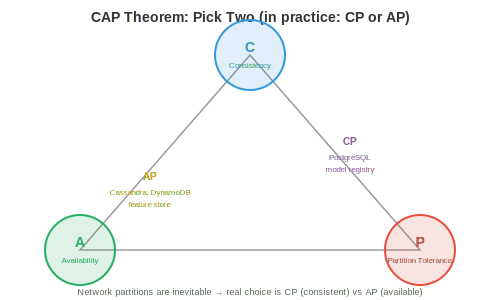

# Systems Design Fundamentals

*Systems design is how you build software that works reliably at scale. This file covers client-server architecture, networking protocols, DNS, proxies, load balancing, caching, databases, message queues, consistency models, and resilience patterns*

- Every ML system in production is a distributed system. A recommendation engine is not just a model — it is an API server, a feature store, a model registry, a caching layer, a message queue, and a monitoring stack, all communicating over a network. Understanding systems design is what separates "I trained a model" from "I built a product."

- Systems design interviews at top tech companies (Google, Meta, Amazon, OpenAI) test whether you can design these systems. This chapter gives you the building blocks (this file), the cloud infrastructure (file 02), scaling patterns (file 03), ML-specific design (file 04), and worked examples (file 05).

## Client-Server Architecture

- The fundamental pattern: a **client** sends a request, a **server** processes it and returns a response. Your browser (client) sends an HTTP request to google.com (server), which returns HTML.

- **Request-response model**: synchronous. The client waits for the response. Simple but creates a bottleneck: the client is idle while waiting, and the server must handle the request before moving on.

- **Stateless servers**: the server does not remember previous requests. Each request contains all the information needed to process it. This makes scaling easy: any server can handle any request, so you can add more servers behind a load balancer.

- **Stateful servers**: the server maintains state between requests (e.g., a user session). Harder to scale because requests from the same user must go to the same server (session affinity). Modern systems avoid server-side state by storing it in a database or cache (Redis).

## Networking Protocols

- We covered networking in chapter 13 (TCP/IP layers, sockets). Here we focus on the application-level protocols used in systems design:

- **HTTP/HTTPS**: the protocol of the web and most APIs. Request methods: GET (read), POST (create/predict), PUT (update), DELETE (remove). HTTPS adds TLS encryption (chapter 13 security). REST APIs (chapter 15 file 03) are built on HTTP.

- **WebSockets**: persistent bidirectional connection between client and server. Unlike HTTP (request → response → connection closes), WebSocket keeps the connection open for real-time streaming. Used for: LLM token streaming (send tokens as they are generated), live dashboards, chat applications.

- **gRPC**: Google's RPC framework. Uses Protocol Buffers (binary serialisation, ~10x smaller and faster than JSON) over HTTP/2. Supports streaming (server-side, client-side, bidirectional). Used for internal service-to-service communication where performance matters. Triton Inference Server (chapter 15) and TensorFlow Serving use gRPC.

- **Protocol Buffers**: define message schemas in `.proto` files:

```protobuf
message PredictRequest {
    repeated float features = 1;
    string model_version = 2;
}

message PredictResponse {
    float prediction = 1;
    float confidence = 2;
}

service ModelService {
    rpc Predict(PredictRequest) returns (PredictResponse);
}
```

- The schema is compiled into client and server code in any language (Python, C++, Go, Java). Type safety, backward compatibility, and performance come for free.

## DNS

- **DNS** (Domain Name System) translates human-readable names to IP addresses (chapter 13). For systems design, DNS also provides:

- **Load balancing via DNS**: return different IP addresses for the same domain name, distributing traffic across multiple servers. Simple but coarse-grained (DNS results are cached for minutes to hours, so traffic does not rebalance quickly).

- **Geographic routing**: return the IP of the nearest data centre based on the client's location. A user in Tokyo gets the Japanese data centre; a user in London gets the European one.

- **Failover**: if a server goes down, DNS stops returning its IP. New clients go to healthy servers. But cached DNS entries mean some clients continue hitting the dead server for minutes (the TTL problem).

## Proxies

- A **proxy** is an intermediary between client and server:

- **Reverse proxy** (in front of servers): clients connect to the proxy, which forwards requests to backend servers. The client does not know which server handled the request. **Nginx** and **HAProxy** are the standard reverse proxies. They provide: load balancing (distribute requests), SSL termination (decrypt HTTPS at the proxy, send plain HTTP to backends), caching, rate limiting, and compression.

- **API gateway**: a specialised reverse proxy for APIs. Handles authentication, rate limiting, request routing (different paths → different services), and API versioning. **Kong**, **AWS API Gateway**, and **Envoy** are common choices.

- For ML serving: an API gateway sits in front of your model servers. It authenticates API keys, rate-limits free-tier users, routes `/v1/predict` to model server A and `/v2/predict` to model server B, and collects usage metrics.

## Load Balancing

- When you have multiple servers, a **load balancer** distributes incoming requests across them.


- **Algorithms**:
    - **Round robin**: send requests to servers in order (1, 2, 3, 1, 2, 3...). Simple, fair, but does not account for server load.
    - **Least connections**: send to the server with the fewest active connections. Better for requests with variable processing time (some LLM requests generate 10 tokens, others generate 1000).
    - **Weighted round robin**: servers with more capacity get more requests. A server with 80 GB GPU memory handles 2x the requests of one with 40 GB.
    - **Consistent hashing**: hash the request key to a specific server. Same key always goes to the same server. Useful for: caching (requests for the same user hit the same cache), session affinity, and prefix caching (chapter 17: requests with the same system prompt go to the server that has the KV-cache for that prompt).

- **L4 vs L7 load balancing**:
    - **L4** (transport layer): routes based on IP and port. Fast but cannot inspect request content.
    - **L7** (application layer): routes based on HTTP path, headers, or body content. Can route `/api/chat` to chat servers and `/api/embed` to embedding servers. Slower but more flexible.

## Caching

- **Caching** stores frequently accessed data in a fast storage layer (RAM) to avoid recomputing or re-fetching it.


- **Cache patterns**:
    - **Cache-aside** (lazy loading): the application checks the cache first. On miss, it fetches from the database, stores in cache, and returns. Most common pattern.
    - **Write-through**: every write goes to both the cache and database simultaneously. Ensures cache is always up to date but slows writes.
    - **Write-back**: writes go to the cache only; the cache asynchronously flushes to the database. Fastest writes but risks data loss if the cache crashes before flushing.

- **Eviction policies** (when the cache is full):
    - **LRU** (Least Recently Used): evict the entry that has not been accessed for the longest time. The most common policy.
    - **LFU** (Least Frequently Used): evict the least-accessed entry. Better when some items are consistently popular.
    - **TTL** (Time To Live): entries expire after a fixed duration. Used for data that becomes stale (model predictions cached for 5 minutes, feature values cached for 1 hour).

- **CDN** (Content Delivery Network): a globally distributed cache for static content (images, JavaScript, CSS). Servers in 100+ locations worldwide serve cached content from the nearest location to the user. For ML: model weights can be cached on CDNs for fast download.

- **Redis**: the standard in-memory cache/database. Supports strings, lists, sets, sorted sets, hashes, and streams. Sub-millisecond latency. Used for: caching model predictions, storing session data, rate limiting (count requests per user per minute), and real-time feature serving.

- For ML serving: cache predictions for repeated inputs. If many users ask "What is the capital of France?", compute the answer once and serve the cached result. Cache hit rates of 20-40% are common for chatbot workloads, reducing GPU cost proportionally.

## Databases

### SQL (Relational)

- **SQL databases** (PostgreSQL, MySQL) store data in tables with rows and columns. Relations between tables are expressed via foreign keys. Queries use SQL. **ACID** guarantees:

    - **Atomicity**: a transaction either fully completes or fully rolls back. No partial updates.
    - **Consistency**: the database moves from one valid state to another. Constraints (unique keys, foreign keys) are always satisfied.
    - **Isolation**: concurrent transactions do not interfere with each other.
    - **Durability**: committed data survives crashes (written to disk before acknowledging).

- SQL databases excel at: structured data with relationships, complex queries (joins, aggregations), strict consistency requirements, and data integrity.

### NoSQL

- **NoSQL databases** trade some ACID guarantees for scalability and flexibility:

    - **Key-value stores** (Redis, DynamoDB): simplest model. Fast lookups by key. Used for caching, session storage, and feature stores.
    - **Document stores** (MongoDB, Firestore): store JSON-like documents. Flexible schema (each document can have different fields). Used for user profiles, product catalogues, and configuration.
    - **Column-family stores** (Cassandra, HBase): optimised for write-heavy workloads and time-series data. Used for event logging, metrics, and analytics.
    - **Graph databases** (Neo4j): store nodes and edges. Optimised for traversal queries. Used for social networks, knowledge graphs, and recommendation systems.
    - **Vector databases** (Pinecone, Milvus, Weaviate, FAISS): store high-dimensional embeddings and support approximate nearest neighbour (ANN) search. Essential for semantic search, RAG (retrieval-augmented generation), and recommendation systems.

### CAP Theorem

- In a distributed database, you can have at most two of three properties:

    - **Consistency**: every read returns the most recent write.
    - **Availability**: every request receives a response (even if some nodes are down).
    - **Partition tolerance**: the system continues operating despite network partitions (nodes cannot communicate).



- Since network partitions are inevitable in distributed systems, the real choice is **CP** (consistent but may be unavailable during partitions — e.g., PostgreSQL) vs **AP** (available but may return stale data during partitions — e.g., Cassandra, DynamoDB).

- For ML: feature stores typically choose AP (a slightly stale feature value is better than no prediction). Model registries choose CP (serving the wrong model version is catastrophic).

### Sharding

- **Sharding** splits a database across multiple machines. Each shard holds a subset of the data.

- **Hash sharding**: hash the key to determine the shard. `shard = hash(user_id) % num_shards`. Even distribution but makes range queries impossible.

- **Range sharding**: each shard holds a key range (users A-G on shard 1, H-N on shard 2). Enables range queries but can create hot spots (if many users have names starting with "S").

- **The resharding problem**: adding a shard invalidates the hash mapping. **Consistent hashing** minimises the data movement: only ~1/n of keys need to move when adding the nth shard.

### Database Indexing

- An **index** is a data structure that speeds up queries at the cost of extra storage and slower writes. Without an index, a query scans every row (**O(n)**). With an index, it finds the target in **O(log n)**.

- **B-tree index** (the default): a balanced tree (chapter 13, chapter 14) where each node contains multiple keys and pointers. B-trees are cache-friendly (wide nodes fit in cache lines) and support range queries (`WHERE age BETWEEN 20 AND 30`). Most SQL databases use B-trees.

- **Hash index**: maps keys to row locations using a hash function. $O(1)$ lookup but does not support range queries. Used for exact-match lookups (`WHERE id = 12345`).

- **Composite index**: an index on multiple columns. `CREATE INDEX ON users(country, city)` speeds up queries filtered by country, or by country + city, but NOT by city alone (the leftmost column must be in the query).

- **The tradeoff**: every index speeds up reads but slows down writes (the index must be updated on every insert/update/delete) and uses storage (~10-30% of the table size per index). Do not index everything — index the columns you query frequently.

- **For ML systems**: the feature store's online database needs indexes on entity keys (user_id, item_id) for fast feature lookup. The experiment tracking database needs indexes on (experiment_id, metric_name) for dashboard queries.

### API Design

- Systems communicate via APIs. Good API design makes the system usable, evolvable, and debuggable:

- **REST conventions**: use nouns for resources (`/users`, `/models`), HTTP methods for actions (GET = read, POST = create, PUT = update, DELETE = remove), and status codes for results (200 = OK, 201 = created, 400 = bad request, 404 = not found, 429 = rate limited, 500 = server error).

- **Pagination**: for endpoints that return lists, never return all results at once. Use cursor-based pagination (`GET /items?cursor=abc&limit=50`) or offset-based (`GET /items?offset=100&limit=50`). Cursor-based is more efficient for large datasets (offset-based requires skipping rows).

- **Versioning**: prefix API paths with a version (`/v1/predict`, `/v2/predict`). This lets you evolve the API without breaking existing clients. Clients migrate to v2 at their own pace; v1 is deprecated but not removed until traffic drops.

- **Error responses**: return structured errors with enough information to debug:

```json
{
    "error": {
        "code": "INVALID_INPUT",
        "message": "Feature 'user_age' must be a positive integer",
        "details": {"field": "user_age", "value": -5}
    }
}
```

## Message Queues

- **Message queues** decouple producers (services that generate work) from consumers (services that process it). The producer sends a message to the queue; the consumer pulls it when ready.

- **Why queues matter**: without a queue, if the consumer is slow or down, the producer is blocked. With a queue, the producer fires and forgets; the queue buffers messages until the consumer is ready.

- **Apache Kafka**: a distributed, persistent, high-throughput message queue. Messages are stored in **topics**, each partitioned across multiple brokers. Consumers read from partitions, tracking their position (**offset**). Kafka guarantees ordering within a partition and can replay messages (the log is persistent).

- **Pub/sub**: publishers send messages to a topic; all subscribers to that topic receive a copy. Used for event-driven architecture: "a new model was deployed" triggers the monitoring service, the A/B testing service, and the logging service simultaneously.

- For ML: a prediction request arrives via HTTP, is placed in a Kafka queue, processed by a GPU worker, and the result is returned via a callback or WebSocket. The queue buffers bursts of traffic and ensures no requests are lost if a GPU worker crashes.

## Consistency Models

- In a distributed system, different nodes may have different views of the data. **Consistency models** define what guarantees the system provides:

- **Strong consistency**: after a write, all subsequent reads (from any node) see the new value. Simple to reason about but slow (requires coordination between nodes).

- **Eventual consistency**: after a write, reads may see stale data for some period, but will eventually see the new value. Fast (no coordination) but requires the application to handle stale reads.

- **Causal consistency**: if operation A causally precedes B (e.g., "write X then read X"), the system guarantees B sees A's result. But unrelated operations may be seen in any order.

- **Read-your-writes**: a user always sees their own writes immediately, even if other users see stale data. The minimum consistency most applications need.

## Resilience Patterns

- **Rate limiting**: cap the number of requests per user per time window. Protects against abuse and ensures fair access. Implemented with a token bucket or sliding window counter in Redis.

- **Circuit breaker**: if a downstream service starts failing (error rate exceeds threshold), the circuit breaker "opens" and stops sending requests to it (returning a fallback response immediately). After a timeout, it "half-opens" and sends a test request. If the test succeeds, it closes (normal operation). This prevents cascading failures: if the feature store is down, the model server returns predictions without features rather than timing out on every request.

- **Backpressure**: when a system is overwhelmed, it signals upstream to slow down. Rather than accepting requests and failing, it rejects excess requests early (with a 429 or 503 status code). The client retries with exponential backoff.

- **Retry with exponential backoff**: if a request fails, wait 1 second and retry. If it fails again, wait 2 seconds. Then 4, 8, etc. Add jitter (random delay) to prevent all clients retrying simultaneously (the thundering herd problem).

- **Idempotency**: an operation is idempotent if doing it twice has the same effect as doing it once. `PUT /user/123 {"name": "Alice"}` is idempotent (setting the name twice to "Alice" is fine). `POST /payments` is not (paying twice is bad). Making operations idempotent ensures retries are safe.
