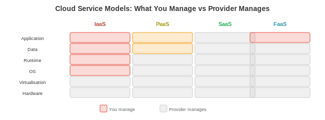

# Cloud Computing

*Cloud computing provides on-demand infrastructure for ML workloads without owning hardware. This file covers service models, major cloud providers, containers and Kubernetes, storage, cloud networking, serverless computing, cost management, and infrastructure as code*

- Training a frontier model requires thousands of GPUs for months. No startup owns that hardware. Cloud computing lets you rent it by the hour, scale up for training, scale down for inference, and pay only for what you use. Understanding cloud infrastructure is essential for anyone building ML systems beyond a laptop.

## Cloud Service Models



- Cloud services are layered by how much the provider manages:

| Model | You Manage | Provider Manages | Example |
|-------|-----------|-----------------|---------|
| **IaaS** (Infrastructure) | OS, runtime, app | Hardware, virtualisation, networking | AWS EC2, GCP Compute Engine |
| **PaaS** (Platform) | App, data | OS, runtime, scaling, patching | AWS SageMaker, GCP Vertex AI |
| **SaaS** (Software) | Nothing (just use it) | Everything | OpenAI API, Weights & Biases |
| **FaaS** (Function) | Individual functions | Everything else | AWS Lambda, GCP Cloud Functions |

- **For ML**: most teams use a mix. IaaS for custom training (full control over GPU instances), PaaS for managed training and serving (SageMaker, Vertex AI handle the orchestration), and SaaS for tools (W&B for experiment tracking, OpenAI API for baseline comparisons).

## Major Providers

### AWS (Amazon Web Services)

- The largest cloud provider (~32% market share). Key ML services:
    - **EC2**: virtual machines. GPU instances: p4d (A100), p5 (H100), g5 (A10G for inference).
    - **S3**: object storage. The standard for storing datasets and model weights. Virtually unlimited capacity, ~$0.023/GB/month.
    - **SageMaker**: managed ML platform. Handles training, hyperparameter tuning, deployment, and monitoring.
    - **EKS**: managed Kubernetes.
    - **Lambda**: serverless functions. Not suitable for GPU workloads but useful for preprocessing and orchestration.

### GCP (Google Cloud Platform)

- Google's cloud (~11% market share). Key ML services:
    - **Compute Engine**: VMs. GPU instances with A100, H100. **TPU VMs** for TPU access.
    - **GCS**: object storage (like S3).
    - **Vertex AI**: managed ML platform. Native JAX/TPU support.
    - **GKE**: managed Kubernetes (the most mature K8s offering, since Google created Kubernetes).
    - **Cloud TPUs**: exclusive to GCP. v5e and v5p for large-scale training.

### Azure (Microsoft)

- Microsoft's cloud (~23% market share). Key ML services:
    - **Azure VMs**: GPU instances with A100, H100.
    - **Azure Blob Storage**: object storage.
    - **Azure ML**: managed ML platform.
    - **AKS**: managed Kubernetes.
    - **OpenAI Service**: exclusive access to OpenAI models via Azure API.

## Containers and Kubernetes

- We covered containers (Docker) and Kubernetes conceptually in chapter 13 (OS) and practically in chapter 15 (deployment). Here we focus on the **cloud-specific** patterns:

### Kubernetes for ML

- **Kubernetes (K8s)** orchestrates containers at scale. Key concepts:

    - **Pod**: the smallest deployable unit. Contains one or more containers sharing networking and storage. A model serving pod might contain: the model server container + a sidecar container for metrics collection.

    - **Deployment**: manages a set of identical pods. Specifies the desired number of replicas. If a pod crashes, K8s automatically creates a replacement.

    - **Service**: a stable network endpoint for a set of pods. Clients connect to the service; K8s routes to a healthy pod. Types: ClusterIP (internal), NodePort (external via node port), LoadBalancer (external via cloud LB).

    - **StatefulSet**: like a Deployment but for stateful workloads. Each pod gets a persistent identity and stable storage. Used for databases and distributed training (each worker needs a stable identity for communication).

    - **DaemonSet**: runs one pod on every node. Used for: monitoring agents (Prometheus node exporter), log collectors (Fluentd), GPU device plugins (NVIDIA device plugin).

- **GPU scheduling in K8s**: the NVIDIA device plugin exposes GPUs as a K8s resource. Pods request GPUs:

```yaml
resources:
  limits:
    nvidia.com/gpu: 2  # this pod needs 2 GPUs
```

- K8s schedules the pod onto a node with 2 available GPUs. This is how cloud ML platforms allocate GPUs for training and inference.

### Autoscaling

- **Horizontal Pod Autoscaler (HPA)**: scales the number of pods based on metrics (CPU usage, request rate, custom metrics like GPU utilisation or queue depth).

- **Cluster Autoscaler**: scales the number of nodes. If pods cannot be scheduled because there are not enough nodes, the cluster autoscaler provisions new VMs from the cloud provider. When nodes are underutilised, it drains and terminates them.

- **KEDA** (Kubernetes Event-Driven Autoscaling): scales based on external event sources (Kafka queue depth, HTTP request rate). Perfect for inference: scale up model servers when the request queue grows, scale down when it is empty.

## Storage

| Type | Characteristics | Use Case | Example |
|------|----------------|----------|---------|
| **Block** | Low-latency, attached to one VM | OS disks, databases | AWS EBS, GCP Persistent Disk |
| **Object** | Unlimited capacity, HTTP access | Datasets, model weights, logs | AWS S3, GCS, Azure Blob |
| **File** | Shared across VMs, POSIX | Shared training data | AWS EFS, GCP Filestore, NFS |
| **Data lake** | Schema-on-read, raw data | Analytics, feature engineering | Delta Lake, Iceberg, Hudi |

- **For ML training**: datasets are stored in object storage (S3/GCS). Training scripts read data from object storage into RAM. For fast random access (shuffled data loading), either: (1) download the dataset to local SSD before training, (2) use a high-throughput file system (Lustre, FSx), or (3) use a data loading library that streams and caches efficiently (WebDataset, FFCV).

- **Model weights**: stored in object storage with versioning. A 70B model in FP16 is ~140 GB. Loading from S3 at 1 GB/s takes ~2.5 minutes. Caching on local SSD reduces cold start time for inference.

## Cloud Networking

- **VPC** (Virtual Private Cloud): an isolated network within the cloud. Your VMs, databases, and services communicate within the VPC. External traffic enters through load balancers or gateways.

- **Subnets**: divide the VPC into segments. Public subnets have internet access (for API servers). Private subnets do not (for databases, GPU workers). This is the network equivalent of the security principle of least privilege.

- **Security groups** (AWS) / **Firewall rules** (GCP): control which traffic is allowed. "Allow inbound HTTP on port 80 from anywhere. Allow inbound SSH on port 22 from my IP only. Block everything else." Misconfigured security groups are the number one cause of cloud security incidents.

- **Service mesh** (Istio, Envoy): manages service-to-service communication within K8s. Provides: mTLS encryption (every service-to-service call is encrypted), traffic routing (A/B testing: route 10% of traffic to the new model), retries, timeouts, circuit breaking, and observability (which service called which, how long did it take).

## Serverless

- **Serverless** (AWS Lambda, GCP Cloud Functions): you upload a function, and the cloud provider runs it when triggered. No servers to manage, no scaling to configure. You pay per invocation (typically $0.20 per 1M invocations + compute time).

- **Cold starts**: the first invocation after a period of inactivity takes longer (the provider must allocate a container and load your code). Cold starts are 0.5-5 seconds, making serverless unsuitable for latency-sensitive ML inference.

- **For ML**: serverless is useful for: preprocessing (resize images before sending to the model), postprocessing (format model output, send notifications), orchestration (trigger a training pipeline when new data arrives), and lightweight inference (small models with tolerance for cold starts).

- Serverless is **not** suitable for: GPU inference (no GPU support in most serverless platforms), long-running training jobs (15-minute timeout in Lambda), or stateful services (no persistent state between invocations).

## Cost Management

- Cloud costs are the number one operational concern for ML teams. A single H100 instance costs ~$8/hour. A 64-GPU training run costs ~$500/hour. A month-long training run costs ~$360,000. Cost optimisation is engineering, not accounting.

- **Spot/preemptible instances**: unused cloud capacity sold at 60-90% discount. The provider can reclaim them with 30-second to 2-minute notice. Use for: fault-tolerant training (checkpoint frequently, resume on new instances), batch inference, data preprocessing. Not for: latency-sensitive serving (interruption = downtime).

- **Reserved instances**: commit to 1-3 years of usage for 30-60% discount. Use for: steady-state inference serving where you know the baseline load.

- **Autoscaling**: scale up during peak hours, scale down at night/weekends. A model server that needs 10 GPUs at peak and 2 at night saves ~60% by autoscaling vs running 10 GPUs 24/7.

- **Right-sizing**: do not use an H100 for a 7B model that runs fine on an A10G. Match the GPU to the workload. Use profiling (chapter 16) to determine which GPU is the best fit.

- **Storage costs**: object storage is cheap ($0.023/GB/month for S3 Standard), but accumulates. A team storing every training checkpoint (10 GB each, 100 per experiment, 50 experiments) accumulates 50 TB = $1,150/month. Set lifecycle policies to delete old checkpoints automatically.

## Multi-Region Deployment

- For global ML systems (serving users worldwide), deploying in a single region means high latency for distant users (a user in Tokyo hitting a US server adds ~150ms network round trip) and a single point of failure (if the region goes down, the entire service is offline).

- **Multi-region patterns**:

    - **Active-passive**: one primary region handles all traffic. A secondary region has a warm standby (replicated data, ready to receive traffic). On primary failure, DNS switches to the secondary. Downtime during failover: 30 seconds to several minutes.

    - **Active-active**: both regions handle traffic simultaneously. Users are routed to the nearest region. Both regions have up-to-date data (replicated asynchronously or synchronously). No downtime during a single-region failure — traffic is rerouted automatically.

- **Data replication**: the hard part. Model weights can be replicated easily (copy to S3 in each region). Feature store data must be replicated with acceptable staleness. User data may have **data residency requirements** (GDPR: European user data must stay in Europe).

- **GPU cloud pricing comparison** (approximate, 2026):

| GPU | AWS | GCP | Azure | Typical Use |
|-----|-----|-----|-------|-------------|
| A10G (24 GB) | $1.00/hr (g5) | $0.90/hr | $0.90/hr | Small model inference |
| A100 (80 GB) | $4.10/hr (p4d) | $3.70/hr | $3.40/hr | Training, large inference |
| H100 (80 GB) | $8.00/hr (p5) | $7.50/hr | $7.00/hr | Frontier training |
| TPU v5e | n/a | $1.20/hr | n/a | JAX training at scale |

- Spot/preemptible pricing is typically 60-70% off these rates. Prices vary by region and availability.

## Infrastructure as Code

- **IaC** defines infrastructure (VMs, networks, databases, K8s clusters) in version-controlled configuration files. Instead of clicking buttons in the AWS console, you write code that describes what you want, and a tool creates it.

- **Terraform** (HashiCorp): the standard IaC tool. Works with all major cloud providers. Declarative: you describe the desired state, Terraform figures out what to create/modify/delete to reach it.

```hcl
# main.tf — create a GPU VM for inference
resource "aws_instance" "model_server" {
  ami           = "ami-0abcdef1234567890"  # Deep Learning AMI
  instance_type = "g5.xlarge"               # A10G GPU

  tags = {
    Name = "model-server-prod"
  }
}

resource "aws_s3_bucket" "model_weights" {
  bucket = "my-model-weights-prod"

  versioning {
    enabled = true
  }
}
```

```bash
terraform init      # download provider plugins
terraform plan      # show what will change
terraform apply     # create the infrastructure
terraform destroy   # tear it all down
```

- **Why IaC matters**: reproducibility (recreate the entire infrastructure from code), auditing (git history shows who changed what), disaster recovery (rebuild in a different region from the same config), and environment parity (dev, staging, and prod use the same templates with different parameters).

- **Pulumi**: like Terraform but uses real programming languages (Python, TypeScript, Go) instead of HCL. Useful when your infrastructure logic is complex (conditionals, loops, dynamic configuration).
