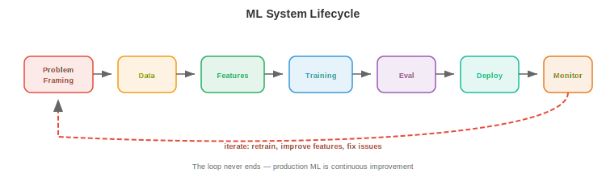
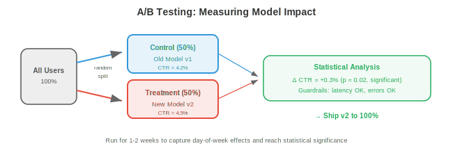

# ML Systems Design

*ML systems design applies the infrastructure patterns from files 01-03 to the specific challenges of machine learning. This file covers the ML lifecycle, data management, training infrastructure, model evaluation, serving strategies, feature engineering, ML pipelines, and monitoring.*

- A systems design interview question like "Design a recommendation system for YouTube" is not asking you to describe the recommendation algorithm. It is asking you to design the **entire system**: data pipelines, feature engineering, model training, evaluation, serving, monitoring, and iteration. This file provides the framework.

## The ML System Lifecycle



- Every ML system follows the same lifecycle, whether it is a spam classifier or a foundation model:

```
Problem Framing → Data → Features → Training → Evaluation → Deployment → Monitoring → Iteration
       ↑                                                                                    │
       └────────────────────────────────────────────────────────────────────────────────────┘
```

### Problem Framing

- Before touching data or models, define:
    - **What** are you predicting? (click probability, next token, object bounding box)
    - **Who** are the users? (end users, internal analysts, other ML models)
    - **What are the constraints?** (latency < 100ms, offline batch is fine, must run on-device)
    - **What is the business metric?** (revenue, engagement, accuracy) and how does the ML metric relate to it?
    - **What is the baseline?** (heuristic, rule-based system, existing model) — you must beat this to justify the ML system.

- **Common mistake**: jumping to model architecture before understanding the problem. "We should use a transformer" is not a system design answer. "We need to predict click probability for 10M candidates within 200ms, so we need a two-stage system: fast retrieval then a small ranking model" is.

## Data Management

### Data Collection and Labelling

- **Explicit labels**: humans annotate data (click/no-click, object bounding boxes, conversation quality ratings). Expensive (~$0.02-$10 per label depending on complexity), slow, and subjective.

- **Implicit labels**: derive labels from user behaviour. Clicks, dwell time, purchases, skips. Cheap and abundant but noisy (a click does not mean satisfaction; a skip does not mean dislike).

- **Programmatic labelling** (Snorkel): write labelling functions (heuristics, regex, existing models) that vote on each example. Aggregate votes statistically to produce probabilistic labels. Scales to millions of examples with moderate accuracy.

- **Active learning**: the model identifies the examples it is most uncertain about and requests human labels for those. This maximises label efficiency: 1000 actively-selected labels can match 10,000 random labels.

### Data Quality

- **Data validation**: check every batch of incoming data for schema violations (missing fields, wrong types), distribution shifts (average values changed significantly), and volume anomalies (expected 1M rows, got 500K).

- **Great Expectations** and **TFX Data Validation** are tools that define expectations about data and alert when they are violated.

- **Data versioning**: every training run should be reproducible. **DVC** (chapter 15) tracks data files alongside code. Each dataset version gets a hash; the training config references the hash.

### Feature Stores


- **Feature stores** (chapter 15) provide consistent features for training and serving. Key concepts:

    - **Offline features**: computed from batch pipelines (Spark), stored in data warehouses. Used during training and for batch inference. Examples: user's average session length over 30 days, item's total purchase count.

    - **Online features**: computed in real-time or precomputed and served from a low-latency store (Redis, DynamoDB). Used during real-time inference. Examples: user's last 5 actions, current cart contents.

    - **Training-serving skew**: if the feature computation differs between training and serving, the model sees different feature values at inference than it was trained on. Feature stores eliminate this by using the same computation for both.

## Training Infrastructure

- For this book's audience, distributed training was covered in depth in chapter 6 (data parallelism, model parallelism, mixed precision, scaling laws). Here we focus on the **systems** aspects:

- **Experiment tracking** (W&B, MLflow — chapter 15): every training run logs hyperparameters, metrics, git commit, data version, and hardware. This is the ML equivalent of version control for models.

- **Hyperparameter tuning**: automated search over hyperparameters. Methods: grid search (exhaustive, expensive), random search (surprisingly effective), Bayesian optimisation (model the objective, sample where improvement is likely), and **ASHA** (Asynchronous Successive Halving: start many trials, kill underperforming ones early).

- **Training pipeline orchestration** (Airflow, Kubeflow — chapter 15): automate the sequence of data prep → training → evaluation → registration. Schedule daily retraining. Alert on failures.

## Model Evaluation

### Offline Evaluation

- **Held-out test set**: evaluate on data the model never saw during training. Standard but can be misleading if the test set does not represent production data.

- **Slice-based evaluation**: evaluate on subgroups (by user demographics, content type, language, time period). A model with 95% overall accuracy might have 70% accuracy for a specific minority group — unacceptable.

- **Backtesting**: for time-series or sequential prediction, evaluate on historical data in time order. Train on data up to time $t$, evaluate on data from $t$ to $t + \Delta t$. Avoids the leakage of using future data for training.

### Online Evaluation



- **A/B testing**: randomly split live traffic into control (old model) and treatment (new model). Compare business metrics (revenue, engagement, retention) with statistical significance. The gold standard for evaluating ML changes.

    - **Sample size**: you need enough data to detect the expected effect size. A 0.1% improvement in click-through rate requires millions of impressions to detect with significance.

    - **Duration**: run for at least one full cycle (1-2 weeks for most products) to capture day-of-week effects.

    - **Guardrail metrics**: monitor metrics that should NOT change (page load time, error rate, crash rate) alongside the target metric. A model that increases revenue but also increases crashes is a net negative.

- **Shadow deployment**: run the new model alongside the old one in production. Both receive the same requests, but only the old model's predictions are served to users. Compare the outputs. This catches bugs and quality issues without risk to users.

- **Interleaving**: for ranking problems, interleave results from the old and new model in a single list. Users interact with the interleaved list, and you measure which model's results get more engagement. Requires fewer users than A/B testing to reach significance.

## Model Serving

### Batch vs Real-Time

- **Batch inference**: precompute predictions for all possible inputs. Store in a database/cache. Serve from the cache. Works when: the input space is finite (recommend for all users nightly), freshness is not critical (daily predictions are fine), and latency tolerance is high.

- **Real-time inference**: compute predictions on demand for each request. Works when: the input space is infinite (any user query), freshness matters (predict for this specific query right now), and latency must be low.

- Many systems use **both**: batch precomputes a set of candidates (cheap, covers 80% of traffic), real-time handles the rest (expensive, covers tail queries and new users).

### Model Versioning and Registry

- A **model registry** (MLflow, W&B, SageMaker) stores trained models with metadata:
    - Version number and training date.
    - Training config and data version.
    - Evaluation metrics (accuracy, latency, memory usage).
    - Stage: development → staging → production → archived.

- **Rollback**: if a new model degrades metrics in production, revert to the previous version immediately. The registry makes this a one-click operation.

## Feature Engineering

- **Feature engineering** transforms raw data into the inputs the model needs. It is often the highest-leverage activity in ML: better features improve every model, while better models are limited by the features they receive.

### Online vs Offline Features

- **Offline features** are precomputed and change slowly (user demographics, 30-day aggregates). Computed by batch pipelines (Spark), stored in the feature store.

- **Online features** reflect the current state and change rapidly (items in cart, last action, current location). Computed in real-time from event streams or looked up from a fast store.

- **Feature freshness**: some features need to be seconds-fresh (fraud detection: is this transaction anomalous given the last 5 transactions?). Others can be hours-stale (recommendations: what genres does this user prefer based on their history?). Fresher features are more expensive to compute and serve.

### Common Feature Patterns

- **Counting features**: count of events in a time window (purchases in last 7 days, logins in last 24 hours).
- **Embedding features**: learned embeddings for categorical variables (user embedding, item embedding, query embedding). These are the inputs to two-tower models and similar architectures.
- **Cross features**: combinations of two or more features (user_age × item_category). Capture interactions that individual features miss.
- **Temporal features**: time since last action, day of week, hour of day. Capture temporal patterns.
- **Aggregation features**: mean, median, min, max, std of a numerical feature over a group (average rating of items by this seller).

## ML Pipelines

- An ML pipeline orchestrates the entire workflow from data to deployed model:

```
Data ingestion → Validation → Feature engineering → Training → Evaluation → Registration → Deployment → Monitoring
```

- Each step is a task in an orchestrator (Airflow, Kubeflow, Metaflow — chapter 15). The pipeline:
    - Runs on a schedule (daily retraining) or on trigger (new data available).
    - Is idempotent (rerunning produces the same result).
    - Has retry logic (if feature computation fails, retry 3 times with backoff).
    - Produces artifacts (trained model, evaluation report, feature statistics) that are versioned and stored.

- **Metaflow** (Netflix/Outerbounds) is particularly well-suited for ML: it versions code, data, and models together, supports local development and cloud execution with the same code, and integrates with K8s and AWS.

## Monitoring

- We covered monitoring fundamentals in chapter 15 (Prometheus, Grafana, alerts). Here we focus on **ML-specific monitoring**:

### Data Drift

- **Data drift** occurs when the distribution of incoming data changes relative to the training data. A model trained on summer data may perform poorly on winter data (different user behaviour, different product availability).

- **Detection**: compare the distribution of incoming features to the training distribution using statistical tests:
    - **KS test** (Kolmogorov-Smirnov): compares two empirical distributions. Tests whether they come from the same underlying distribution.
    - **PSI** (Population Stability Index): measures how much a distribution has shifted. PSI < 0.1 is stable, 0.1-0.25 is moderate shift, > 0.25 is significant.
    - **Embedding drift**: compare the embedding distribution of incoming queries to the training set using centroid distance or MMD (Maximum Mean Discrepancy).

### Concept Drift

- **Concept drift** occurs when the relationship between inputs and outputs changes. The features look the same, but the correct prediction is different. Example: user preferences shift after a cultural event, pandemic, or product change.

- Concept drift is harder to detect than data drift because it requires labelled data. Monitor proxy metrics: click-through rate, conversion rate, user satisfaction scores. A sustained decline suggests concept drift.

### Model Degradation

- Models degrade over time for multiple reasons: data drift, concept drift, feature pipeline bugs (a feature starts returning null), and upstream data changes (a third-party API changes its response format).

- **Response**: when degradation is detected, the action depends on severity:
    - Mild: retrain on recent data (scheduled retraining handles this).
    - Moderate: investigate the root cause (which feature changed? which user segment is affected?).
    - Severe: roll back to a previous model version immediately, then investigate.

### Feedback Loops

- ML systems create **feedback loops**: the model's predictions influence user behaviour, which becomes the training data for the next model version. These loops can be virtuous or vicious.

- **Positive feedback loop** (dangerous): a recommendation model shows mostly popular items → users click on popular items (because that is all they see) → the model learns that popular items are even more popular → diversity collapses. The model creates the data that confirms its biases.

- **Negative feedback loop** (also dangerous): a fraud detection model catches all fraud of type A → no type-A fraud reaches the training data → the next model does not learn to detect type A → type-A fraud resurfaces.

- **Mitigations**:
    - **Exploration**: show some items the model is uncertain about (epsilon-greedy, Thompson sampling). This generates diverse training data.
    - **Counterfactual logging**: record what the model *would have* predicted, not just what the user saw. Train on counterfactual data to debias.
    - **Holdout sets**: randomly serve a fraction of traffic without model filtering. The unfiltered data provides ground truth for evaluating model quality.
    - **Delayed labels**: wait for the true outcome before using the data for training. A recommendation clicked today may be regretted tomorrow. A fraud prediction must wait for the chargeback window (30-90 days).

### Embedding Table Management

- Large-scale ML systems often have embedding tables with 100M+ entries (one embedding per user, item, ad, or entity). Managing these at scale is a systems challenge:

- **Storage**: 100M entities × 256-dim × float16 = 50 GB. Does not fit in GPU memory. Solutions: store in CPU memory with GPU-side caching, shard across multiple machines, or use **hash embeddings** (hash entities to a fixed-size table, accepting collisions).

- **Updates**: embeddings change as the model retrains. Deploying a new embedding table to serving requires: loading 50 GB into memory without disrupting live traffic, verifying correctness, and rolling back if metrics degrade. Use blue-green deployment for embedding tables.

- **Staleness**: a newly created user has no embedding (the cold start problem). Solutions: use a default embedding, derive an embedding from the user's features via a feature-to-embedding model, or fall back to a non-personalised model.

### Fairness and Bias

- ML systems can systematically treat different groups differently, often reflecting biases in training data. **Fairness monitoring** is a responsibility, not an optional feature.

- **Metrics to monitor**:
    - **Demographic parity**: does the positive prediction rate differ across groups (gender, ethnicity, age)?
    - **Equal opportunity**: does the true positive rate differ across groups? (A hiring model should be equally good at identifying qualified candidates from all groups.)
    - **Calibration**: if the model says P(qualified) = 0.7 for group A, does 70% of group A actually qualify? And the same for group B?

- **Practical steps**:
    - Evaluate model performance on slices (subgroups) not just overall metrics.
    - Include fairness metrics in the model evaluation pipeline (a model that improves overall accuracy but degrades a specific group should not be deployed without review).
    - Document known limitations and failure modes.
    - Establish a review process for models deployed in sensitive domains (hiring, lending, criminal justice, healthcare).
