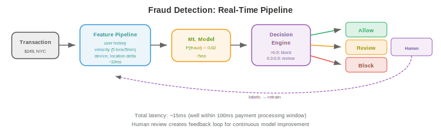
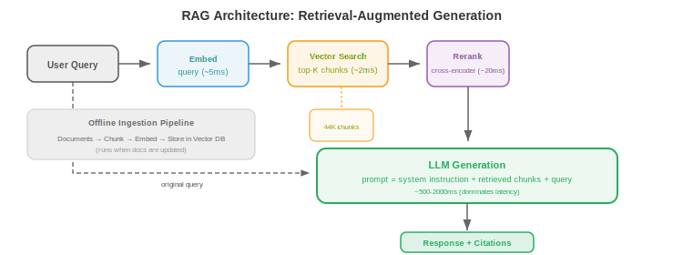

# ML Design Examples

*The best way to learn ML systems design is through worked examples. This file walks through seven complete designs: recommendation systems, search ranking, ads click prediction, fraud detection, content moderation, conversational AI, and large-scale image search.*

- Each example follows a consistent framework:
    1. **Problem framing**: what are we building, who are the users, what are the constraints?
    2. **Data**: what data do we have, how is it collected, how is it labelled?
    3. **Features**: what features does the model need?
    4. **Model**: what architecture and training approach?
    5. **Serving**: how is the model deployed and served?
    6. **Evaluation**: how do we measure success?
    7. **Iteration**: what improvements would we make over time?

---

## 1. Recommendation System (e.g., YouTube, Netflix, Spotify)

### Problem Framing

- **Goal**: show users content they will enjoy, maximising engagement (watch time, listens, clicks).
- **Scale**: 1B+ users, 100M+ items, 10K+ recommendations per second.
- **Latency**: <200ms for the full recommendation pipeline.
- **Key challenge**: the candidate space is enormous (100M items). Cannot score all items for all users in real-time.

### Architecture: Two-Stage Pipeline


```
100M items → Candidate Generation (fast, coarse) → 1000 candidates
          → Ranking (slow, precise) → 100 ranked items
          → Re-ranking (business rules) → 20 shown to user
```

### Candidate Generation

- **Goal**: reduce 100M items to ~1000 candidates. Must be fast (<50ms).
- **Two-tower model**: encode users and items into the same embedding space. The user embedding captures preferences; the item embedding captures content characteristics. Score = dot product of user and item embeddings.
- **Training**: contrastive learning on (user, positive_item, negative_items) triples. Positives = items the user engaged with. Negatives = random items + hard negatives (popular items the user did not engage with).
- **Serving**: precompute all item embeddings. At request time: compute the user embedding, ANN search (HNSW in a vector database) to find the 1000 nearest item embeddings.

### Ranking

- **Goal**: precisely score the 1000 candidates. Can afford ~100ms.
- **Model**: a deep neural network (MLP or transformer) that takes rich features: user features (demographics, history, context), item features (content, popularity, freshness), and cross features (user-item interaction history, contextual relevance).
- **Output**: predicted probability of engagement (click, watch 50%+, like, share). Multiple objectives can be combined: $\text{score} = w_1 \cdot P(\text{click}) + w_2 \cdot P(\text{watch}) + w_3 \cdot P(\text{like})$.

### Re-ranking

- Apply business rules: diversity (do not show 5 videos from the same creator), freshness (boost new content), safety (filter flagged content), and personalised exploration (show some lower-ranked items the user might discover).

### Back-of-Envelope Numbers

- **Item embedding index**: 100M items × 256-dim × float16 = 50 GB. HNSW index adds ~2x overhead → ~100 GB. Fits on a single machine with 128 GB RAM, or shard across 4 × 32 GB machines.

- **User embedding computation**: ~5ms per user (small MLP on user features). At 10K QPS, need ~50 model replicas to handle the load.

- **ANN search**: ~2ms for top-1000 from 100M vectors with HNSW. At 10K QPS, each index replica handles ~500 QPS → need 20 replicas.

- **Ranking model**: 1000 candidates × ~0.1ms per candidate = 100ms per request. At 10K QPS, need 1000 GPU-seconds per second → ~10 A10G GPUs for ranking alone.

- **Total infrastructure**: ~20 embedding index replicas + ~50 user embedding servers + ~10 ranking GPUs + caching + load balancers. Cost: ~$50K-$100K/month at cloud prices.

### Cold Start

- **New users** (no history): use demographic features, device/location context, and popularity-based recommendations. After 5-10 interactions, switch to the personalised model.

- **New items** (no engagement data): use content-based features (title, description, thumbnail embeddings). Allocate an exploration budget: show new items to a fraction of users to gather engagement data quickly. Items with no engagement after a boost period are demoted.

- **Cold start is a systems problem**: the feature store must handle missing features gracefully (return defaults, not errors). The model must be trained with missing features (dropout on user history features during training simulates new users).

### Evaluation

- **Offline**: NDCG (Normalized Discounted Cumulative Gain), recall@K, precision@K on a held-out set.
- **Online**: A/B test measuring watch time, DAU, retention. Long-term A/B tests (weeks) to catch effects on user retention that short tests miss.

---

## 2. Search Ranking (e.g., Google, Bing)

### Problem Framing

- **Goal**: given a user query, return the most relevant results from a corpus of billions of documents.
- **Latency**: <500ms total (100ms retrieval + 200ms ranking + 100ms rendering + overhead).

### Architecture: Query Understanding → Retrieve → Rank

### Query Understanding

- Before retrieval, process the raw query to improve results:

- **Spell correction**: "reccomendation systm" → "recommendation system." Use an edit-distance model or a sequence-to-sequence model trained on (misspelled, corrected) pairs from search logs.

- **Query expansion**: add related terms to improve recall. "Python ML" → "Python machine learning scikit-learn pytorch." Use synonym dictionaries, word embeddings, or an LLM to generate expansions.

- **Intent classification**: determine what the user wants. "buy Nike shoes" is **transactional** (show product pages). "How does backpropagation work" is **informational** (show articles). "facebook.com" is **navigational** (go directly to the site). Different intents should trigger different retrieval strategies and result layouts.

- **Entity recognition**: extract entities from the query. "best restaurants near Times Square" → location: "Times Square", entity type: "restaurants." Route to a location-aware search pipeline.

### Retrieval

- **BM25** (traditional): term-matching retrieval using an inverted index. Fast, effective for keyword queries. No semantic understanding ("dog food" does not match "canine nutrition").

- **Dense retrieval**: encode queries and documents as embeddings (using a bi-encoder like DPR or ColBERT). Retrieve by ANN search. Captures semantic similarity ("dog food" matches "canine nutrition"). Slower than BM25 but better for natural language queries.

- **Hybrid retrieval**: combine BM25 and dense retrieval. BM25 finds exact keyword matches; dense retrieval finds semantic matches. Merge and deduplicate. Best of both worlds.

### Ranking

- **Learning to rank**: a model scores each (query, document) pair. Three approaches:
    - **Pointwise**: predict a relevance score for each document independently. Simple but ignores relative ordering.
    - **Pairwise**: predict which of two documents is more relevant. LambdaMART (gradient-boosted trees) is the classic approach.
    - **Listwise**: optimise the entire ranked list directly for a list-level metric (NDCG). More complex but best results.

- **Cross-encoder**: a transformer that takes `[query, document]` as input and outputs a relevance score. More accurate than bi-encoders (which encode query and document independently) because it captures fine-grained interactions. But too slow for the full corpus — used only for re-ranking the top 100-1000 candidates from retrieval.

### Features

- **Query features**: query length, language, intent classification (navigational, informational, transactional).
- **Document features**: PageRank, freshness, content quality score, domain authority.
- **Query-document features**: BM25 score, embedding similarity, exact match count, click-through rate for this (query, document) pair in historical logs.

---

## 3. Ads Click Prediction

### Problem Framing

- **Goal**: predict the probability that a user will click on an ad. This determines how much to bid in real-time auctions.
- **Scale**: 100K+ auctions per second, each requiring a prediction within 10ms.
- **Revenue impact**: a 0.1% improvement in click prediction accuracy translates to millions in additional revenue.

### Architecture

- **Feature engineering** is the core of ads systems. Features include:
    - **User features**: demographics, browsing history, purchase history, device, location, time of day.
    - **Ad features**: creative (image/text), advertiser, category, historical CTR, bid amount.
    - **Context features**: page content, ad position, device type, connection speed.
    - **Cross features**: user_category × ad_category interaction, user_region × ad_campaign interaction.

- **Model**: historically logistic regression (simple, fast, interpretable). Modern systems use deep learning: a **DLRM** (Deep Learning Recommendation Model) with embedding tables for categorical features and an MLP for dense features.

- **Calibration**: the predicted probability must be accurate (if the model says P(click) = 0.05, then 5% of such impressions should actually be clicked). Calibration is critical because the predicted probability directly determines bid amounts.

- **Exploration-exploitation**: always showing the predicted best ad is suboptimal long-term (you never discover that a new ad might be better). Thompson sampling or $\epsilon$-greedy exploration ensures some fraction of impressions go to less-certain ads to gather data.

### Real-Time Bidding

- When a user loads a page, an ad auction runs in <100ms:
    1. Publisher sends a bid request (user info, page context) to multiple ad exchanges.
    2. Each advertiser's bidding server predicts CTR for their ads.
    3. Bid = CTR × value_per_click. Higher bids win the auction.
    4. The winning ad is shown; if clicked, the advertiser pays.

---

## 4. Fraud Detection

### Problem Framing

- **Goal**: detect fraudulent transactions in real-time (credit card fraud, account takeover, fake reviews).
- **Latency**: <100ms (the transaction must be approved or flagged before the payment processes).
- **Key challenge**: extreme class imbalance (0.1% fraud rate). False positives block legitimate users; false negatives lose money.

### Architecture



### Features

- **Transaction features**: amount, currency, merchant category, time of day, is_international.
- **User features**: account age, average transaction amount, number of recent transactions, device fingerprint.
- **Velocity features** (real-time, from a streaming pipeline): number of transactions in the last 5 minutes, number of distinct merchants in the last hour, geographic distance from previous transaction.
- **Graph features**: is this merchant connected to known fraud rings? Is this device shared with flagged accounts?

### Model

- **Gradient-boosted trees** (XGBoost, LightGBM) are the standard for tabular fraud detection. They handle mixed feature types, are interpretable (feature importance), and train fast.

- **Handling imbalance**: undersampling the majority class, oversampling the minority (SMOTE), or using class weights in the loss function. Focal loss (chapter 8) down-weights easy negatives.

- **The cost matrix**: a false positive (blocking a legitimate transaction) has a cost (user frustration, lost sale). A false negative (missing fraud) has a different cost (financial loss). The decision threshold should minimise total expected cost, not maximise accuracy.

### Human-in-the-Loop

- Uncertain predictions (model confidence between 0.3 and 0.7) are sent to human reviewers. Reviewer decisions become labels for retraining. This creates a feedback loop: the model improves over time as it sees more labelled fraud cases.

---

## 5. Content Moderation

### Problem Framing

- **Goal**: automatically detect and remove harmful content (hate speech, violence, misinformation, CSAM) from a platform.
- **Scale**: billions of posts per day (text, images, video).
- **Challenge**: context-dependent (sarcasm, satire, cultural nuance). Must balance free expression with safety.

### Architecture

- **Multi-modal classification**: separate models for text, images, and video, with a fusion layer that combines their signals.

- **Text moderation**: fine-tuned language model classifies text into categories (harassment, hate speech, misinformation, spam). Multilingual models handle 100+ languages.

- **Image moderation**: vision model detects: explicit content (nudity, violence), text in images (OCR + text classifier), and known harmful content (hash-matching against databases of known CSAM).

- **Video moderation**: sample frames at regular intervals, run image classifier on each frame, combine with audio transcription (ASR → text classifier).

- **Policy-as-code**: moderation policies are defined in structured rules that map model outputs to actions:

```python
if text_model.hate_speech_score > 0.9:
    action = "remove"
elif text_model.hate_speech_score > 0.7:
    action = "human_review"
else:
    action = "allow"
```

- Policies change frequently (new regulations, evolving norms). Separating policy from model ensures changes can be deployed without retraining.

### Proactive vs Reactive Moderation

- **Proactive** (pre-publication): run classifiers on content before it goes live. High-confidence violations are blocked automatically. This prevents harmful content from ever being visible but adds latency to publishing and risks false positives (blocking legitimate content).

- **Reactive** (post-publication): content goes live immediately. Users can report violations. Reports trigger classifier + human review. Lower latency for publishers but harmful content is visible until detected.

- **Most platforms use both**: proactive for high-severity categories (CSAM: zero tolerance, block before publication) and reactive for nuanced categories (misinformation: needs human judgement, review after reports).

### Hash Matching

- For known harmful content (CSAM, terrorist propaganda), use **perceptual hashing**: compute a hash of the image/video that is robust to minor modifications (cropping, resizing, compression). Compare against databases of known harmful content (NCMEC's hash database, GIFCT shared hash database). Match → immediate removal without needing a classifier.

- **PhotoDNA** (Microsoft) is the standard perceptual hash for CSAM detection. It is a legal obligation in many jurisdictions, not just a technical choice.

### Back-of-Envelope Numbers

- **Scale**: 1B posts/day = ~12K posts/second. Each post needs: text classification (~5ms), image classification (~20ms), hash matching (~1ms). At 12K QPS: need ~60 text classifiers, ~240 image classifiers, and ~12 hash matchers (plus redundancy).

- **Human review**: if 2% of posts are flagged for review = 20M/day. At 100 reviews/reviewer/day, need 200K reviewers (this is why automated accuracy matters: every 0.1% reduction in false positives saves 1M reviews/day).

- **Latency budget**: proactive moderation must complete within the publishing pipeline (~500ms). Text (5ms) + image (20ms) + hash (1ms) + overhead = well within budget. Video is the exception: even sampling 1 frame/second from a 10-minute video requires 600 classifier calls → handle asynchronously.

### Escalation Workflow

- Automatic removal → human review of appeals → specialist review (legal, cultural experts) → policy team for ambiguous cases. Each level handles fewer cases with more nuance.

- **Feedback to model**: human review decisions are the highest-quality labels for retraining. Disagreements between the model and reviewers are prioritised for active learning — they represent the cases the model handles worst.

---

## 6. Conversational AI (RAG-Based Chatbot)

### Problem Framing

- **Goal**: a chatbot that answers questions about a company's products using its documentation.
- **Requirements**: accurate (does not hallucinate), cites sources, handles follow-up questions, and stays within the product domain.



### Architecture: Retrieval-Augmented Generation (RAG)

```
User query → Query Embedding → Vector Search (documentation) → Top-K chunks
                                                                      ↓
User query + Retrieved chunks → LLM → Response (with citations)
```

### Components

- **Document ingestion**: chunk documents and embed them. **Chunking strategy** matters significantly:

    - **Fixed-size chunking**: split every N tokens (e.g., 500) with M-token overlap (e.g., 50). Simple, predictable chunk sizes, but can split mid-sentence or mid-paragraph, losing context.

    - **Semantic chunking**: split at paragraph or section boundaries. Each chunk is a coherent unit of information. Variable size (some chunks are 100 tokens, others are 800), which requires the retrieval system to handle variable lengths.

    - **Recursive chunking**: try to split at paragraph boundaries. If a paragraph is too long, split at sentence boundaries. If a sentence is too long, split at a fixed size. Best balance of coherence and size consistency.

    - **Embedding**: embed each chunk with a text encoder (e.g., E5, BGE, Cohere embed). Store in a vector database.

- **Retrieval**: embed the user query, search the vector database for the $k$ most similar chunks (typically $k = 5$-$10$). Optionally rerank with a cross-encoder for higher precision.

- **Generation**: construct a prompt with the retrieved chunks as context:

```
System: You are a helpful assistant. Answer based ONLY on the provided context.
If the answer is not in the context, say "I don't know."

Context:
[chunk 1]
[chunk 2]
...

User: {question}
```

- **Guardrails**: prevent the LLM from answering questions outside the product domain, generating harmful content, or contradicting the retrieved context. Implement as: input filtering (reject off-topic queries), output filtering (check response against retrieved context), and constitutional prompting (instruct the model to refuse certain requests).

- **Conversation memory**: maintain the last $n$ turns of conversation. Include them in the prompt so the model understands follow-up questions ("What about the pricing?" → needs the previous context about which product).

### Query Rewriting

- Users often ask ambiguous follow-up questions: "What about the pricing?" (pricing of what?). **Query rewriting** uses the conversation history to produce a standalone query:

    - Input: conversation history + "What about the pricing?"
    - Rewritten: "What is the pricing for the enterprise plan of Product X?"

- This rewritten query is what gets embedded and searched against the vector database. Without rewriting, the retrieval would search for "pricing" without context and return irrelevant chunks.

- Query rewriting can be done with a small LLM call (~50ms) or with a fine-tuned sequence-to-sequence model (~5ms).

### Back-of-Envelope Numbers

- **Documentation corpus**: 10K pages, average 2000 tokens each = 20M tokens. At 500 tokens/chunk with 50 overlap = ~44K chunks.
- **Embedding index**: 44K chunks × 768-dim × float16 = ~65 MB. Trivially fits in memory. Even 10M chunks would be ~15 GB.
- **Latency breakdown**: query embedding (5ms) + vector search (2ms) + cross-encoder rerank (20ms for top-50) + LLM generation (500-2000ms) = ~600-2100ms total. The LLM dominates. Use streaming to reduce perceived latency.
- **Cost**: at $3/1M tokens (Claude/GPT-4 API), 1000 queries/day with ~2K tokens each = ~$6/day. At scale (1M queries/day), self-host a 7B model on 2 A10G GPUs (~$50/day) for 100x cost reduction.

### Evaluation

- **Retrieval quality**: Recall@K (do the top-K chunks contain the answer?), MRR (Mean Reciprocal Rank).
- **Generation quality**: factual accuracy (does the response match the retrieved context?), groundedness (does the response cite the correct chunks?), answer relevance.
- **End-to-end**: user satisfaction (thumbs up/down), escalation rate to human agents.

---

## 7. Large-Scale Image Search

### Problem Framing

- **Goal**: given an image, find visually similar images from a corpus of 1B+ images.
- **Applications**: reverse image search, product search (photo → matching products), duplicate detection.
- **Latency**: <500ms including network round trip.

### Architecture

```
Query image → Embedding Model (ViT/CLIP) → 512-dim vector → ANN Search → Top-K results
```

### Embedding Extraction

- **Model**: a pre-trained vision encoder (ViT, CLIP's image encoder, DINOv2). Fine-tuned on the specific domain if needed (fashion, e-commerce, medical imaging).

- **Training**: contrastive learning (chapter 10). Positive pairs = different views of the same image (or image + matching text). Negative pairs = random images. The model learns to produce similar embeddings for similar images and dissimilar embeddings for different images.

### Indexing

- **Offline**: embed all 1B images and build an ANN index. For HNSW (file 03), building the index takes hours and the index is stored in memory (~128 GB for 1B × 512-dim × float16 + graph overhead).

- **Sharding**: split the index across multiple machines. Each machine holds a shard. At query time, search all shards in parallel and merge the top-K results.

- **Incremental updates**: new images (uploads, new products) must be added to the index. HNSW supports incremental insertion without rebuilding. Vector databases (Milvus, Pinecone) handle this natively.

### Serving

- **Embedding service**: a GPU server running the ViT model. Latency: ~20ms per image. Batch multiple queries for throughput.

- **Search service**: the ANN index server. Latency: ~10ms for top-100 search over 1B vectors (with HNSW).

- **Caching**: cache results for popular queries. For duplicate detection, cache the embedding of recently uploaded images and compare new uploads against the cache before searching the full index.

### Evaluation

- **Precision@K**: are the top-K results actually similar?
- **Recall@K**: out of all truly similar images in the corpus, how many are in the top-K?
- **Mean Average Precision (mAP)**: the area under the precision-recall curve.
- **Human evaluation**: for subjective similarity, human raters judge whether retrieved images are relevant.

---

## The Interview Framework

- When you encounter a systems design question, follow this framework:

1. **Clarify requirements** (2-3 minutes): ask about scale, latency, consistency requirements, and edge cases. "How many users? What latency is acceptable? What happens during failures?"

2. **High-level design** (5-7 minutes): draw the major components and their interactions. Start with the happy path. Use the patterns from files 01-03.

3. **Deep dive** (15-20 minutes): pick the most interesting/challenging component and design it in detail. This is where you show depth. For an ML system, the deep dive is often: the model architecture, the feature pipeline, or the serving architecture.

4. **Evaluation and monitoring** (3-5 minutes): how do you measure success? What can go wrong? How do you detect and respond to problems?

5. **Iteration** (2-3 minutes): what would you improve with more time/resources? This shows you understand tradeoffs and can prioritise.

- **What interviewers look for**: structured thinking (not jumping to solutions), tradeoff awareness (every choice has a cost), practical knowledge (you have actually built systems), and communication (can you explain your design clearly?).
